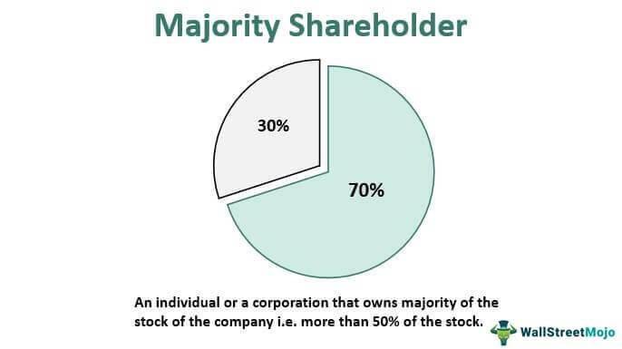

## Table of Contents

## What are shareholder perks?

Shareholder perks are special benefits that companies give to people who own their stock. These perks can make owning the stock more fun and rewarding. Companies offer these perks to make their shareholders happy and to encourage more people to buy their stock. Perks can be things like discounts on products, free samples, or even special events that only shareholders can attend.

Some companies are well-known for their shareholder perks. For example, a company might give its shareholders a discount at their stores or free products to try. These perks can be a big reason why someone decides to buy and keep the stock. It's like getting a little extra thank you for believing in the company. However, not all companies offer these perks, so it's important to check what a company offers before buying its stock.

## Why are shareholder perks important for investors?

Shareholder perks are important for investors because they can make owning a stock more fun and rewarding. When a company gives its shareholders special benefits like discounts or free products, it can make investors feel appreciated. This can make them want to keep their shares longer or even buy more. It's like getting a little extra thank you for believing in the company, which can make the investment feel more personal and enjoyable.

These perks can also help investors save money or try new products for free. For example, if a company offers a discount at their stores, shareholders can save money on things they were going to buy anyway. Or, if they get free samples, they can try new products without spending any money. This can be a big reason why someone decides to buy and keep the stock, especially if they like the company's products. So, shareholder perks can make investing more appealing and rewarding.

## How can one identify UK companies offering shareholder perks?

To find UK companies that offer shareholder perks, you can start by looking at the company's website. Many companies have a section for investors where they list any perks or benefits they offer to shareholders. You can also check the company's annual report or shareholder communications, as these often mention any special programs or benefits. Another good place to look is on investor websites or forums where people talk about their experiences with different companies and the perks they receive.

Another way to find out about shareholder perks is to use a financial news website or a stock market app. These often have information about companies and might mention any perks they offer. You can also ask a financial advisor or broker, as they often know about these things and can help you find companies that offer perks that interest you. Remember, not all companies offer perks, so it's important to check before you buy their stock.

## What types of perks do UK companies commonly offer to shareholders?

UK companies often give their shareholders perks like discounts on their products or services. For example, a retail company might offer shareholders a discount at their stores. This can help shareholders save money on things they were going to buy anyway. Some companies also give free samples or products to their shareholders. This lets shareholders try new things without spending any money.

Another common perk is invitations to special events or shareholder meetings. These events can be fun and give shareholders a chance to meet the company's leaders and learn more about the business. Some companies also offer perks like free or discounted travel, especially if they are in the travel or hospitality industry. These perks can make owning the stock more enjoyable and rewarding for shareholders.

## Can you list some UK companies known for their shareholder perks?

Some UK companies are well-known for giving their shareholders special perks. One example is Whitbread, the company that owns Premier Inn hotels and Costa Coffee. They give their shareholders a discount when they stay at Premier Inn hotels or buy things at Costa Coffee. This can help shareholders save money on holidays or their morning coffee. Another company is Burberry, a famous fashion brand. They sometimes give their shareholders free samples of their new products, like perfumes or clothes. This lets shareholders try new things without spending any money.

Another company that offers perks is Marks & Spencer, a popular UK retailer. They give their shareholders a discount when they shop at their stores. This can help shareholders save money on things like clothes, food, and home goods. These perks can make owning the stock more fun and rewarding for shareholders. It's like getting a little extra thank you for believing in the company.

## How do shareholder perks vary across different sectors in the UK?

Shareholder perks in the UK can be different depending on what kind of business the company is in. For example, companies in the retail sector, like Marks & Spencer, often give their shareholders discounts on things they sell in their stores. This can help shareholders save money on clothes, food, and other things they might buy anyway. On the other hand, companies in the hospitality sector, like Whitbread, which owns Premier Inn and Costa Coffee, might give their shareholders discounts on hotel stays or coffee. This can make holidays or daily routines a bit cheaper for shareholders.

In the fashion and beauty sector, companies like Burberry might give their shareholders free samples of new products, like perfumes or clothes. This lets shareholders try new things without spending any money. Meanwhile, companies in the travel sector might offer perks like free or discounted travel. These perks can make owning the stock more fun and rewarding, and they can be a big reason why someone decides to buy and keep the stock. Each sector tries to give perks that match what they do, making the perks more useful and interesting for shareholders.

## What are the tax implications of receiving shareholder perks in the UK?

In the UK, the tax rules for shareholder perks can be a bit tricky. If you get something for free or at a discount because you own shares, it might be seen as a benefit. If it's worth more than £50, you might have to pay tax on it. This is called a 'benefit in kind'. The company that gives you the perk has to tell HMRC about it and might take some tax off before they give it to you. But if the perk is worth less than £50, you usually don't have to pay tax on it.

It's a good idea to keep track of the perks you get and their value. If you're not sure if you need to pay tax on a perk, you can ask the company or talk to a tax advisor. They can help you understand the rules and make sure you're doing everything right. Remember, the rules can change, so it's always good to check the latest information from HMRC or a professional.

## How have shareholder perks evolved in the UK over the past decade?

Over the past decade, shareholder perks in the UK have changed a lot. Companies have started to offer more creative and interesting perks to keep their shareholders happy. Before, perks were mostly simple things like discounts on products or free samples. But now, companies are doing more to make shareholders feel special. For example, they might invite shareholders to special events or give them early access to new products. This makes owning shares more fun and rewarding.

Another big change is that companies are using technology more to give out perks. They might use apps or online platforms to make it easier for shareholders to get their perks. This is especially important because more people are buying shares online. Also, companies are being more careful about the tax rules for perks. They want to make sure they're following the law and not causing any problems for their shareholders. Overall, shareholder perks have become more varied and tech-savvy over the past ten years.

## What criteria should be used to evaluate the value of shareholder perks?

When thinking about how good shareholder perks are, it's important to look at how much they are worth in money. If a company gives you a big discount on something you were going to buy anyway, that's a great perk. But if the perk is something you don't really need or want, it might not be as valuable to you. You should also think about how easy it is to use the perk. If it's hard to get the discount or the free product, it might not be worth it, even if it's a big perk.

Another thing to think about is how the perk makes you feel about the company. If the perk makes you feel special and appreciated, you might want to keep your shares longer or even buy more. This can be good for both you and the company. Also, you should check if the perk will cost you any extra money, like taxes. If the perk is worth more than £50, you might have to pay tax on it, which can make it less valuable. So, when looking at shareholder perks, think about how much they are worth, how easy they are to use, how they make you feel, and if they will cost you more in taxes.

## How do UK companies' shareholder perks compare to those offered by companies in other countries?

UK companies often give their shareholders perks like discounts on their products or services, free samples, and invitations to special events. These perks are similar to what companies in other countries offer, but there are some differences. For example, in the US, some companies give their shareholders free products or big discounts, but they might also offer things like free travel or tickets to sports events. In Japan, shareholders might get special gifts or vouchers that they can use at different stores.

In Europe, companies in countries like Germany and France might give their shareholders perks like discounts on products or services, similar to the UK. But they might also offer things like free museum visits or special tours. In Australia, shareholders might get discounts on products or services, but they might also get special experiences like winery tours or tickets to cultural events. So, while the basic idea of shareholder perks is the same around the world, the specific perks can be different depending on where the company is from and what they think their shareholders will like.

## What are the potential risks associated with investing in companies primarily for their shareholder perks?

Investing in a company just because of the perks they offer can be risky. The main problem is that perks don't mean the company is doing well. If the company starts to lose money or has other problems, the value of your shares could go down. This means you could lose more money than you save with the perks. Also, if the company stops offering perks, you might be left with shares that aren't worth as much as you thought.

Another risk is that you might not use the perks as much as you think. For example, a discount on hotel stays sounds great, but if you don't travel often, it won't save you much money. Plus, some perks might cost you more in taxes than they're worth. If a perk is worth more than £50, you might have to pay tax on it, which can make it less valuable. So, it's important to think about these risks before deciding to invest in a company just for its perks.

## How can advanced data analysis be used to predict future trends in shareholder perks offered by UK companies?

Advanced data analysis can help us see what might happen with shareholder perks in the UK. By looking at lots of information from the past, like what perks companies have offered and how shareholders have reacted, we can spot patterns. For example, if more companies start giving discounts on their products, we might guess that this trend will keep going. We can also use special computer programs to look at things like how the economy is doing or what people are buying. This can help us predict if companies will offer more or different kinds of perks in the future.

Another way to use data analysis is to look at what shareholders say on social media or in surveys. If lots of people are talking about wanting certain perks, companies might start offering them. We can also use numbers to see if perks make shareholders happier or if they make them want to buy more shares. By putting all this information together, we can make good guesses about what kinds of perks UK companies might offer next. This can help investors decide which companies to buy shares in, based on the perks they might get.

## References & Further Reading

[1]: Marcos Lopez de Prado (2018). ["Advances in Financial Machine Learning,"](https://www.amazon.com/Advances-Financial-Machine-Learning-Marcos/dp/1119482089) John Wiley & Sons.

[2]: David Aronson (2006). ["Evidence-Based Technical Analysis: Applying the Scientific Method and Statistical Inference to Trading Signals,"](https://www.amazon.com/Evidence-Based-Technical-Analysis-Scientific-Statistical/dp/0470008741) John Wiley & Sons.

[3]: Stefan Jansen (2018). ["Machine Learning for Algorithmic Trading: Predictive Models to Extract Signals from Market and Alternative Data for Systematic Trading Strategies with Python,"](https://www.amazon.com/Machine-Learning-Algorithmic-Trading-alternative/dp/1839217715) Packt Publishing.

[4]: Ernest P. Chan (2009). ["Quantitative Trading: How to Build Your Own Algorithmic Trading Business,"](https://onlinelibrary.wiley.com/doi/pdf/10.1002/9781119203377.fmatter) John Wiley & Sons.

[5]: Rosenbaum, M., & ISR (2017). ["The Role of Algorithmic Trading in the Financial Crisis – A Discussion Document from the UK Financial Conduct Authority."](https://www.sciencedirect.com/org/science/article/pii/S1438887121000698) Financial Conduct Authority.

[6]: D. Easley, M. Lopez de Prado, & M. O’Hara (2012). ["Flow Toxicity and Liquidity in a High-frequency World,"](https://papers.ssrn.com/sol3/papers.cfm?abstract_id=1695596) CFA Institute.

[7]: Argiles Bosch, J. M., & Garcia-Blandon, J. (2011). ["Shareholder perks: Income effect or loyalty effect?,"](https://diposit.ub.edu/dspace/bitstream/2445/106266/1/630495.pdf) Review of Accounting Studies.