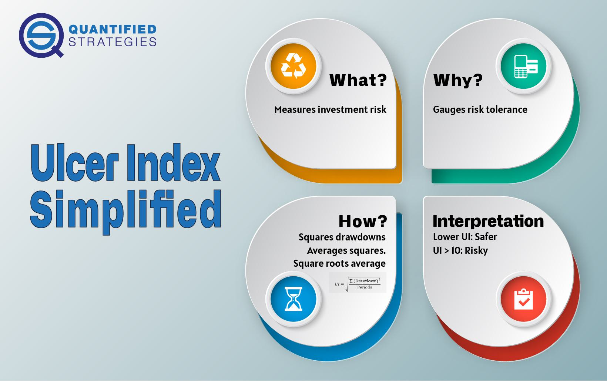

## Table of Contents

## What is the Ulcer Index?

The Ulcer Index is a measure used to gauge the risk in an investment, especially in the stock market. It focuses on how much and how long an investment drops in value, rather than just looking at the ups and downs. The idea is to show how stressful or painful these drops can be for investors. The Ulcer Index was created by Peter Martin in the 1980s to help investors understand the downside risk of their investments better.

To calculate the Ulcer Index, you start by finding the percentage drop of the investment from its highest point over a certain time. Then, you square these percentage drops to emphasize larger drops more. After that, you average these squared drops over the time period you're looking at. Finally, you take the square root of this average to get the Ulcer Index. A higher Ulcer Index means the investment has had bigger and longer drops, which can be more stressful for investors.

## How is the Ulcer Index calculated?

The Ulcer Index is a way to measure how risky an investment is by looking at how much and how long it falls in value. To start calculating it, you first find out the percentage drop of the investment from its highest point over a certain period. You do this for each day or period you're looking at. Then, you square each of these percentage drops. Squaring them makes bigger drops count more, showing how painful they can be.

Next, you add up all these squared percentage drops and find the average over the time you're studying. This average shows you the typical amount of pain or stress from the drops. Finally, you take the square root of this average to get the Ulcer Index. A higher Ulcer Index means the investment had bigger and longer drops, which can be more stressful for investors.

## What is the purpose of the Ulcer Index in financial analysis?

The Ulcer Index is used in financial analysis to show how risky an investment can be by looking at how much and how long it drops in value. Unlike other measures that focus on the ups and downs of an investment, the Ulcer Index zeroes in on the downside, or the drops. This helps investors understand the stress or pain they might feel from these drops. By focusing on the downside, the Ulcer Index gives a clearer picture of the risk involved in holding onto an investment over time.

In simple terms, the Ulcer Index tells investors how bumpy the ride might be. If an investment has a high Ulcer Index, it means it has had bigger and longer drops, which can be more stressful for investors. This information is useful for people who want to avoid big losses or who are more worried about the pain of losing money than the joy of gaining it. By using the Ulcer Index, investors can make smarter choices about which investments might be too risky for them.

## How does the Ulcer Index differ from other risk measures like standard deviation?

The Ulcer Index and standard deviation both measure risk, but they do it in different ways. Standard deviation looks at how much an investment's returns go up and down around its average. It treats all changes the same, whether they are up or down. This means standard deviation can show how wild the ride might be, but it doesn't tell you much about the bad times specifically. On the other hand, the Ulcer Index focuses only on the downside. It measures how much and how long an investment drops from its highest point. This makes the Ulcer Index more about the pain or stress of losing money, not just about how much the investment moves around.

Because the Ulcer Index only cares about the drops, it gives a clearer picture of the risk that matters most to many investors: the risk of losing money. For example, if an investment goes up and down a lot but always comes back quickly, it might have a high standard deviation but a low Ulcer Index. This tells investors that while the ride might be bumpy, the drops aren't deep or long-lasting. So, the Ulcer Index is better for showing the kind of risk that can keep investors up at night, while standard deviation is more about the overall volatility of an investment.

## Can the Ulcer Index be used for any type of investment?

The Ulcer Index can be used for many types of investments, like stocks, mutual funds, and even portfolios. It's especially helpful for investments that you hold for a long time. The Ulcer Index looks at how much and how long an investment drops in value. This can help you understand how risky an investment might be, no matter what kind of investment it is.

However, the Ulcer Index might not be as useful for some types of investments. For example, if you're looking at short-term investments or something like options that have a set time to expire, the Ulcer Index might not give you the full picture. It's best for investments where you're worried about the stress of seeing your money drop in value over time.

## What historical data is needed to compute the Ulcer Index?

To compute the Ulcer Index, you need the price data of the investment over a specific period. This data should show the highest price the investment reached during that time and the daily or periodic prices after that high point. You use this data to figure out the percentage drop from the highest price for each day or period you're looking at.

Once you have the percentage drops, you square each of these numbers and then find the average of these squared drops over the entire period. Finally, you take the square root of this average to get the Ulcer Index. This way, you can see how much and how long the investment fell in value, which helps measure the risk involved.

## How frequently should the Ulcer Index be calculated for optimal use?

The Ulcer Index should be calculated as often as you need to check on the risk of your investment. If you are watching your investment closely, you might want to calculate it every day or every week. This way, you can see how the risk changes over short periods. It's good for keeping an eye on how bumpy the ride is right now.

For a longer-term view, calculating the Ulcer Index once a month or once a quarter can be enough. This helps you understand the overall risk over time without getting too caught up in daily ups and downs. By choosing how often to calculate it based on your needs, you can use the Ulcer Index to make better decisions about your investments.

## What are the limitations of the Ulcer Index?

The Ulcer Index has some limits that you should know about. It only looks at how much and how long an investment drops in value, but it doesn't tell you anything about the good times when the investment goes up. This means it might make an investment seem riskier than it really is if you only look at the Ulcer Index and ignore the gains. Also, the Ulcer Index can be hard to use for short-term investments because it's meant for looking at risk over longer periods of time.

Another thing to keep in mind is that the Ulcer Index doesn't work well with all types of investments. For example, it might not be the best tool for options or other investments that have a set time to expire. These kinds of investments have different risks that the Ulcer Index doesn't cover. So, while the Ulcer Index can be a helpful way to understand risk, it's not perfect and should be used with other tools to get a full picture of an investment's risk.

## How can the Ulcer Index be integrated into a broader investment strategy?

The Ulcer Index can be a useful tool in a broader investment strategy by helping you understand how risky an investment might be. It looks at how much and how long an investment drops in value, which can tell you about the stress or pain of losing money. By using the Ulcer Index, you can pick investments that match how much risk you're okay with. If you don't like big drops, you can choose investments with a lower Ulcer Index. This way, you can build a portfolio that feels safer and less stressful for you.

But the Ulcer Index shouldn't be the only tool you use. It's good to mix it with other ways to measure risk and look at how well your investments are doing. For example, you can use standard deviation to see how much your investments go up and down overall, and the Sharpe Ratio to see if the returns you're getting are worth the risk. By using the Ulcer Index along with these other tools, you can get a fuller picture of your investments and make smarter choices. This can help you build a strategy that not only aims for good returns but also keeps your stress levels in check.

## What are some real-world examples where the Ulcer Index has been effectively used?

In the world of investing, the Ulcer Index has been used by many investors to help them pick safer investments. For example, a person saving for retirement might look at different mutual funds. By calculating the Ulcer Index for each fund, they can see which ones have had smaller and shorter drops in value. This helps them choose a fund that won't cause as much stress, especially when they're close to retiring and can't afford big losses.

Another real-world use of the Ulcer Index is in portfolio management. A financial advisor might use it to show their clients how risky their current investments are. If a client's portfolio has a high Ulcer Index, the advisor might suggest changing some of the investments to lower the risk. This way, the client can feel more comfortable and confident about their investments, knowing that their money is less likely to drop a lot and stay down for a long time.

## How does the Ulcer Index perform during different market conditions?

The Ulcer Index is good at showing how risky an investment is, and it can be really helpful in different market conditions. When the market is going up and everything is doing well, the Ulcer Index might be low because there aren't many big drops. This tells investors that things are pretty smooth and there's not much stress about losing money. But, if the market starts to go down or gets really bumpy, the Ulcer Index can go up a lot. It shows how much and how long investments are dropping, which helps investors see how stressful it can be during tough times.

In a bear market, where prices are falling a lot, the Ulcer Index can be really useful. It helps investors understand which investments are dropping more and for longer periods. This can guide them to make changes in their portfolio to lower their risk. During a bull market, where prices are going up, the Ulcer Index might not seem as important because there are fewer drops to worry about. But it's still good to keep an eye on it to make sure the investments you have aren't too risky, even when times are good.

## What advanced techniques can be used to enhance the predictive power of the Ulcer Index?

To make the Ulcer Index better at predicting risk, you can use it with other tools like the Sharpe Ratio and standard deviation. The Sharpe Ratio looks at how much return you're getting for the risk you're taking, and standard deviation shows how much an investment goes up and down. By using these together, you can get a fuller picture of both the risk and the reward of an investment. For example, if an investment has a high Ulcer Index but also a high Sharpe Ratio, it might be worth the risk because the returns are good.

Another way to improve the Ulcer Index is by using more advanced math techniques like regression analysis. This can help you see how different things like the economy or interest rates might affect the Ulcer Index. By understanding these relationships, you can predict how the risk of your investments might change in the future. This can help you make smarter choices about when to buy or sell, making your investment strategy more effective.

## What is the Ulcer Index and how can it be understood?

The Ulcer Index (UI) was developed by Peter Martin and Byron McCann in 1987 as a response to the inadequacy of traditional volatility measures in capturing the true risk experienced by investors during market downturns. Initially intended to evaluate mutual fund performance, the UI specifically addresses the stress associated with price declines, which often have a more severe psychological impact than general market volatility.

Traditional [volatility](/wiki/volatility-trading-strategies) measures, like standard deviation, assess the fluctuation of returns around an average, considering both upward and downward movements. This approach can be misleading for investors primarily concerned with downside risk - the potential for loss. The Ulcer Index takes a different approach by concentrating solely on the depth and duration of drawdowns in an asset's price or value.

A drawdown occurs when the price of an asset falls from its peak to a subsequent low, before recovering. The UI quantifies the investor's experience of this deterioration. Essentially, it measures how long and how deeply the investment declines from its peak, offering a more nuanced evaluation of downside risk than overall volatility metrics provide.

The formula for calculating the Ulcer Index involves several steps. First, the percentage drawdown from the most recent high price is calculated for each day within the specified period:

$$
\text{Drawdown}_t = \frac{\text{Peak Price} - \text{Current Price}_t}{\text{Peak Price}} \times 100
$$

These daily percentage drawdowns are squared to amplify larger drops:

$$
\text{Squared Drawdown}_t = (\text{Drawdown}_t)^2
$$

The average of these squared values over the selected period is computed:

$$
\text{Average Squared Drawdown} = \frac{\sum \text{Squared Drawdown}_t}{N}
$$

Finally, the UI is obtained by taking the square root of this average:

$$
\text{Ulcer Index} = \sqrt{\text{Average Squared Drawdown}}
$$

The Ulcer Index's focus on just the downside provides a specialized risk metric, reflecting the stress investors endure during periods of market decline more accurately than traditional measures. This makes the UI a valuable tool for those focused on minimizing losses and managing risk effectively.

## How do you calculate the Ulcer Index?

The Ulcer Index (UI) is specifically designed to measure the depth and duration of drawdowns, providing insight into downside risk. The computation of the UI involves a series of methodical steps that offer a comprehensive understanding of market stress during price declines. 

To calculate the Ulcer Index over a specified period, start by identifying the peak price within that timeframe. For each day in the period, determine the percentage drawdown, which is calculated as follows:

$$
\text{Drawdown}(\%) = \left( \frac{\text{Peak Price} - \text{Current Price}}{\text{Peak Price}} \right) \times 100
$$

After obtaining the percentage drawdowns for all the days in the period, the next step involves squaring each of these values. Squaring the drawdowns amplifies the impact of larger declines, thus emphasizing the severity of more significant drops.

The subsequent step is to calculate the average of the squared drawdowns. This is done by summing all the squared values and dividing by the number of observations in the period:

$$
\text{Average of Squared Drawdowns} = \frac{\sum (\text{Drawdown}^2)}{n}
$$

where $n$ is the number of days in the calculation period.

Finally, take the square root of the average of the squared drawdowns to arrive at the Ulcer Index:

$$
\text{Ulcer Index} = \sqrt{\text{Average of Squared Drawdowns}}
$$

This method not only highlights the magnitude of price declines but also their persistence over time, providing a focused assessment of downside risk. The Ulcer Index is particularly valuable for investors who prioritize awareness of risk exposure during periods of market downturns. Encoding this process in Python can further aid in automating and integrating the computation into trading systems:

```python
def calculate_ulcer_index(prices):
    peak_price = 0
    squared_drawdowns = []

    for price in prices:
        if price > peak_price:
            peak_price = price
        drawdown_percent = (peak_price - price) / peak_price * 100
        squared_drawdowns.append(drawdown_percent ** 2)

    average_squared_drawdown = sum(squared_drawdowns) / len(squared_drawdowns)
    ulcer_index = average_squared_drawdown ** 0.5

    return ulcer_index
```

This function iterates over a list of prices, calculates the squared percentage drawdown for each price relative to the peak price, averages these values, and finally returns the Ulcer Index. This index serves as a valuable tool for evaluating downside risk in financial markets.

## What is the difference between the Ulcer Index and other risk metrics?

The Ulcer Index (UI) is a specialized metric that provides a distinct focus on downside risk, setting it apart from traditional risk measures such as standard deviation and the Sharpe Ratio. Standard deviation is a commonly used statistical measure that gauges the overall volatility in an asset's returns. It calculates how much the returns deviate from their average, without differentiating between upside and downside movements. This approach, while comprehensive, does not differentiate between price increases and decreases, treating them equivalently in terms of risk.

In contrast, the Ulcer Index specifically highlights the psychological and financial stress caused by sustained drawdowns. By concentrating solely on the downside volatility, the UI sheds light on periods of decline that pose potential stress to investors. This characteristic is particularly valuable when evaluating investments where capital protection is paramount.

The Sharpe Ratio, another prevalent risk metric, measures the risk-adjusted return of an investment portfolio. It calculates the average return earned in excess of the risk-free rate per unit of volatility, represented by the standard deviation. While useful for assessing return performance relative to total risk, the Sharpe Ratio does not isolate downside risk. This limitation can obscure the potential impacts of drawdowns, especially for risk-averse investors who are more concerned with the downside than the upside.

The Ulcer Index, therefore, provides a clearer interpretation for those specifically concerned with avoiding severe losses. By making potential drawdown periods more transparent, the UI offers crucial insights into the magnitude and duration of past declines, allowing investors to assess the historical risk profile of an investment with a focus on avoiding stressful periods. 

The formula for calculating the Ulcer Index further illustrates its focus:

$$
\text{UI} = \sqrt{\frac{1}{n} \sum_{i=1}^{n} \left[ \left( \frac{\text{Close}_i - \text{Peak}_i}{\text{Peak}_i} \times 100 \right)^2 \right]}
$$

Here, $\text{Close}_i$ is the daily closing price, $\text{Peak}_i$ is the highest closing price observed over the specified period, and $n$ is the number of days considered. This approach comparatively amplifies the impact of larger drawdowns while minimizing the noise of less significant fluctuations.

By focusing on downside movements, the Ulcer Index serves as a pivotal tool for investors and traders seeking a targeted perspective on risk management, offering a nuanced complement to the more general risk assessments provided by standard deviation and Sharpe Ratio.

## References & Further Reading

[1]: Martin, P., & McCann, B. (1989). ["The Investor's Guide to Fidelity Funds: Winning Strategies for Mutual Fund Investors."](https://archive.org/details/investorsguideto00mart) Probus Publishing.

[2]: LeBeau, C., & Lucas, D. (1992). ["Technical Traders Guide to Computer Analysis of the Futures Markets."](https://books.google.com/books/about/Technical_traders_guide_to_computer_anal.html?id=at0PAQAAMAAJ) McGraw-Hill.

[3]: Kaufman, P. J. (2013). ["Trading Systems and Methods."](https://onlinelibrary.wiley.com/doi/book/10.1002/9781119202561) Wiley.

[4]: Rosenthal, M. (2012). ["The ULcer Index: A Measure of Market Stress."](https://www.investopedia.com/terms/u/ulcerindex.asp)

[5]: "Algorithmic Trading: Winning Strategies and Their Rationale" by Ernie Chan.