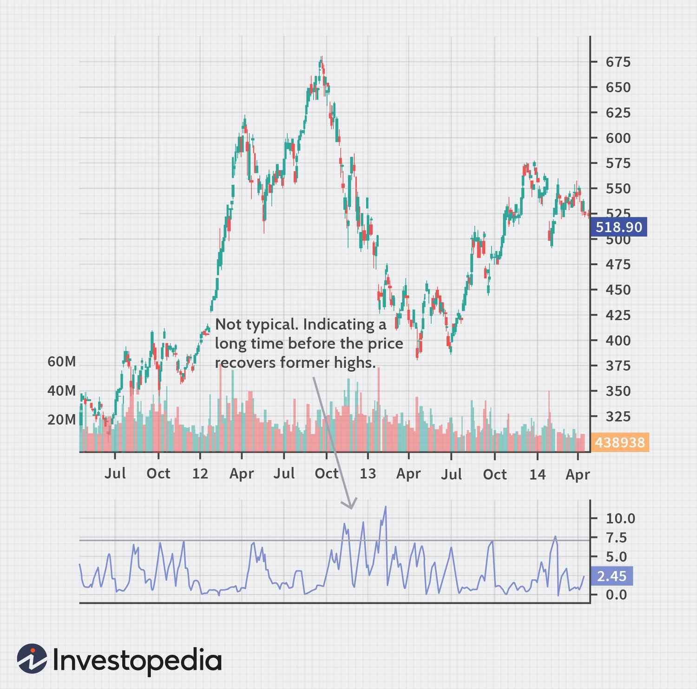

## Table of Contents

## What is the Ulcer Index?

The Ulcer Index is a way to measure how much risk there is in investing in stocks or other financial things. It was created by Peter Martin and Byron McCann in the 1980s. The Ulcer Index looks at how much the price of an investment goes down and how long it stays down. This helps investors understand not just how much they might lose, but also how uncomfortable they might feel while their investment is losing value.

The Ulcer Index is different from other risk measures because it focuses more on the downside, or the drops in price, rather than just the ups and downs. It calculates the percentage drawdowns from the highest point the investment reached. If the price goes up, it doesn't affect the Ulcer Index. This makes it a good tool for investors who are more worried about losing money than about missing out on gains. By using the Ulcer Index, investors can better manage their fears and make smarter choices about where to put their money.

## Who developed the Ulcer Index and when?

The Ulcer Index was developed by Peter Martin and Byron McCann. They came up with this idea in the 1980s. Peter Martin and Byron McCann wanted to help investors understand how risky their investments were, especially when the prices were going down.

The Ulcer Index is different because it focuses on how much and how long the price of an investment drops. It doesn't care about the price going up. This makes it a useful tool for people who are more worried about losing money than missing out on gains. By using the Ulcer Index, investors can make better decisions about where to put their money and feel less worried about their investments.

## What is the purpose of the Ulcer Index in financial analysis?

The Ulcer Index is a tool used in financial analysis to measure how risky an investment is, especially when the price goes down. It was created to help investors understand not just how much they might lose, but also how long they might feel uncomfortable while their investment is losing value. The Ulcer Index looks at the percentage drop from the highest price the investment reached. If the price goes up, it doesn't affect the Ulcer Index. This focus on downside risk makes it different from other measures that look at both ups and downs.

By using the Ulcer Index, investors can better manage their fears and make smarter choices about where to put their money. It helps them see how much and how long their investment might go down, which can be more important to some people than how much it might go up. This way, investors can choose investments that match their comfort level with risk, helping them feel more secure and less worried about their financial decisions.

## How is the Ulcer Index calculated?

The Ulcer Index is calculated by looking at how much an investment's price drops and how long those drops last. First, you find the percentage drop from the highest price the investment reached to its current price every day. If the price goes up, you don't count it. You only care about the drops. Then, you square each of these percentage drops to make sure bigger drops have a bigger impact. After that, you add up all these squared percentage drops over a certain time, like a month or a year.

Next, you take the average of these squared percentage drops by dividing the total by the number of days in the time period you're looking at. Finally, you take the square root of this average to get the Ulcer Index. This number tells you how risky the investment is based on how much and how long its price has dropped. A higher Ulcer Index means the investment has had bigger and longer drops, which might make investors feel more uncomfortable.

## What data is required to compute the Ulcer Index?

To compute the Ulcer Index, you need daily price data for the investment you're looking at. This data should cover the time period you want to analyze, like a month or a year. You need to know the highest price the investment reached during this time, and then the price every day after that. The Ulcer Index only cares about the days when the price is lower than the highest price, so you don't need data for days when the price goes up.

Once you have the daily price data, you calculate the percentage drop from the highest price to the current price for each day. You then square each of these percentage drops. After that, you add up all the squared percentage drops over the time period you're looking at. Finally, you take the average of these squared percentage drops by dividing the total by the number of days, and then take the square root of this average to get the Ulcer Index. This number shows how risky the investment is based on how much and how long its price dropped.

## Can you explain the concept of drawdown as it relates to the Ulcer Index?

Drawdown is a very important idea when we talk about the Ulcer Index. It's the drop in value from the highest price an investment has reached to a lower price later on. When we calculate the Ulcer Index, we look at these drawdowns. We find out how much the price has dropped as a percentage and then we square these percentages. The Ulcer Index cares about how big the drop is and how long it lasts. If the price goes up, it doesn't change the Ulcer Index at all. This means the Ulcer Index is all about the bad times, when the price is going down.

The Ulcer Index uses drawdowns to help investors understand how risky an investment is. It shows not just how much money they might lose, but also how long they might feel worried while their investment is losing value. By focusing on drawdowns, the Ulcer Index helps people see how uncomfortable an investment might make them feel. If an investment has big drawdowns that last a long time, it will have a high Ulcer Index, meaning it's riskier. This can help investors choose investments that fit their comfort level with risk.

## How does the Ulcer Index differ from other risk measures like standard deviation?

The Ulcer Index is different from other risk measures like standard deviation because it only looks at the times when an investment's price goes down. Standard deviation measures how much the price moves up and down in both directions. It treats ups and downs the same. But the Ulcer Index cares about how much and how long the price drops, not the ups. This makes it a better tool for people who are more worried about losing money than missing out on gains.

Another way the Ulcer Index is different is that it helps investors understand how uncomfortable they might feel while their investment is losing value. Standard deviation just tells you how much the price changes, but it doesn't tell you about the feeling of seeing your investment go down. The Ulcer Index focuses on the drawdowns, or the drops in price, and how long they last. This can help investors pick investments that match their comfort level with risk, making them feel more secure about their financial choices.

## What are the typical values of the Ulcer Index and what do they indicate?

The Ulcer Index usually ranges from 0 to around 20, but it can go higher. A lower Ulcer Index, like a number close to 0, means the investment has had small and short drops in price. This shows the investment is less risky and might make investors feel more comfortable. On the other hand, a higher Ulcer Index, like a number around 10 or above, means the investment has had bigger and longer drops in price. This shows the investment is riskier and might make investors feel more worried.

When you look at the Ulcer Index, it's good to compare it with other investments or with the same investment over different times. For example, if the Ulcer Index of one investment is 5 and another is 15, the first one is less risky. Also, if the Ulcer Index of an investment goes from 3 to 8 over a year, it means the investment has become riskier during that time. By understanding these numbers, investors can make better choices about where to put their money and feel more secure about their financial decisions.

## How can the Ulcer Index be used in investment decision-making?

The Ulcer Index can help investors make better choices by showing them how risky an investment is. It looks at how much and how long the price of an investment goes down. This is important because it helps investors understand not just how much money they might lose, but also how uncomfortable they might feel while their investment is losing value. If an investor doesn't like to feel worried about their money, they can use the Ulcer Index to pick investments that have a lower number. This means the investment has smaller and shorter drops in price, making it less risky and more comfortable for the investor.

Investors can also use the Ulcer Index to compare different investments or to see how the risk of one investment changes over time. For example, if an investor is looking at two stocks, they can check the Ulcer Index of each one. The stock with the lower Ulcer Index is less risky. If an investor already owns a stock, they can watch its Ulcer Index over time. If the number goes up, it means the stock is getting riskier. By keeping an eye on the Ulcer Index, investors can make smarter decisions about where to put their money and feel more secure about their financial choices.

## What are the limitations of the Ulcer Index?

The Ulcer Index is a good tool for looking at risk, but it has some problems. One big problem is that it only looks at how much and how long the price goes down. It doesn't care about how much the price goes up. This means the Ulcer Index might make an investment look more risky than it really is if the price goes up a lot after going down. Also, the Ulcer Index doesn't tell you about other kinds of risk, like the risk of the whole market going down or the risk that comes from not being able to sell your investment when you want to.

Another problem with the Ulcer Index is that it can be hard to compare it across different investments. The Ulcer Index depends on how long you look at the investment. If you look at one investment for a month and another for a year, the numbers might not mean the same thing. Also, the Ulcer Index doesn't tell you how likely it is that the price will go down. It just tells you how bad it was when it did go down. This means investors need to use other tools along with the Ulcer Index to get a full picture of the risk.

## How does the Ulcer Index perform during different market conditions?

The Ulcer Index can change a lot depending on what's happening in the market. In a bull market, where prices are going up, the Ulcer Index might stay low. This is because the Ulcer Index only looks at the times when the price goes down. If the market is doing well and prices are going up more than they're going down, the Ulcer Index won't show much risk. But, if there are some small drops in price during a bull market, the Ulcer Index will still pick up on those and show them as risk.

In a bear market, where prices are going down, the Ulcer Index can get a lot higher. This is because the Ulcer Index cares about how big and how long the price drops are. If the market is going down and staying down for a long time, the Ulcer Index will show a lot of risk. It will make the investment look very risky because it's all about the bad times when the price is dropping. So, the Ulcer Index can be a good way to see how uncomfortable an investment might make you feel during a bear market.

## Can the Ulcer Index be integrated with other technical indicators for better results?

Yes, the Ulcer Index can be used with other technical indicators to give investors a better idea of how risky an investment is. For example, you can use the Ulcer Index with the Sharpe Ratio, which looks at how much return you get for the risk you take. The Ulcer Index tells you about the bad times when the price goes down, while the Sharpe Ratio tells you if the good times are worth the risk. By using both, you can see if an investment is worth the risk it brings.

Another way to use the Ulcer Index with other indicators is to pair it with the Relative Strength Index (RSI), which shows if an investment is overbought or oversold. The Ulcer Index can tell you how risky the investment is, and the RSI can tell you if it might be a good time to buy or sell. This can help you make better decisions about when to get into or out of an investment. By combining these tools, you get a fuller picture of both the risk and the timing of your investments.

## How do you calculate the Ulcer Index?

Calculating the Ulcer Index involves analyzing percentage drawdowns from the highest peaks in a specified time frame. A drawdown is the reduction from a peak value of an investment to its lowest value before reaching a new peak. The Ulcer Index focuses on the magnitude and duration of these declines, which differentiates it from other [volatility](/wiki/volatility-trading-strategies) measures.

The process starts by determining the peak value within a given period and calculating the percentage decrease of prices from this peak for each day. These percentage drawdowns, denoted as $R_i$, are then squared to emphasize larger deviations. The squared drawdowns are averaged over the specified number of periods, $N$, to capture the typical stress experienced by the investment. The square root of this average is taken to obtain the Ulcer Index. Mathematically, the formula is represented as:

$$
\text{Ulcer Index} = \sqrt{\frac{1}{N} \sum (R_i - L)^2}
$$

Here, $N$ signifies the total number of days considered, while $R_i$ is each day's percentage drawdown from the peak. The constant $L$ in the formula is typically set to zero because it only shifts all values equally without affecting the outcome.

A common time frame for calculating the Ulcer Index is 14 days, though this period can be adjusted based on investment goals or specific trading strategies. The choice of period impacts the sensitivity of the index to market conditions, with shorter periods capturing more recent volatility, while longer periods provide a smoother, long-term risk evaluation.

Using Python, calculating the Ulcer Index can be implemented as follows:

```python
import numpy as np

def calculate_ulcer_index(prices, period=14):
    max_price = np.maximum.accumulate(prices)
    drawdowns = (prices - max_price) / max_price * 100
    squared_drawdowns = drawdowns**2
    ulcer_index = np.sqrt(np.mean(squared_drawdowns[-period:]))
    return ulcer_index

# Example usage with a list of daily prices
prices = [100, 105, 102, 98, 95, 92, 97, 99, 96, 101, 98, 97, 94, 93, 92]
ui = calculate_ulcer_index(prices)
print("Ulcer Index:", ui)
```

This script computes the Ulcer Index over the last 14 days of provided price data, illustrating the application's practical aspect in risk measurement.

## What are Frequently Asked Questions (FAQs)?

**What is the Ulcer Index in the share market?**

The Ulcer Index (UI) is a financial metric used to measure the downside risk in the share market. Unlike traditional volatility measures that consider both upward and downward price movements, the Ulcer Index focuses exclusively on the severity and duration of price declines from recent highs. This specificity makes it particularly valuable for investors keen on assessing the potential stress associated with holding a particular stock or portfolio over time.

**How do you interpret Ulcer Index scores?**

Interpreting Ulcer Index scores involves understanding the degree of risk indicated by its value. A lower Ulcer Index suggests stability and lesser downside risk, implying that price movements have remained relatively close to recent highs. Conversely, a higher Ulcer Index indicates significant price declines and prolonged periods of loss, suggesting increased market stress. As a general benchmark, an Ulcer Index value above 10 typically signifies excessive downside risk, although the acceptable threshold can vary according to individual risk tolerance.

**How is the Ulcer Index calculated?**

The calculation of the Ulcer Index involves determining the percentage drawdowns from peak prices over a set period. The drawdowns are squared and averaged, with the Ulcer Index being the square root of this mean. The formula is:

$$
\text{Ulcer Index} = \sqrt{\frac{1}{N} \sum_{i=1}^{N} (D_i)^2}
$$

Where $D_i$ represents the percentage drawdown from a peak, and $N$ is the number of periods being analyzed. Typically, a standard calculation uses a 14-day period, but this can be adjusted based on specific analysis needs.

**How does the Ulcer Index compare with other risk assessment tools?**

When compared with other risk assessment tools, the Ulcer Index offers a unique perspective by concentrating only on downside risk. Traditional metrics like standard deviation fail to differentiate between upside and downside volatility, potentially misleading risk-averse investors. The Sharpe Ratio, though widely used for assessing risk-adjusted returns, doesn't focus solely on drawdowns as the Ulcer Index does. This exclusive attention to downside risk makes the Ulcer Index particularly appealing for investors and traders focused on risk mitigation rather than simply volatility or returns.

**Can the Ulcer Index be used across different asset classes?**

Yes, the Ulcer Index can be applied across various asset classes including equities, commodities, and mutual funds. Its foundation in measuring drawdowns allows it to be a versatile tool in any market where peak-trough analysis is pertinent. However, its most impactful use remains in assessing instruments with significant past price volatility, where understanding the potential for future price declines is crucial for informed decision-making.

## References & Further Reading

[1]: Martin, P. J., & McCann, B. A. (1989). ["The Investor's Guide to Fidelity Funds: Winning Strategies for Mutual Fund Investors."](https://books.google.com/books/about/The_investor_s_guide_to_fidelity_funds.html?id=nOoJAQAAMAAJ) Times Books.

[2]: Korn, O., & Korn, R. (2020). ["Algorithmic Trading: Tools and Techniques for Automated and Systematic Trading."](https://en.wikipedia.org/wiki/Korn) John Wiley & Sons.

[3]: Kirkpatrick, C. D., & Dahlquist, J. R. (2010). ["Technical Analysis: The Complete Resource for Financial Market Technicians."](https://ptgmedia.pearsoncmg.com/images/9780134137049/samplepages/9780134137049.pdf) FT Press.

[4]: Kaufman, P. J. (2013). ["Trading Systems and Methods, + Website (5th ed.)."](https://onlinelibrary.wiley.com/doi/book/10.1002/9781119202561) John Wiley & Sons.

[5]: Schwager, J. D. (2008). ["Hedge Fund Market Wizards: How Winning Traders Win."](https://books.google.com/books/about/Hedge_Fund_Market_Wizards.html?id=eAR5mPSK9voC) John Wiley & Sons.