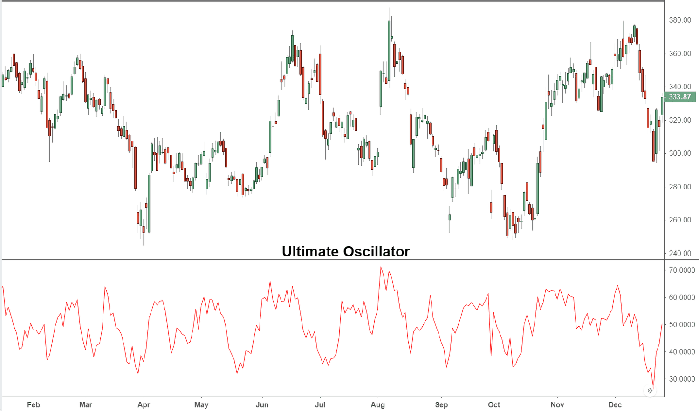

Technical analysis is a pivotal component of trading strategies, enabling traders to make informed decisions by analyzing historical price data and market trends. Among the array of tools available to traders, oscillators play an essential role in identifying momentum and potential reversal points. These indicators help traders gauge market conditions by measuring aspects such as momentum or speed of price changes.

The Ultimate Oscillator, developed by Larry Williams, stands out among various oscillators due to its unique design and functionality. It combines multiple timeframes into its calculation, which helps provide a more comprehensive view of market dynamics and reduces the likelihood of false signals. Unlike many traditional oscillators that focus on a single timeframe, the Ultimate Oscillator incorporates short, medium, and long-term market cycles to enhance its accuracy and reliability in predicting price reversals.



As technology continues to advance, the integration of oscillators, particularly the Ultimate Oscillator, into algorithmic trading systems holds significant potential for traders. Algorithmic trading leverages programmed algorithms to execute trades based on predefined criteria, allowing for rapid and emotionless decision-making. The automation of trading strategies facilitated by algorithms can offer increased precision, efficiency, and round-the-clock market engagement.

This article examines the integration of the Ultimate Oscillator into technical analysis trading strategies, particularly focusing on its use within algorithmic trading frameworks. By employing this approach, traders can enhance their market analysis and potentially improve trading performance through more informed decision-making and optimized execution processes.

## Table of Contents

## Understanding Technical Analysis

Technical analysis is a method used by traders and investors to predict future price movements based on historical market data. It relies on the belief that past trading activity and price changes can be significant indicators of future price behavior. The core elements of technical analysis include price charts, patterns, and a variety of statistical indicators.

Price charts are fundamental tools in technical analysis. They come in several forms, including line charts, bar charts, and candlestick charts, each offering unique insights into market trends. These charts are valuable for identifying trends, which can be upward (bullish), downward (bearish), or sideways (range-bound), aiding traders in deciding whether to buy or sell.

Patterns, another critical element, refer to formations created by price movements on a chart. Common patterns include head and shoulders, double tops and bottoms, and flags. These patterns help traders anticipate possible future price movements by recognizing historical formations that have previously led to predictable outcomes.

Statistical indicators are used to analyze price data and provide insights into market conditions. Among these indicators, oscillators play a prominent role in technical analysis. An oscillator is a tool that fluctuates within a band and provides overbought or oversold signals. These signals alert traders to potential reversal points by indicating when a security may be due for a price correction. Common oscillators include the Relative Strength Index (RSI), the Moving Average Convergence Divergence (MACD), and the Stochastic Oscillator.

Understanding the principles of supply and demand, support and resistance, and price action is pivotal. Supply and demand drive market movements, with prices rising when demand outstrips supply and falling when the opposite occurs. Support levels are price points where a security tends to stop falling, while resistance levels are points where it tends to stop rising. These levels are essential for identifying potential entry and [exit](/wiki/exit-strategy) points for trades.

Price action analysis involves studying historical prices to forecast future movements without relying on indicators. It emphasizes understanding the psychological and behavioral aspects of price movements, which can lead to more intuitive trading decisions.

Overall, technical analysis provides a structured approach for analyzing historical data and making strategic trading decisions. By applying these methods, traders can identify potential entry and exit points, manage risk effectively, and optimize their trading strategies.

## The Role of Oscillators in Trading Strategies

Oscillators are essential tools within technical analysis that enable traders to identify short-term extreme market conditions. These indicators serve a pivotal role in determining optimal entry and exit points by signaling overbought or oversold market states. The core concept behind oscillators is to evaluate the [momentum](/wiki/momentum) of price movements, thereby providing clues about potential trend reversals or continuations.

A few widely-used oscillators include the Relative Strength Index (RSI), Moving Average Convergence Divergence (MACD), and the Stochastic Oscillator. Each of these tools offers unique insights into market dynamics:

1. **Relative Strength Index (RSI)**: Developed by J. Welles Wilder, the RSI measures the magnitude of recent price changes to evaluate overbought or oversold conditions. It is typically scaled from 0 to 100, where values above 70 generally indicate overbought conditions, and values below 30 indicate oversold conditions. The formula for RSI is:
$$
   \text{RSI} = 100 - \left( \frac{100}{1 + \text{RS}}} \right)

$$

   where RS (Relative Strength) is the average gain of up periods during the specified time frame divided by the average loss of down periods.

2. **Moving Average Convergence Divergence (MACD)**: Created by Gerald Appel, the MACD is a trend-following momentum indicator that calculates the difference between two exponential moving averages (EMAs)—one longer and one shorter. A signal line, which is a moving average of the MACD, is plotted against the MACD, and crossovers are used as trading signals.

3. **Stochastic Oscillator**: Introduced by George Lane, this oscillator compares a particular closing price of a security to a range of its prices over a certain period. It operates on the premise that in upward-trending markets, prices close near the high, and in downward-trending markets, prices close near the low. It ranges between 0 and 100, with typical thresholds indicating overbought conditions over 80 and oversold conditions below 20.

Oscillators are particularly beneficial in range-bound market environments where price movements are not significantly trending but fluctuate within a certain range. They help traders ascertain potential buy and sell signals when markets are neither in a strong upward nor downward trend. However, oscillators also come with limitations and understanding these is crucial for effective trading. In trending markets, oscillators might provide false signals by indicating overbought or oversold conditions too early.

In conclusion, the utility of oscillators lies in their ability to capture and reflect short-term price dynamics, assisting traders in making informed decisions under specific market conditions. They function as a guide for identifying strategic entry and exit points, particularly when used in conjunction with other technical analysis tools and criteria.

## Introducing the Ultimate Oscillator

The Ultimate Oscillator, introduced by renowned market technician Larry Williams, represents a complex but versatile tool in technical analysis. It distinguishes itself from conventional single-timeframe oscillators by amalgamating data across short, medium, and long-term market cycles. This multi-timeframe approach aims to mitigate the incidence of false signals often produced by oscillators that focus on a single temporal dimension. By integrating various timeframes, the Ultimate Oscillator offers a more holistic view of market momentum, thereby enhancing the reliability of the signals generated.

The primary function of the Ultimate Oscillator is to evaluate buying or selling pressure within a specified timeframe. It operates on a scale typically ranging from 0 to 100. This range is critical for traders, as values generally above 70 indicate overbought conditions—suggesting a potential sell opportunity—while values below 30 signal oversold conditions, hinting at a potential buy.

The calculation of the Ultimate Oscillator involves three main components: the buying pressure (BP), true range (TR), and the average of these values over specified periods. The formula for BP is:

$$
\text{BP} = \text{Close} - \min(\text{Low}, \text{Prior Close})
$$

Meanwhile, the True Range (TR) is determined by:

$$
\text{TR} = \max(\text{High}, \text{Prior Close}) - \min(\text{Low}, \text{Prior Close})
$$

These calculations are then used across three different timeframes to compute weighted averages. The final value of the Ultimate Oscillator is derived from these weighted moving averages, compressing them into a unified metric that reflects market sentiment over varying periods. The unique weighting method across different periods allows for nuanced detection of market dynamics, reducing potential biases that single-period oscillators might introduce.

Integrating the Ultimate Oscillator into trading strategies requires not only an appreciation for its formulaic underpinnings but also an understanding of market interpretation. Traders need to recognize how signals are generated and the importance of thresholds, since effective implementation can lead to better-informed decisions in volatile market environments.

## Advantages of Ultimate Oscillator in Trading

The Ultimate Oscillator, designed by Larry Williams, offers distinct advantages in trading by reducing noise through its incorporation of multiple timescales. This oscillator evaluates market conditions across short, medium, and long-term periods, enhancing the reliability of trading signals. This approach counteracts the pitfalls of false breakouts, a common issue in oscillators focusing on a single timeframe. By synthesizing data from various market cycles, the Ultimate Oscillator provides a more nuanced view, allowing traders to identify more accurate entry and exit points.

For instance, the formula for the Ultimate Oscillator combines weighted averages of three different timeframes:

$$
UO = 100 \times \frac{(4 \times BP_1/ TR_1) + (2 \times BP_2/ TR_2) + (BP_3/ TR_3)}{4 + 2 + 1}
$$

Where:
- $BP_n$ is the True Price Change over the nth period,
- $TR_n$ is the True Range over the nth period, 
- The periods (1, 2, and 3) correspond to different timeframes, typically short, medium, and long term, such as 7, 14, and 28 days.

This multi-period analysis helps traders better anticipate trend reversals, thereby improving risk management. Crucially, traders can integrate the Ultimate Oscillator with other indicators like the Moving Average Convergence Divergence (MACD) or the Relative Strength Index (RSI) to further bolster their trading strategies. This integration provides a comprehensive view of the market by combining momentum analysis with other technical perspectives.

Additionally, the adaptability of the Ultimate Oscillator to different market conditions is notable. It functions effectively across varying market trends and volatilities, offering traders a robust tool that can be tailored to their specific strategy needs. By capitalizing on its ability to assess market dynamics over multiple timeframes, traders can gain clearer insights and execute more informed decisions within their trading models.

## Algorithmic Trading and Oscillator Integration

Algorithmic trading has revolutionized financial markets by leveraging the speed and precision of automated systems to execute orders based on predefined criteria. Integrating oscillators, such as the Ultimate Oscillator developed by Larry Williams, into algorithmic frameworks offers the potential to significantly improve trading strategies by reducing noise and enhancing the reliability of signals used for decision-making.

The Ultimate Oscillator is distinct in its multi-timeframe approach, considering short, medium, and long-term market cycles to produce a more comprehensive view of market momentum. This feature is particularly suited for [algorithmic trading](/wiki/algorithmic-trading), which demands consistency and precision. Algorithm developers aiming to incorporate the Ultimate Oscillator into their systems must possess substantial technical knowledge in both programming and the intricacies of financial markets. This integration involves developing algorithms that can quantify the oscillator's readings and translate them into actionable trading commands.

Backtesting is an indispensable step in this process. By applying the algorithm to historical data, traders can evaluate and refine their strategies across various market conditions, ensuring robustness before deploying them in live environments. This testing process helps identify the oscillator's optimal parameter settings, aiming to balance sensitivity and reliability effectively.

One of the primary advantages of algorithmic trading is its ability to operate independently of human intervention, thereby minimizing the influence of emotions that often lead to biased trading decisions. Once programmed, these algorithms can monitor the markets around the clock, responding to opportunities as they arise with a level of speed and accuracy that human traders cannot match.

The integration of the Ultimate Oscillator into such systems leverages its multi-dimensional analysis, enhancing the overall effectiveness of trading strategies. This integrated approach enables traders to capture more nuanced market signals, which can be particularly advantageous in volatile or rapidly changing market environments.

By automating the execution process, traders also benefit from consistent strategy implementation, which aids in maintaining disciplined risk management practices. The potential for integrating the Ultimate Oscillator with other technical indicators further amplifies its utility, allowing for the development of sophisticated multi-[factor](/wiki/factor-investing) trading models capable of adapting to a wide range of market scenarios. In sum, embedding the Ultimate Oscillator within algorithmic trading frameworks can greatly augment the precision and responsiveness of trading operations.

## Developing an Ultimate Oscillator Algo Trading Strategy

To develop an Ultimate Oscillator algo trading strategy, one must first define the parameters that govern entry and exit conditions based on the Ultimate Oscillator's readings. The Ultimate Oscillator is a momentum oscillator that combines three different timeframes, providing a more comprehensive view of market momentum. It calculates an average based on three weighted timeframes, commonly short (7 days), medium (14 days), and long (28 days):

$$
UO = \left( \frac{4 \times AVG_{short} + 2 \times AVG_{medium} + 1 \times AVG_{long}}{4 + 2 + 1} \right) \times 100
$$

Entry and exit conditions can be set based on the oscillator's values, using thresholds like 30 for oversold conditions (potential buy signal) and 70 for overbought conditions (potential sell signal).

### Backtest the Strategy

Backtesting involves running the developed strategy on historical market data to assess its effectiveness. By simulating trades through past market conditions, traders can evaluate how well the strategy would have performed. This process helps identify the strategy's profitability, risk, drawdowns, and win-loss ratio. Using Python, one might employ libraries like `pandas` for data manipulation and `[backtrader](/wiki/backtrader)` for [backtesting](/wiki/backtesting). Here’s a simplified example of backtesting an Ultimate Oscillator strategy:

```python
import backtrader as bt

class UltimateOscillatorStrategy(bt.SignalStrategy):
    def __init__(self):
        self.uo = bt.indicators.UltimateOscillator(self.data)

    def next(self):
        if self.uo < 30:
            self.buy()
        elif self.uo > 70:
            self.sell()

cerebro = bt.Cerebro()
cerebro.addstrategy(UltimateOscillatorStrategy)
data = bt.feeds.YahooFinanceData(dataname='AAPL', fromdate=datetime(2020,1,1), todate=datetime(2021,1,1))
cerebro.adddata(data)
cerebro.run()
```

### Optimize Algorithm Parameters

To enhance the robustness and reliability of the strategy, optimization should be carried out by testing different parameter values (e.g., different time periods for the Ultimate Oscillator) to determine the configurations that yield the best performance metrics. This can be done using optimization techniques like grid search or genetic algorithms to cover a range of possible parameters systematically.

### Incorporate Risk Management Measures

Effective risk management is crucial for limiting potential losses. Incorporating mechanisms like stop-loss orders, which automatically close a position at a specified price level, is imperative. Position sizing methods can also be employed to ensure that no single trade significantly impacts the overall portfolio. For example:

```python
position_size = int(cash_available * risk_per_trade / stop_loss_amount)
```

### Continuous Refinement and Adaptation

The trading strategy must be periodically reviewed and refined based on real-world performance and market changes. This involves troubleshooting any inconsistencies discovered during live testing, making necessary adjustments, and keeping pace with evolving market dynamics. Continuous integration of new data, updating algorithmic parameters, and incorporating advanced analytics are essential for maintaining strategic advantage and capitalizing on market opportunities.

## Challenges and Considerations in Algo Trading

Algorithmic trading, while offering numerous advantages, presents unique challenges that traders must address to ensure optimal performance and reliability. At the core of these challenges is the necessity for traders to possess a robust understanding of both programming and trading principles. This dual proficiency enables the effective design, deployment, and management of trading algorithms.

Market conditions are inherently volatile, and algorithms must be continuously monitored to adapt to rapid changes. An algorithm that performs well in one market environment may falter in another, requiring ongoing assessment and tuning. Failure to adjust to evolving conditions can lead to suboptimal decision-making and financial losses.

Technical issues, such as connectivity and latency, are critical concerns that can significantly affect trade execution. Latency, the delay between signal generation and order execution, can result in missed opportunities or unintended trades. Ensuring a stable, high-speed internet connection and utilizing low-latency trading platforms or data feeds helps mitigate these risks.

Security and reliability are vital components of algorithmic trading systems. Ensuring that trading platforms are secure from unauthorized access and cyber threats is paramount. Implementing robust cybersecurity measures, such as encryption and secure access protocols, protects sensitive trading information and operations.

Despite the automation of decision-making in algorithmic trading, maintaining a degree of human oversight remains important. Algorithms may not always account for unexpected market events or anomalies. Traders must be ready to intervene manually in unique situations, where algorithmic predictions may fall short. This hybrid approach balances the efficiency of automation with the adaptability of human intuition, ensuring resilience in the face of unforeseen market dynamics.

In summary, successful algorithmic trading demands a comprehensive understanding of both trading strategies and technological systems, constant vigilance in monitoring algorithms, and the capacity to secure and maintain reliable trading infrastructure. Balancing automation with human oversight ensures that traders can confidently navigate the complexities and unpredictabilities inherent in dynamic financial markets.

## Conclusion

The integration of the Ultimate Oscillator into technical analysis and algorithmic trading offers a strategic edge for traders. By providing a multi-timeframe perspective, the Ultimate Oscillator allows traders to enhance their decision-making processes, as it reduces noise in trading signals that often plagues single-timeframe oscillators. This ability to examine short, medium, and long-term market cycles simultaneously equips traders with a more comprehensive view of market dynamics, enabling more reliable identification of buy and sell conditions.

Algorithmic trading complements this by automating the execution of trading strategies, allowing for timely and efficient management of trades. Algorithmic systems, leveraging the Ultimate Oscillator, can operate 24/7, executing trades based on pre-defined criteria without the emotional biases that can affect human traders. This automation ensures consistency and swiftness, crucial in the fast-paced trading environment where seconds can make a difference.

However, while the potential for improved trading performance through these strategies is significant, challenges exist that traders must consider. Algorithmic trading systems require a robust understanding of both the technical and trading domains, as well as continuous monitoring to adapt to changing market conditions. Additionally, technical issues such as connectivity and latency can affect order execution, necessitating reliable systems.

For traders willing to invest the necessary time and effort into understanding and implementing these systems, the Ultimate Oscillator, when combined with algorithmic trading, offers considerable advantages. By effectively capturing market trends and automating strategic decisions, traders can attain a competitive edge and potentially enhance their trading performance.

## References & Further Reading

[1]: Williams, L. ["The Ultimate Oscillator"](https://www.investopedia.com/terms/u/ultimateoscillator.asp) Trading Academy.

[2]: Wilder, J. W. (1978). ["New Concepts in Technical Trading Systems"](https://archive.org/details/newconceptsintec00wild) Trend Research.

[3]: Appel, G. (2005). ["Technical Analysis: Power Tools for Active Investors"](https://www.amazon.com/Technical-Analysis-Power-Active-Investors/dp/0131479024) FT Press.

[4]: Lane, G. C. (1984). ["Lane's Stochastics: Interpretive Techniques and Control"](https://www.bavarian-studies.org/an-english-language-bibliography-on-bavarian-history/) Traders Press.

[5]: Chan, E. P. (2009). ["Quantitative Trading: How to Build Your Own Algorithmic Trading Business"](https://github.com/ftvision/quant_trading_echan_book) Wiley.

[6]: Prado, M. L. (2018). ["Advances in Financial Machine Learning"](https://www.amazon.com/Advances-Financial-Machine-Learning-Marcos/dp/1119482089) Wiley.