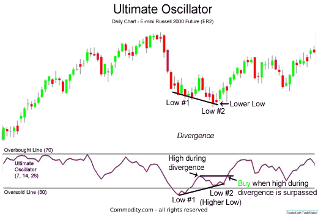

## Table of Contents

## What is the Ultimate Oscillator and what is its purpose in trading?

The Ultimate Oscillator is a technical indicator used in trading to measure the momentum of a stock or other financial instrument across different time frames. It was developed by Larry Williams in 1976 and is designed to avoid the limitations of using a single time frame for analysis. The oscillator combines short-term, intermediate-term, and long-term price cycles into one comprehensive indicator, typically using 7-day, 14-day, and 28-day periods.

The purpose of the Ultimate Oscillator in trading is to help traders identify potential buy and sell signals. It does this by comparing the closing price of a security to its price range over the chosen time periods. When the oscillator rises above 70, it suggests that the security might be overbought, indicating a possible sell signal. Conversely, when it falls below 30, it indicates that the security might be oversold, suggesting a potential buy signal. Traders often use the Ultimate Oscillator in conjunction with other indicators to confirm signals and improve the accuracy of their trading decisions.

## Who developed the Ultimate Oscillator and when was it introduced?

The Ultimate Oscillator was developed by a man named Larry Williams. He introduced it in the year 1976. Larry Williams is known for his work in technical analysis, which is a way to predict future price movements based on past market data.

The Ultimate Oscillator is a tool used by traders to understand how a stock or other financial item is doing over different time periods. It looks at short, medium, and long-term trends to give a full picture. This helps traders make better decisions about when to buy or sell.

## What are the three time frames used in calculating the Ultimate Oscillator?

The Ultimate Oscillator uses three different time frames to figure out how a stock is doing. These time frames are 7 days, 14 days, and 28 days. Each one looks at the price of the stock over a different period of time. The 7-day period is the shortest and shows what's happening right now. The 14-day period is in the middle and gives a medium-term view. The 28-day period is the longest and shows what's been happening over a longer time.

By using these three time frames together, the Ultimate Oscillator gives a complete picture of the stock's momentum. It helps traders see if the stock might be overbought, which means the price might be too high and could go down soon, or if it's oversold, meaning the price might be too low and could go up soon. This way, traders can make better decisions about when to buy or sell the stock.

## How is the buying pressure calculated in the Ultimate Oscillator formula?

The buying pressure in the Ultimate Oscillator formula is figured out by looking at the closing price of a stock and comparing it to the price range over a certain period. The buying pressure is the difference between the closing price and the lowest price of the day. If the closing price is higher than the lowest price, that difference is the buying pressure for that day. If the closing price is the same as the lowest price, then the buying pressure is zero.

This calculation is done for each of the three time frames used in the Ultimate Oscillator: 7 days, 14 days, and 28 days. For each time frame, you add up the buying pressure over the number of days in that period. This total buying pressure is then used in the formula to help figure out the overall momentum of the stock. By looking at the buying pressure across different time frames, the Ultimate Oscillator gives traders a better idea of whether the stock might be a good buy or sell.

## What is the formula for calculating the True Range in the Ultimate Oscillator?

The True Range in the Ultimate Oscillator is a way to measure how much the price of a stock moved in a day. It looks at three different ways to find the biggest price move. The first way is to find the difference between today's highest price and today's lowest price. The second way is to find the difference between today's highest price and yesterday's closing price. The third way is to find the difference between yesterday's closing price and today's lowest price. The True Range is the biggest number out of these three differences.

This calculation helps traders understand how much the price of the stock can change in one day. By using the True Range, the Ultimate Oscillator can better measure the momentum of the stock over different time periods. It's an important part of figuring out if a stock is overbought or oversold, which helps traders decide when to buy or sell.

## How do you combine the three time frames to get the final Ultimate Oscillator value?

To combine the three time frames and get the final Ultimate Oscillator value, you first need to calculate the Buying Pressure and True Range for each time frame: 7 days, 14 days, and 28 days. The Buying Pressure is the difference between the closing price and the lowest price of the day, while the True Range is the biggest difference between today's high and low, today's high and yesterday's close, or yesterday's close and today's low. You add up the Buying Pressure and True Range over each time frame.

Once you have these sums, you calculate the Average Buying Pressure and Average True Range for each time frame by dividing the total Buying Pressure and True Range by the number of days in that period. Then, you combine these averages using specific weights: 4 for the 7-day period, 2 for the 14-day period, and 1 for the 28-day period. The final Ultimate Oscillator value is calculated by summing up the weighted ratios of the Average Buying Pressure to the Average True Range for all three periods, then multiplying the result by 100 to convert it to a percentage. This final value helps traders see if a stock is overbought or oversold.

## What is considered an overbought or oversold level for the Ultimate Oscillator?

The Ultimate Oscillator helps traders see if a stock is overbought or oversold. When the oscillator goes above 70, it means the stock might be overbought. This suggests that the price is too high and could go down soon. Traders might think about selling the stock when they see this happen.

On the other hand, when the oscillator drops below 30, it means the stock might be oversold. This suggests that the price is too low and could go up soon. Traders might think about buying the stock when they see this happen. By using these levels, traders can make better decisions about when to buy or sell a stock.

## How can traders use divergence between price and the Ultimate Oscillator to predict market moves?

Traders can use divergence between the price of a stock and the Ultimate Oscillator to predict market moves. Divergence happens when the price of the stock is going one way, but the Ultimate Oscillator is going the other way. For example, if the stock price is going up but the Ultimate Oscillator is going down, this is called bearish divergence. It might mean that the price could start going down soon. Traders can use this information to decide if it's a good time to sell the stock.

On the other hand, if the stock price is going down but the Ultimate Oscillator is going up, this is called bullish divergence. It might mean that the price could start going up soon. Traders can use this information to decide if it's a good time to buy the stock. By watching for these divergences, traders can get a better idea of what might happen next with the stock price and make smarter trading decisions.

## What are some common trading strategies that incorporate the Ultimate Oscillator?

One common trading strategy using the Ultimate Oscillator is to buy when the oscillator falls below 30 and then rises back above it. This is called an oversold condition, which means the stock price might be too low and could go up soon. Traders look for this signal to decide when to buy the stock. They might also wait for the price to start going up a bit before buying, to make sure the trend is really changing.

Another strategy is to sell when the oscillator goes above 70 and then falls back below it. This is called an overbought condition, meaning the stock price might be too high and could go down soon. Traders use this signal to decide when to sell the stock. They might wait for the price to start going down a bit before selling, to be sure the trend is changing.

Traders also look for divergence between the stock price and the Ultimate Oscillator. If the price is going up but the oscillator is going down, it's called bearish divergence, and it might mean the price will go down soon. If the price is going down but the oscillator is going up, it's called bullish divergence, and it might mean the price will go up soon. By watching for these signals, traders can make better decisions about when to buy or sell a stock.

## How can the Ultimate Oscillator be used in conjunction with other technical indicators?

Traders often use the Ultimate Oscillator with other technical indicators to make better decisions. One common way is to use it with moving averages. A moving average is a line that shows the average price of a stock over a certain time. If the Ultimate Oscillator shows an oversold signal (below 30) and the price is also below the moving average, it might be a good time to buy. If the oscillator shows an overbought signal (above 70) and the price is above the moving average, it might be a good time to sell. By using both indicators together, traders can get a clearer picture of whether to buy or sell.

Another way to use the Ultimate Oscillator with other indicators is with the Relative Strength Index (RSI). The RSI is another tool that measures if a stock is overbought or oversold. If both the Ultimate Oscillator and the RSI show that a stock is oversold, it can give traders more confidence to buy. If both show that a stock is overbought, it can give traders more confidence to sell. By looking at signals from both indicators, traders can make more informed decisions and reduce the chance of making a wrong move.

## What are the limitations and potential pitfalls of using the Ultimate Oscillator in trading?

The Ultimate Oscillator, like any technical indicator, has its limitations and potential pitfalls. One major limitation is that it can give false signals. Sometimes the oscillator might show that a stock is overbought or oversold, but the price doesn't move as expected. This can lead traders to buy or sell at the wrong time, which can result in losses. Another issue is that the Ultimate Oscillator works best in a trending market but can be less effective in a sideways or choppy market. In these conditions, the oscillator might keep giving signals that don't lead to any big price moves, causing confusion and potential losses.

Another potential pitfall is that the Ultimate Oscillator is just one tool among many. Relying on it alone without considering other indicators or market conditions can be risky. Traders need to use it along with other tools like moving averages or the RSI to get a fuller picture of the market. Also, the settings of the Ultimate Oscillator, like the time periods used, can affect its signals. If the settings aren't right for the stock or market being traded, the signals might not be accurate. This means traders need to adjust the settings carefully and be aware that what works for one stock might not work for another.

## Can you provide a case study or example of a successful trade using the Ultimate Oscillator?

Imagine a trader named Sarah who uses the Ultimate Oscillator to make trading decisions. She's been watching a stock that she thinks is a good buy, but she wants to wait for the right moment. One day, she notices that the stock's price has been going down, but the Ultimate Oscillator starts to go up. This is called bullish divergence, and it means the stock price might start going up soon. Sarah sees that the oscillator has also dropped below 30 and is now rising above it, which is a strong buy signal. She decides to buy the stock at this point.

A few days later, the stock price starts to go up just like Sarah hoped. She keeps an eye on the Ultimate Oscillator and sees it go above 70, which means the stock might be overbought. When the oscillator starts to fall back below 70, Sarah decides it's time to sell. She sells the stock and makes a nice profit. By using the Ultimate Oscillator to spot the bullish divergence and the overbought signal, Sarah was able to make a successful trade.

## What is the Role of Oscillators in Trading Strategies?

Oscillators are essential tools within technical analysis that enable traders to identify short-term extreme market conditions. These indicators serve a pivotal role in determining optimal entry and [exit](/wiki/exit-strategy) points by signaling overbought or oversold market states. The core concept behind oscillators is to evaluate the [momentum](/wiki/momentum) of price movements, thereby providing clues about potential trend reversals or continuations.

A few widely-used oscillators include the Relative Strength Index (RSI), Moving Average Convergence Divergence (MACD), and the Stochastic Oscillator. Each of these tools offers unique insights into market dynamics:

1. **Relative Strength Index (RSI)**: Developed by J. Welles Wilder, the RSI measures the magnitude of recent price changes to evaluate overbought or oversold conditions. It is typically scaled from 0 to 100, where values above 70 generally indicate overbought conditions, and values below 30 indicate oversold conditions. The formula for RSI is:
$$
   \text{RSI} = 100 - \left( \frac{100}{1 + \text{RS}}} \right)

$$

   where RS (Relative Strength) is the average gain of up periods during the specified time frame divided by the average loss of down periods.

2. **Moving Average Convergence Divergence (MACD)**: Created by Gerald Appel, the MACD is a trend-following momentum indicator that calculates the difference between two exponential moving averages (EMAs)—one longer and one shorter. A signal line, which is a moving average of the MACD, is plotted against the MACD, and crossovers are used as trading signals.

3. **Stochastic Oscillator**: Introduced by George Lane, this oscillator compares a particular closing price of a security to a range of its prices over a certain period. It operates on the premise that in upward-trending markets, prices close near the high, and in downward-trending markets, prices close near the low. It ranges between 0 and 100, with typical thresholds indicating overbought conditions over 80 and oversold conditions below 20.

Oscillators are particularly beneficial in range-bound market environments where price movements are not significantly trending but fluctuate within a certain range. They help traders ascertain potential buy and sell signals when markets are neither in a strong upward nor downward trend. However, oscillators also come with limitations and understanding these is crucial for effective trading. In trending markets, oscillators might provide false signals by indicating overbought or oversold conditions too early.

In conclusion, the utility of oscillators lies in their ability to capture and reflect short-term price dynamics, assisting traders in making informed decisions under specific market conditions. They function as a guide for identifying strategic entry and exit points, particularly when used in conjunction with other technical analysis tools and criteria.

## What is the Ultimate Oscillator?

The Ultimate Oscillator, introduced by renowned market technician Larry Williams, represents a complex but versatile tool in technical analysis. It distinguishes itself from conventional single-timeframe oscillators by amalgamating data across short, medium, and long-term market cycles. This multi-timeframe approach aims to mitigate the incidence of false signals often produced by oscillators that focus on a single temporal dimension. By integrating various timeframes, the Ultimate Oscillator offers a more holistic view of market momentum, thereby enhancing the reliability of the signals generated.

The primary function of the Ultimate Oscillator is to evaluate buying or selling pressure within a specified timeframe. It operates on a scale typically ranging from 0 to 100. This range is critical for traders, as values generally above 70 indicate overbought conditions—suggesting a potential sell opportunity—while values below 30 signal oversold conditions, hinting at a potential buy.

The calculation of the Ultimate Oscillator involves three main components: the buying pressure (BP), true range (TR), and the average of these values over specified periods. The formula for BP is:

$$
\text{BP} = \text{Close} - \min(\text{Low}, \text{Prior Close})
$$

Meanwhile, the True Range (TR) is determined by:

$$
\text{TR} = \max(\text{High}, \text{Prior Close}) - \min(\text{Low}, \text{Prior Close})
$$

These calculations are then used across three different timeframes to compute weighted averages. The final value of the Ultimate Oscillator is derived from these weighted moving averages, compressing them into a unified metric that reflects market sentiment over varying periods. The unique weighting method across different periods allows for nuanced detection of market dynamics, reducing potential biases that single-period oscillators might introduce.

Integrating the Ultimate Oscillator into trading strategies requires not only an appreciation for its formulaic underpinnings but also an understanding of market interpretation. Traders need to recognize how signals are generated and the importance of thresholds, since effective implementation can lead to better-informed decisions in volatile market environments.

## What are the advantages of using the Ultimate Oscillator in trading?

The Ultimate Oscillator, designed by Larry Williams, offers distinct advantages in trading by reducing noise through its incorporation of multiple timescales. This oscillator evaluates market conditions across short, medium, and long-term periods, enhancing the reliability of trading signals. This approach counteracts the pitfalls of false breakouts, a common issue in oscillators focusing on a single timeframe. By synthesizing data from various market cycles, the Ultimate Oscillator provides a more nuanced view, allowing traders to identify more accurate entry and exit points.

For instance, the formula for the Ultimate Oscillator combines weighted averages of three different timeframes:

$$
UO = 100 \times \frac{(4 \times BP_1/ TR_1) + (2 \times BP_2/ TR_2) + (BP_3/ TR_3)}{4 + 2 + 1}
$$

Where:
- $BP_n$ is the True Price Change over the nth period,
- $TR_n$ is the True Range over the nth period, 
- The periods (1, 2, and 3) correspond to different timeframes, typically short, medium, and long term, such as 7, 14, and 28 days.

This multi-period analysis helps traders better anticipate trend reversals, thereby improving risk management. Crucially, traders can integrate the Ultimate Oscillator with other indicators like the Moving Average Convergence Divergence (MACD) or the Relative Strength Index (RSI) to further bolster their trading strategies. This integration provides a comprehensive view of the market by combining momentum analysis with other technical perspectives.

Additionally, the adaptability of the Ultimate Oscillator to different market conditions is notable. It functions effectively across varying market trends and volatilities, offering traders a robust tool that can be tailored to their specific strategy needs. By capitalizing on its ability to assess market dynamics over multiple timeframes, traders can gain clearer insights and execute more informed decisions within their trading models.

## How can one develop an Ultimate Oscillator Algo Trading Strategy?

To develop an Ultimate Oscillator algo trading strategy, one must first define the parameters that govern entry and exit conditions based on the Ultimate Oscillator's readings. The Ultimate Oscillator is a momentum oscillator that combines three different timeframes, providing a more comprehensive view of market momentum. It calculates an average based on three weighted timeframes, commonly short (7 days), medium (14 days), and long (28 days):

$$
UO = \left( \frac{4 \times AVG_{short} + 2 \times AVG_{medium} + 1 \times AVG_{long}}{4 + 2 + 1} \right) \times 100
$$

Entry and exit conditions can be set based on the oscillator's values, using thresholds like 30 for oversold conditions (potential buy signal) and 70 for overbought conditions (potential sell signal).

### Backtest the Strategy

Backtesting involves running the developed strategy on historical market data to assess its effectiveness. By simulating trades through past market conditions, traders can evaluate how well the strategy would have performed. This process helps identify the strategy's profitability, risk, drawdowns, and win-loss ratio. Using Python, one might employ libraries like `pandas` for data manipulation and `[backtrader](/wiki/backtrader)` for [backtesting](/wiki/backtesting). Here’s a simplified example of backtesting an Ultimate Oscillator strategy:

```python
import backtrader as bt

class UltimateOscillatorStrategy(bt.SignalStrategy):
    def __init__(self):
        self.uo = bt.indicators.UltimateOscillator(self.data)

    def next(self):
        if self.uo < 30:
            self.buy()
        elif self.uo > 70:
            self.sell()

cerebro = bt.Cerebro()
cerebro.addstrategy(UltimateOscillatorStrategy)
data = bt.feeds.YahooFinanceData(dataname='AAPL', fromdate=datetime(2020,1,1), todate=datetime(2021,1,1))
cerebro.adddata(data)
cerebro.run()
```

### Optimize Algorithm Parameters

To enhance the robustness and reliability of the strategy, optimization should be carried out by testing different parameter values (e.g., different time periods for the Ultimate Oscillator) to determine the configurations that yield the best performance metrics. This can be done using optimization techniques like grid search or genetic algorithms to cover a range of possible parameters systematically.

### Incorporate Risk Management Measures

Effective risk management is crucial for limiting potential losses. Incorporating mechanisms like stop-loss orders, which automatically close a position at a specified price level, is imperative. Position sizing methods can also be employed to ensure that no single trade significantly impacts the overall portfolio. For example:

```python
position_size = int(cash_available * risk_per_trade / stop_loss_amount)
```

### Continuous Refinement and Adaptation

The trading strategy must be periodically reviewed and refined based on real-world performance and market changes. This involves troubleshooting any inconsistencies discovered during live testing, making necessary adjustments, and keeping pace with evolving market dynamics. Continuous integration of new data, updating algorithmic parameters, and incorporating advanced analytics are essential for maintaining strategic advantage and capitalizing on market opportunities.

## References & Further Reading

[1]: Williams, L. ["The Ultimate Oscillator"](https://www.investopedia.com/terms/u/ultimateoscillator.asp) Trading Academy.

[2]: Wilder, J. W. (1978). ["New Concepts in Technical Trading Systems"](https://archive.org/details/newconceptsintec00wild) Trend Research.

[3]: Appel, G. (2005). ["Technical Analysis: Power Tools for Active Investors"](https://www.amazon.com/Technical-Analysis-Power-Active-Investors/dp/0131479024) FT Press.

[4]: Lane, G. C. (1984). ["Lane's Stochastics: Interpretive Techniques and Control"](https://www.bavarian-studies.org/an-english-language-bibliography-on-bavarian-history/) Traders Press.

[5]: Chan, E. P. (2009). ["Quantitative Trading: How to Build Your Own Algorithmic Trading Business"](https://github.com/ftvision/quant_trading_echan_book) Wiley.

[6]: Prado, M. L. (2018). ["Advances in Financial Machine Learning"](https://www.amazon.com/Advances-Financial-Machine-Learning-Marcos/dp/1119482089) Wiley.