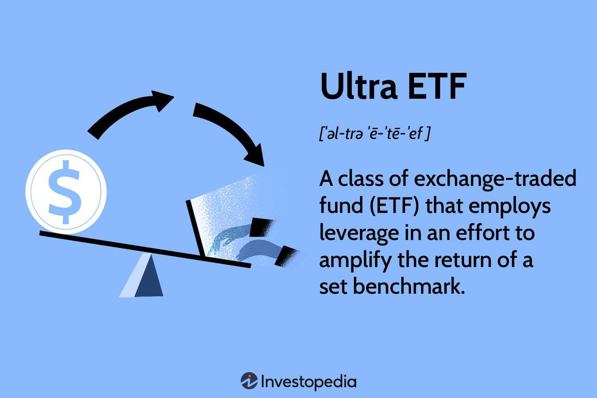

## Table of Contents

## What is an Ultra ETF?

An Ultra ETF, also known as a leveraged ETF, is a type of exchange-traded fund that aims to give investors bigger returns in a shorter time. It does this by using financial tools to make the fund's performance go up or down more than the thing it's tracking, like a stock index or commodity. For example, if the stock index goes up by 1%, an Ultra ETF might try to go up by 2% or more.

These funds can be very risky because they use a lot of borrowing to try to get bigger returns. This means that if the market goes down, the losses can be much bigger than with a normal ETF. Ultra ETFs are usually meant for short-term trading, not for keeping for a long time. It's important for investors to understand these risks before they decide to invest in an Ultra ETF.

## How does an Ultra ETF work?

An Ultra ETF works by using special financial tools to try to make more money than the thing it's following, like a stock index or commodity. If the stock index goes up by 1%, the Ultra ETF might try to go up by 2% or even more. It does this by borrowing money to invest more than it has, which is called leverage. This can make the returns bigger, but it also makes the risks bigger.

Because Ultra ETFs use a lot of borrowing, they can be very risky. If the market goes down, the losses can be much bigger than with a normal ETF. These funds are usually meant for people who want to trade for a short time, not for people who want to keep their money in the fund for a long time. It's important for anyone thinking about investing in an Ultra ETF to understand these risks and to be ready for big changes in the value of their investment.

## What are the common types of Ultra ETFs?

Ultra ETFs come in different types, but the most common ones are those that try to make double or triple the returns of a stock index, like the S&P 500. These are called 2x or 3x leveraged ETFs. For example, if the S&P 500 goes up by 1%, a 2x leveraged ETF would try to go up by 2%, and a 3x leveraged ETF would try to go up by 3%.

Another type of Ultra ETF focuses on specific sectors or industries, like technology or energy. These ETFs also use leverage to try to make bigger returns than the sector they are tracking. For example, a 2x leveraged technology ETF would try to make double the returns of a technology index.

There are also inverse Ultra ETFs, which try to make money when the market goes down. These ETFs use leverage to make bigger returns in the opposite direction of the market. For example, if the S&P 500 goes down by 1%, a 2x inverse leveraged ETF would try to go up by 2%.

## What are the benefits of investing in Ultra ETFs?

Investing in Ultra ETFs can give you the chance to make more money in a shorter time. If you think the market or a certain sector will go up, a 2x or 3x leveraged ETF can help you make double or triple the returns of the market. This can be good for people who like to trade a lot and want to take advantage of short-term changes in the market. For example, if you think the technology sector will do well in the next few days, you could invest in a 2x leveraged technology ETF to try to make more money.

Another benefit of Ultra ETFs is that they can help you make money even when the market is going down. Inverse Ultra ETFs are made to go up when the market goes down. So, if you think the market will go down, you can invest in an inverse ETF to try to make money from that. This can be a good way to protect your money or even make money during times when the market is not doing well.

## What are the potential risks associated with Ultra ETFs?

Ultra ETFs can be very risky because they use a lot of borrowing to try to make bigger returns. This means that if the market goes down, the losses can be much bigger than with a normal ETF. For example, if you invest in a 3x leveraged ETF and the market goes down by 1%, your investment could go down by 3%. This can lead to big losses if the market keeps going down.

Another risk is that Ultra ETFs are usually meant for short-term trading, not for keeping for a long time. If you keep your money in an Ultra ETF for a long time, the daily resetting of the leverage can make your investment lose value, even if the market stays the same or goes up a little. This is called volatility decay, and it can eat away at your investment over time.

Lastly, Ultra ETFs can be hard to understand and manage. They need a lot of attention and active trading to work well. If you don't know what you're doing, you could lose a lot of money. It's important to understand these risks and be ready for big changes in the value of your investment before you decide to invest in an Ultra ETF.

## How do Ultra ETFs differ from traditional ETFs?

Ultra ETFs and traditional ETFs are different in how they try to make money. Traditional ETFs usually follow a stock index or a group of stocks and try to make the same returns as that index. For example, if the S&P 500 goes up by 1%, a traditional ETF that follows the S&P 500 would also try to go up by 1%. Ultra ETFs, on the other hand, use something called leverage to try to make bigger returns. If the S&P 500 goes up by 1%, a 2x Ultra ETF would try to go up by 2%, and a 3x Ultra ETF would try to go up by 3%.

Because Ultra ETFs use leverage, they can be much riskier than traditional ETFs. If the market goes down, the losses can be much bigger with an Ultra ETF. For example, if the market goes down by 1%, a 3x Ultra ETF could go down by 3%. Traditional ETFs are usually safer and meant for people who want to keep their money in the fund for a long time. Ultra ETFs are meant for short-term trading and need a lot of attention and active trading to work well.

## What is the impact of leverage in Ultra ETFs?

Leverage in Ultra ETFs makes them try to make bigger returns than the thing they are following, like a stock index. If the stock index goes up by 1%, a 2x Ultra ETF would try to go up by 2%, and a 3x Ultra ETF would try to go up by 3%. This can be good if the market is going up because you can make more money in a shorter time. But it also makes the ETFs riskier because they use a lot of borrowing to try to make these bigger returns.

The use of leverage can lead to big losses if the market goes down. For example, if the market goes down by 1%, a 3x Ultra ETF could go down by 3%. This means that if you invest in an Ultra ETF and the market goes down, you could lose a lot more money than if you had invested in a normal ETF. Also, Ultra ETFs are usually meant for short-term trading, not for keeping for a long time. If you keep your money in an Ultra ETF for a long time, the daily resetting of the leverage can make your investment lose value, even if the market stays the same or goes up a little. This is called volatility decay, and it can eat away at your investment over time.

## How can Ultra ETFs be used in a diversified investment portfolio?

Ultra ETFs can be a part of a diversified investment portfolio, but they should be used carefully because they are very risky. If you think the market or a certain sector will go up in the short term, you can use a 2x or 3x Ultra ETF to try to make more money. For example, if you think the technology sector will do well in the next few days, you could invest a small part of your portfolio in a 2x leveraged technology ETF. This way, you can try to make more money from the sector's growth without putting all your money at risk.

However, because Ultra ETFs are so risky, they should only be a small part of your overall investment plan. Most of your money should be in safer investments like traditional ETFs, stocks, and bonds. This way, you can protect your money from big losses if the market goes down. It's also important to keep an eye on your Ultra ETF investments and be ready to sell them if the market changes. By using Ultra ETFs carefully, you can try to make more money while still keeping your portfolio safe.

## What are the tax implications of trading Ultra ETFs?

Trading Ultra ETFs can have special tax rules that you need to know about. When you buy and sell Ultra ETFs, you might have to pay taxes on any money you make. If you hold an Ultra ETF for less than a year, any profit you make is called a short-term capital gain. The tax on short-term gains is usually higher than on long-term gains, which are profits from investments you hold for more than a year. Because Ultra ETFs are meant for short-term trading, you might end up paying more in taxes than if you were trading other types of investments.

Another thing to think about is that Ultra ETFs can create a lot of trading inside the fund. This can lead to something called capital gains distributions, which are taxes you have to pay even if you didn't sell your shares. These distributions happen when the fund sells its investments and makes a profit. Because Ultra ETFs use a lot of borrowing and trading to try to make bigger returns, they might have more of these distributions than other ETFs. It's a good idea to talk to a tax advisor to understand how trading Ultra ETFs might affect your taxes.

## How do daily rebalancing and compounding affect Ultra ETF performance?

Daily rebalancing and compounding can make Ultra ETFs act in ways that might surprise you. Ultra ETFs try to make double or triple the returns of the market every day. To do this, they have to change their investments every day to keep the right amount of leverage. This is called daily rebalancing. If the market goes up and down a lot, this daily rebalancing can make the Ultra ETF lose value over time, even if the market stays the same or goes up a little. This is because the ETF has to buy high and sell low every day to keep the leverage right.

Compounding can also make things tricky. When you make money on your money, that's called compounding. With Ultra ETFs, the daily returns are compounded every day. If the market goes up one day and down the next, the compounding can make the losses bigger than the gains. This can lead to something called volatility decay, where the value of your investment goes down over time, even if the market stays the same. So, it's important to understand how daily rebalancing and compounding can affect the performance of Ultra ETFs before you decide to invest in them.

## What are some strategies for effectively using Ultra ETFs?

One good way to use Ultra ETFs is to trade them for a short time when you think the market or a certain sector will go up or down a lot. For example, if you think the technology sector will do well in the next few days, you could buy a 2x leveraged technology ETF. This way, you can try to make more money from the sector's growth. But, it's important to keep an eye on your investment and be ready to sell it if the market changes. Ultra ETFs are meant for short-term trading, so you should not keep them for a long time.

Another strategy is to use Ultra ETFs to protect your money when you think the market will go down. You can do this by buying an inverse Ultra ETF, which tries to make money when the market goes down. For example, if you think the S&P 500 will go down by 1%, you could buy a 2x inverse ETF to try to make 2% from the market's drop. This can be a good way to make money or protect your other investments during times when the market is not doing well. But remember, Ultra ETFs are very risky, so you should only use them for a small part of your overall investment plan.

## How do market conditions influence the performance of Ultra ETFs?

Market conditions can really change how well Ultra ETFs do. When the market goes up a lot, Ultra ETFs can make you a lot more money because they use leverage to try to make double or triple the returns of the market. For example, if the market goes up by 1%, a 2x Ultra ETF would try to go up by 2%. But, if the market goes down, the losses can be much bigger. If the market goes down by 1%, a 2x Ultra ETF could go down by 2%. So, if you think the market will go up a lot in the short term, Ultra ETFs can be a good way to make more money.

But, if the market goes up and down a lot every day, Ultra ETFs can lose value over time, even if the market stays the same or goes up a little. This is because Ultra ETFs have to change their investments every day to keep the right amount of leverage. This daily rebalancing can make the ETF buy high and sell low, which can lead to something called volatility decay. So, it's important to think about how the market is doing before you decide to invest in an Ultra ETF. If the market is very up and down, it might be better to stay away from Ultra ETFs.

## References & Further Reading

[1]: Bergstra, J., Bardenet, R., Bengio, Y., & Kégl, B. (2011). ["Algorithms for Hyper-Parameter Optimization."](https://dl.acm.org/doi/10.5555/2986459.2986743) Advances in Neural Information Processing Systems 24.

[2]: ["Advances in Financial Machine Learning"](https://www.amazon.com/Advances-Financial-Machine-Learning-Marcos/dp/1119482089) by Marcos Lopez de Prado

[3]: ["Evidence-Based Technical Analysis: Applying the Scientific Method and Statistical Inference to Trading Signals"](https://www.amazon.com/Evidence-Based-Technical-Analysis-Scientific-Statistical/dp/0470008741) by David Aronson

[4]: ["Machine Learning for Algorithmic Trading"](https://github.com/stefan-jansen/machine-learning-for-trading) by Stefan Jansen

[5]: ["Quantitative Trading: How to Build Your Own Algorithmic Trading Business"](https://www.amazon.com/Quantitative-Trading-Build-Algorithmic-Business/dp/1119800064) by Ernest P. Chan