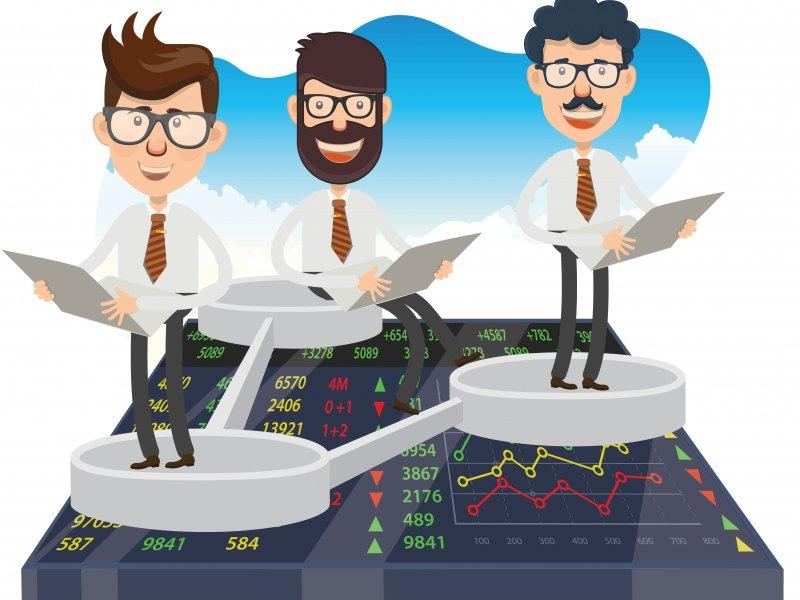

## Table of Contents

## What is direct market access (DMA)?

Direct Market Access (DMA) is a way for investors to buy and sell stocks directly on an exchange without going through a middleman like a broker. This means that traders can place their orders directly into the market's order book, which can lead to faster execution of trades and potentially better prices.

DMA is often used by institutional investors, like big investment firms, because it gives them more control over their trades. They can see real-time market data and make quick decisions based on that information. However, using DMA can be risky because it requires a good understanding of the market and the ability to manage trades effectively.

## What does ultra-low latency mean in the context of trading?

Ultra-low latency in trading means that the time it takes for a trade to happen is very, very short. Imagine sending a message and getting a reply almost instantly. In trading, this means that when you decide to buy or sell a stock, the order gets to the market and gets filled super fast. This is important because in the world of trading, even a few milliseconds can make a big difference.

Traders use special technology to make sure their orders get to the market as quickly as possible. This can help them get better prices and make more money. For example, if a trader sees a good opportunity, they want to act on it before anyone else does. Ultra-low latency helps them do that. But it's not easy to set up and can be expensive, so it's usually used by big trading firms and professional traders.

## How does ultra-low latency DMA benefit traders?

Ultra-low latency DMA helps traders by making their trades happen really fast. When traders use DMA, they can put their orders straight into the market without a middleman slowing things down. With ultra-low latency, this process is even quicker. This means traders can buy or sell stocks almost as soon as they decide to, which can help them get the best prices. If a stock's price is changing quickly, being fast can make a big difference in how much money they make or lose.

Another way ultra-low latency DMA helps is by giving traders more control over their trades. They can see what's happening in the market in real time and react right away. This is important because the stock market can change very quickly. By using ultra-low latency DMA, traders can make decisions based on the latest information and adjust their strategies on the spot. This can lead to better trading results and more profits.

## What technologies are used to achieve ultra-low latency in DMA?

To achieve ultra-low latency in DMA, traders use special computers and networks that are very fast. These computers are often placed right next to the stock exchange's servers, which helps reduce the time it takes for orders to travel back and forth. This setup is called co-location. The computers use high-speed processors and lots of memory to handle orders quickly. They also use special software that can process and send orders in just a few microseconds.

Another important technology is the use of fast networks. Traders use fiber-optic cables that can send data at the speed of light. Some even use microwave or laser links to send data even faster. These networks are designed to have as few stops or delays as possible. This means that the data can travel from the trader's computer to the exchange and back in the shortest time possible. All these technologies work together to make sure that trades happen as quickly as possible, giving traders an edge in the market.

## What are the typical latency times considered 'ultra-low' in trading?

In trading, 'ultra-low' latency means the time it takes for a trade to happen is very short. Usually, this means the latency is less than 1 millisecond (ms). That's super fast, like a blink of an eye but even quicker. Traders aim for this because even a tiny delay can mean missing out on the best prices.

To get these ultra-low latencies, traders use special technology. They put their computers right next to the stock exchange's servers, use super fast networks like fiber-optic cables, and even sometimes use microwave or laser links. All these things help make sure that orders get to the market and back in just a few microseconds, which is a thousand times faster than a millisecond.

## How does ultra-low latency DMA differ from traditional DMA?

Ultra-low latency DMA and traditional DMA both let traders put their orders straight into the market without a middleman. But, ultra-low latency DMA is much faster. It uses special technology to make sure orders get to the market and back in just a few microseconds. This means traders can buy or sell stocks almost as soon as they decide to, which can help them get the best prices. Traditional DMA, on the other hand, might take a bit longer, often in the range of milliseconds or more.

The speed difference between ultra-low latency DMA and traditional DMA is important because the stock market can change very quickly. With ultra-low latency DMA, traders can see what's happening in the market in real time and react right away. This can lead to better trading results and more profits. Traditional DMA still gives traders control over their trades, but it might not be as fast, so they might miss out on some opportunities that ultra-low latency DMA can catch.

## What are the challenges in implementing ultra-low latency DMA systems?

Setting up ultra-low latency DMA systems can be really tough. One big challenge is the cost. The special computers, fast networks, and being close to the stock exchange's servers can be very expensive. Not everyone can afford to spend so much money just to make their trades a bit faster. Also, keeping everything running smoothly takes a lot of work. The technology needs to be updated and checked all the time to make sure it stays fast.

Another challenge is the complexity of the technology. Ultra-low latency DMA uses very advanced stuff like high-speed processors, fiber-optic cables, and sometimes even microwave or laser links. Understanding and managing all these things can be hard. If something goes wrong, it can slow down the whole system, and that can cost traders a lot of money. So, it's not just about having the money to buy the technology, but also about having the know-how to use it right.

Lastly, there's the issue of fairness. Some people worry that ultra-low latency DMA gives an unfair advantage to big trading firms who can afford it. This can make the market less fair for smaller traders who can't use the same technology. Regulators have to keep an eye on this to make sure everyone has a fair chance. Balancing speed and fairness is a big challenge in the world of trading.

## What regulatory considerations must be taken into account with ultra-low latency DMA?

When using ultra-low latency DMA, traders need to follow rules set by regulators to make sure the market stays fair. One big rule is about market access. Regulators want to make sure that everyone has a fair chance to trade, so they watch how fast some traders can be. They might set limits on how much faster some traders can be compared to others. This is to stop big firms with lots of money from always getting the best deals and leaving smaller traders behind.

Another important thing regulators look at is how traders use their technology. They want to make sure that ultra-low latency DMA isn't used to do things like front-running, where someone uses fast technology to trade ahead of others and make unfair profits. Regulators also check that the systems are safe and secure. If something goes wrong with the technology, it could cause big problems in the market. So, traders have to show that they have good plans to keep their systems working well and to fix any issues quickly.

## How can ultra-low latency DMA impact market fairness and efficiency?

Ultra-low latency DMA can make the market more efficient by letting traders buy and sell stocks really fast. When traders can act quickly, they can take advantage of small changes in stock prices. This can help the market work better because prices can adjust to new information faster. But, it also means that the market can move very quickly, which can be hard for some traders to keep up with.

On the other hand, ultra-low latency DMA can make the market less fair. Big trading firms with lots of money can afford the special technology needed for ultra-low latency DMA. This gives them an advantage over smaller traders who can't afford it. They can get their orders in faster and get better prices, which can make it harder for others to compete. Regulators have to watch this closely to make sure everyone has a fair chance in the market.

## What are the best practices for maintaining ultra-low latency in DMA?

To keep ultra-low latency in DMA, it's important to use the right technology and keep it working well. Traders should use fast computers with high-speed processors and lots of memory. They should also use fiber-optic cables or even microwave and laser links to send data quickly. It's a good idea to put these computers as close as possible to the stock exchange's servers, which is called co-location. This setup helps make sure that orders get to the market and back in just a few microseconds.

Another important thing is to keep the technology up to date and working smoothly. This means checking the systems all the time to make sure they are running fast and fixing any problems right away. Traders should also use special software that can handle orders quickly and without delays. It's also good to have a backup plan in case something goes wrong, so the system can keep working even if there's a problem. By doing these things, traders can keep their ultra-low latency DMA working well and stay ahead in the market.

## How do different trading venues support ultra-low latency DMA?

Different trading venues support ultra-low latency DMA by offering special services and technology. Some venues have co-location services, which means they let traders put their computers right next to the exchange's servers. This makes the time it takes for orders to travel back and forth very short. They also use fast networks like fiber-optic cables to send data quickly. Some venues even have special software that helps traders handle their orders without delays.

Another way trading venues help is by making sure their own systems are fast and reliable. They use high-speed processors and lots of memory to process orders quickly. They also keep their systems updated and checked all the time to make sure they stay fast. This helps traders who use ultra-low latency DMA to get their orders in and out of the market as quickly as possible.

## What future developments can we expect in ultra-low latency DMA technology?

In the future, we can expect ultra-low latency DMA technology to get even faster and better. Scientists and engineers are always working on new ways to make computers and networks quicker. They might use new types of cables or even wireless technology like 5G or 6G to send data even faster. They could also come up with new software that can handle orders in even less time. All these improvements will help traders get their orders into the market and back in just a few microseconds, making trading even more efficient.

Another thing we might see is more fairness in the market. Regulators are thinking about new rules to make sure that everyone has a fair chance, even if they can't afford the most expensive technology. They might set limits on how fast some traders can be or make sure that everyone has access to the same kind of technology. This way, the market can stay fair while still using ultra-low latency DMA to make trading faster and more efficient.

## References & Further Reading

[1]: Aldridge, I. (2013). ["High-Frequency Trading: A Practical Guide to Algorithmic Strategies and Trading Systems"](https://www.amazon.com/High-Frequency-Trading-Practical-Algorithmic-Strategies/dp/1118343506). Wiley.

[2]: Narang, R. K. (2013). ["Inside the Black Box: A Simple Guide to Quantitative and High-Frequency Trading"](https://onlinelibrary.wiley.com/doi/book/10.1002/9781118662717). Wiley.

[3]: De Prado, M. L. (2018). ["Advances in Financial Machine Learning"](https://www.amazon.com/Advances-Financial-Machine-Learning-Marcos/dp/1119482089). Wiley.

[4]: Hasbrouck, J. (2016). ["Empirical Market Microstructure: The Institutions, Economics, and Econometrics of Securities Trading"](https://archive.org/details/empiricalmarketm0000hasb). Oxford University Press.

[5]: Hendershott, T., Jones, C. M., & Menkveld, A. J. (2011). ["Does algorithmic trading improve liquidity?"](https://onlinelibrary.wiley.com/doi/full/10.1111/j.1540-6261.2010.01624.x). The Review of Financial Studies, 24(5), 1593-1624.