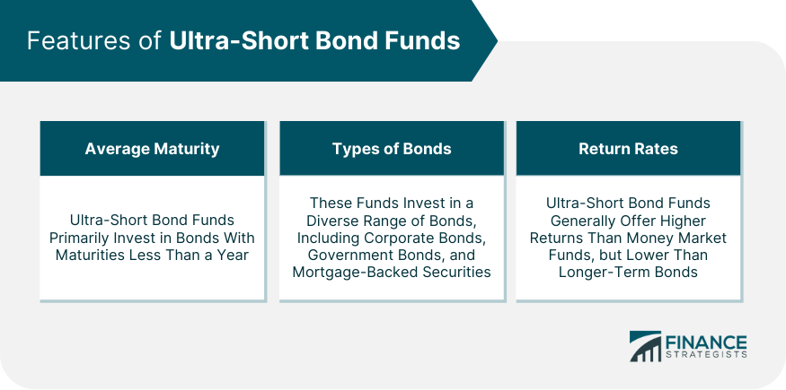

## Table of Contents

## What are ultra-short bond funds?

Ultra-short bond funds are a type of investment that focuses on bonds with very short maturity dates, usually less than one year. These funds aim to provide investors with a safe place to park their money while still earning a bit of interest. They are often seen as a good option for people who want to keep their money relatively safe but still want to earn more than they would from a regular savings account.

These funds invest in high-quality, short-term bonds, like those issued by governments or big companies. Because the bonds mature quickly, the funds are less affected by changes in interest rates, which makes them less risky than funds that hold longer-term bonds. However, the returns from ultra-short bond funds are usually lower than those from funds with longer-term bonds, but they are generally higher than what you would get from a savings account.

## How do ultra-short bond funds differ from other bond funds?

Ultra-short bond funds are different from other bond funds mainly because of how long the bonds they invest in last. Ultra-short bond funds focus on bonds that will pay back the money in less than a year. Other bond funds might hold bonds that take much longer to mature, like 10 or even 30 years. Because ultra-short bond funds deal with bonds that mature quickly, they are less affected by changes in interest rates. This makes them less risky than funds with longer-term bonds.

Another key difference is the level of return and risk. Ultra-short bond funds usually offer lower returns compared to other bond funds that invest in longer-term bonds. This is because shorter-term bonds generally pay less interest. However, the trade-off is that ultra-short bond funds are considered safer. They are a good choice for people who want to keep their money safe but still earn a bit more than they would from a regular savings account. In contrast, other bond funds might offer higher returns, but they also come with more risk because of the longer time until the bonds mature and the greater impact of [interest rate](/wiki/interest-rate-trading-strategies) changes.

## What are the typical investment objectives of ultra-short bond funds?

The main goal of ultra-short bond funds is to provide a safe place for people to invest their money while still [earning](/wiki/earning-announcement) a little bit of interest. These funds focus on bonds that will pay back the money in less than a year. Because the bonds don't last long, the funds are less affected by changes in interest rates. This makes them a good choice for people who want to keep their money safe but don't want it sitting in a regular savings account that pays very little interest.

Another important objective of ultra-short bond funds is to offer a bit more return than what you would get from a savings account, but without taking on too much risk. These funds invest in high-quality, short-term bonds, like those issued by governments or big companies. While the returns might not be as high as those from funds that invest in longer-term bonds, the trade-off is that ultra-short bond funds are considered safer. They are ideal for investors who want to earn a bit more interest without exposing their money to a lot of risk.

## What is the average duration of bonds in ultra-short bond funds?

The average duration of bonds in ultra-short bond funds is usually less than one year. Duration is a way to measure how long it takes for the bond to pay back the money you invested. Because ultra-short bond funds focus on bonds that mature quickly, they are less affected by changes in interest rates. This makes them a safer choice for people who want to keep their money safe but still earn a bit of interest.

These funds invest in high-quality, short-term bonds, like those issued by governments or big companies. The short duration means that the bonds in these funds will pay back the money soon, which reduces the risk of losing money if interest rates go up or down. While the returns might not be as high as those from funds with longer-term bonds, ultra-short bond funds are a good option for people who want to keep their money safe and earn a bit more than they would from a regular savings account.

## How does the credit quality of bonds in ultra-short bond funds affect their risk and return?

The credit quality of bonds in ultra-short bond funds plays a big role in how risky and how much return the fund can offer. Credit quality is about how likely it is that the bond issuer will pay back the money they borrowed. High-quality bonds, like those from governments or big, stable companies, are seen as safer because there's a lower chance the issuer won't pay back the money. When ultra-short bond funds invest in these high-quality bonds, the risk of losing money is lower. But, because these bonds are safer, they usually offer lower returns compared to riskier bonds.

On the other hand, if ultra-short bond funds invest in bonds with lower credit quality, the risk goes up. These bonds are from issuers that might have a harder time paying back the money they borrowed. Because of this higher risk, these bonds usually offer higher interest rates to attract investors. So, if an ultra-short bond fund includes more of these lower-quality bonds, it might offer higher returns, but it also comes with a higher chance of losing money. Investors need to balance their need for safety with their desire for higher returns when choosing an ultra-short bond fund.

## What are the common types of securities found in ultra-short bond funds?

Ultra-short bond funds usually invest in a variety of short-term securities that will pay back the money in less than a year. These funds often include U.S. Treasury bills, which are very safe because they are backed by the government. They also invest in commercial paper, which are short-term loans to big companies. These are seen as safe because the companies are usually well-known and financially stable.

Another common type of security in ultra-short bond funds is certificates of deposit (CDs) from banks. These are also considered safe because they are insured by the government up to a certain amount. Some funds might also include short-term corporate bonds, which are loans to companies that last less than a year. While these can be a bit riskier than government securities, they still offer a good balance of safety and return for ultra-short bond funds.

## How do interest rate changes impact ultra-short bond funds?

Interest rate changes have less of an effect on ultra-short bond funds compared to funds that hold longer-term bonds. This is because the bonds in ultra-short bond funds will pay back the money in less than a year. When interest rates go up or down, the value of these short-term bonds doesn't change as much as longer-term bonds. This means that ultra-short bond funds are less risky when it comes to interest rate changes.

However, interest rate changes can still impact ultra-short bond funds. If interest rates go up, the value of the bonds in the fund might go down a little bit. But because the bonds mature quickly, the fund can soon reinvest the money at the new, higher interest rates. This can help the fund earn a bit more interest over time. On the other hand, if interest rates go down, the value of the bonds might go up a little, but the fund will soon have to reinvest at lower rates, which could mean earning less interest in the future.

## What are the advantages of investing in ultra-short bond funds?

One big advantage of investing in ultra-short bond funds is that they are safer than other types of bond funds. These funds invest in bonds that will pay back the money in less than a year. Because the bonds don't last long, they are less affected by changes in interest rates. This makes ultra-short bond funds a good choice for people who want to keep their money safe but still earn a bit more interest than they would from a regular savings account.

Another advantage is that ultra-short bond funds can offer a bit more return than a savings account. While the returns might not be as high as those from funds that invest in longer-term bonds, the trade-off is that ultra-short bond funds are less risky. They invest in high-quality, short-term bonds, like those issued by governments or big companies. This means that investors can earn a bit more interest without taking on too much risk.

## What are the potential risks associated with ultra-short bond funds?

Even though ultra-short bond funds are seen as safe, they still have some risks. One risk is that the value of the bonds in the fund can go down if interest rates go up. This happens because new bonds will be issued at the higher interest rates, making the older bonds with lower rates less valuable. But because the bonds in ultra-short bond funds mature quickly, this risk is smaller than with longer-term bonds.

Another risk is that the credit quality of the bonds in the fund can change. If a company or government that issued a bond starts to have money problems, the bond's value can go down. Ultra-short bond funds try to avoid this by investing in high-quality bonds, but there's still a small chance it could happen. This risk is usually lower than with funds that invest in riskier, lower-quality bonds, but it's something to keep in mind.

Lastly, ultra-short bond funds might not keep up with inflation. If the interest you earn from the fund is less than the rate of inflation, the buying power of your money could go down over time. This means that even though your money is safe, it might not grow enough to keep up with the rising cost of living.

## How can investors assess the credit quality of an ultra-short bond fund?

Investors can assess the credit quality of an ultra-short bond fund by looking at the fund's holdings and the ratings of the bonds it invests in. Credit rating agencies like Moody's, Standard & Poor's, and Fitch give bonds ratings based on how likely the issuer is to pay back the money. A bond with a high rating, like AAA or AA, is seen as very safe because the issuer is likely to pay back the money. On the other hand, a bond with a lower rating, like BB or B, is seen as riskier because there's a higher chance the issuer might not pay back the money. By checking the ratings of the bonds in the fund, investors can get a good idea of the overall credit quality.

Another way to assess the credit quality is by looking at the fund's prospectus or fact sheet. These documents often include information about the average credit quality of the bonds in the fund. They might also show the percentage of the fund's assets that are invested in different credit rating categories. This can help investors understand how much of the fund is in safe, high-quality bonds and how much is in riskier, lower-quality bonds. By considering both the ratings and the fund's documentation, investors can make a more informed decision about the credit quality of an ultra-short bond fund.

## What role do ultra-short bond funds play in a diversified investment portfolio?

Ultra-short bond funds can be a useful part of a diversified investment portfolio because they help balance out risk. These funds invest in bonds that will pay back the money in less than a year, so they are safer than other types of bond funds. This means they can help protect your money when other parts of your portfolio, like stocks or longer-term bonds, are going up and down a lot. By adding ultra-short bond funds, you can make your overall portfolio less risky and more stable.

Another way ultra-short bond funds can help in a diversified portfolio is by providing a steady, small return. While these funds don't offer big returns like stocks or longer-term bonds might, they do give you a bit more interest than a regular savings account. This can be helpful for investors who want to earn a little bit of extra money without taking on too much risk. By including ultra-short bond funds, you can have a mix of investments that work together to grow your money safely over time.

## How have ultra-short bond funds performed historically compared to other fixed income investments?

Ultra-short bond funds have generally performed better than regular savings accounts but not as well as longer-term bond funds or stocks. Over the years, these funds have provided steady, small returns because they invest in high-quality, short-term bonds. This means they are less risky and less affected by changes in interest rates compared to funds that hold longer-term bonds. For example, during times when interest rates go up, ultra-short bond funds might see a small drop in value, but they recover quickly because the bonds mature soon and can be reinvested at the new rates.

Compared to other fixed income investments, ultra-short bond funds have been a good middle ground. They offer more return than a savings account but with less risk than longer-term bond funds or corporate bonds with lower credit ratings. During periods of economic uncertainty or when interest rates are volatile, ultra-short bond funds have often been a safe haven for investors looking to protect their money while still earning some interest. This makes them a popular choice for people who want to balance safety and return in their investment portfolios.

## References & Further Reading

[1]: Bergstra, J., Bardenet, R., Bengio, Y., & Kégl, B. (2011). ["Algorithms for Hyper-Parameter Optimization."](https://dl.acm.org/doi/10.5555/2986459.2986743) Advances in Neural Information Processing Systems 24.

[2]: ["Advances in Financial Machine Learning"](https://www.amazon.com/Advances-Financial-Machine-Learning-Marcos/dp/1119482089) by Marcos Lopez de Prado

[3]: ["Evidence-Based Technical Analysis: Applying the Scientific Method and Statistical Inference to Trading Signals"](https://www.amazon.com/Evidence-Based-Technical-Analysis-Scientific-Statistical/dp/0470008741) by David Aronson

[4]: ["Machine Learning for Algorithmic Trading"](https://github.com/stefan-jansen/machine-learning-for-trading) by Stefan Jansen

[5]: ["Quantitative Trading: How to Build Your Own Algorithmic Trading Business"](https://www.amazon.com/Quantitative-Trading-Build-Algorithmic-Business/dp/1119800064) by Ernest P. Chan