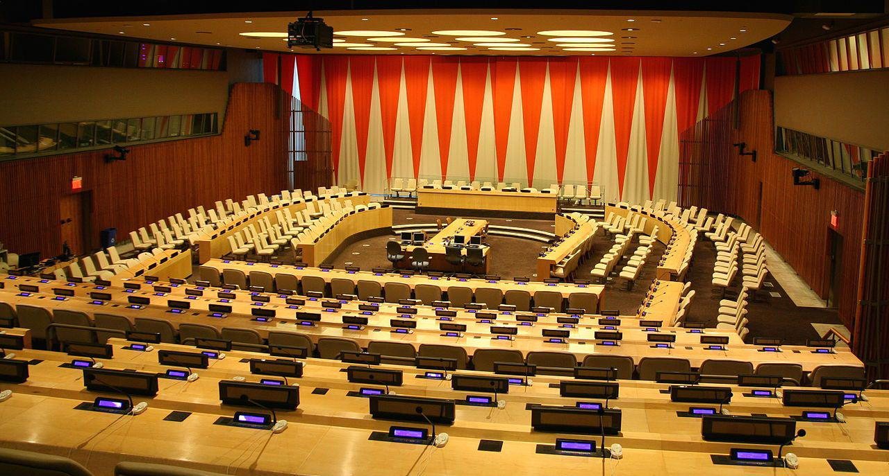

## Table of Contents

## What are the UN Principles for Responsible Investment (PRI)?

The UN Principles for Responsible Investment (PRI) are a set of guidelines that help investors make decisions that are good for both their wallets and the world. They were created by the United Nations to encourage investors to think about how their investments affect things like the environment, human rights, and society as a whole. The PRI are based on the idea that by considering these factors, investors can make better choices that lead to more sustainable and successful investments.

There are six main principles that make up the PRI. These principles guide investors to include environmental, social, and governance (ESG) factors in their investment decisions. This means looking at how a company treats its workers, how it impacts the environment, and how it is managed. By following these principles, investors can help create a more sustainable global financial system. The PRI also encourage investors to work together and share information to improve their practices and make a bigger positive impact.

## Who can sign up to the UN PRI?

Anyone who invests money can sign up to the UN PRI. This includes big organizations like pension funds, insurance companies, and banks, as well as smaller groups and even individual investors. The main thing is that you want to make your investments in a way that helps the world, not just your wallet.

Signing up to the PRI means you agree to follow their six principles. These principles help you think about how your investments affect the environment, people, and how companies are run. By joining, you become part of a big group of investors who share ideas and work together to make the world a better place through responsible investing.

## What is the history and background of the UN PRI?

The UN Principles for Responsible Investment (PRI) started in 2005. A group of big investors worked with the United Nations to create these principles. They wanted to make sure that investing money could help the world, not just make more money. The PRI was officially launched at the New York Stock Exchange in April 2006. Since then, more and more people and organizations have joined, making it a big movement for responsible investing.

The PRI came from the idea that investors should think about more than just money when they make choices. They should also consider things like the environment, how people are treated, and how companies are run. This is called ESG, which stands for Environmental, Social, and Governance. By following the PRI, investors help make the world a better place while still trying to make good investments. The PRI has grown a lot and now has thousands of members from all over the world, working together to make a positive difference through their investments.

## How do the UN PRI support sustainable investment?

The UN PRI help with sustainable investment by giving investors a set of rules to follow. These rules, called the six principles, tell investors to think about the environment, how people are treated, and how companies are run when they make choices about where to put their money. By following these rules, investors can make choices that are good for the world and still make money. The PRI also help investors work together and share ideas, so they can learn from each other and make even better choices.

The PRI started in 2005 when a group of big investors worked with the United Nations to create these rules. They wanted to make sure that investing money could help the world, not just make more money. Since then, more and more people and organizations have joined the PRI, making it a big movement for responsible investing. Today, thousands of members from all over the world use the PRI to guide their investments and make a positive difference.

## What are the six principles of the UN PRI?

The UN PRI has six principles that help investors make choices that are good for the world and their wallets. The first principle says to think about how your investments affect things like the environment, how people are treated, and how companies are run. This is called ESG, which stands for Environmental, Social, and Governance. The second principle is about being an active owner, which means using your power as an investor to make companies do better in these areas. The third principle is about asking companies for more information about their ESG practices, so you can make better choices.

The fourth principle is about working with others to make a bigger impact. This means sharing ideas and working together with other investors to make the world better. The fifth principle is about improving your own practices, which means always trying to get better at responsible investing. The last principle is about telling others about what you're doing, so more people can learn about responsible investing and join in. By following these six principles, investors can help make the world a better place while still making good investments.

## How can an organization implement the UN PRI?

An organization can start implementing the UN PRI by first understanding the six principles and how they apply to their investment decisions. This means looking at how their investments affect the environment, how people are treated, and how companies are run. They should start by making sure their investment choices consider these factors, which is called ESG (Environmental, Social, and Governance). The organization can also become an active owner by using their power as an investor to encourage companies to improve their ESG practices. They should also ask companies for more information about their ESG efforts to make better investment choices.

Next, the organization should work with other investors to share ideas and make a bigger impact. This can be done by joining networks and groups that focus on responsible investing. They should also keep improving their own practices by learning more about ESG and how to make better investment decisions. Finally, the organization should tell others about what they are doing to promote responsible investing. By sharing their experiences and successes, they can help more people and organizations join the movement and make the world a better place through their investments.

## What are the benefits of adopting the UN PRI for investors?

Adopting the UN PRI can help investors make better choices that are good for both their wallets and the world. By following the six principles, investors can think about how their investments affect the environment, how people are treated, and how companies are run. This means they can choose to invest in companies that are doing good things for the world, which can lead to more sustainable and successful investments over time. It also helps investors avoid companies that might have problems in the future because they are not taking care of the environment or treating people well.

Another benefit is that investors who follow the UN PRI can work together with other investors. This means they can share ideas and learn from each other, which can help them make even better investment choices. By being part of a big group of investors who care about the world, they can have a bigger impact and help make the world a better place. Plus, by telling others about what they are doing, they can encourage more people to join in and make responsible investing a bigger movement.

## How does the UN PRI measure and report on its impact?

The UN PRI measures and reports on its impact by looking at how well its members are following the six principles. They do this by asking members to fill out a yearly report called the "Reporting Framework." This report asks members to share information about how they are thinking about the environment, how people are treated, and how companies are run when they make investment choices. By collecting this information, the UN PRI can see how much progress is being made and where more work is needed.

The UN PRI also shares this information with everyone through a public report called the "PRI in Numbers." This report shows how many members are part of the PRI, how much money they are investing, and how they are doing in different areas like the environment and how people are treated. By making this information public, the UN PRI helps everyone see the impact of responsible investing and encourages more people to join in and make a difference.

## What challenges do organizations face when implementing the UN PRI?

When organizations try to follow the UN PRI, they often find it hard to get the right information about how companies are doing with the environment, how they treat people, and how they are run. This is called ESG information. Sometimes, companies do not share this information, or it is hard to understand. This makes it tough for investors to make good choices based on the UN PRI principles. Also, it can be hard to change the way an organization makes investment decisions. They might need to train their staff and change their rules and systems, which takes time and money.

Another challenge is that some people might not believe that following the UN PRI will help them make money. They might think that focusing on the environment and how people are treated will make their investments less successful. This can make it hard to get everyone in the organization to agree on following the UN PRI. But, by working together with other investors and sharing ideas, organizations can learn how to make responsible investing work well for them. It takes effort and commitment, but the benefits for the world and their investments can be worth it.

## How do the UN PRI align with other global sustainability frameworks?

The UN PRI work well with other big plans for making the world better, like the UN Sustainable Development Goals (SDGs) and the Paris Agreement on climate change. The SDGs are a list of 17 goals that countries around the world want to reach by 2030, like ending poverty and protecting the planet. The UN PRI help investors think about these goals when they make choices about where to put their money. By doing this, investors can help make progress on the SDGs and make the world a better place. The Paris Agreement is about stopping the world from getting too hot. The UN PRI encourage investors to think about how their investments affect the climate, which helps them follow the Paris Agreement.

The UN PRI also fit well with other rules and ideas about how companies should act, like the UN Global Compact and the OECD Guidelines for Multinational Enterprises. The UN Global Compact is a promise that companies make to do business in a way that helps the world. The OECD Guidelines are rules for big companies to follow to make sure they treat people and the environment well. By following the UN PRI, investors can help make sure that the companies they invest in are following these other rules too. This makes the whole system of investing more responsible and helps make the world a better place.

## What role do the UN PRI play in influencing corporate behavior?

The UN PRI help change how companies act by encouraging investors to think about more than just making money. When investors follow the UN PRI, they look at how companies treat the environment, how they treat people, and how they are run. This is called ESG, which stands for Environmental, Social, and Governance. By choosing to invest in companies that do well in these areas, investors can push companies to do better. If a company knows that investors care about ESG, it might try harder to be good to the environment and treat people well, because it wants to attract more investment.

The UN PRI also help investors work together and share ideas. When lots of investors join the UN PRI, they can talk to each other about what they are doing and learn from each other. This can make a big difference because when many investors ask a company to do better, the company is more likely to listen. By working together, investors can make a bigger impact and help companies change their behavior to be more responsible. This can lead to a better world for everyone.

## What are the future developments and trends expected for the UN PRI?

The UN PRI is expected to keep growing and becoming more important in the future. More and more investors are starting to care about how their investments affect the environment, how people are treated, and how companies are run. This means that the UN PRI will likely have more members and more money being invested in a responsible way. As more people join, the UN PRI will be able to have a bigger impact on making the world a better place. They might also start working on new ways to help investors make good choices, like using new technology or coming up with new rules.

Another trend for the UN PRI is working more closely with governments and other big groups. This can help make sure that everyone is working together to make the world better. The UN PRI might also focus more on big problems like climate change and making sure everyone has a fair chance. By working on these big issues, the UN PRI can help investors make choices that not only make money but also help solve these problems. This could lead to a future where investing is not just about making money, but also about making the world a better place for everyone.

## References & Further Reading

[1]: ["The Principles for Responsible Investment (PRI)"](https://www.unpri.org/about-us/what-are-the-principles-for-responsible-investment) by United Nations-supported Principles for Responsible Investment

[2]: Clark, G. L., Feiner, A., & Viehs, M. (2014). ["From the Stockholder to the Stakeholder: How Sustainability Can Drive Financial Outperformance."](https://www.semanticscholar.org/paper/From-the-Stockholder-to-the-Stakeholder%3A-How-Can-Clark-Feiner/d37a738e5ea8df791487ff183deca5ee6b893afb) SSRN Electronic Journal.

[3]: Friede, G., Busch, T., & Bassen, A. (2015). ["ESG and financial performance: aggregated evidence from more than 2000 empirical studies."](https://www.tandfonline.com/doi/full/10.1080/20430795.2015.1118917) Journal of Sustainable Finance & Investment.

[4]: ["Green Bonds: Mobilizing the Debt Capital Markets for a Low-Carbon Transition"](https://docslib.org/doc/8501229/green-bonds-mobilising-the-debt-capital-markets-for-a-low-carbon-transition) by World Bank

[5]: MacKenzie, D. (2021). ["Trading at the Speed of Light: How Ultrafast Algorithms Are Transforming Financial Markets"](https://www.amazon.com/Trading-Speed-Light-Algorithms-Transforming/dp/0691211388) by Princeton University Press