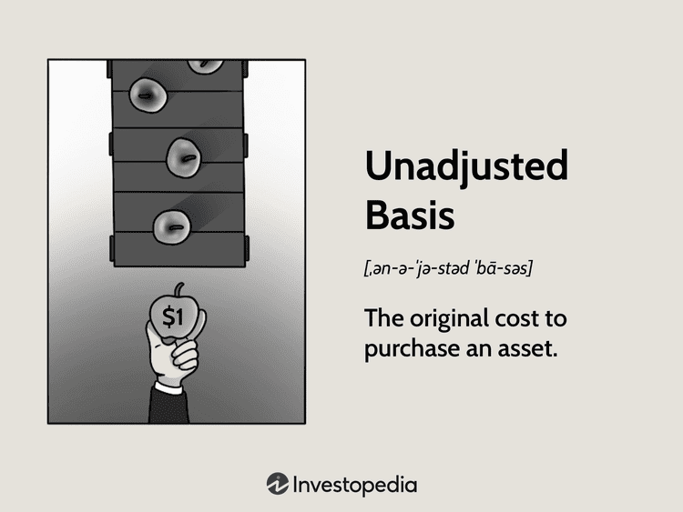

In the world of algorithmic trading, accuracy and reliability are paramount for effective decision-making. These decisions are grounded in robust statistical analyses, which are critical for interpreting market data and guiding trading strategies. However, biases, both unadjusted and statistical, can have significant impacts on these strategies and their outcomes.

Unadjusted biases are those that remain uncorrected throughout the data analysis process, leading to distorted interpretations and potentially flawed decisions. For instance, reliance on non-representative samples or limited datasets can predispose models to overfitting, where the trading strategy appears effective historically but performs poorly in real market environments. Such biases give traders false confidence in their strategy's robustness.



On the other hand, statistical biases introduce systematic errors that skew the results of data analyses. When these biases infiltrate algorithmic trading models, they distort perceptions of market behaviors and trends, causing traders to develop strategies based on misconceptions. Unsound sampling methods often root these biases—they misrepresent the broader market dynamics, which can mislead even the most sophisticated model if left unchecked.

This article examines the various biases relevant to trading, including statistical and algorithmic biases, demonstrating their real-world implications with examples. By understanding these biases, traders can take steps to mitigate their effects, striving for more precise and reliable trading strategies that stand up to changing market conditions.

## Table of Contents

## Understanding Bias in Algorithmic Trading

Algorithmic trading leverages computational models to automate financial decision-making, using vast quantities of data to inform buy and sell orders in financial markets. These trading models are inherently data-driven, making them vulnerable to biases that can skew their effectiveness. Bias in algorithmic trading can manifest in several ways, each with potential implications for the validity and financial outcomes of the strategies deployed.

One significant source of bias in algorithmic trading is sample size neglect. This occurs when the datasets used to train models are either too small or unrepresentative of the broader market. Insufficient sample size can result in overfitting, where a model captures noise rather than signal from historical data, leading to poor predictive performance in live market conditions. An overfitted model may excel in backtests but fail when exposed to new data, causing significant financial losses.

Data biases also present challenges in [algorithmic trading](/wiki/algorithmic-trading). Such biases arise when the data collected and used for model training are not representative of the market they are supposed to mirror. This can result from selection bias, whereby the available data do not reflect the entire market due to systematic exclusion of certain types of information. For example, using only data from bullish market periods can lead to the development of strategies that are inadequate during bearish or volatile phases.

Algorithmic biases are another concern, deriving from the assumptions and processing methods embedded within the trading models. These biases can stem from skewed training data or from inherent biases in the algorithms themselves. For instance, models based on historical data that implicitly reflect social or economic biases might make prejudiced predictions that do not align with actual market dynamics.

Addressing these biases necessitates a comprehensive approach that involves careful data curation, robust statistical analysis, and ongoing evaluation of model performance. Ensuring the diversity and representativeness of datasets, along with the application of strict validation methods, enhances the reliability of algorithmic trading strategies, mitigating the adverse effects biases can introduce.

## Examples of Unadjusted Bias in Trading

Unadjusted bias in trading refers to the biases present in trading models that have not been addressed or corrected, which can significantly skew interpretations and outcomes. Such biases are pervasive in algorithmic trading systems, where they can undermine the reliability and effectiveness of trading strategies.

A prime example of unadjusted bias is sample size neglect, which leads to overfitting. Overfitting occurs when a trading model is tailored too closely to historical data, capturing noise rather than the underlying market signal. As a result, the model may exhibit exceptional performance during [backtesting](/wiki/backtesting) but fail to deliver similar results in live markets. Overfitting can be quantitatively assessed by evaluating the difference in performance metrics such as the Sharpe ratio between in-sample and out-of-sample data. A substantial divergence in these metrics often indicates a risk of overfitting.

Another instance of unadjusted bias arises from backtesting with a small or unrepresentative sample. An inadequate sample size can lead to biased estimates of a trading strategy’s future performance. If a model is validated on data that does not accurately represent the broader market conditions, the conclusions drawn about its effectiveness may be overly optimistic. This results in false confidence in the strategy's robustness, potentially leading to financial losses when deployed in real-world trading scenarios.

Mathematically, the danger of small sample sizes can be illustrated by considering statistical concepts such as variance. In cases where $n$ (the sample size) is small, the estimate of a parameter $\theta$ obtained from the sample (denoted as $\hat{\theta}$) may have high variance. This high variance means that $\hat{\theta}$ is likely to deviate significantly from the true parameter $\theta$, leading to misleading insights about the trading strategy’s viability.

Moreover, unadjusted biases can also emerge from ignoring transaction costs or market impact in backtests. A strategy might appear profitable when ignoring the friction of actual trading conditions, but once implemented, it could result in significantly lower or even negative returns after accounting for these costs.

To mitigate these types of unadjusted biases, traders should focus on using sufficiently large and representative samples for model development and backtesting. Incorporating realistic assumptions about market conditions and transaction costs is crucial. Additionally, employing cross-validation techniques can help ensure that models generalize well to unseen data, reducing the risk of biases that could compromise trading strategies.

## Statistical Bias Explained

Statistical bias is a systematic error that skews the interpretation of data, leading to erroneous conclusions. In the context of trading, such biases can profoundly impact market analysis and strategy formulation. Sampling bias is one of the most prevalent forms of statistical bias, characterized by the selection of a data subset that fails to represent the broader market accurately. For example, a trading model based on data from a particularly volatile market segment may not apply to more stable conditions, thereby leading to skewed results and flawed strategies. 

Another significant type of statistical bias is response bias. This occurs when the data inputs contain inaccuracies, possibly due to misreported or manipulated figures, which then feed into the model, distorting its outputs. In trading, such biases can manifest when traders rely on incomplete or incorrect information, causing them to misinterpret market signals and make suboptimal decisions. 

For instance, suppose a trader develops a model using historical price data heavily influenced by sporadic economic events (a biased sample). In this case, the trader might assume such [volatility](/wiki/volatility-trading-strategies) is typical, leading to aggressive strategies that underperform during normal market conditions. Corrections for such biases might involve increasing the sample size or ensuring that the data encompasses various market phases.

To better understand the impact of statistical bias on trading models, consider this Python example using a simple linear regression model:

```python
import numpy as np
from sklearn.linear_model import LinearRegression
from sklearn.model_selection import train_test_split

# Generate sample data
np.random.seed(0)
X = np.random.rand(100, 1) * 10  # 100 data points from 0 to 10
# Introduce sampling bias by selecting only large values
y = 2 * X + 1 + np.random.randn(100, 1) * 2
X = X[X > 5]
y = y[:len(X)]

# Split data into training and test sets
X_train, X_test, y_train, y_test = train_test_split(X, y, test_size=0.2, random_state=42)

# Train the model
model = LinearRegression()
model.fit(X_train, y_train)

# Evaluate the model
score = model.score(X_test, y_test)
print(f"Model R^2 score: {score}")

# Outputs a low R^2 score due to sampling bias
```

This code generates biased data by selecting values above a threshold, fitting a linear regression model, and evaluating its performance. The model's low $R^2$ score highlights how biased samples lead to inaccurate predictions and reduced model reliability. Addressing biases like these involves careful data selection, validation, and model testing across diverse scenarios to enhance the predictive accuracy of trading strategies.

## Algorithmic Bias: Causes and Examples

Algorithmic bias occurs when an algorithm's output is systematically biased due to skewed or unrepresentative training data. This phenomenon results in decisions or predictions that do not accurately reflect reality or equitable standards. The impact of algorithmic bias is far-reaching, with notable societal examples such as racial biases in facial recognition systems, where algorithms misidentify individuals of certain ethnic groups at a higher rate than others. For instance, a study by MIT Media Lab found that facial analysis algorithms had an error rate of 34.7% for dark-skinned women compared to just 0.8% for light-skinned men, illustrating a profound example of racial bias.[^1]

In the context of recruitment, algorithmic bias can arise when historical hiring data that incorporates gender biases influences automated hiring tools. Amazon's experiment with an AI recruitment tool revealed that the model systematically disadvantaged female candidates, as the data it was trained on was predominantly comprised of male applicants, reflecting the existing gender disparity in their workforce.[^2]

Within algorithmic trading, similar biases can manifest when models are designed on biased financial data. These biases may result in skewed predictions and trading decisions that inadvertently favor certain market conditions or entities over others. For example, if a trading algorithm is predominantly trained on data from a bull market phase without adequately representing bearish or volatile periods, it might exhibit a bias towards assuming upward trends, leading to inaccurate forecasts and suboptimal investment decisions.

Algorithmic trading models must be rigorously tested for biases by employing diverse and comprehensive datasets that consider all market conditions. Furthermore, methodologies such as cross-validation, feature selection, and continuous model evaluation help ensure that these models remain unbiased and representative of broader market realities. Advanced practices such as fairness-aware [machine learning](/wiki/machine-learning) approaches also aim to mitigate algorithmic biases by adjusting models to achieve more equitable outcomes.

[^1]: Buolamwini, J., & Gebru, T. (2018). "Gender Shades: Intersectional Accuracy Disparities in Commercial Gender Classification". In *Proceedings of Machine Learning Research*.
[^2]: Dastin, J. (2018). "Amazon scraps secret AI recruiting tool that showed bias against women". Reuters.

## Mitigating Bias in Algorithmic Trading

To mitigate bias in algorithmic trading, traders should prioritize the use of diverse and representative datasets alongside robust statistical methods throughout the processes of model training and evaluation. This helps in minimizing any skewness or distortions in the predictions generated by trading algorithms.

A key strategy for mitigating bias is the implementation of cross-validation techniques. Cross-validation involves partitioning the dataset into subsets, using one subset to validate the model trained on the remaining data. This approach ensures the model's performance is consistent across various segments of the data and reduces overfitting. Specifically, k-fold cross-validation, where the data is divided into 'k' parts, can be employed. The model is trained and tested 'k' times, with each iteration using a different subset as the validation data and the rest as the training data. This systematic testing over multiple rounds provides a robust evaluation of the model’s ability to generalize to unseen data.

```python
from sklearn.model_selection import KFold, cross_val_score
from sklearn.ensemble import RandomForestRegressor
import numpy as np

# Sample dataset
X = np.random.rand(100, 10)
y = np.random.rand(100)

# Initialize model
model = RandomForestRegressor()

# Use k-fold cross-validation
kf = KFold(n_splits=5)
cv_scores = cross_val_score(model, X, y, cv=kf)
print(f"Cross-Validation Scores: {cv_scores}")
print(f"Mean CV Score: {cv_scores.mean()}")
```

Another effective method is bootstrapping, which involves repeatedly sampling data with replacement and building a distribution of the model's performance. This technique provides insights into the variability and stability of the model's predictions. It helps in understanding the uncertainty and potential biases inherent in the model's estimates.

Regular auditing and refinement of trading algorithms are essential to identify and correct biases that may affect trading outcomes. Such auditing can involve conducting a bias impact analysis to detect and quantify any systematic errors in the model's predictions, followed by making necessary adjustments to improve fairness and accuracy.

Moreover, incorporating fairness constraints and debiasing algorithms during model development can further enhance the reliability of trading strategies. These tools help ensure that the algorithms do not propagate existing biases in the data, thereby aligning model outputs more closely with ethical and unbiased standards.

By adopting these approaches, traders can significantly reduce the likelihood of biased predictions, leading to improved decision-making and enhanced financial outcomes in algorithmic trading. Regular model evaluation and updates are paramount to sustaining the effectiveness of these strategies in dynamic market conditions.

## Conclusion

Bias in algorithmic trading, if left unaddressed, can significantly distort the accuracy of market predictions, leading to substantial financial losses. These biases can stem from various sources, including inadequately prepared datasets and faulty model assumptions. A primary example includes unadjusted biases, which can lead models to make predictions based on incomplete or skewed data. Similarly, statistical biases such as sampling or response bias can misrepresent the true market conditions, leading to flawed strategy formulation and execution.

Addressing and understanding these biases is crucial for enhancing the reliability and accuracy of algorithmic trading strategies. By employing robust methodologies such as cross-validation, traders can ensure that their models are tested across diverse datasets, thus facilitating better generalization in live trading situations. Likewise, using techniques like bootstrapping allows for more reliable statistical inference, thereby reducing the likelihood of bias-induced errors.

Maintaining a commitment to rigorous data analysis and the continuous evaluation of trading models is essential. This includes regularly updating and auditing trading algorithms to detect and rectify any biases that may have developed over time. By doing so, traders can improve their adaptability to changing market conditions and refine their strategies to maximize financial returns. Such a disciplined approach is vital for ensuring that algorithmic trading solutions remain both effective and equitable.

## References & Further Reading

[1]: Buolamwini, J., & Gebru, T. (2018). ["Gender Shades: Intersectional Accuracy Disparities in Commercial Gender Classification."](http://proceedings.mlr.press/v81/buolamwini18a/buolamwini18a.pdf) In Proceedings of Machine Learning Research.

[2]: Dastin, J. (2018). ["Amazon scraps secret AI recruiting tool that showed bias against women."](https://www.reuters.com/article/world/insight-amazon-scraps-secret-ai-recruiting-tool-that-showed-bias-against-women-idUSKCN1MK0AG/) Reuters.

[3]: Lopez de Prado, M. (2018). ["Advances in Financial Machine Learning."](https://www.amazon.com/Advances-Financial-Machine-Learning-Marcos/dp/1119482089) Wiley.

[4]: Aronson, D. R. (2006). ["Evidence-Based Technical Analysis: Applying the Scientific Method and Statistical Inference to Trading Signals."](https://www.amazon.com/Evidence-Based-Technical-Analysis-Scientific-Statistical/dp/0470008741) Wiley.

[5]: Jansen, S. (2020). ["Machine Learning for Algorithmic Trading."](https://github.com/stefan-jansen/machine-learning-for-trading) Packt Publishing.

[6]: Chan, E. P. (2008). ["Quantitative Trading: How to Build Your Own Algorithmic Trading Business."](https://github.com/ftvision/quant_trading_echan_book) Wiley.