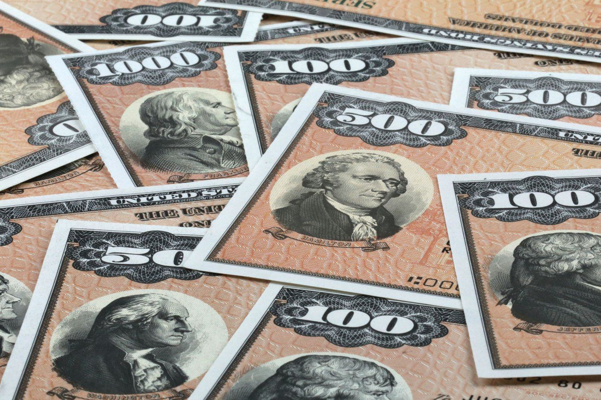

## Table of Contents

## What is a bond?

A bond is like a loan that you give to a company or the government. When you buy a bond, you are lending them money. In return, they promise to pay you back the money you lent them, plus some extra money called interest, on a specific date in the future. This is different from stocks, where you own a piece of a company. With bonds, you are just a lender.

Bonds can be a safe way to invest your money because they usually have a lower risk than stocks. The interest you get from bonds can be a steady source of income. But, if the company or government you lent money to has problems, they might not be able to pay you back. This is called defaulting. So, it's important to check how likely they are to pay you back before you buy a bond.

There are different types of bonds, like government bonds, which are issued by governments, and corporate bonds, which are issued by companies. Government bonds are often seen as safer because governments are less likely to go bankrupt. But, the interest you get from them might be lower than from corporate bonds, which can be riskier but offer higher returns.

## What is a bond discount?

A bond discount happens when a bond is sold for less than its face value. The face value is the amount the bond will be worth when it matures, or when the loan is due to be paid back. For example, if a bond has a face value of $1,000 but is sold for $950, it is sold at a discount. The reason a bond might be sold at a discount is because it offers a lower [interest rate](/wiki/interest-rate-trading-strategies) than what investors can get from other investments at that time. Investors are willing to pay less for the bond because the interest they will earn from it is not as good as what they could get elsewhere.

When a bond is bought at a discount, the investor can make money in two ways. First, they still get the interest payments that the bond promises, even though they paid less for it. Second, when the bond matures, they get the full face value. So, if they bought a $1,000 bond for $950, they would get $1,000 back at maturity, making a $50 profit on top of the interest they earned. This extra profit is like getting a bonus for buying the bond at a lower price.

## What does it mean for a bond to be unamortized?

When a bond is unamortized, it means that the discount or premium on the bond hasn't been spread out over the life of the bond yet. A discount happens when a bond is sold for less than its face value, and a premium happens when it's sold for more. Instead of accounting for this difference all at once, it's usually spread out over time. This spreading out is called amortization.

If a bond is unamortized, the full amount of the discount or premium is still on the [books](/wiki/algo-trading-books) and hasn't been slowly reduced through regular accounting entries. This can affect how the bond's value is reported and how much interest income is recognized each year. For example, if a bond was bought at a discount, the unamortized discount would be the amount of the discount that hasn't been accounted for yet as the bond gets closer to its maturity date.

## How is an unamortized bond discount calculated?

An unamortized bond discount is the part of the discount on a bond that hasn't been accounted for yet. When a bond is sold for less than its face value, it's sold at a discount. Let's say a bond with a face value of $1,000 is sold for $950. The $50 difference is the total discount. Instead of recognizing this $50 all at once, it's spread out over the life of the bond. This spreading out is called amortization. The unamortized bond discount is what's left of that $50 after some of it has been accounted for over time.

To calculate the unamortized bond discount, you need to know how much of the discount has already been amortized. If the bond in our example has a 5-year term and you're calculating the unamortized discount after 2 years, you first figure out how much of the $50 discount should have been amortized each year. If it's spread evenly, that would be $10 per year ($50 divided by 5 years). After 2 years, $20 of the discount would have been amortized ($10 per year times 2 years). So, the unamortized bond discount would be $30 ($50 total discount minus $20 amortized). This means $30 of the original discount is still on the books and hasn't been accounted for yet.

## Why is the concept of unamortized bond discount important in accounting?

The concept of unamortized bond discount is important in accounting because it helps show the true value of a bond over time. When a bond is sold for less than its face value, it's sold at a discount. This discount isn't just recognized all at once; instead, it's spread out over the life of the bond. This spreading out, or amortization, makes sure that the bond's value and the interest income from it are reported accurately each year. If the discount wasn't amortized, the bond's value would look lower than it really is, and the interest income would be misreported.

By keeping track of the unamortized bond discount, accountants can give a clearer picture of a company's financial health. It shows how much of the discount is still on the books and hasn't been accounted for yet. This helps investors and other stakeholders understand the bond's value more accurately. It also ensures that the interest income reported each year reflects the real earnings from the bond, which is important for making informed financial decisions.

## How does an unamortized bond discount affect the carrying amount of a bond?

An unamortized bond discount affects the carrying amount of a bond by making it lower than the bond's face value. When a bond is sold at a discount, it means the bond is sold for less than what it will be worth when it matures. The difference between the sale price and the face value is the total discount. This discount isn't recognized all at once but is spread out over the life of the bond. The part of the discount that hasn't been spread out yet is called the unamortized bond discount. As long as there is an unamortized bond discount, the carrying amount of the bond, which is the value shown on the company's books, will be less than the face value.

Over time, as the discount is amortized, the carrying amount of the bond gets closer to its face value. Each time a portion of the discount is amortized, it's added to the bond's carrying amount. This means the carrying amount increases a little bit each period until it reaches the bond's face value at maturity. So, the unamortized bond discount is important because it shows how much of the original discount is still affecting the bond's carrying amount.

## What is the difference between amortized and unamortized bond discount?

An amortized bond discount is the part of the discount that has been spread out over the life of the bond. When a bond is sold for less than its face value, it's sold at a discount. Instead of counting this discount all at once, it's divided into smaller amounts and added to the bond's value each year until the bond matures. This spreading out is called amortization. So, the amortized bond discount is the amount of the discount that has already been accounted for.

An unamortized bond discount is the part of the discount that hasn't been spread out yet. It's what's left of the original discount after some of it has been accounted for over time. If a bond was sold for $950 instead of its $1,000 face value, the $50 difference is the total discount. If only $20 of that discount has been amortized so far, the unamortized bond discount would be $30. This means $30 of the original discount is still on the books and hasn't been accounted for yet.

## How is the amortization of a bond discount recorded in financial statements?

When a bond is sold for less than its face value, it's sold at a discount. This discount isn't just counted all at once. Instead, it's spread out over the life of the bond. This spreading out is called amortization. On the financial statements, the amortization of a bond discount is recorded as an increase in the bond's carrying amount and as interest expense. Each year, a part of the discount is added to the bond's value on the balance sheet. At the same time, this amount is also added to the interest expense on the income statement.

For example, if a bond with a face value of $1,000 is sold for $950, there's a $50 discount. If the bond matures in 5 years and the discount is amortized evenly, $10 of the discount is added to the bond's carrying amount each year. On the balance sheet, the bond's value goes up by $10 each year, starting from $950. On the income statement, $10 is added to the interest expense each year. This way, by the time the bond matures, its carrying amount will be back to $1,000, and the full $50 discount will have been recognized as interest expense over the 5 years.

## What are the tax implications of an unamortized bond discount?

When you buy a bond at a discount, the difference between what you paid and what you'll get back when the bond matures is called the bond discount. This discount can affect your taxes. The IRS treats the bond discount as extra interest income. But instead of counting all this extra interest at once, you can spread it out over the time you own the bond. This spreading out is called amortization. The part of the discount that hasn't been spread out yet is called the unamortized bond discount. You don't have to pay taxes on the unamortized part until it's amortized.

For tax purposes, you can choose to amortize the bond discount over the life of the bond. This means you report a little bit of the discount as interest income each year. If you do this, you'll have to pay taxes on this interest income each year. If you don't choose to amortize the discount, you'll have to pay taxes on the full amount of the discount when the bond matures. This can be a bigger tax bill all at once. So, it's important to think about how you want to handle the unamortized bond discount for your taxes.

## How does the treatment of unamortized bond discount vary under different accounting standards (e.g., GAAP vs. IFRS)?

Under Generally Accepted Accounting Principles (GAAP), which is used mainly in the United States, the unamortized bond discount is treated as a reduction to the carrying amount of the bond on the balance sheet. This discount is then amortized over the life of the bond using the effective interest method. Each period, a portion of the discount is added to the interest expense on the income statement, which increases the bond's carrying amount on the balance sheet. This method ensures that the interest expense reflects the actual cost of borrowing over time.

Under International Financial Reporting Standards (IFRS), which are used in many other countries, the treatment of unamortized bond discount is similar but with some differences. IFRS also requires the use of the effective interest method to amortize the bond discount, which means the discount is spread out over the bond's life and added to the interest expense each period. However, IFRS allows more flexibility in how the effective interest rate is calculated and may have different rules for when the bond is classified as a financial liability or an equity instrument. Both GAAP and IFRS aim to show the true cost of borrowing, but the specific rules and calculations can vary.

## What are the strategic considerations for managing unamortized bond discounts in corporate finance?

When a company issues bonds at a discount, it needs to think about how to manage the unamortized bond discount carefully. This is important because the discount affects the company's financial statements and can impact its taxes. By choosing to amortize the discount over the life of the bond, the company can spread out the interest expense, which can make the financial statements look more stable. This can be helpful if the company wants to show steady earnings over time. On the other hand, not amortizing the discount means a big interest expense all at once when the bond matures, which could lead to a larger tax bill at that time.

Another thing to consider is how the unamortized bond discount affects the company's debt levels. Since the carrying amount of the bond is lower because of the unamortized discount, it can make the company's debt look smaller on the balance sheet. This might be good if the company wants to appear less leveraged to investors and lenders. But as the discount is amortized, the carrying amount of the bond increases, which can change how the company's debt looks over time. So, the company needs to plan how it will handle the unamortized bond discount to manage its financial health and meet its strategic goals.

## How can changes in interest rates impact the value of unamortized bond discounts?

Changes in interest rates can have a big effect on the value of unamortized bond discounts. When interest rates go up, new bonds that are issued will offer higher interest rates to attract investors. This makes existing bonds with lower interest rates less attractive, so their market value goes down. If a company has bonds it sold at a discount, the unamortized part of that discount stays the same, but the bond's market value drops. This means the difference between the bond's market value and its carrying amount (which includes the unamortized discount) gets bigger. So, if the company wants to sell the bond before it matures, it might lose more money because the bond is worth less in the market.

On the other hand, when interest rates go down, new bonds will have lower interest rates. This makes existing bonds with higher interest rates more attractive, so their market value goes up. The unamortized bond discount doesn't change, but the bond's market value is higher. This means the difference between the bond's market value and its carrying amount gets smaller. If the company decides to sell the bond before it matures, it might lose less money or even make a profit because the bond is worth more in the market. So, keeping an eye on interest rates is important for managing unamortized bond discounts effectively.

## What are the accounting and financial implications of unamortized discounts?

Unamortized bond discounts represent the portion of a bond's issuance discount that has yet to be amortized over the life of the bond. This amortization process is crucial because it affects the issuer's financial statements and has significant implications for profitability and taxation.

### Impact on Interest Expense and Profitability

The amortization of a bond discount affects the interest expense reported on an issuer's income statement. As the discount is amortized, it increases the bond's interest expense, leading to a higher cost of borrowing over time. This effect can be represented by the formula for calculating the interest expense using the effective interest rate method:

$$
\text{Interest Expense} = \left(\text{Carrying Amount of Bond at Beginning of Period}\right) \times \text{Effective Interest Rate}
$$

Here, the carrying amount of the bond is adjusted each period by the amortization of the discount, which increases the interest expense recognized and thus impacts the issuer's profitability. 

### Tax Implications

The amortization of bond discounts also bears tax implications. As the discount amount is gradually expensed, it affects taxable income and therefore the tax liabilities of the issuer. A higher interest expense reduces taxable income, potentially leading to lower tax payments. This tax shield can be a strategic consideration for issuers when managing debt finances.

### Impact on Financial Health Reporting

Accurate reporting of unamortized discounts is essential for transparent financial health representations. By affecting the interest expense on financial statements, they influence key financial metrics such as net income and earnings before interest and taxes (EBIT). Investors and analysts rely on these metrics to assess the company's financial stability and creditworthiness.

### Importance for Investors

For investors, understanding how unamortized discounts affect financial statements is critical for evaluating the financial health and investment potential of bond issuers. Bond amortization impacts yield calculations and the perceived risk associated with the bond. Investors skilled in analyzing these factors can better gauge the actual returns and intrinsic value of bond investments.

### Enhancement of Investment Transparency

Proper accounting and clear disclosure of bond discounts enhance investment transparency, enabling investors to make informed decisions. This transparency ensures that investors can accurately assess the true cost of a bond over its life and its corresponding impact on financial conditions.

In conclusion, the accounting and financial ramifications of unamortized bond discounts are substantial for both issuers and investors. Understanding their effects on interest expense, profitability, tax obligations, and financial health is essential for making informed investment decisions.

## References & Further Reading

[1]: ["Bond Markets, Analysis and Strategies"](https://www.amazon.com/Bond-Markets-Analysis-Strategies-tenth/dp/026204627X) by Frank J. Fabozzi

[2]: ["Algorithmic Trading: Winning Strategies and Their Rationale"](https://www.amazon.com/Algorithmic-Trading-Winning-Strategies-Rationale-ebook/dp/B00CY5HC0U) by Ernest P. Chan

[3]: ["Fixed Income Securities: Tools for Today's Markets"](https://www.amazon.com/Fixed-Income-Securities-Markets-Finance/dp/1119835550) by Bruce Tuckman and Angel Serrat

[4]: ["Principles of Financial Engineering"](https://www.sciencedirect.com/book/9780123735744/principles-of-financial-engineering) by Robert L. Navin

[5]: ["Trading and Exchanges: Market Microstructure for Practitioners"](https://www.amazon.com/Trading-Exchanges-Market-Microstructure-Practitioners/dp/0195144708) by Larry Harris