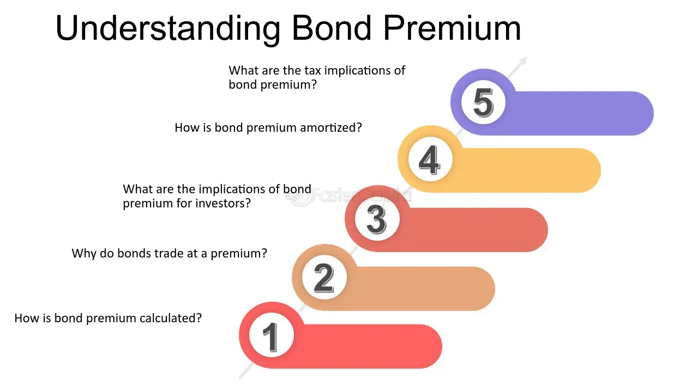

## Table of Contents

## What is a bond premium?

A bond premium is when a bond is sold for more than its face value. The face value, also known as the par value, is the amount the bond will be worth when it matures. If someone buys a bond for more than this amount, they are paying a premium. This often happens when the bond's interest rate is higher than current market rates.

When a bond is sold at a premium, the buyer pays more upfront but will still only get the face value back at maturity. This means the buyer's actual yield, or the effective return on their investment, will be lower than the bond's stated interest rate. For example, if a bond with a face value of $1,000 and a 5% interest rate is bought for $1,100, the buyer pays more but the interest payments are based on the $1,000 face value, not the $1,100 purchase price.

## What does 'unamortized' mean in the context of bonds?

When we talk about 'unamortized' in the context of bonds, we are usually referring to the bond premium or discount that has not yet been accounted for over the life of the bond. When a bond is sold at a premium (above its face value) or at a discount (below its face value), this difference needs to be spread out over the time until the bond matures. This process of spreading out the cost is called amortization. The part of the premium or discount that hasn't been spread out yet is called unamortized.

For example, if you buy a bond for $1,100 that has a face value of $1,000, you paid a $100 premium. Over time, this $100 premium will be gradually accounted for until the bond reaches its maturity date. If you look at the bond's value before it matures, the amount of the premium that hasn't been accounted for yet is the unamortized bond premium. This unamortized amount affects the bond's carrying value on the issuer's financial statements and can impact the investor's yield calculations.

## How is a bond premium calculated?

A bond premium is calculated by finding the difference between what you pay for the bond and its face value. The face value is the amount the bond will be worth when it matures. If you buy the bond for more than this face value, the extra amount you pay is called the bond premium. For example, if a bond has a face value of $1,000 and you buy it for $1,050, the bond premium is $50.

The reason you might pay a premium for a bond is often because its interest rate, called the coupon rate, is higher than what new bonds are offering in the market. People are willing to pay more for the bond to get those higher interest payments. Over time, this premium gets smaller as you get closer to the bond's maturity date. This process of gradually reducing the premium is called amortization, and it affects how much interest income you report for tax purposes each year.

## Why would a bond be sold at a premium?

A bond is sold at a premium when its price is higher than its face value. This happens because the bond's interest rate, or coupon rate, is higher than what new bonds are offering in the market. When interest rates in the market go down, older bonds with higher rates become more valuable. People are willing to pay more for these bonds because they want to lock in the higher interest payments.

For example, imagine a bond with a face value of $1,000 and a coupon rate of 5%. If new bonds are being issued with a coupon rate of only 3%, the old bond with the 5% rate looks really good. Investors might pay $1,050 or even more to buy this bond. They are happy to pay extra because they will get higher interest payments until the bond matures.

## What is the difference between amortized and unamortized bond premium?

When you buy a bond for more than its face value, you pay a premium. This premium can be spread out over the time until the bond matures. This process of spreading out the premium is called amortization. When you amortize the premium, you gradually reduce it each year until the bond reaches its maturity date. The part of the premium that you have already accounted for is called the amortized bond premium.

The part of the premium that you haven't spread out yet is called the unamortized bond premium. For example, if you paid $1,100 for a bond with a face value of $1,000, the $100 extra is your premium. If you've only accounted for $20 of this premium so far, then $80 is still unamortized. This unamortized amount affects how much the bond is worth on financial statements and can change how much interest income you report for taxes each year.

## How does the unamortized bond premium affect the bond's carrying value?

The unamortized bond premium affects the bond's carrying value by making it higher than the bond's face value. When you buy a bond for more than its face value, you pay a premium. This premium is not accounted for all at once. Instead, it's spread out over the time until the bond matures. The part of the premium that hasn't been spread out yet is called the unamortized bond premium. This unamortized amount is added to the bond's face value to find its carrying value on the financial statements.

For example, if you bought a bond with a face value of $1,000 for $1,100, you paid a $100 premium. If you've only accounted for $20 of this premium so far, then $80 is still unamortized. So, the bond's carrying value would be the face value of $1,000 plus the unamortized premium of $80, making it $1,080. As you continue to account for more of the premium over time, the unamortized amount gets smaller, and the bond's carrying value gets closer to its face value.

## What are the accounting treatments for unamortized bond premium?

When a bond is sold for more than its face value, the extra amount is called a bond premium. This premium needs to be spread out over the time until the bond matures. This process of spreading it out is called amortization. The part of the premium that hasn't been spread out yet is called the unamortized bond premium. On the company's balance sheet, the bond's carrying value is shown as the face value plus the unamortized premium. This means the bond's value on the [books](/wiki/algo-trading-books) is higher than its face value until the premium is fully accounted for.

For income statements, the unamortized bond premium affects how much interest expense the company reports. Each year, a part of the premium is amortized and reduces the amount of interest expense. This is because the bond was bought at a premium, so the effective interest rate the company pays is lower than the bond's stated rate. The unamortized premium gets smaller over time, and this reduction is recorded as a decrease in interest expense. This way, the financial statements show a more accurate picture of the company's costs and the bond's value.

## How is the unamortized bond premium reported on financial statements?

On a company's balance sheet, the unamortized bond premium is added to the bond's face value to show its carrying value. If a bond has a face value of $1,000 and was sold for $1,100, the $100 premium is not accounted for all at once. Instead, it's spread out over the time until the bond matures. The part of the premium that hasn't been spread out yet is the unamortized bond premium. So, if $20 of the premium has been accounted for, the remaining $80 is added to the $1,000 face value, making the bond's carrying value $1,080 on the balance sheet.

On the income statement, the unamortized bond premium affects the interest expense the company reports. Each year, a portion of the premium is amortized, which reduces the interest expense. This happens because the bond was bought at a premium, so the actual interest rate the company pays is lower than the bond's stated rate. As the unamortized premium gets smaller over time, the amount recorded as a reduction in interest expense also changes. This way, the income statement shows a more accurate picture of the company's costs related to the bond.

## What are the tax implications of an unamortized bond premium?

When you buy a bond for more than its face value, you pay a premium. This premium is spread out over the time until the bond matures. The part of the premium that hasn't been spread out yet is called the unamortized bond premium. For tax purposes, you can't deduct this unamortized premium all at once. Instead, you need to spread it out over the life of the bond. This means each year, you report a little less interest income because you're also accounting for a bit of the premium.

The way you handle the unamortized bond premium on your taxes is important. Each year, as you amortize the premium, you reduce the amount of interest income you report. This can lower your taxable income. For example, if you bought a bond for $1,100 with a face value of $1,000 and a 5% interest rate, you'd normally report $50 in interest income each year. But because you paid a $100 premium, you'd report less than $50 each year as you spread out that $100 over the bond's life. This can help you save on taxes over time.

## How does the method of amortization (e.g., straight-line vs. effective interest method) impact the unamortized bond premium?

The method of amortization you use for a bond premium, like straight-line or effective interest, changes how the unamortized bond premium is handled over time. With the straight-line method, you spread out the premium evenly each year until the bond matures. If you paid a $100 premium on a 10-year bond, you'd reduce the premium by $10 each year. This means the unamortized premium goes down by the same amount every year, making it easier to predict and calculate.

On the other hand, the effective interest method takes into account the bond's interest rate and how it compares to the market rate. This method means the amount of premium you account for each year changes. At first, you'll account for more of the premium, so the unamortized premium goes down faster. As time goes on, you'll account for less each year. This method gives a more accurate picture of the bond's value and interest income but can be a bit more complicated to calculate.

## What are the considerations for investors regarding unamortized bond premiums?

When investors buy a bond for more than its face value, they pay a premium. This premium isn't accounted for all at once. Instead, it's spread out over the time until the bond matures. This part that hasn't been spread out yet is called the unamortized bond premium. Investors need to think about this because it affects how much they report as interest income each year. If they use the straight-line method, they'll spread out the premium evenly each year. If they use the effective interest method, they'll account for more of the premium at first and less as time goes on. This can change how much tax they have to pay each year.

The unamortized bond premium also changes the bond's value on the books. If an investor sells the bond before it matures, the unamortized premium can affect the price they get for it. The bond's carrying value, which includes the unamortized premium, might be different from what someone is willing to pay in the market. So, investors need to keep an eye on this unamortized amount because it can impact their investment decisions and financial planning.

## How do changes in interest rates affect the unamortized bond premium?

When interest rates in the market go up or down, it can change how much a bond is worth. If interest rates go down, older bonds with higher rates become more valuable. People might pay more for these bonds, which means the bond's price goes up and so does the premium. If you bought a bond at a premium and then interest rates drop, the unamortized bond premium might stay the same, but the bond's value in the market goes up because it's more attractive to investors.

On the other hand, if interest rates go up, newer bonds with higher rates become more appealing. This can make the price of older bonds with lower rates go down. If you're holding a bond you bought at a premium, and interest rates rise, the bond's market value might drop. The unamortized premium doesn't change right away, but it can affect how much you get if you sell the bond before it matures. So, changes in interest rates can make the bond's value go up or down, but the unamortized premium itself stays the same until it's time to account for it.

## What is the Understanding of Amortization of Bond Premium?

Amortization of bond premium involves systematically expensing the premium paid for a bond over its remaining term. This process helps to align the premium with the income generated from the bond, ensuring accurate financial reporting and analysis. Two primary methods for amortizing bond premiums are the straight-line method and the effective [interest rate](/wiki/interest-rate-trading-strategies) method.

The straight-line method is the simpler of the two approaches, allocating an equal amount of the premium expense to each period throughout the bond's life. Mathematically, if a bond premium is denoted as $P$ and the bond has $n$ periods until maturity, the amortization expense $E$ for each period is calculated as:

$$
E = \frac{P}{n}
$$

For example, if a bond with a premium of $1,000 has 10 years until maturity, the annual amortization expense using the straight-line method would be $100.

The effective interest rate method, alternatively, considers the time value of money, providing a more accurate representation of financial costs. This method calculates the amortization based on the difference between the bond's actual interest expense and the coupon payment due to the premium. The formula for the effective interest expense in a given period $t$ is:

$$
\text{Interest Expense} = (\text{Book Value at } t-1) \times \text{Market Interest Rate}
$$

The amortization of the bond premium in period $t$ is then the difference between this interest expense and the actual interest payment (coupon):

$$
\text{Amortization} = \text{Coupon Payment} - \text{Interest Expense}
$$

This process results in a larger amortization expense in the early periods and a gradually decreasing expense over time, reflecting the decreasing book value of the bond.

Understanding these methods is crucial for financial professionals, as the choice between them affects the perceived profitability and financial health of an investment. Accurate reporting using these methods can aid investors in making informed decisions by aligning bookkeeping practices with economic realities.

## References & Further Reading

[1]: Fabozzi, F. J. (2007). ["Bond Markets, Analysis, and Strategies."](https://books.google.com/books/about/Bond_Markets_Analysis_and_Strategies_ten.html?id=bQpNEAAAQBAJ) Pearson Education.

[2]: ["Advances in Financial Machine Learning"](https://www.amazon.com/Advances-Financial-Machine-Learning-Marcos/dp/1119482089) by Marcos Lopez de Prado

[3]: ["Algorithmic Trading: Winning Strategies and Their Rationale"](https://books.google.com/books/about/Algorithmic_Trading.html?id=WAlFDwAAQBAJ) by Ernie Chan

[4]: ["Fixed Income Analysis"](https://en.wikipedia.org/wiki/Fixed_income_analysis) by Barbara S. Petitt

[5]: ["Investments"](https://www.nerdwallet.com/article/investing/the-best-investments-right-now) by Zvi Bodie, Alex Kane, and Alan J. Marcus