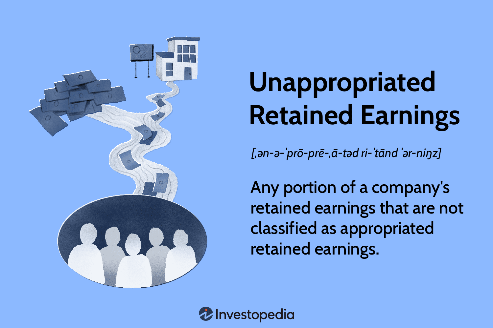

## Table of Contents

## What are unappropriated retained earnings?

Unappropriated retained earnings are the profits a company has made over time that haven't been used for anything specific yet. When a company makes money, it can either pay out those profits to shareholders as dividends or keep them in the business. The money that stays in the business is called retained earnings. If these earnings are not set aside for a particular purpose, like expanding the business or buying new equipment, they are called unappropriated retained earnings.

These earnings are important because they show how much money a company has available to use for future projects or to cover unexpected costs. They are listed on the company's balance sheet under shareholders' equity. By looking at unappropriated retained earnings, investors and managers can get a sense of the company's financial health and its ability to grow or handle tough times without needing to borrow money.

## How are unappropriated retained earnings different from appropriated retained earnings?

Unappropriated retained earnings and appropriated retained earnings are both parts of a company's profits that it keeps instead of giving to shareholders. The main difference is what the company plans to do with these profits. Unappropriated retained earnings are profits that the company hasn't decided what to do with yet. They're like money in a savings account that you haven't planned to spend on anything specific.

On the other hand, appropriated retained earnings are profits that the company has set aside for a specific purpose. For example, a company might decide to use some of its profits to buy new equipment or to expand its business. When it sets aside money for these specific plans, those profits become appropriated retained earnings. This helps the company and its investors know that this money is earmarked for something important, and it's not just sitting around unused.

## Where can unappropriated retained earnings be found on a company's financial statements?

Unappropriated retained earnings are shown on a company's balance sheet. The balance sheet is a report that shows what a company owns, what it owes, and how much money shareholders have put into the business. On the balance sheet, unappropriated retained earnings are listed under the section called "shareholders' equity." This section shows all the money that belongs to the shareholders, including the profits the company has kept instead of paying out as dividends.

The exact place where you find unappropriated retained earnings can be a bit different from one company to another. But usually, you will see a line that says "Retained Earnings" or something similar. If the company has both appropriated and unappropriated retained earnings, they might show them separately, with unappropriated retained earnings being the part that hasn't been set aside for a specific purpose. This helps everyone see how much money the company has that it can use freely for future plans or unexpected needs.

## What is the process of calculating unappropriated retained earnings?

Calculating unappropriated retained earnings is pretty straightforward. You start with the beginning balance of retained earnings at the start of the accounting period. Then, you add any net income the company made during that period. If the company paid out any dividends to shareholders, you subtract that amount. The result is the total retained earnings for the period.

Next, you need to see if any of these retained earnings have been set aside for specific purposes, like buying new equipment or expanding the business. These are called appropriated retained earnings. To find unappropriated retained earnings, you take the total retained earnings and subtract any appropriated retained earnings. What's left over is the unappropriated retained earnings, which is the money the company hasn't planned to use for anything specific yet.

## Why are unappropriated retained earnings important for a company?

Unappropriated retained earnings are important because they show how much money a company has that it can use for whatever it wants. This money isn't set aside for buying new stuff or expanding the business. It's like having extra cash in your pocket that you can use for anything that comes up. For a company, this means they can use it for new projects, pay off debts, or keep it as a safety net for tough times.

Having a good amount of unappropriated retained earnings also makes investors feel more confident. They see that the company is doing well and has money to grow or handle problems without needing to borrow. This can make the company's stock more attractive to people who want to invest. So, unappropriated retained earnings are a big deal for showing that a company is strong and ready for the future.

## Can unappropriated retained earnings be used for dividend payments?

Yes, unappropriated retained earnings can be used for dividend payments. These earnings are the profits a company has kept but hasn't planned to use for anything specific yet. So, if the company decides to give some money back to its shareholders, it can use the unappropriated retained earnings to do that. This is good for shareholders because they get to enjoy some of the company's success.

However, using unappropriated retained earnings for dividends means there will be less money available for other things the company might need, like growing the business or fixing unexpected problems. The company's leaders have to think carefully about whether paying dividends is the best use of this money, or if they should keep it for other important reasons. Balancing these choices helps the company stay strong and keep its shareholders happy.

## How do unappropriated retained earnings affect a company's financial health?

Unappropriated retained earnings show how much money a company has that it can use for whatever it wants. This money is important because it helps the company stay strong and ready for the future. When a company has a lot of unappropriated retained earnings, it means they have money to grow their business, pay off debts, or handle unexpected problems without needing to borrow. This makes the company more stable and less risky, which is good for everyone who cares about the company, like investors and employees.

Having a good amount of unappropriated retained earnings also makes investors feel more confident. They see that the company is doing well and has money to use for new projects or to keep the business running smoothly. This can make the company's stock more attractive to people who want to invest, which can help the company grow even more. So, unappropriated retained earnings are a big deal for showing that a company is strong and ready for whatever comes next.

## What are the tax implications of unappropriated retained earnings?

Unappropriated retained earnings are the profits a company keeps but hasn't planned to use for anything specific yet. These earnings are not taxed directly, but they can affect how much a company pays in taxes. When a company makes a profit, it has to pay corporate income tax on that profit. The money left over after taxes becomes retained earnings, and whether it's appropriated or unappropriated doesn't change the tax situation at that point.

However, if a company decides to use unappropriated retained earnings to pay dividends to shareholders, those dividends can be taxed. Shareholders have to pay taxes on the money they get from dividends, which means the same profit gets taxed twice—once as corporate income and again as personal income for the shareholders. This is called double taxation. So, while unappropriated retained earnings themselves aren't taxed, how a company chooses to use them can affect the overall tax situation for both the company and its shareholders.

## How do changes in accounting policies affect unappropriated retained earnings?

When a company changes its accounting policies, it can change how much money shows up as unappropriated retained earnings. Accounting policies are the rules a company follows to record its money. If a company decides to use a new rule, it might have to go back and change old numbers. This can make the amount of profit the company has kept, which is the retained earnings, go up or down. If the new rule makes the profit look bigger, then unappropriated retained earnings will be bigger too. If the profit looks smaller, then unappropriated retained earnings will be smaller.

For example, if a company used to count its inventory one way and then switches to a different way, the value of the inventory might change. This change can affect how much profit the company reports, and therefore how much money it has as unappropriated retained earnings. It's important for companies to explain these changes clearly in their financial reports so that everyone understands why the numbers changed. This helps investors and others see the true financial health of the company.

## What strategies can a company employ to manage its unappropriated retained earnings effectively?

A company can manage its unappropriated retained earnings by carefully planning how to use this money. One good strategy is to set clear goals for what the company wants to achieve, like growing the business or paying off debts. By setting aside some of the unappropriated retained earnings for these specific goals, the company turns them into appropriated retained earnings. This helps everyone know that the money is being used wisely and not just sitting around. Another strategy is to keep some of the unappropriated retained earnings as a safety net for unexpected problems. This way, the company can handle tough times without needing to borrow money, which keeps it strong and stable.

Another approach is to use unappropriated retained earnings to pay dividends to shareholders. This can make shareholders happy because they get to enjoy some of the company's success. But the company needs to balance this with keeping enough money for its own needs. It's important to think about the long-term health of the company and not just give away all the money. By carefully planning how to use unappropriated retained earnings, a company can keep growing, stay strong, and make its shareholders happy.

## How do unappropriated retained earnings influence a company's ability to secure financing?

Unappropriated retained earnings show how much money a company has that it can use freely. When a company wants to borrow money, banks and other lenders look at these earnings to see if the company is doing well. If a company has a lot of unappropriated retained earnings, it means they have money to pay back loans. This makes lenders feel more confident about giving the company money because they see that the company is strong and less likely to have trouble paying back what they borrow.

Having good unappropriated retained earnings also helps a company get better deals on loans. When lenders see that a company has plenty of money to use, they might offer lower interest rates or more flexible terms. This makes it easier and cheaper for the company to borrow money when they need it. So, unappropriated retained earnings are important because they show that a company is in a good position to handle new loans and keep growing.

## What are the regulatory requirements and restrictions concerning the use of unappropriated retained earnings?

There are some rules that companies have to follow about how they use their unappropriated retained earnings. These rules can be different depending on where the company is located and what kind of business it is. For example, some countries have laws that say companies must keep a certain amount of their profits in the business as a safety net. This means that the company can't use all of its unappropriated retained earnings for things like paying dividends to shareholders. They have to keep some of it to make sure the business stays strong and can handle any problems that come up.

Also, companies that are publicly traded have to follow rules set by stock exchanges and financial regulators. These rules might say that the company has to tell everyone how it plans to use its unappropriated retained earnings. This helps investors understand what the company is doing with its money. If a company doesn't follow these rules, it could get in trouble or have to pay fines. So, it's important for companies to know and follow all the rules about how they can use their unappropriated retained earnings.

## What is Understanding Retained Earnings?

Retained earnings represent the portion of net income that a company retains rather than distributing to shareholders as dividends. This financial metric plays a crucial role in the context of corporate finance, serving as a critical indicator of a company's capacity to invest in itself and ensure sustainable growth over the long term. The formula to calculate retained earnings is as follows:

$$
\text{Retained Earnings} = \text{Beginning Retained Earnings} + \text{Net Income} - \text{Dividends Paid}
$$

These retained earnings reflect the accumulated profits that can be utilized for various strategic financial purposes. Companies often leverage retained earnings to fund capital expenditures, reduce debt, or expand operations, demonstrating the organization's internal growth capabilities and financial adaptability.

Typically, retained earnings can be classified into two categories: appropriated and unappropriated retained earnings. Appropriated retained earnings are earmarked by management for specific projects or contingencies, establishing a reserve for future needs or obligations. This allocation may serve various purposes, such as funding ongoing projects, planned capital expenditures, or debt repayment, providing a disciplined approach to financial planning.

Conversely, unappropriated retained earnings remain free of such specific designations, offering flexibility for the company to adapt to unforeseen opportunities or financial challenges. These funds can be swiftly redirected according to strategic needs, whether for investment in innovation, shareholder dividends, or to strengthen the balance sheet against economic uncertainties.

Overall, the management of retained earnings is a pivotal aspect of corporate financial strategy, informing decisions that may influence a company's future growth trajectory and financial health. As a financial indicator, retained earnings provide insights not only into past profitability but also into the potential for future investment and shareholder value maximization.

## What is an Example of Managing Unappropriated Retained Earnings?

Consider Company XYZ at the end of its fiscal year with $5 million in retained earnings. This sizeable reserve provides the company with various strategic options. 
Management opts to allocate $3 million of these earnings towards acquiring new equipment, a reinvestment decision that underscores a commitment to bolstering operational capacity.

The remaining $2 million is categorized as unappropriated retained earnings, giving Company XYZ the flexibility to decide on its use. One strategic use for these funds could be the distribution of dividends to shareholders, reflecting a balance between reinvestment in the business and returning value to investors. By dispensing dividends, Company XYZ enhances investor confidence, potentially leading to an increase in stock price due to perceived financial strength and shareholder-friendly policies.

Mathematically, the retained earnings distribution can be represented as follows:

$$

\text{Total Retained Earnings} = \text{Appropriated Earnings} + \text{Unappropriated Earnings}
$$

For Company XYZ:

$$
5 \text{ million} = 3 \text{ million (Appropriated)} + 2 \text{ million (Unappropriated)}
$$

In a management simulation, a Python code snippet could help visualize this allocation:

```python
total_retained_earnings = 5_000_000
appropriated = 3_000_000
unappropriated = total_retained_earnings - appropriated

print(f"Appropriated Earnings: ${appropriated}")
print(f"Unappropriated Earnings: ${unappropriated}")
```

This strategic management of unappropriated retained earnings not only supports Company XYZ's growth and operational upgrades but also maintains shareholder trust and boosts the company's market position. By making careful decisions on the allocation of retained earnings, the company demonstrates financial stewardship and strategic foresight.

## References & Further Reading

[1]: [Gitman, L. J., & Zutter, C. J. (2012). "Principles of Managerial Finance."](https://archive.org/details/principlesofmana13edgitm_l9n6) Prentice Hall.

[2]: ["Retained Earnings in Corporate Finance"](https://corporatefinanceinstitute.com/resources/accounting/retained-earnings-guide/) Journal of Corporate Finance, by various authors.

[3]: ["Corporate Finance: A Focused Approach"](https://www.amazon.com/Corporate-Finance-Approach-Michael-Ehrhardt/dp/0357714636) by Michael C. Ehrhardt and Eugene F. Brigham

[4]: ["Financial Management: Theory & Practice"](https://faculty.cengage.com/titles/9781305632295) by Eugene F. Brigham and Michael C. Ehrhardt

[5]: [Azoff, E. M. (1994). "Neural Network Time Series Forecasting of Financial Markets."](https://www.semanticscholar.org/paper/Neural-Network-Time-Series%3A-Forecasting-of-Markets-Azoff/e5af89e161a32b12b1a7cc7c9559f53e9a946216) John Wiley & Sons.