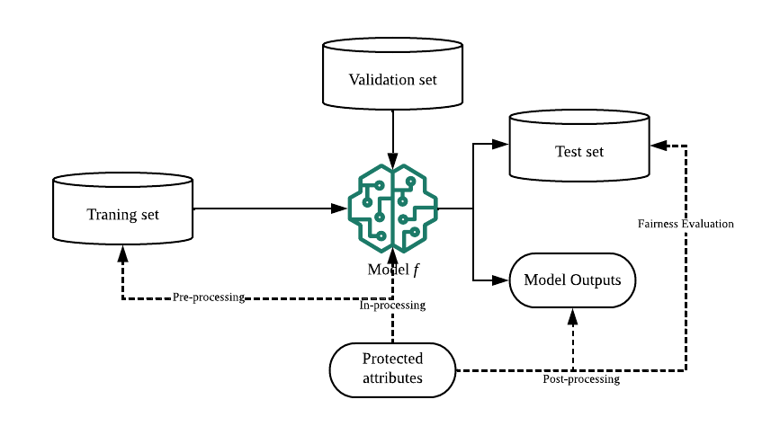

## Table of Contents

## What is unawareness in the context of machine learning?

In machine learning, unawareness refers to a situation where a model does not have access to certain information or features that could be useful for making predictions or decisions. This can happen for various reasons, such as limitations in data collection, privacy concerns, or simply because the relevant data was not considered during the model's development. When a model is unaware of important factors, its performance can suffer because it is making decisions based on incomplete information.

For example, imagine a machine learning model designed to predict whether a patient will develop a certain disease. If the model is unaware of the patient's family medical history, which is a significant risk factor, the model's predictions will be less accurate. This unawareness can lead to missed opportunities for early intervention and treatment. To improve such models, data scientists need to identify and include all relevant features, ensuring the model has a complete picture of the situation it is trying to predict or classify.

## Why is unawareness to a sensitive attribute important in machine learning?

In machine learning, being unaware of sensitive attributes like race, gender, or age is important because it helps prevent unfair treatment. When a model does not know about these sensitive details, it cannot use them to make biased decisions. For example, if a model is used to decide who gets a loan, it should not consider the applicant's race. By keeping the model unaware of such sensitive information, we can make sure that everyone is treated equally, and the decisions are based on relevant factors like income and credit history.

However, making a model unaware of sensitive attributes can be challenging. Sometimes, other information in the data can indirectly reveal sensitive details. For instance, a person's zip code might be linked to their race or income level. If the model uses zip code to make decisions, it might still end up treating people unfairly, even though it does not directly use race or income. To solve this, data scientists need to carefully check the data and use special techniques to ensure that the model remains fair and unbiased.

## How does unawareness help in reducing bias in machine learning models?

Unawareness in [machine learning](/wiki/machine-learning) helps reduce bias by keeping sensitive information, like a person's race or gender, away from the model. When the model does not know about these details, it cannot use them to make unfair decisions. For example, if a model is used to approve loans, it should not consider the applicant's race. By making the model unaware of such sensitive attributes, we make sure that everyone is treated the same way, and decisions are based on important factors like income and credit history, not on irrelevant details.

However, making a model unaware of sensitive information can be tricky. Other pieces of data might indirectly show sensitive details. For example, a person's zip code might be linked to their race or income level. If the model uses zip code to make decisions, it might still treat people unfairly, even though it does not directly use race or income. To fix this, data scientists need to carefully check the data and use special methods to make sure the model stays fair and unbiased.

## What are the common sensitive attributes considered in machine learning?

In machine learning, sensitive attributes are pieces of information about a person that could lead to unfair treatment if used in decision-making. Common sensitive attributes include race, gender, age, religion, and sexual orientation. These are considered sensitive because they should not influence decisions like hiring, loan approvals, or medical diagnoses. For example, a model should not use someone's race to decide if they get a loan, as that would be unfair.

However, it can be hard to keep models from using these sensitive attributes. Other information in the data might indirectly show these details. For instance, a person's zip code might be linked to their race or income level. If the model uses zip code to make decisions, it might still treat people unfairly, even though it does not directly use race or income. To stop this from happening, data scientists need to carefully check the data and use special methods to make sure the model stays fair and unbiased.

## Can you explain the difference between unawareness and fairness in machine learning?

Unawareness in machine learning means that a model does not know about certain sensitive information, like a person's race or gender. By keeping the model unaware of these details, we try to stop it from making unfair decisions. For example, if a model is used to approve loans, it should not consider the applicant's race. This way, everyone is treated the same, and decisions are based on things like income and credit history, not on sensitive details.

Fairness in machine learning, on the other hand, is about making sure that the model's decisions are fair and equal for everyone, even if it knows about sensitive information. Fairness can be measured in different ways. One common way is to check if the model's decisions have the same error rate for different groups of people. For example, if a model predicts who will get a disease, it should be equally accurate for men and women. Even if the model is aware of sensitive attributes, it can still be designed to treat everyone fairly.

Both unawareness and fairness aim to reduce bias in machine learning models, but they do it in different ways. Unawareness tries to prevent bias by not letting the model see sensitive information. Fairness, however, focuses on making sure the model's decisions are fair, even if it has access to all the data. Both approaches are important and often used together to make machine learning models more just and equitable.

## What are some techniques used to achieve unawareness in machine learning models?

One common technique to achieve unawareness in machine learning models is to simply remove sensitive attributes from the dataset before training the model. For example, if the model is used to approve loans, the data scientist might take out any information about the applicant's race or gender. This way, the model cannot use these details to make decisions. However, this method can be tricky because other pieces of data might still show sensitive information indirectly. For instance, a person's zip code might be linked to their race or income level. If the model uses zip code, it might still treat people unfairly, even though it does not directly use race or income.

Another technique is to use a method called "data masking" or "data obfuscation." This means changing the data in a way that hides sensitive information but keeps the rest of the data useful. For example, instead of using exact ages, the data might be grouped into age ranges like "20-30," "31-40," and so on. This makes it harder for the model to use age in a way that could lead to unfair decisions. Data scientists also use special algorithms to make sure the model does not learn to predict sensitive attributes from other data. These algorithms help keep the model unaware of sensitive details and make its decisions more fair.

A third approach involves using "fairness-aware" machine learning algorithms. These algorithms are designed to work with all the data, including sensitive attributes, but they are built to make fair decisions. They do this by adding special rules or constraints to the model's training process. For example, the algorithm might be told to make sure its predictions are equally accurate for different groups of people. This way, even if the model knows about sensitive information, it is trained to treat everyone fairly. By using these techniques, data scientists can help make sure that machine learning models are both unaware of sensitive details and fair in their decisions.

## How can we measure the effectiveness of unawareness in a machine learning model?

To measure the effectiveness of unawareness in a machine learning model, we need to check if the model's decisions are fair and unbiased even when it does not know about sensitive information like race or gender. One way to do this is by comparing the model's performance on different groups of people. For example, if the model is used to approve loans, we can see if it approves loans at the same rate for men and women, or for different races. If the rates are similar, it suggests that the model is effectively unaware of these sensitive attributes and is making fair decisions.

Another way to measure unawareness is by using special tests that check if the model can predict sensitive information from other data. For instance, we might train another model to see if it can guess a person's race just by looking at their zip code or other non-sensitive data. If this model cannot predict race well, it means the original model is likely unaware of race and is not using it to make decisions. By using these methods, we can make sure that the machine learning model is treating everyone fairly and not relying on sensitive details to make its choices.

## What challenges are faced when implementing unawareness in machine learning algorithms?

Implementing unawareness in machine learning algorithms can be tricky because sensitive information can be hidden in other data. For example, a person's zip code might be linked to their race or income level. If the model uses zip code to make decisions, it might still treat people unfairly, even though it does not directly use race or income. This means that simply removing sensitive attributes from the dataset is not always enough. Data scientists need to carefully check the data and use special methods to make sure the model stays fair and unbiased.

Another challenge is that making a model unaware of sensitive information can sometimes make it less accurate. When the model does not know about important details, it might miss out on useful information that could help it make better decisions. For example, if a model is used to predict who will get a disease, not knowing the patient's age might make the model's predictions less accurate. Data scientists need to find a balance between keeping the model unaware of sensitive attributes and making sure it still works well. This can be hard to do, but it is important for making sure the model treats everyone fairly.

## Can you provide examples of machine learning applications where unawareness to sensitive attributes is critical?

In the world of hiring, machine learning models are often used to help choose the best people for jobs. It's very important that these models do not know about sensitive details like a person's race or gender. If the model knows these things, it might pick people unfairly, like choosing more men than women or favoring one race over another. By keeping the model unaware of these details, it can focus on what really matters, like a person's skills and experience. This helps make sure everyone has a fair chance at getting the job.

Another important place where unawareness matters is in deciding who gets loans from banks. A machine learning model might look at a person's information to decide if they should get a loan. If the model knows about sensitive things like race or age, it might say no to some people unfairly. For example, it might think older people are riskier, even if they have good credit. By not letting the model see these sensitive details, it can make decisions based on things like income and credit history. This way, the model can be fair to everyone who applies for a loan.

## How does unawareness relate to data preprocessing in machine learning?

Unawareness in machine learning is all about making sure the model does not know about sensitive details like a person's race or gender. This starts with data preprocessing, which is when we get the data ready for the model. During preprocessing, we might remove or change sensitive information so the model cannot use it to make unfair decisions. For example, if we are using a model to approve loans, we would take out any information about the applicant's race or gender. This way, the model cannot use these details to decide who gets a loan.

However, just removing sensitive attributes is not always enough. Other pieces of data, like a person's zip code, might still show sensitive information indirectly. So, during data preprocessing, we need to be careful and use special methods to hide these details. For instance, we might group ages into ranges instead of using exact ages, or use algorithms that make sure the model does not learn to predict sensitive information from other data. By doing this, we can help make sure the model stays unaware of sensitive details and makes fair decisions for everyone.

## What are the ethical implications of using unawareness techniques in machine learning?

Using unawareness techniques in machine learning can help make sure that models treat everyone fairly. When a model does not know about sensitive details like a person's race or gender, it cannot use these details to make unfair decisions. For example, if a model is used to approve loans, it should not consider the applicant's race. By keeping the model unaware of such sensitive information, we can make sure that everyone is treated the same way, and decisions are based on important factors like income and credit history, not on irrelevant details. This can lead to more just and equitable outcomes in areas like hiring, healthcare, and lending.

However, there are also challenges and ethical concerns with using unawareness techniques. Sometimes, other information in the data can indirectly show sensitive details. For instance, a person's zip code might be linked to their race or income level. If the model uses zip code to make decisions, it might still treat people unfairly, even though it does not directly use race or income. Data scientists need to be careful and use special methods to ensure that the model remains fair and unbiased. Additionally, making a model unaware of sensitive information can sometimes make it less accurate, which can have its own ethical implications if the model's decisions affect people's lives. Finding the right balance between fairness and accuracy is a key ethical challenge in machine learning.

## How can advanced machine learning models like deep learning incorporate unawareness to sensitive attributes?

In [deep learning](/wiki/deep-learning) models, which are a type of advanced machine learning, incorporating unawareness to sensitive attributes can be tricky but important. These models are good at finding patterns in data, so they might still pick up on sensitive details even if we try to hide them. To stop this from happening, we can use special techniques during the training process. One way is to change the data before we use it, like grouping ages into ranges instead of using exact ages. Another way is to add rules to the model's training that make sure it does not learn to predict sensitive information from other data. By doing this, we can help make sure the deep learning model stays unaware of sensitive details and makes fair decisions for everyone.

However, making a deep learning model unaware of sensitive information can sometimes make it less accurate. When the model does not know about important details, it might miss out on useful information that could help it make better decisions. For example, if a model is used to predict who will get a disease, not knowing the patient's age might make the model's predictions less accurate. Data scientists need to find a balance between keeping the model unaware of sensitive attributes and making sure it still works well. This can be hard to do, but it is important for making sure the model treats everyone fairly and does not make decisions based on irrelevant details.

## References & Further Reading

[1]: Mehrabi, N., Morstatter, F., Saxena, N., Lerman, K., & Galstyan, A. (2021). ["A Survey on Bias and Fairness in Machine Learning."](https://dl.acm.org/doi/abs/10.1145/3457607) ACM Computing Surveys (CSUR), 54(6), 1-35.

[2]: Dwork, C., Hardt, M., Pitassi, T., Reingold, O., & Zemel, R. (2012). ["Fairness through Awareness."](https://arxiv.org/abs/1104.3913) Proceedings of the 3rd Innovations in Theoretical Computer Science Conference.

[3]: Barocas, S., Hardt, M., & Narayanan, A. (2019). ["Fairness and Machine Learning: Limitations and Opportunities."](https://fairmlbook.org/) fairmlbook.org.

[4]: Corbett-Davies, S., & Goel, S. (2018). ["The Measure and Mismeasure of Fairness: A Critical Review of Fair Machine Learning."](https://arxiv.org/abs/1808.00023) arXiv preprint arXiv:1808.00023.

[5]: Kusner, M. J., Loftus, J., Russell, C., & Silva, R. (2017). ["Counterfactual Fairness."](https://arxiv.org/abs/1703.06856) Advances in Neural Information Processing Systems, 30.

[6]: Calders, T., & Verwer, S. (2010). ["Three Naive Bayes Approaches for Discrimination-Free Classification."](https://link.springer.com/article/10.1007/s10618-010-0190-x) Data Mining and Knowledge Discovery, 21(2), 277-292.

[7]: Hardt, M., Price, E., & Srebro, N. (2016). ["Equality of Opportunity in Supervised Learning."](https://arxiv.org/abs/1610.02413) Advances in Neural Information Processing Systems, 29.

[8]: Feldman, M., Friedler, S. A., Moeller, J., Scheidegger, C., & Venkatasubramanian, S. (2014). ["Certifying and Removing Disparate Impact."](https://arxiv.org/abs/1412.3756) Proceedings of the 21th ACM SIGKDD International Conference on Knowledge Discovery and Data Mining.