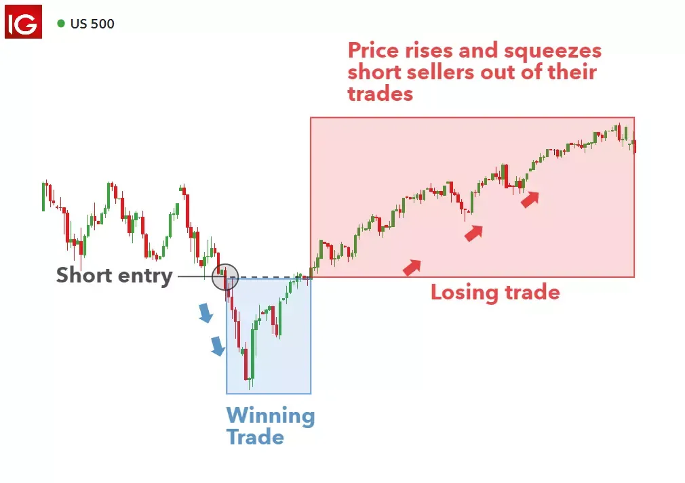

## Table of Contents

## What is unborrowable stock?

Unborrowable stock refers to shares of a company that cannot be borrowed by investors or traders. This usually happens when there are not enough shares available in the market to meet the demand for borrowing. People might want to borrow stocks to sell them short, which means they sell the borrowed shares hoping to buy them back later at a lower price. If a stock is unborrowable, it can make short selling more difficult or even impossible.

The reason a stock becomes unborrowable can vary. Sometimes, it's because the company has a small number of shares outstanding, or because many shareholders are holding onto their shares and not lending them out. Other times, it might be due to high demand from short sellers, which uses up all the available shares to borrow. When a stock is unborrowable, it can affect how investors approach trading that stock, as they need to find other ways to bet on its price going down.

## Why can some stocks become unborrowable?

Some stocks become unborrowable because there aren't enough shares available for people to borrow. This can happen if a company has a small number of shares to begin with. When a lot of people want to borrow these shares to sell them short, hoping the price will go down so they can buy them back cheaper, it can use up all the shares that are available to borrow. If everyone who owns the stock decides to hold onto it and not lend it out, that also makes it hard for others to borrow.

Another reason is high demand from short sellers. If many investors think a stock's price will drop, they might all try to borrow and sell the stock at the same time. This can quickly use up all the shares that are available for borrowing. When this happens, the stock becomes unborrowable, and people who want to bet on the stock's price going down have to find other ways to do it.

## How does the concept of unborrowable stock affect short selling?

When a stock becomes unborrowable, it makes short selling harder. Short selling is when someone borrows a stock and sells it, hoping to buy it back later at a lower price. If there are no shares to borrow, people can't do this. This means they can't bet on the stock's price going down in the usual way.

This can change how investors approach trading. If they can't short sell a stock because it's unborrowable, they might look for other ways to make money if they think the stock's price will drop. They might use options or other financial tools instead. So, unborrowable stocks can make the market work differently and affect how people trade.

## What are the common reasons a stock might be considered unborrowable?

A stock might be considered unborrowable if there aren't enough shares available for people to borrow. This can happen when a company has a small number of shares to start with. If a lot of people want to borrow these shares to sell them short, hoping the price will go down so they can buy them back cheaper, it can use up all the shares that are available to borrow. Also, if the people who own the stock decide to hold onto it and not lend it out, that makes it hard for others to borrow.

Another reason a stock might be unborrowable is because of high demand from short sellers. If many investors think a stock's price will drop, they might all try to borrow and sell the stock at the same time. This can quickly use up all the shares that are available for borrowing. When this happens, the stock becomes unborrowable, and people who want to bet on the stock's price going down have to find other ways to do it.

## How can an investor identify if a stock is unborrowable?

An investor can find out if a stock is unborrowable by checking with their broker. Brokers have tools and data that show how many shares are available to borrow. If the broker says there are no shares to borrow, then the stock is unborrowable. Sometimes, the broker might also tell you how hard it is to borrow a stock, which can give you a hint that it might become unborrowable soon.

Another way to tell if a stock might be unborrowable is by looking at how much it costs to borrow the stock. If the borrowing cost is very high, it could mean that there are not many shares left to borrow. High borrowing costs can be a sign that the stock is close to becoming unborrowable. By keeping an eye on these costs and talking to their broker, an investor can get a good idea of whether a stock is unborrowable or not.

## What are the implications of unborrowable stock for market liquidity?

Unborrowable stock can make the market less liquid. Liquidity means how easy it is to buy or sell something without changing its price too much. When a stock is unborrowable, it means people can't borrow it to sell it short. This can make it harder for people to trade the stock because they can't use one of the usual ways to bet on the price going down. If fewer people are trading, it can make the market less active and harder for people to buy or sell the stock quickly.

This can also affect how prices move in the market. If short sellers can't borrow a stock, they might not be able to push the price down as much as they want. This can make the stock's price seem more stable than it really is. But it can also mean that if the price does start to fall, there might not be as many people ready to buy the stock, which can make the fall even sharper. So, unborrowable stocks can change how the market works and how easy it is for people to trade.

## How do regulatory environments influence the availability of stocks for borrowing?

Regulatory environments can make it harder or easier for people to borrow stocks. Some rules might say that certain stocks can't be borrowed at all, or they might make it more expensive to borrow them. For example, if a government wants to protect a company, they might put rules in place that stop people from borrowing its stock. This can make the stock unborrowable and change how people trade it.

Other rules might affect how many shares are available to borrow. If a rule says that only certain people can lend out their shares, it can make fewer shares available for borrowing. This can happen if the rule is meant to protect investors or to make the market more stable. When there are fewer shares to borrow, it can make more stocks unborrowable and affect how easy it is for people to trade them.

## What strategies can investors use to navigate markets with unborrowable stocks?

When stocks are unborrowable, investors can't use short selling to bet that the stock's price will go down. Instead, they might use options. Options are like bets on what will happen to a stock's price. If an investor thinks a stock's price will drop, they can buy a "put option," which gives them the right to sell the stock at a certain price. This can be a good way to make money if the stock's price falls, even if they can't borrow the stock.

Another strategy is to look for other stocks that are similar to the unborrowable stock. If an investor can't short sell one stock, they might find another stock in the same industry that they can borrow and short sell. This way, they can still bet on the industry's performance without being able to borrow the specific stock they wanted. By being flexible and finding other ways to trade, investors can navigate markets where some stocks are unborrowable.

## Can the status of a stock as unborrowable change over time, and if so, why?

Yes, the status of a stock as unborrowable can change over time. This happens because the number of shares available to borrow can go up or down. If more people decide to lend out their shares, or if the company issues more shares, there might be more shares to borrow. Also, if fewer people want to short sell the stock, the demand for borrowing might go down, making it easier to borrow the stock again.

The reasons for these changes can be different. Sometimes, it's because of what's happening in the market or with the company. If the company does well and more people want to buy its stock, fewer people might want to short sell it, so the stock might become borrowable again. Other times, it might be because of new rules or changes in how brokers handle stock lending. These changes can make it easier or harder to borrow a stock, so the status of a stock as unborrowable can change over time.

## How do unborrowable stocks impact the overall efficiency of financial markets?

Unborrowable stocks can make financial markets less efficient. When stocks are unborrowable, it means people can't use short selling to bet that a stock's price will go down. Short selling helps keep prices fair by letting people show when they think a stock is too expensive. If people can't short sell, the market might not be as good at setting the right prices for stocks. This can make the market less efficient because it's harder for prices to reflect what's really happening with a company.

Also, unborrowable stocks can make it harder for people to trade. When stocks are hard to borrow, fewer people might want to trade them. This can make the market less active and less liquid, which means it's harder to buy or sell stocks quickly. When the market is less liquid, it can be harder for people to get in and out of trades, which can make the market less efficient. So, unborrowable stocks can change how the market works and make it less good at doing its job.

## What role do stock lending platforms play in the dynamics of unborrowable stocks?

Stock lending platforms help people borrow and lend stocks. They make it easier for people to find shares to borrow when they want to short sell a stock. If a stock is hard to borrow, these platforms can bring together people who want to lend their shares with those who want to borrow them. This can help make more shares available for borrowing and might stop a stock from becoming unborrowable.

But, stock lending platforms can also make things more complicated. If a lot of people want to borrow the same stock, the platforms might not have enough shares to meet everyone's needs. This can make the stock unborrowable if the demand is too high. So, while these platforms can help, they can also show how hard it is to borrow certain stocks and affect whether a stock becomes unborrowable or not.

## How can advanced data analytics be used to predict when a stock might become unborrowable?

Advanced data analytics can help predict when a stock might become unborrowable by looking at patterns in the data. Analysts can use data to see how many shares are available to borrow and how many people want to borrow them. If the data shows that more and more people are trying to borrow a stock, and there are fewer shares left to borrow, it might mean the stock will soon be unborrowable. By watching these trends, analysts can guess when a stock might run out of shares to borrow.

Another way data analytics can help is by looking at how much it costs to borrow a stock. If the cost to borrow a stock is going up, it can be a sign that there are not many shares left to borrow. High borrowing costs can mean that a stock is close to becoming unborrowable. By keeping an eye on these costs and other data, investors can get a good idea of when a stock might become hard to borrow.

## References & Further Reading

[1]: Russolillo, S. (2021). ["GameStop Mania: What Just Happened?"](https://www.cnn.com/2021/10/19/investing/premarket-stocks-trading/index.html). The Wall Street Journal.

[2]: Lopez de Prado, M. (2018). ["Advances in Financial Machine Learning"](https://www.amazon.com/Advances-Financial-Machine-Learning-Marcos/dp/1119482089). Wiley.

[3]: Aronson, D. R. (2007). ["Evidence-Based Technical Analysis: Applying the Scientific Method and Statistical Inference to Trading Signals"](https://www.amazon.com/Evidence-Based-Technical-Analysis-Scientific-Statistical/dp/0470008741). Wiley.

[4]: Jansen, S. (2020). ["Machine Learning for Algorithmic Trading"](https://github.com/stefan-jansen/machine-learning-for-trading). Packt Publishing.

[5]: Chan, E. P. (2009). ["Quantitative Trading: How to Build Your Own Algorithmic Trading Business"](https://github.com/ftvision/quant_trading_echan_book). Wiley.