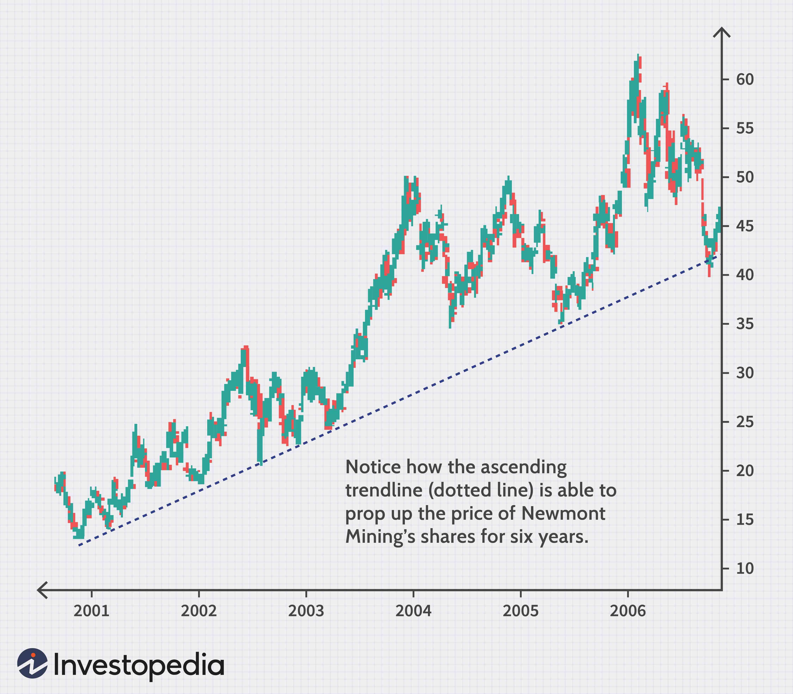

The stock market presents investors with numerous opportunities to generate profit, one of which is short selling. This strategy involves borrowing a stock and selling it with the intention of buying it back at a lower price, thereby capitalizing on the price decline. The process requires a keen understanding of market trends and potential risks, as profits are realized when the price of the stock decreases after the initial sale. However, short selling is not without its challenges. Investors may encounter unborrowable stocks, which are stocks that cannot be borrowed, making them inaccessible for short selling. This situation often arises due to regulatory restrictions, high demand matched with low supply, or strategic maneuvers by market participants.

Another layer of complexity is introduced by algorithmic trading, which automates trading strategies through the use of computer programs that execute trades based on pre-set criteria. These algorithms can streamline the short selling process by eliminating emotional biases and executing trades with precision. While algorithmic trading offers significant advantages, such as reduced transaction costs and the ability to rapidly respond to market movements, it also poses challenges. The reliance on technology and the potential for increased market volatility are considerations that traders must navigate.



In this article, short selling in the stock market is examined with a focus on the intricacies posed by unborrowable stocks and the influence of algorithmic trading. Understanding these components can provide traders with the tools necessary to optimize their strategies and enhance profitability in the ever-evolving landscape of stock trading.

## Table of Contents

## Understanding Unborrowable Stocks

Unborrowable stocks are a significant concern in short selling, arising when potential lenders are unwilling or unable to lend their shares to short sellers. This situation typically occurs due to several factors including high demand for shorting, low supply of stocks available in the lending market, and regulatory restrictions that limit the lending of certain equities.

### Causes of Unborrowable Stocks

1. **High Demand for Shorting**: When a stock is perceived to be overvalued or poised for a price drop, it attracts a large number of short sellers. This heightened activity can outstrip the available supply of shares available to borrow, making the stock unborrowable.

2. **Low Supply of Stocks**: Not all shareholders are willing to lend their shares, especially those managed by funds following a long-term investment strategy. Additionally, stocks with low liquidity naturally have a restricted number of shares available for lending, further complicating their availability for short selling.

3. **Regulatory Restrictions**: Certain jurisdictions impose regulations that can directly affect stock borrowing. This includes restrictions on lending practices during market downturns or for stocks labeled as highly volatile or risky. Historical instances include short-selling bans during economic downturns to curb speculation.

### Impact on Traders

Unborrowable stocks introduce significant challenges for traders. When a stock becomes unborrowable, traders looking to short sell face increased borrowing costs or may be entirely precluded from executing their trades. This can lead to missed opportunities or necessitate alternative strategies.

### Market Implications

The lack of availability of stocks for borrowing can impact market prices. Short sellers who are unable to borrow stocks may contribute to less downward pressure on the stock price, potentially sustaining overvalued stock prices longer than market fundamentals would suggest. This scenario can skew market dynamics, as reduced short selling can lead to decreased [liquidity](/wiki/liquidity-risk-premium) and price inefficiencies.

In conclusion, unborrowable stocks pose a distinct challenge within short selling, driven by an interplay of demand, supply, and regulatory frameworks. For traders, understanding these dynamics is crucial in developing robust strategies that anticipate and navigate the limitations posed by unborrowable stocks.

## The Mechanics of Short Selling

Short selling is a sophisticated financial strategy that involves borrowing shares from a broker and selling them on the open market with the expectation of buying them back at a lower price. The overarching goal is to profit from the anticipated decline in the stock’s value. To initiate a short sale, the trader borrows shares that they do not own, sells these borrowed shares to buyers currently in the market, and later repurchases the shares to return to the lender. This repay sequence is what differentiates short selling from ordinary stock selling.

The primary risk of short selling is the theoretically unlimited loss. Unlike buying stocks, where the maximum loss is limited to the amount invested, short selling can expose traders to extreme losses if the stock's price escalates rather than declines. This potential for significant loss underscores the importance of careful analysis and strategic planning before engaging in short selling.

A more contemporary approach to short selling financial instruments without owning them is through Contracts for Difference (CFDs). CFDs allow traders to speculate on the price movements of stocks without actually owning the underlying asset. When trading CFDs, the investor enters into a contract with a broker, agreeing to exchange the difference in the value of a stock between the time the contract is opened and closed. If the trader believes the stock price will drop, they can open a short CFD position. The key advantage of CFDs lies in their leverage potential, enabling traders to control a larger position with a relatively small amount of capital. However, leverage also amplifies the risk of losses.

For traders, identifying potential short-selling opportunities requires meticulous market analysis. A critical aspect involves assessing whether a stock is overvalued or likely to decline in the near future. Several strategic considerations can aid in this decision-making process:

1. **Technical Analysis**: Traders often employ charts and technical indicators to detect signs of overvaluation or bearish trends. Common indicators include relative strength index (RSI), moving averages, and Bollinger bands. For instance, an RSI above 70 might suggest an overbought condition, potentially signaling a decline.

2. **Fundamental Analysis**: This involves examining a company's financial health and market position. Factors such as declining earnings, poor cash flow, or negative industry trends can indicate potential for a stock's value to drop.

3. **Market Sentiment**: Traders frequently monitor market news, earnings reports, and industry developments that could influence a stock's future performance. A negative earnings surprise or adverse regulatory changes may create a shorting opportunity.

4. **Short Interest**: The short interest ratio, which measures the number of shares sold short relative to the total float, can indicate market sentiment. A high short interest suggests that many traders expect the stock to decline, though it can also lead to short squeezes if the stock's price moves upward unexpectedly.

5. **Risk Management**: Setting stop-loss orders and position sizing are vital risk management strategies to mitigate potential losses in short selling activities.

In summary, short selling—whether through traditional means or using CFDs—requires astute analysis and strategic positioning. While CFDs offer a practical alternative with leverage benefits, they also necessitate careful risk management due to the inherent amplification of losses. Traders aiming to capitalize on short selling must combine technical, fundamental, and sentiment analysis to effectively identify viable opportunities and manage the associated risks.

## Algorithmic Trading in Short Selling

Algorithmic trading utilizes computer-programmed algorithms to execute trades based on pre-defined criteria, streamlining trading processes and minimizing human errors. This approach is particularly valuable in short selling, where timing and precision are critical.

One key advantage of [algorithmic trading](/wiki/algorithmic-trading) in short selling is its ability to eliminate emotional biases that often influence traders' decisions. Emotions like fear and greed can lead to irrational decision-making, which algorithms can avoid by adhering strictly to the defined trading strategy. Algorithms can respond to market changes faster than humans, enabling quicker execution of trades before price shifts diminish the potential profit.

Algorithmic trading strategies that are particularly relevant to short selling include trend-following and [arbitrage](/wiki/arbitrage) opportunities. Trend-following involves creating algorithms that detect and exploit stock price movements. For instance, a simple moving average crossover strategy can be employed, where an algorithm buys or sells a stock based on the crossing of short-term and long-term moving averages.

```python
def moving_average_crossover_strategy(prices, short_window, long_window):
    signal = pd.DataFrame(index=prices.index)
    signal["short_mavg"] = prices["Close"].rolling(window=short_window, min_periods=1, center=False).mean()
    signal["long_mavg"] = prices["Close"].rolling(window=long_window, min_periods=1, center=False).mean()
    signal["signal"] = 0.0
    signal["signal"][short_window:] = np.where(signal["short_mavg"][short_window:] > signal["long_mavg"][short_window:], 1.0, -1.0)
    signal["positions"] = signal["signal"].diff()
    return signal
```

The algorithm generates buy and sell signals by monitoring the crossovers between the short-term and long-term moving averages of the stock's price. This can be particularly effective in identifying reversal patterns, providing an edge in timing short sales when trends reverse downward.

Arbitrage strategies focus on exploiting price discrepancies in different markets or securities that are theoretically identical. For instance, [statistical arbitrage](/wiki/statistical-arbitrage) involves identifying and profiting from mispriced securities, where algorithms cross-reference multiple datasets to find inconsistencies in pricing.

```python
def statistical_arbitrage(stock1_prices, stock2_prices):
    spread = stock1_prices - stock2_prices
    zscore = (spread - spread.mean()) / spread.std()
    entry_threshold = 2.0
    exit_threshold = 0.5

    positions = np.where(zscore > entry_threshold, -1, 
                         np.where(zscore < -entry_threshold, 1, 0))
    returns = np.diff(np.cumsum(positions * np.diff(stock1_prices - stock2_prices)))
    return positions, returns
```

This strategy identifies potential arbitrage opportunities by calculating the z-score of the price spread between two correlated stocks, generating sell signals when the z-score deviates significantly from zero. Such strategies, when executed with [high frequency](/wiki/high-frequency-trading) and precision, can enhance profitability in short selling unborrowable stocks.

In summary, algorithmic trading optimizes short selling by executing trades with improved speed and accuracy, minimizing risks associated with human emotion and reaction time. Incorporating sophisticated algorithms for trend-following and arbitrage allows traders to harness quantitative analysis, making timely and profitable short-selling decisions in dynamic market environments.

## Benefits and Challenges of Algorithmic Short Selling

Algorithmic trading, when applied to short selling, offers a set of significant benefits that enhance trading efficiency and profitability. One primary advantage of algorithmic trading is its ability to execute trades with precision. By using pre-set rules and automated systems, traders can minimize slippage and ensure optimal execution prices. This level of precision is crucial in short selling, where timing and price can greatly affect overall profitability.

Another notable benefit is the reduction in transaction costs. Algorithmic trading systems can analyze market data and execute trades in fractions of a second, decreasing the time and cost associated with manual trading. For short sellers, who often make numerous trades to capitalize on price fluctuations, lower transaction costs can lead to substantial savings and increased net returns.

However, algorithmic short selling is not without challenges. One of the primary concerns is the heavy reliance on technology. Systems must be robust and secure to handle the high-frequency nature of algorithmic trading. Any technological failure or latency in executing trades can lead to significant financial losses. This dependence on technology necessitates rigorous testing and maintenance of trading algorithms.

Another challenge is the potential for increased market [volatility](/wiki/volatility-trading-strategies). Algorithmic trading can lead to rapid price movements as large volumes of trades are executed almost simultaneously. In the context of short selling unborrowable stocks, this could exacerbate price swings, potentially leading to undesirable market conditions. Traders must be cautious about how their strategies influence market dynamics and consider implementing safeguard measures, such as circuit breakers, to mitigate unintended consequences.

Algorithmic trading strategies in short selling must also contend with regulatory scrutiny, particularly when dealing with unborrowable stocks. Market regulators may impose restrictions to prevent excessive short selling and maintain market stability. Traders must remain informed about regulatory changes and ensure their strategies remain compliant.

In conclusion, while algorithmic trading in short selling provides advantages such as precise execution and cost reduction, it also presents challenges, especially in the context of unborrowable stocks. Traders should weigh these benefits and challenges carefully, deploying sophisticated risk management strategies to navigate the complexities of the market effectively.

## Case Studies and Real-World Applications

Short selling, particularly involving unborrowable stocks, presents unique challenges and opportunities. While these stocks are difficult to borrow due to scarcity or regulatory constraints, strategic navigation can lead to both successful and unsuccessful outcomes. Additionally, algorithmic trading is increasingly shaping the landscape of short selling through its ability to execute pre-defined rules with precision.

### Successful Short Selling Cases

One notable success in short selling involves the infamous case of GameStop in early 2021, where "unborrowable" circumstances indirectly influenced market dynamics. Despite its popularity among retail investors, GameStop was heavily shorted, with over 140% of its available shares being shorted at one point.[^1] This intense short interest led to a short squeeze when a coordinated buying effort by retail investors forced the price up, compelling short sellers to cover their positions at a loss. However, those with early short positions and effective risk management strategies, such as certain hedge funds, were ultimately able to capitalize on the subsequent volatility when the stock's bubble burst. 

### Unsuccessful Short Selling Cases

Conversely, the case of the Volkswagen short squeeze in 2008 is illustrative of the risks associated with short selling when stocks become unborrowable. At the time, many traders had shorted Volkswagen, betting the stock price would drop. However, a surprise announcement that Porsche had increased its stake in Volkswagen led to a scarcity of shares available for shorting. This caught many traders off guard, leading to a massive short squeeze that briefly made Volkswagen the most valuable company in the world by market capitalization. Traders who were unable to borrow shares or cover their positions quickly encountered significant losses.

### Algorithmic Trading in Practice

Algorithmic trading has transformed short selling by enabling traders to systematically exploit market inefficiencies. For example, automated arbitrage strategies are utilized to identify and capitalize on price differentials between stock exchanges or related financial instruments, which can include short selling components. 

Algorithmic trend-following strategies are another key area, where algorithms analyze historical stock price movements to identify patterns or trends that suggest optimal entry and [exit](/wiki/exit-strategy) points for shorting. A simple example of a Python-based trend-following algorithm might look as follows:

```python
import pandas as pd

def trend_following(prices, short_window, long_window):
    signals = pd.DataFrame(index=prices.index)
    signals['price'] = prices
    signals['short_mavg'] = prices.rolling(window=short_window, min_periods=1).mean()
    signals['long_mavg'] = prices.rolling(window=long_window, min_periods=1).mean()
    signals['signal'] = 0.0
    signals['signal'][short_window:] = np.where(signals['short_mavg'][short_window:] > signals['long_mavg'][short_window:], 1.0, 0.0)   
    signals['positions'] = signals['signal'].diff()
    return signals

# Sample usage
prices = pd.Series([120, 118, 115, 122, 121, 128, 126, 130, 135, 133, 140])
signals = trend_following(prices, short_window=2, long_window=5)
```

This algorithm calculates short and long moving averages to generate signals for potential short trades based on trend reversals.

These examples demonstrate that, while algorithmic trading facilitates efficiency and speed in short selling, it requires robust models and vigilant monitoring to adapt to rapid market changes, such as those seen in high-profile short squeezes.

[^1]: [Russolillo, S. (2021). GameStop Mania: What Just Happened?. The Wall Street Journal.](https://www.wsj.com/articles/gamestop-mania-what-just-happened-11611526804)

## Conclusion

Short selling presents a dynamic opportunity for investors, particularly when complemented by algorithmic trading strategies. This combination not only maximizes potential profits but also amplifies the challenges involved. The effectiveness of short selling significantly hinges on comprehending the nuances of unborrowable stocks. Such stocks become a pivotal aspect for traders, affecting risk management and strategic planning, given that they cannot always be borrowed at will due to factors like high short interest or regulatory constraints. 

Smart trading algorithms serve as a powerful tool to navigate these complexities. By leveraging advanced computational techniques, traders can efficiently automate decision-making processes, reducing the influence of human emotional biases that often result in suboptimal trading behaviors. These algorithms are capable of rapidly analyzing large datasets to identify short-selling opportunities in stocks that might otherwise be overlooked. 

However, practitioners must remain vigilant and adaptable. The stock market is inherently unpredictable, and the complexities of algorithmic short selling introduce unique risks. Algorithmic models can fail if they are not regularly updated to reflect market changes, and technical failures can lead to significant losses. Moreover, reliance on borrowed stocks adds another layer of risk, as these stocks can become more challenging to secure amidst changing market conditions.

In sum, while the integration of algorithmic trading into short selling presents numerous avenues for generating profits, it is crucial for traders to maintain a nuanced understanding of the market environment, specifically related to unborrowable stocks. By staying informed and adaptable, traders can better manage the risks and capitalize on the opportunities that short selling offers.

## Further Readings and Resources

When exploring the complex landscape of short selling and algorithmic trading, a well-rounded understanding is crucial for effective decision-making and strategic planning. Here are some resources to enhance your proficiency:

1. **Comprehensive Guides:**

   - **Contracts for Difference (CFDs):** CFDs are popular derivatives allowing traders to speculate on price movements of underlying assets without owning them. A detailed guide on CFDs is available through the Investopedia platform, providing insights into their mechanics, risks, and strategic applications in short selling. [Investopedia CFD Guide](https://www.investopedia.com/articles/active-trading/091114/introduction-contracts-difference-cfd.asp)

   - **Algorithmic Trading:** Algorithmic trading automates trading activities through computational strategies. The book "Algorithmic Trading: Winning Strategies and Their Rationale" by Ernest P. Chan offers an accessible introduction to designing and implementing algorithms. For online resources, QuantInsti's free online course provides foundational knowledge and practical coding examples. [QuantInsti Algorithmic Trading Course](https://www.quantinsti.com/)

   - **Risk Management Strategies:** Managing risk is essential in short selling and algorithmic trading. The Chartered Financial Analyst (CFA) Institute offers numerous resources on risk management techniques, focusing on market risk assessment and mitigation. [CFA Institute Risk Management Resources](https://www.cfainstitute.org/en/research/foundation/2019/investment-risk-and-performance-2020-20th-annual-survey)

2. **Recommended Courses and Webinars:**

   - **Advanced Trading Techniques:** Coursera provides courses like "Financial Engineering and Risk Management" by Columbia University, which dives into advanced trading strategies, incorporating real-world case studies. [Coursera Financial Engineering and Risk Management](https://www.coursera.org/learn/financial-engineering-and-risk-management)

   - **Algorithmic Trading Workshops:** Udacity offers a Nanodegree program in "Artificial Intelligence for Trading," focusing on applying AI techniques to develop algorithmic trading models. [Udacity AI for Trading Nanodegree](https://www.udacity.com/course/ai-for-trading--nd880)

These resources collectively cover various aspects of short selling and algorithmic trading, equipping traders with the skills necessary to navigate these challenging but potentially rewarding financial activities. Use these materials to stay informed and continually advance your trading strategies.

## References & Further Reading

[1]: Russolillo, S. (2021). ["GameStop Mania: What Just Happened?"](https://www.cnn.com/2021/10/19/investing/premarket-stocks-trading/index.html). The Wall Street Journal.

[2]: Lopez de Prado, M. (2018). ["Advances in Financial Machine Learning"](https://www.amazon.com/Advances-Financial-Machine-Learning-Marcos/dp/1119482089). Wiley.

[3]: Aronson, D. R. (2007). ["Evidence-Based Technical Analysis: Applying the Scientific Method and Statistical Inference to Trading Signals"](https://www.amazon.com/Evidence-Based-Technical-Analysis-Scientific-Statistical/dp/0470008741). Wiley.

[4]: Jansen, S. (2020). ["Machine Learning for Algorithmic Trading"](https://github.com/stefan-jansen/machine-learning-for-trading). Packt Publishing.

[5]: Chan, E. P. (2009). ["Quantitative Trading: How to Build Your Own Algorithmic Trading Business"](https://github.com/ftvision/quant_trading_echan_book). Wiley.