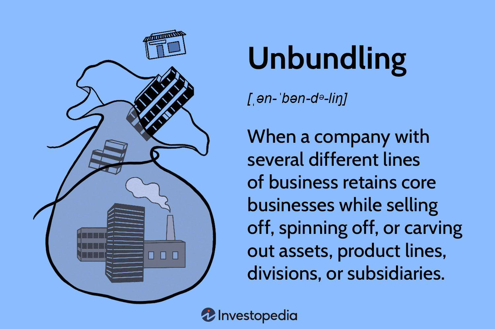

## Table of Contents

## What is unbundling?

Unbundling is when a big thing is broken down into smaller parts. Imagine you have a big box of toys. Instead of keeping all the toys together, you take them out and put each type of toy in its own smaller box. This way, you can play with just the cars or just the dolls, without having to go through the whole big box.

In business, unbundling often happens with services or products. For example, a company might offer a big package with many services. But then, they decide to offer each service separately. This can make it easier for customers to choose only what they need. It can also help the company focus on making each service better.

## How does the unbundling process work?

Unbundling starts when a company or organization decides that breaking a big product or service into smaller parts might be better. They look at what they offer and think about how they can split it up. For example, a TV channel package might be unbundled into individual channels or smaller groups of channels. The company has to figure out what each smaller part should be and how much it should cost. They need to make sure that people still want to buy the smaller parts and that it's worth it for the company.

Once the company decides how to unbundle, they start telling people about the new options. They might change their website, ads, and the way they talk to customers. They need to explain why unbundling is good and how it can help people get exactly what they want. Sometimes, unbundling can make things more complicated for a while, so the company has to help people understand the new choices. If done well, unbundling can make customers happier because they can pick and choose what they really need or want.

## What are the main reasons companies choose to unbundle?

Companies choose to unbundle because it can make their customers happier. When a big package is split into smaller parts, people can pick only what they need. This can save them money and make them feel like they have more control. For example, if someone only wants to watch sports, they can choose a sports channel instead of buying a whole TV package with lots of other channels they don't watch.

Another reason is that unbundling can help a company focus on making each part better. When everything is in one big package, it can be hard to improve each part. But when the parts are separate, the company can pay more attention to each one. This can lead to better products or services. Also, unbundling can help a company find out what people really want, so they can offer more of that and less of what people don't want.

## What are the potential benefits of unbundling for consumers?

Unbundling can help consumers save money. When a big package is split into smaller parts, people can choose only what they need. For example, if someone only wants to watch sports, they can buy a sports channel instead of a whole TV package with lots of other channels they don't watch. This way, they pay less for what they really want.

Unbundling also gives consumers more control. They can pick and choose the services or products that fit their needs best. This can make them feel happier because they are not stuck with a big package that has things they don't use. It's like [picking](/wiki/asset-class-picking) your favorite candies from a big mix instead of buying the whole bag.

## Can you explain the economic impacts of unbundling on industries?

Unbundling can shake up industries by changing how companies make money. When a big package is broken into smaller parts, companies might make less money from each customer if people only buy what they need. But it can also help them reach more customers who only want certain things. This can lead to more competition as other companies see a chance to offer their own smaller parts. For example, in the TV industry, unbundling channels can lead to new streaming services that focus on specific types of shows or sports.

This change can also push industries to be more innovative. When companies focus on smaller parts, they can work harder to make each part better. This can lead to new ideas and better products or services. For example, in the software industry, unbundling can lead to specialized apps that do one thing really well instead of big programs that try to do everything. This can make the whole industry more dynamic and exciting for both companies and consumers.

## What are some historical examples of unbundling in different sectors?

In the music industry, unbundling happened when people started buying single songs instead of whole albums. Before, if you wanted one song, you had to buy the whole CD. But with digital music stores like iTunes, you could buy just the songs you liked. This changed how music was sold and made it easier for people to get what they wanted without spending a lot of money on a whole album.

In the telecommunications sector, unbundling happened with phone services. Before, you had to buy a big package that included long-distance calls, local calls, and other services. But then, companies started offering these services separately. This let people choose only the services they needed, like just a cell phone plan without a landline. It made things more flexible and often cheaper for customers.

In the financial industry, unbundling has been seen with banking services. Banks used to offer big packages that included checking accounts, savings accounts, and investment services all together. But now, many banks let you pick and choose what you want. You can have just a checking account at one bank and an investment account at another. This gives people more control over their money and lets them find the best deals for each service.

## How does unbundling affect competition within a market?

Unbundling can make competition in a market stronger. When a big package is split into smaller parts, other companies see a chance to offer their own versions of those parts. This means more choices for customers. For example, in the TV industry, when channels are unbundled, new streaming services can start up, focusing on specific types of shows or sports. This competition can push all companies to work harder to make their products or services better, which is good for customers.

But unbundling can also make things harder for some companies. If a big company used to make a lot of money from selling big packages, they might make less money when people only buy the smaller parts they need. This can be tough for the big company, but it can also open up the market for smaller companies or new businesses. These new players can offer better deals or more specialized services, which can shake up the market and make it more exciting and dynamic.

## What are the challenges and risks associated with unbundling?

Unbundling can be hard for companies because it changes how they make money. When a big package is split into smaller parts, the company might make less money from each customer. This is because people only buy what they need, not the whole package. It can also be confusing for customers at first. They have to learn about all the new choices and figure out what they want. This can take time and might make some people unhappy if they don't understand the new system.

Another challenge is that unbundling can make things more complicated for the company. They have to change how they sell their products or services, which can be a lot of work. They need to make sure that people still want to buy the smaller parts and that it's worth it for the company. There's also a risk that unbundling might not work out. If people don't like the new choices or if it's too hard to understand, the company could lose customers. This means the company has to be careful and plan well before they decide to unbundle.

## How do regulatory frameworks influence unbundling strategies?

Regulatory frameworks can have a big impact on how companies decide to unbundle their products or services. Governments and other rule-makers can set rules that make it easier or harder for companies to break big packages into smaller parts. For example, in some industries like telecommunications, rules might say that companies have to let people buy services separately. This can push companies to unbundle even if they don't want to, because they have to follow the rules.

On the other hand, some regulations might make unbundling harder. If there are strict rules about how companies can change their products or services, it can be tough to unbundle. Companies might have to spend a lot of time and money to make sure they are following all the rules. This can slow down the unbundling process and make companies think twice before they decide to do it. So, regulatory frameworks can really shape how and when unbundling happens in different industries.

## What role does technology play in facilitating unbundling?

Technology makes unbundling easier for companies. With computers and the internet, companies can split big packages into smaller parts and sell them separately. For example, music used to be sold on CDs, but now you can buy single songs online. This is because technology lets companies keep track of what people want and sell it to them in smaller pieces. It also helps companies change their products quickly and easily, so they can try new ways of selling things without a lot of extra work.

Technology also helps customers understand and use unbundled products. Websites and apps can show people all the different choices and help them pick what they need. For example, if you want to watch a certain TV show, you can use an app to find the right streaming service. This makes it easier for people to get exactly what they want without having to buy a big package. So, technology not only helps companies unbundle, but it also makes it better for customers.

## How can unbundling be measured and evaluated in terms of success?

Unbundling can be measured and evaluated by looking at how it affects a company's money and customers. One way to see if unbundling is successful is by checking if the company is making more money or reaching more customers. If people are buying the smaller parts and the company is making more money than before, that's a good sign. Another way is to see if customers are happier. If people are choosing the smaller parts they need and feel like they have more control, then unbundling is working well for them.

Another important thing to look at is how unbundling changes the market. If unbundling leads to more competition and better products or services, it can be seen as a success. Companies can use surveys and feedback from customers to find out if they like the new choices and if they feel they are getting a better deal. By looking at all these things together - money, customers, and the market - a company can tell if unbundling is a good idea and if it's working the way they hoped.

## What are the future trends and predictions for unbundling in various industries?

In the future, unbundling is likely to keep growing in many industries. As technology gets better, it will be easier for companies to break big packages into smaller parts. For example, in the healthcare industry, we might see more unbundling of services. Instead of buying a big health plan, people might be able to pick and choose the services they need, like just getting a yearly check-up or buying medicine. This can make healthcare more personal and maybe even cheaper for people.

Another trend we might see is in the education sector. Right now, many schools offer big packages of classes and services. But in the future, students might be able to pick and choose what they want to learn, like taking one class from one school and another from a different school. This can make education more flexible and let students focus on what they really want to learn. Overall, unbundling is likely to keep changing how we buy things and make it easier for people to get exactly what they need.

## References & Further Reading

[1]: ["Unbundling the Supply Chain: Stages and Developments"](https://mru.org/courses/international-trade/unbundling-supply-chain) by Steven A. Melnyk and others, Systems, 2017.

[2]: Schwartz, B. (2004). ["The Paradox of Choice: Why More Is Less"](https://psycnet.apa.org/record/2004-13971-000) by Barry Schwartz.

[3]: Lee, I. (2017). ["Unbundling and Technology-Enabled Service Innovation"](https://boundaryless.io/blog/shifting-to-an-organizational-unbundling-model-when-and-why/), Journal of Hospitality and Tourism Management.

[4]: ["Market Microstructure: A Survey"](https://www.sciencedirect.com/science/article/pii/S1386418100000070) by Albert S. Kyle, in Handbook of the Economics of Finance.

[5]: ["Computational Finance: An Introductory Text with CD-ROM"](https://archive.org/details/academictorrents_f07203f2eedb4792c351ba0e28406dab9ab54d7d) by Steven E. Shreve.