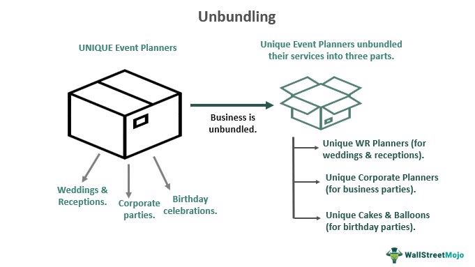

In the dynamic landscape of business strategy, the concept of unbundling has gained significant traction. Unbundling involves breaking down bundled products or services to meet consumer needs more effectively. This approach allows companies to offer individual components of a product or service separately, thereby granting consumers the flexibility to purchase only what they require. As consumer expectations shift towards more personalized and tailored experiences, unbundling has emerged as a formidable strategy to fulfill these demands.

Businesses across various sectors, including technology, finance, and media, are increasingly adopting unbundling tactics. By doing so, they can enhance their competitiveness and better align their offerings with consumer preferences. This article explores the role of unbundling in business strategy, focusing on its implications for consumers and its particular relevance in algorithmic trading.



Unbundling not only empowers consumers by offering greater choice and customization, but it also frequently results in cost savings, as consumers no longer need to pay for unwanted parts of a package. This modeling of services caters to the rising consumer demand for solutions that are specifically aligned with their individual needs, leading to increased satisfaction and loyalty.

Moreover, unbundling holds significant importance in industries where algorithmic trading is prevalent. Algorithmic trading, characterized by the use of complex algorithms to automate trading strategies, benefits from unbundling as it enables traders to select specific data feeds, analytics, and execution services independently. This capability enhances traders' efficiency and supports a more competitive trading environment.

Ultimately, this article aims to highlight how unbundling shapes modern business strategies and enhances consumer experiences. As market conditions continue to evolve, businesses that leverage unbundling effectively are poised to capture new opportunities and maintain a competitive edge. Unbundling is not merely a trend; it is a strategic tool crucial for adaptation and growth in the ever-changing business landscape.

## Table of Contents

## Understanding Unbundling in Business

Unbundling refers to the process where a bundled offering is broken down into its individual components, allowing consumers to select only the elements they need. This strategic approach provides significant flexibility and customization, enabling companies to efficiently meet diverse consumer demands. By offering such tailored choices, businesses can better align their products or services with consumer preferences, thus enhancing overall satisfaction and fostering customer loyalty.

The practice of unbundling is often adopted by businesses to sharpen their competitive edge. By concentrating on core offerings, companies can streamline operations and focus resources on areas where they can achieve the most impact. This focus often leads to improved product quality and innovation, as businesses are not spread too thin across multiple bundled services or products.

Unbundling can manifest in various forms, each catering to different aspects of business operations. Product unbundling involves separating a multi-component product package into standalone items. This allows consumers to purchase individual components rather than a complete set, which may not fully cater to their specific requirements. Service unbundling, on the other hand, disassembles complex service packages into individual services, enabling customers to opt for only those they find essential. Organizational unbundling can also occur when companies restructure their internal processes and teams to focus more intensively on distinct business segments or functions.

Numerous industries, including technology, finance, and media, have embraced unbundling as a means to innovate and remain competitive. In the technology sector, software companies, for example, may offer modular software solutions, allowing users to pay for only the features they need. The finance industry, through application in [algorithmic trading](/wiki/algorithmic-trading), has utilized unbundling to provide customizable trading services. Meanwhile, the media industry often offers unbundled content subscriptions, permitting consumers to pay only for specific channels or streaming services rather than entire cable or service packages.

In summary, unbundling is a strategic initiative that drives innovation and relevance across various sectors. As businesses continue to adapt to shifting market conditions and consumer preferences, unbundling is likely to remain a crucial component of contemporary business strategies.

## Consumer Benefits of Unbundling

Unbundling presents several benefits to consumers by significantly enhancing their buying experience with increased choice and personalization, subsequently leading to higher satisfaction. Fundamentally, unbundling allows consumers to purchase only the specific components or services they truly require, potentially leading to considerable cost savings. This can be particularly appealing in markets where products and services have traditionally been offered as part of comprehensive packages that might include unwanted or unused elements.

The increasing consumer demand for tailored solutions mirrors the flexibility provided by unbundling. In an era characterized by the customization of products and services, unbundling allows for a more tailored approach to consumer needs and preferences. By precisely aligning offerings with individual preferences, companies can foster deeper connections with their customers, enhancing brand loyalty and user satisfaction. Studies have shown that personalization can lead to increased customer retention rates. For example, a 2017 Epsilon study found that 80% of consumers are more likely to make a purchase when brands offer a personalized experience.

Moreover, unbundling serves as a catalyst for innovation. By segmenting their offerings, companies can concentrate on advancing and improving each component individually. This focus not only enhances the quality of each offering but also encourages continuous innovation within each segment, leading to potentially groundbreaking advancements that could redefine consumer expectations and market standards.

In summary, unbundling empowers consumers by facilitating choice and personalization, supporting cost efficiency, and driving innovative improvements. By effectively responding to consumer demands for more customized and efficient solutions, unbundling strengthens the relationship between businesses and their customers, fostering an environment conducive to mutual growth and satisfaction.

## Unbundling in Algorithmic Trading

Unbundling in the context of algorithmic trading has significantly altered the landscape of financial markets. Algorithmic trading leverages complex computer algorithms to execute trading strategies at speeds and frequencies that are impossible for human traders. This automated trading method has become integral to modern finance, as it allows for rapid transactions and minimizes the influence of human emotions on trading decisions.

The concept of unbundling in algorithmic trading allows market participants to access individual components such as data feeds, analytics, and execution services separately rather than as part of a monolithic service package. This unbundling enables traders to tailor their trading environments by selecting only the components that best meet their specific needs. By choosing independent data sources and analytics tools, traders can develop more precise and efficient trading strategies. For example, a trader might choose a particular real-time market data feed due to its speed and reliability while opting for a separate analytics provider known for advanced predictive models.

This flexibility supports higher levels of innovation within the industry. As traders experiment with different combinations of services, they can identify optimal setups that might not be possible through bundled services. The competition among service providers to offer high-quality unbundled components further drives technological advancements and the creation of new financial products.

Unbundling also aligns with the trend towards open systems and interoperability in financial markets. By allowing traders to integrate various third-party services seamlessly, unbundling promotes an open marketplace where competition is based on the quality and utility of individual components rather than fixed service packages. This approach can lead to more competitive pricing and better service offerings, benefiting the end users—traders and investors.

In practice, a Python-based algorithmic trader might use a combination of libraries and APIs to build a trading system. For instance, using the `pandas` library for data manipulation, a specific API for market data, and another for executing trades. Here's a simple example illustrating how different unbundled components can be brought together in a Python script for algorithmic trading:

```python
import pandas as pd
import requests

# Fetch market data from a chosen data feed
def fetch_market_data(api_url, params):
    response = requests.get(api_url, params=params)
    data = response.json()
    return pd.DataFrame(data)

# Perform custom analytics using chosen analytics tool
def calculate_moving_average(prices, window_size):
    return prices.rolling(window=window_size).mean()

# Execute trades through a separate execution service
def execute_trade(api_url, trade_params):
    response = requests.post(api_url, json=trade_params)
    return response.status_code == 200

# Example usage
market_data = fetch_market_data('https://api.example.com/marketdata', {'symbol': 'AAPL'})
moving_average = calculate_moving_average(market_data['close'], window_size=20)

if moving_average.iloc[-1] > market_data['close'].iloc[-1]:
    execute_trade('https://api.example.com/trade', {'symbol': 'AAPL', 'action': 'buy', 'quantity': 10})
```

In summary, the unbundling model in algorithmic trading empowers traders to customize their operations for increased efficiency and efficacy. It fosters an environment of innovation and competition, giving rise to advanced tools and services that redefine the financial trading landscape.

## The Intersection of Unbundling and Business Strategy

Unbundling represents a significant shift in business strategy, allowing companies to maintain relevance in a rapidly changing market landscape. By offering products and services independently, businesses can target specific segments that demand tailored solutions, thus capturing niche markets. This separation aligns seamlessly with modern trends such as personalization, digital transformation, and an empowered consumer base.

Personalization, a key driver in today's business climate, benefits significantly from unbundling. Allowing customers to choose individual components fosters a sense of ownership and satisfaction, as consumers can tailor their experiences to fit unique preferences. Digital transformation further encourages unbundling by leveraging technology to provide customizable solutions at scale. Technologies such as [artificial intelligence](/wiki/ai-artificial-intelligence) and data analytics can be used to dissect consumer behavior and predict preferences, enabling businesses to offer unbundled options that are most likely to appeal to their target audiences.

Moreover, unbundling facilitates consumer empowerment by giving individuals the autonomy to make choices based on their specific needs and financial capabilities. This strategy promotes transparency and flexibility, elements increasingly demanded by a more informed and discerning market. As a result, companies that adeptly navigate the intricacies of unbundling often gain a competitive edge, differentiating themselves through enhanced consumer relationships and tailored product offerings.

Industries that incorporate unbundling into their core strategy tend to be more agile and responsive to market demands. As technological advancements and globalization broaden consumer choices, unbundling will continue to influence strategic decisions across various sectors. The adaptability it offers enables businesses to evolve alongside consumer expectations, ensuring sustained competitiveness and relevance. As markets evolve, unbundling is set to play an essential role in shaping the future of business strategies.

## Challenges and Considerations

Unbundling, while offering distinct advantages such as customization and flexibility, also presents a series of challenges that businesses must navigate to ensure successful implementation. One of the primary challenges is managing the complexities associated with pricing individual components. When companies disassemble bundled offerings into standalone products or services, they must recalibrate their pricing strategies to make each component attractive to consumers. Pricing must reflect the perceived value of each part without alienating customers or leading to revenue loss.

Additionally, offering a wide array of choices can lead to consumer overwhelm and decision paralysis. Studies in behavioral economics, such as those by Schwartz (2004), demonstrate that while some choice is appreciated, too many options can hinder decision-making processes, ultimately discouraging purchases. Companies must strike a balance between providing sufficient choice and maintaining a streamlined selection process that guides consumers effectively.

Another crucial consideration is ensuring seamless integration and user experience across standalone components. Unbundled products or services must not only function independently but also integrate cohesively when used in conjunction with others. Failure to maintain a high level of user experience can diminish the perceived value of individual components, leading to customer dissatisfaction.

Finally, unbundling strategies must be dynamic, evolving with market conditions and consumer preferences. As market dynamics shift, and consumer needs change, businesses must remain agile, continuously reassessing and adjusting their offerings to remain relevant. This requires businesses to invest in robust market analysis and consumer feedback mechanisms to ensure their unbundling strategies align with contemporary trends and demands.

To summarize, while unbundling can be a potent business strategy, its success hinges on addressing these key challenges. Companies that effectively manage pricing, choice complexity, integration, and market responsiveness are better positioned to harness the potential of unbundling to enhance consumer experiences and drive business growth.

## Conclusion

Unbundling is increasingly recognized as a transformative strategy in contemporary business, particularly resonating with current consumer expectations and emerging industry trends. By enabling consumers to select from a suite of individual components rather than a pre-packaged set, businesses can cater to individual preferences, enhancing both customization and flexibility. This approach not only aligns with the growing demand for personalized solutions but also empowers consumers to shape their consumption in ways that best suit their needs.

The impact of unbundling is notably significant in industries like algorithmic trading. Here, the separation of data feeds, analytics, and execution services has fundamentally changed how financial products and services are conceived and offered. This strategic decomposition facilitates innovation and competition, allowing traders to customize their trading frameworks and improve efficiency by selecting only the necessary components. Such flexibility is crucial in fast-paced environments where adaptability and precision are paramount.

For businesses to remain competitive amidst ever-evolving markets, mastering the intricacies of unbundling becomes essential. Companies that proficiently integrate unbundling into their core strategies are better equipped to exploit niche opportunities and distinguish themselves from competitors. As market conditions and consumer preferences continue to shift, leveraging unbundling will become increasingly vital for businesses seeking to maintain relevance and drive growth. Embracing this strategy not only positions companies advantageously in their respective markets but also fosters a culture of continuous innovation and consumer-centric development.

## References & Further Reading

[1]: ["Unbundling the Supply Chain: Stages and Developments"](https://mru.org/courses/international-trade/unbundling-supply-chain) by Steven A. Melnyk and others, Systems, 2017.

[2]: Schwartz, B. (2004). ["The Paradox of Choice: Why More Is Less"](https://psycnet.apa.org/record/2004-13971-000) by Barry Schwartz.

[3]: Lee, I. (2017). ["Unbundling and Technology-Enabled Service Innovation"](https://boundaryless.io/blog/shifting-to-an-organizational-unbundling-model-when-and-why/), Journal of Hospitality and Tourism Management.

[4]: ["Market Microstructure: A Survey"](https://www.sciencedirect.com/science/article/pii/S1386418100000070) by Albert S. Kyle, in Handbook of the Economics of Finance.

[5]: ["Computational Finance: An Introductory Text with CD-ROM"](https://archive.org/details/academictorrents_f07203f2eedb4792c351ba0e28406dab9ab54d7d) by Steven E. Shreve.