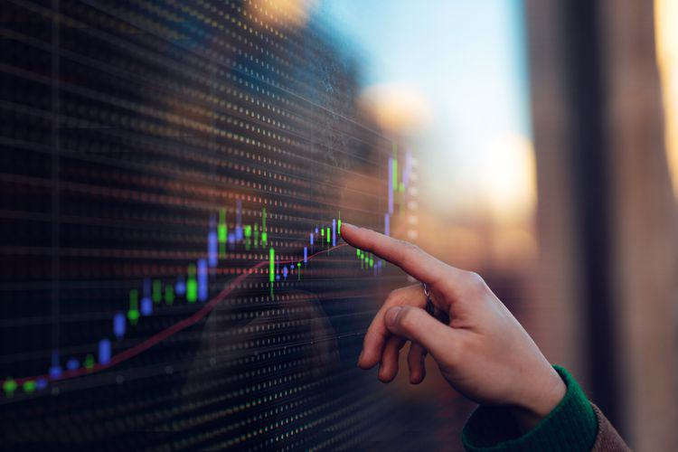

In the world of finance, understanding key terms and concepts is essential for navigating the complexities of trading. This is particularly true in the fast-evolving field of algorithmic trading, often referred to as algo trading. Algo trading relies on computer algorithms to execute trades based on pre-set criteria at speeds and frequencies far beyond human capability. Among the many concepts traders must understand is the idea of 'unchanged', which plays a significant role in developing trading strategies.

The term 'unchanged' refers to the stability of a security's price or rate over two distinct periods. This stability can be observed across various markets, including equities, bonds, futures, and options. In these instances, stability might reflect a balance between buyer and seller demand, or perhaps market indecision due to a lack of significant economic or corporate news. Recognizing unchanged periods allows investors to strategically decide whether to hold or sell their assets, providing a basis for more informed decision-making.



Stable prices hold great significance as they can impact broader financial strategies. For instance, periods of unchanged prices may indicate market consolidation, providing opportunities for traders to assess trends and potential price directions. These scenarios are particularly important in algo trading, where algorithms analyze price stability to optimize trading strategies. High-frequency trading algorithms can, for example, use unchanged price data to reduce transaction costs by avoiding unnecessary trades during periods of market stability.

By examining real-world examples, the influence of 'unchanged' prices on market behaviors and decision-making processes becomes evident. Understanding this concept is beneficial for both novice and seasoned investors, aiding in refining their trading strategies. Whether aiming to stabilize a portfolio or tailor a strategy for algorithmic trading, grasping these fundamental concepts enhances a trader's ability to adapt to market conditions and achieve a competitive advantage.

## Table of Contents

## Understanding the Term 'Unchanged' in Financial Markets

Unchanged refers to a situation where the price or rate of a security remains the same between two distinct periods. This phenomenon is observed across various financial markets, such as equity, bond, futures, and options markets, where it is indicative of stability over a given timeframe. The concept of unchanged prices is critical because it informs traders and investors about the optimal timing to hold or liquidate their assets. 

When prices remain unchanged, it often signals a balance between supply and demand. This equilibrium suggests that the market has no current inclination toward a significant uptrend or downtrend. It may also reflect market indecision or an absence of substantial news that would otherwise influence price movements. For instance, during earnings announcements or geopolitical events, the market may react with volatility. In comparison, unchanged prices typically surface during periods of perceived stability or neutrality. 

Recognizing unchanged prices can greatly affect trading strategies. Investors might see this stability as a cue to maintain their positions, anticipating future [volatility](/wiki/volatility-trading-strategies) that could drive prices in a more favorable direction. Additionally, unchanged prices can directly influence technical analysis techniques, as they often play a role in calculating moving averages and other key indicators used to predict future price movements. While a moving average may provide insights into a security's price direction over time, an unchanged price suggests little immediate trend; thus, technical indicators might show consolidation or a lack of [momentum](/wiki/momentum).

Ultimately, understanding unchanged prices is crucial for anyone involved in trading or investing. This knowledge aids in making informed decisions and developing strategies that leverage periods of market stability to optimize outcomes. In more advanced trading contexts, algorithms may incorporate analysis of unchanged prices to automate strategy adjustments that align with these conditions. By conceptualizing unchanged prices as a foundational concept, traders can refine their approaches to navigating the complexities of financial markets.

## The Role of Unchanged Prices in Algo Trading

In [algorithmic trading](/wiki/algorithmic-trading), unchanged prices play a pivotal role in the design and implementation of trading strategies. These prices can serve as key indicators of market stability, a concept crucial for traders relying on algorithms to make rapid decisions based on market conditions.

When the prices of securities remain stable over a certain period, it informs algorithm designers of market efficiency. Algorithms can be programmed to recognize these periods of stability, enabling traders to make strategic decisions about when to execute or withhold trading activities. In the context of high-frequency trading ([HFT](/wiki/high-frequency-trading-strategies)), unchanged prices can indicate that market movements are not significant enough to warrant rapid trading, which in turn minimizes transaction costs.

Algorithms leverage historical data to detect periods of price consolidation — instances where the price tends to stay within a particular range. Such periods are characterized by low volatility and indicate a potential balance between supply and demand. Here, trend analysis and computational models come into play. Algorithms can employ mathematical techniques, such as moving averages or support and resistance levels, to detect consolidation phases and adjust trading strategies accordingly.

For example, an algorithm may use a simple moving average (SMA) to track price stability:

```python
import pandas as pd

# Assuming 'prices' is a Pandas Series of closing prices
window_size = 20
moving_average = prices.rolling(window=window_size).mean()

# Identifying periods of consolidation
consolidation = (prices - moving_average).abs() < threshold
```

In this Python snippet, a moving average is calculated over a specified window size. The algorithm identifies consolidation periods by checking if the difference between the current price and the moving average is within a predefined threshold.

Detecting unchanged prices can also inform traders about potential [breakout](/wiki/breakout-trading) or breakdown scenarios following a consolidation phase. This enables algorithms to prepare for significant price movements, ultimately guiding traders in making preemptive adjustments to their strategies. By meticulously analyzing these periods, algorithms can optimize execution plans and reduce unnecessary trade volumes, enhancing overall trading efficiency.

In conclusion, incorporating the analysis of unchanged prices in algorithmic trading allows for more nuanced market assessments. It supports the development of sophisticated strategies that not only optimize transaction outcomes but also maintain lower operational costs during periods of market stability.

## Real-World Examples of Unchanged Instances

Unchanged prices in financial markets can provide insights into market behavior and influence trading strategies. A notable example of this phenomenon is observed with West Texas Intermediate (WTI) [crude oil](/wiki/crude-oil). At certain times, WTI crude has traded at precisely $70.32 per barrel across different months in separate years. This consistency in price suggests a stable balance between supply and demand, reflective of broader economic factors and geopolitical stability influencing the oil market. Despite experiencing various market fluctuations due to factors such as changes in global oil demand, production levels by OPEC, or shifts in geopolitical tensions, the recurrence of an unchanged outcome highlights the complex dynamics governing market equilibrium.

In equity markets, unchanged price patterns are less common in heavily traded indices like the S&P 500 due to the sheer [volume](/wiki/volume-trading-strategy) and [liquidity](/wiki/liquidity-risk-premium). However, they can occur with individual stocks or less liquid assets. In these cases, the opening and closing prices of a stock may occasionally be identical, indicating a day of equilibrium where buying and selling pressures are balanced. The formula for calculating returns when prices remain unchanged simplifies to:

$$
\text{Return} = \frac{P_{\text{close}} - P_{\text{open}}}{P_{\text{open}}} \times 100 = 0\%
$$

This zero return result signifies the absence of profit or loss potential for traders holding these positions on such days.

Unchanged prices can also be identified using algorithms designed for high-frequency or algorithmic trading. Consider a Python snippet that identifies unchanged closing prices in a dataset of security prices:

```python
import pandas as pd

# Sample price data
data = {'Date': ['2023-01-01', '2023-01-02', '2023-01-03'],
        'Open': [100, 100, 100],
        'Close': [100, 101, 100]}
df = pd.DataFrame(data)

# Filter unchanged prices
unchanged_days = df[df['Open'] == df['Close']]
print(unchanged_days)
```

This script determines the trading days when the opening and closing prices remain static, guiding traders to reassess their positions or strategies. In essence, recognizing unchanged price patterns helps market participants understand the forces of supply and demand more comprehensively, adapting their strategies to capitalize on such stability.

## Strategic Considerations for Traders

Traders can capitalize on the analysis of unchanged prices to refine their trading strategies. When a security's price remains stable over time, it provides an opportunity to reevaluate buy and sell signals in the context of broader market conditions. This stability can be a significant indicator for traders to assess whether their current strategies align with the ongoing market dynamics or require adjustments.

Unchanged price levels can considerably influence the placement of stop-loss orders. Typically, a stop-loss order is designed to limit an investor's loss on a position. If prices are stable, the likelihood of hitting a stop-loss prematurely is reduced, allowing traders to recalibrate these orders to accommodate expected volatility. This recalibration can involve setting stop-loss levels closer to or farther from the entry point of a trade, depending on the market analysis during stable periods. For instance, if a market exhibits sustained price stability, traders might choose to tighten stop-loss placements to better capture any abrupt market shifts.

Technical indicators, which traders use to predict future price movements, are also affected by unchanged prices. Such stability might suggest that momentum-based indicators, like the Moving Average Convergence Divergence (MACD) or Relative Strength Index (RSI), should be interpreted differently. In stagnating markets, trend-following indicators may not provide significant insights, prompting traders to switch to strategies that focus on breakout or reversal patterns.

In high-frequency trading (HFT), periods of unchanged prices can play a critical role in reducing trading volume. High-frequency trading strategies often depend on rapid execution of trades to capitalize on small price discrepancies. However, in a stable market, fewer opportunities for such discrepancies exist, which could naturally lead to a decrease in the frequency of trades executed. This reduction is beneficial as it can lower transaction costs associated with trading volume, thereby preserving capital.

In essence, understanding the dynamics of unchanged prices enables traders to fine-tune their approaches by ensuring that stop-loss orders and technical indicators are optimally set. Such adaptations can lead to improved overall trading efficiency and cost management, providing traders with the tools to navigate stable market environments effectively.

## Conclusion

Understanding the concept of 'unchanged' within financial trading offers traders valuable insights into market conditions. This awareness allows for the refinement of trading strategies, particularly in algorithm-driven environments where data precision is essential. The ability to discern when prices remain stable can signal market equilibrium, helping traders to make informed decisions regarding portfolio adjustments or maintaining positions.

Recognizing these trends provides a competitive edge, enabling traders to stabilize portfolios amidst volatility or adapt trading strategies for algorithmic implementation. By identifying periods of unchanged prices, traders can optimize entry and [exit](/wiki/exit-strategy) points, thereby enhancing overall trading efficacy and reducing unnecessary trading activity that could lead to higher transaction costs.

Future advancements in algorithmic trading aim to exploit scenarios involving unchanged prices for maximal gain. With continued technological innovation, algorithms will increasingly leverage such stable periods to refine predictive models and maximize profit potential. These insights are particularly beneficial for high-frequency trading and trend analysis, where recognizing consistent stability can inform more strategic and effective market engagement. As the field of algo trading evolves, the ability to harness unchanged scenarios will continue to be a crucial aspect of developing sophisticated trading algorithms.

## References & Further Reading

[1]: Bergstra, J., Bardenet, R., Bengio, Y., & Kégl, B. (2011). ["Algorithms for Hyper-Parameter Optimization."](https://dl.acm.org/doi/10.5555/2986459.2986743) Advances in Neural Information Processing Systems 24.

[2]: ["Advances in Financial Machine Learning"](https://www.amazon.com/Advances-Financial-Machine-Learning-Marcos/dp/1119482089) by Marcos Lopez de Prado

[3]: ["Evidence-Based Technical Analysis: Applying the Scientific Method and Statistical Inference to Trading Signals"](https://www.amazon.com/Evidence-Based-Technical-Analysis-Scientific-Statistical/dp/0470008741) by David Aronson

[4]: ["Machine Learning for Algorithmic Trading"](https://github.com/stefan-jansen/machine-learning-for-trading) by Stefan Jansen

[5]: ["Quantitative Trading: How to Build Your Own Algorithmic Trading Business"](https://www.amazon.com/Quantitative-Trading-Build-Algorithmic-Business/dp/1119800064) by Ernest P. Chan