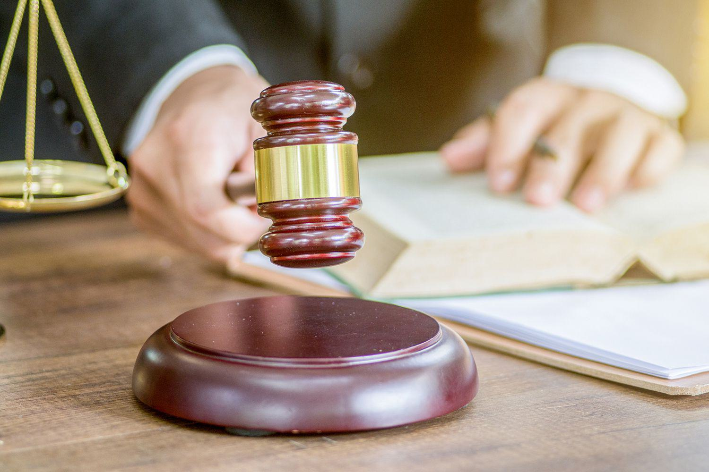

The global trade ecosystem has transformed significantly with the emergence of algorithmic trading, a mechanism that automates trading processes through advanced algorithms, enhancing the speed and efficiency of transactions. This evolution is crucial as it reflects the broader trend of technological integration within international commerce, which continues to grow in scale and complexity. As such, there is an urgent need to modernize trade laws to adequately address and facilitate these advancements, ensuring they align with evolving market dynamics and technological capabilities.

A key player in this modernization effort is the United Nations Commission on International Trade Law (UNCITRAL). Established by the United Nations, UNCITRAL is tasked with the harmonization and modernization of international trade laws. Its focus extends to various trade-related areas, including dispute resolution, the sale of goods, and prominently, electronic commerce—a field that directly intersects with algorithmic trading practices. By standardizing legal frameworks across nations, UNCITRAL aims to create a cohesive and predictable trading environment that accommodates the rapid technological shifts affecting global markets.

The need for a comprehensive legal framework that supports the expansion of algorithmic trading is apparent. As algorithmic trading becomes more prevalent, with its capacity to execute large volumes of trades at speeds unattainable by human traders, it introduces both opportunities and unique challenges. These include the potential for increased market volatility and the ethical implications of automated decision-making in financial markets. Therefore, UNCITRAL's role in crafting and implementing laws that govern and guide algorithmic trading is pivotal to ensuring that its growth benefits international trade in a balanced and equitable manner.

The purpose of this article is to examine how UNCITRAL is shaping a legal framework that supports the development and implementation of algorithmic trading. By focusing on harmonizing trade laws, UNCITRAL facilitates an environment where technological innovation in trading can flourish within a stable and regulated framework. This examination will highlight UNCITRAL's contributions to fostering cooperation among nations, with the aim of establishing uniform standards that guide the responsible deployment and operation of algorithmic trading systems.

## Table of Contents

## Overview of UNCITRAL

The United Nations Commission on International Trade Law (UNCITRAL) was founded in 1966 by the United Nations General Assembly as a key component of the international legal framework. The primary objective of UNCITRAL is to improve the coordination and unification of international trade law, thus simplifying and facilitating trade and commerce across borders. With headquarters strategically located in both New York and Vienna, the organization is well-positioned to address the complexities of global trade dynamics.

UNCITRAL's work spans several critical areas essential for the facilitation of modern trade practices. These areas include:

1. **Dispute Resolution**: One of UNCITRAL's fundamental roles is to streamline and standardize the mechanisms through which international trade disputes are resolved. This includes the development and promotion of arbitration and conciliation rules that provide flexible and efficient alternatives to traditional court proceedings.

2. **Electronic Commerce**: As digital trading becomes increasingly prominent, UNCITRAL actively works to adapt and formulate legal frameworks that accommodate electronic transactions. This involves ensuring that electronic signatures, contracts, and communication are legally recognized, thus removing barriers to digital trade.

3. **Sale of Goods**: In supporting international sales, UNCITRAL has developed uniform legal principles to govern the international sale of goods, embodied in instruments like the United Nations Convention on Contracts for the International Sale of Goods (CISG). This harmonization helps reduce legal uncertainty and facilitates smoother transactions across different legal systems.

By focusing on these core areas, UNCITRAL plays a vital role in promoting a more predictable and transparent legal environment for international trade. This not only benefits established economies but also provides developing nations with structured pathways to engage more actively in global markets. Through its ongoing efforts, UNCITRAL continues to safeguard the integrity of international trade by ensuring that legal frameworks evolve in tandem with commercial innovations and technologies.

## Algorithmic Trading in International Markets

Algorithmic trading, often dubbed "algo trading," involves the use of complex algorithms for executing trades based on predetermined criteria and conditions. This technology automates trading processes, enhancing the speed and efficiency of transactions in financial markets. By implementing strategies based on price, timing, and [volume](/wiki/volume-trading-strategy), [algorithmic trading](/wiki/algorithmic-trading) optimizes decision-making processes, reducing human intervention and emotional biases.

The growth of algorithmic trading has brought profound changes to international financial markets. It facilitates high-frequency trading ([HFT](/wiki/high-frequency-trading-strategies)), a subset of algorithmic trading characterized by extremely rapid trade execution. With HFT accounting for a significant portion of trades on major stock exchanges, the global markets have experienced increased [liquidity](/wiki/liquidity-risk-premium) and tighter spreads, which can lead to lower costs for traders and investors. However, this rapid pace also introduces potential risks such as heightened market [volatility](/wiki/volatility-trading-strategies) and the possibility of systemic disruptions during abnormal trading conditions.

The complex nature of these advanced trading systems necessitates a comprehensive legal framework capable of managing the associated risks while fostering an environment ripe for innovation. The legal constraints surrounding algorithmic trading must address concerns such as market manipulation, latency [arbitrage](/wiki/arbitrage), and the ethical implications of automated systems without stifling technological advancements that lead to improved market efficiency.

UNCITRAL (United Nations Commission on International Trade Law) assumes a crucial role in addressing these legal challenges. The organization focuses on creating a harmonized legislative environment that accommodates the dynamics of rapidly evolving trading technologies. Through collaborative efforts with various international bodies, UNCITRAL works towards developing standardized legal frameworks that prioritize transparency, accountability, and fairness in automated trading practices. By aligning international trade laws with technological progress, UNCITRAL ensures that innovations in algorithmic trading contribute positively to the global trade ecosystem, balancing the interests of market participants while safeguarding the integrity of financial systems.

## UNCITRAL's Role in Modernizing Trade Laws for Algo Trading

The United Nations Commission on International Trade Law (UNCITRAL) plays a crucial role in shaping the legal frameworks that underpin global trade, particularly in the burgeoning area of algorithmic trading. Since its establishment, UNCITRAL has focused on creating conditions conducive to international trade, using both legislative and non-legislative instruments to harmonize laws across nations. This methodology is especially pertinent to algorithmic trading, which demands a legal environment that can handle both the complexity and speed associated with automated trading activities.

One of the key roles of UNCITRAL in modernizing trade laws for algorithmic trading is its involvement in drafting and promoting a range of standardized laws. These laws aim to address fundamental aspects of algorithmic trading such as dispute resolution and electronic commerce. The harmonization of trade laws across jurisdictions ensures that discrepancies do not inhibit the global reach of algorithms used in trading, thereby fostering a more predictable and equitable market environment.

For example, UNCITRAL has made significant strides in electronic commerce laws, which are foundational to algorithmic trading. The Electronic Communications Convention, which facilitates the use of electronic communications in international contracts, is one such instrument. This convention provides legal recognition of electronic communications, ensuring that transactions executed by algorithms, which often occur without human intervention, are legally binding and enforceable across signatory nations.

UNCITRAL's working groups are instrumental in the continual development and harmonization of these laws. These specialized groups consist of experts from various member states and aim to address the specific legal nuances that arise with advancing trading technologies. They focus on creating guidelines and recommendations that nations can adopt to ensure their legal frameworks remain relevant and flexible in light of rapid technological advancements.

The adaptability of trade laws to new technological trends, such as [machine learning](/wiki/machine-learning) and AI in algorithmic trading, is another area where UNCITRAL’s role is pivotal. By fostering collaboration and dialogue among member states, UNCITRAL helps identify potential legal challenges and solutions, ensuring that trade laws evolve in tandem with technological innovation.

In summary, UNCITRAL's efforts in developing and promoting a harmonized legal framework for algorithmic trading are significant. These include creating standardized laws that govern core trading activities and ensuring the adaptability of legal systems to new technologies, ultimately enabling a fair and effective global trading environment.

## Challenges and Opportunities

Algorithmic trading presents both significant challenges and promising opportunities within the international trade landscape. One primary challenge is its potential to exacerbate market volatility, a concern that arises from the sheer speed and volume of transactions executed by algorithms. The 2010 "Flash Crash," where the Dow Jones Industrial Average plummeted nearly 1,000 points within minutes before rapidly recovering, exemplifies how algorithm-driven trading can lead to dramatic market swings. Such volatility can erode investor confidence and precipitate systemic risks across global financial markets.

Furthermore, the potential for algorithmic trading to enable unfair trading practices, such as market manipulation or front-running, calls for stringent legal frameworks. These practices can undermine market integrity and disproportionately disadvantage less technologically advanced market participants. Addressing these concerns requires developing comprehensive legal standards that regulate algorithmic functionalities and monitoring mechanisms to detect and prevent market abuses.

UNCITRAL plays a crucial role in formulating and promoting legal standards to mitigate these risks while fostering an environment conducive to technological innovation. Through international cooperation, UNCITRAL seeks to harmonize regulations that protect market stability without stifling the advancement and implementation of new trading technologies. By providing model laws and guidelines, UNCITRAL encourages countries to adopt consistent and fair legal frameworks, reducing the regulatory inconsistencies that could otherwise create arbitrage opportunities for exploiting weaker regulatory environments.

The harmonization of trade laws also presents significant opportunities, particularly for developing nations. By adopting international standards for algorithmic trading, these nations can more effectively integrate into global markets. This integration is not only technological but also regulatory, providing developing countries with a framework for competitiveness in increasingly automated financial environments. As a result, countries can leverage algorithmic trading to increase market participation, bolster liquidity, and ultimately drive economic growth.

Thus, the dual approach of addressing challenges while capitalizing on opportunities underscores the dynamic role UNCITRAL plays. By navigating the complexities associated with algorithmic trading, UNCITRAL enhances global market stability and inclusivity, ensuring that technological advances benefit international commerce as a whole.

## The Future of International Trade Law and Algorithmic Trading

As technology continues to evolve, UNCITRAL's adaptive legal framework will be crucial in supporting new trading practices. The digital transformation within the global financial sector, exemplified by the rapid advancement of algorithmic trading, necessitates a reshaping of international trade laws to better suit a digital and interconnected world. UNCITRAL's proactive approach highlights the importance of researching and predicting legal adaptations necessary to accommodate such dynamic changes.

Ongoing research and dialogue among nations facilitated by UNCITRAL are pivotal for anticipating and meeting the legal demands that emerging technologies introduce. The organization acts as a conduit for international cooperation, enabling nations to share insights, develop collaborative regulations, and ensure that trade laws do not fall behind technological advancements. This concerted effort aids in identifying potential friction points where current laws may clash with the progression of new trading technologies. By preemptively adjusting the legal landscape, UNCITRAL aims to prevent regulatory gaps that could hinder innovation or lead to unfair market practices.

The future points to a more seamless integration of algorithmic trading into international trade, supported by robust and harmonized legal frameworks. The standardization of legal practices through UNCITRAL's instruments can facilitate efficient cross-border transactions, thus enhancing global market liquidity and participation. A harmonized legal approach reduces the complexity and cost associated with navigating diverse legal systems, making it easier for nations, particularly developing ones, to engage in international commerce.

Furthermore, the advancement of algorithmic trading aligns with broader global trends such as the increasing importance of big data analytics and [artificial intelligence](/wiki/ai-artificial-intelligence) in decision-making processes. These technologies promise enhanced market efficiency but also require stringent regulatory oversight to mitigate associated risks such as market manipulation and systemic instability. UNCITRAL's frameworks aim to balance innovation and regulation, ensuring that technological growth does not compromise market integrity.

In summary, the future of international trade law concerning algorithmic trading hinges on the ability of organizations like UNCITRAL to anticipate and adapt to technological changes. Through continuous research, international collaboration, and the harmonization of laws, the integration of modern trading practices into the global trade infrastructure can be achieved efficiently and equitably.

## Conclusion

UNCITRAL's influence on the modernization of international trade law is vital in adapting to the technological transformations brought about by algorithmic trading. By promoting global cooperation and aligning diverse legal frameworks, UNCITRAL establishes a fair and efficient trading environment. This harmonization is paramount, as it reduces legal barriers and facilitates seamless international transactions, ensuring equitable practices across jurisdictions.

The organization’s persistent efforts to update and refine trade laws in response to technological changes underpin its critical role in shaping a future where algorithmic trading can thrive. By staying attuned to technological advancements, UNCITRAL helps create a legal infrastructure that not only addresses emerging challenges but also fosters innovation. This adaptive framework is crucial for leveraging new trading technologies, ensuring that international commerce remains dynamic and attuned to contemporary developments.

As global trade becomes increasingly digital and automated, UNCITRAL’s commitment to harmonizing laws ensures that all nations can participate in and benefit from global markets. The organization's work supports the seamless integration of algorithmic trading, aligning legal norms to protect against risks while embracing opportunities. In this way, UNCITRAL not only facilitates current trade practices but also lays the groundwork for future developments in international commerce, contributing significantly to global economic development and prosperity.

## References & Further Reading

[1]: ["UNCITRAL Model Law on Electronic Commerce (1996)"](https://uncitral.un.org/sites/uncitral.un.org/files/media-documents/uncitral/en/19-04970_ebook.pdf), United Nations Commission on International Trade Law.

[2]: Jiang, G. J., Lo, I., & Valente, G. (2014). ["High-frequency trading around macroeconomic news announcements: Evidence from the U.S. treasury market."](https://onlinelibrary.wiley.com/doi/10.1002/9781118709207.ch11) Journal of International Money and Finance, 44, 30-54.

[3]: Cartea, Á., Jaimungal, S., & Penalva, J. (2015). ["Algorithmic and High-Frequency Trading."](https://assets.cambridge.org/97811070/91146/frontmatter/9781107091146_frontmatter.pdf) Cambridge University Press.

[4]: Pete Beaumont, Michael Fleming, and John G. McCrank. (2014). ["SEC approves new measures to curb extreme trading moves."](https://en.wikipedia.org/wiki/Fleming_and_John) Reuters.

[5]: Chan, E. (2009). ["Quantitative Trading: How to Build Your Own Algorithmic Trading Business."](https://github.com/ftvision/quant_trading_echan_book) Wiley Trading.

[6]: Lopez de Prado, M. (2018). ["Advances in Financial Machine Learning."](https://www.amazon.com/Advances-Financial-Machine-Learning-Marcos/dp/1119482089) Wiley. 

[7]: United Nations. (2017). ["The UNCITRAL Model Law on International Commercial Arbitration."](https://uncitral.un.org/sites/uncitral.un.org/files/media-documents/uncitral/en/19-09955_e_ebook.pdf) United Nations Commission on International Trade Law.