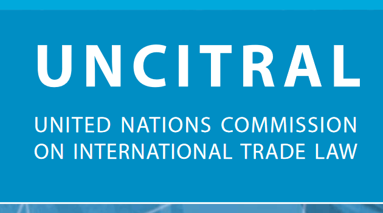

## Table of Contents

## What is UNCITRAL?

UNCITRAL stands for the United Nations Commission on International Trade Law. It is a part of the United Nations that works to make international trade easier and fairer. UNCITRAL does this by creating rules and laws that countries can use when they trade with each other. These rules help to solve problems that can happen in international trade, like disagreements between countries or companies from different places.

The work of UNCITRAL is important because it helps to make sure that trade between countries is smooth and fair. They focus on areas like buying and selling goods across borders, moving goods from one country to another, and settling disputes without going to court. By creating these rules, UNCITRAL helps businesses and countries trust each other more, which can lead to more trade and better relationships between nations.

## When was UNCITRAL established?

UNCITRAL was established in 1966. This was a time when countries were starting to trade more with each other, and they needed help to make sure this trade was fair and easy.

The United Nations saw that there were many problems in international trade, like different laws in different countries that made trading hard. So, they created UNCITRAL to help solve these problems by making rules that everyone could follow.

## What is the main purpose of UNCITRAL?

The main purpose of UNCITRAL is to help make international trade easier and fairer. They do this by creating rules and laws that countries can use when they trade with each other. These rules help to solve problems that can happen in international trade, like disagreements between countries or companies from different places.

UNCITRAL's work is important because it helps to make sure that trade between countries is smooth and fair. They focus on areas like buying and selling goods across borders, moving goods from one country to another, and settling disputes without going to court. By creating these rules, UNCITRAL helps businesses and countries trust each other more, which can lead to more trade and better relationships between nations.

## Which organization does UNCITRAL belong to?

UNCITRAL belongs to the United Nations. The United Nations is a big group of countries that work together to keep peace and help people around the world.

UNCITRAL is a special part of the United Nations that focuses on making trade between countries easier and fairer. They create rules that countries can use when they trade with each other, which helps solve problems and disagreements in international trade.

## How many member states does UNCITRAL have?

UNCITRAL has 60 member states. These countries are chosen by the United Nations General Assembly to be part of UNCITRAL. They come from different parts of the world to make sure that many different countries have a say in how international trade rules are made.

These member states work together to create rules that make international trade easier and fairer. They focus on solving problems that can happen when countries trade with each other, like disagreements or different laws. By working together, they help make sure that trade between countries is smooth and fair.

## What are some key areas of law that UNCITRAL focuses on?

UNCITRAL focuses on several key areas of law to help make international trade easier and fairer. One important area is the law about buying and selling goods across borders. This includes rules about how to make contracts, how to pay for goods, and what to do if there are problems with the goods. These rules help businesses from different countries understand each other better and trade more easily.

Another key area is the law about moving goods from one country to another. This includes rules about shipping, insurance, and how to handle goods when they cross borders. These rules help make sure that goods can move smoothly and safely between countries, which is important for international trade.

UNCITRAL also focuses on the law about settling disputes without going to court. This includes rules about how to solve disagreements between countries or companies from different places through talks or other peaceful ways. These rules help businesses and countries trust each other more, which can lead to more trade and better relationships between nations.

## Can you name some significant legal texts produced by UNCITRAL?

UNCITRAL has created many important legal texts that help with international trade. One of the most well-known is the United Nations Convention on Contracts for the International Sale of Goods (CISG). This text sets out rules for buying and selling goods between countries. It helps businesses know what to expect when they make deals with companies from other countries. The CISG makes it easier for businesses to trade because it gives them a common set of rules to follow.

Another important text is the UNCITRAL Model Law on International Commercial Arbitration. This text provides a way for businesses to solve disagreements without going to court. It helps them use a process called arbitration, where a neutral person listens to both sides and makes a decision. This can be faster and less expensive than going to court, which is good for businesses that want to keep trading smoothly.

UNCITRAL has also produced the UNCITRAL Model Law on Electronic Commerce. This text helps countries make laws about trading using the internet and other electronic ways. It covers things like how to make contracts online, how to sign documents electronically, and how to keep electronic records safe. This is important because more and more trade happens online, and businesses need clear rules to follow.

## How does UNCITRAL influence international trade law?

UNCITRAL influences international trade law by creating rules and laws that countries can use when they trade with each other. They focus on making trade easier and fairer by solving problems that can happen when countries or businesses from different places trade. For example, UNCITRAL's United Nations Convention on Contracts for the International Sale of Goods (CISG) sets out rules for buying and selling goods between countries. This helps businesses know what to expect when they make deals, making trade smoother and more predictable.

Another way UNCITRAL influences international trade law is by providing ways to solve disagreements without going to court. Their Model Law on International Commercial Arbitration helps businesses use arbitration, where a neutral person listens to both sides and makes a decision. This can be faster and less expensive than going to court, which is good for businesses that want to keep trading smoothly. By creating these rules, UNCITRAL helps businesses and countries trust each other more, which can lead to more trade and better relationships between nations.

## What is the process for developing texts at UNCITRAL?

The process for developing texts at UNCITRAL starts with identifying a problem in international trade that needs a solution. UNCITRAL's member states, which are chosen by the United Nations General Assembly, work together to figure out what the problem is and how to fix it. They might talk to businesses, lawyers, and other experts to get ideas. Once they have a good understanding of the problem, they start writing a draft of the text. This draft is like a first version of the rules they want to create.

After the draft is written, UNCITRAL shares it with countries and other groups to get their feedback. They might hold meetings where people can talk about the draft and suggest changes. UNCITRAL listens to all the feedback and makes changes to the draft to make it better. This can take a long time because they want to make sure the rules are fair and will work well for everyone. Once everyone agrees on the final version, the text is finished and ready for countries to use.

## How does UNCITRAL ensure the implementation of its texts?

UNCITRAL helps countries use its texts by giving them clear rules that they can choose to follow. They do not force countries to use these rules, but they make them easy to understand and use. Countries can decide to use UNCITRAL's texts by making them part of their own laws. This means that businesses in those countries will follow the rules when they trade with other countries. UNCITRAL also helps by giving countries advice and support on how to use the texts.

UNCITRAL also works with other groups and organizations to help spread the word about its texts. They hold meetings and workshops where people can learn about the rules and how to use them. This helps more people know about the texts and encourages more countries to use them. By working together with others, UNCITRAL makes sure that its rules are used in a way that helps international trade be easier and fairer.

## What role do working groups play in UNCITRAL?

Working groups are important teams within UNCITRAL. They help create the rules and laws that make international trade easier and fairer. Each working group focuses on a specific problem in international trade, like buying and selling goods across borders or solving disagreements without going to court. They talk to experts and businesses to understand the problem better and then write a draft of the rules. This draft is shared with countries and other groups to get feedback and make it better.

Once the working group has a good draft, they keep working on it until everyone agrees on the final version. This can take a long time because they want to make sure the rules are fair and will work well for everyone. The working groups help UNCITRAL by doing the detailed work of writing and improving the rules. They make sure that the texts are ready for countries to use and help solve real problems in international trade.

## How can countries that are not members of UNCITRAL participate in its work?

Countries that are not members of UNCITRAL can still take part in its work. They can join meetings and give their ideas about the rules UNCITRAL is making. This helps make sure that the rules are fair and work well for everyone, not just the member countries. Non-member countries can also use the rules that UNCITRAL creates, even if they did not help make them. This means they can make the rules part of their own laws and use them when they trade with other countries.

UNCITRAL also works with other groups and organizations to help spread the word about its rules. They hold meetings and workshops where people from non-member countries can learn about the rules and how to use them. This helps more people know about the rules and encourages more countries to use them. By working together with others, UNCITRAL makes sure that its rules are used in a way that helps international trade be easier and fairer for everyone.

## References & Further Reading

[1]: ["UNCITRAL Model Law on Electronic Commerce (1996)"](https://uncitral.un.org/sites/uncitral.un.org/files/media-documents/uncitral/en/19-04970_ebook.pdf), United Nations Commission on International Trade Law.

[2]: Jiang, G. J., Lo, I., & Valente, G. (2014). ["High-frequency trading around macroeconomic news announcements: Evidence from the U.S. treasury market."](https://onlinelibrary.wiley.com/doi/10.1002/9781118709207.ch11) Journal of International Money and Finance, 44, 30-54.

[3]: Cartea, Á., Jaimungal, S., & Penalva, J. (2015). ["Algorithmic and High-Frequency Trading."](https://assets.cambridge.org/97811070/91146/frontmatter/9781107091146_frontmatter.pdf) Cambridge University Press.

[4]: Pete Beaumont, Michael Fleming, and John G. McCrank. (2014). ["SEC approves new measures to curb extreme trading moves."](https://en.wikipedia.org/wiki/Fleming_and_John) Reuters.

[5]: Chan, E. (2009). ["Quantitative Trading: How to Build Your Own Algorithmic Trading Business."](https://github.com/ftvision/quant_trading_echan_book) Wiley Trading.

[6]: Lopez de Prado, M. (2018). ["Advances in Financial Machine Learning."](https://www.amazon.com/Advances-Financial-Machine-Learning-Marcos/dp/1119482089) Wiley. 

[7]: United Nations. (2017). ["The UNCITRAL Model Law on International Commercial Arbitration."](https://uncitral.un.org/sites/uncitral.un.org/files/media-documents/uncitral/en/19-09955_e_ebook.pdf) United Nations Commission on International Trade Law.