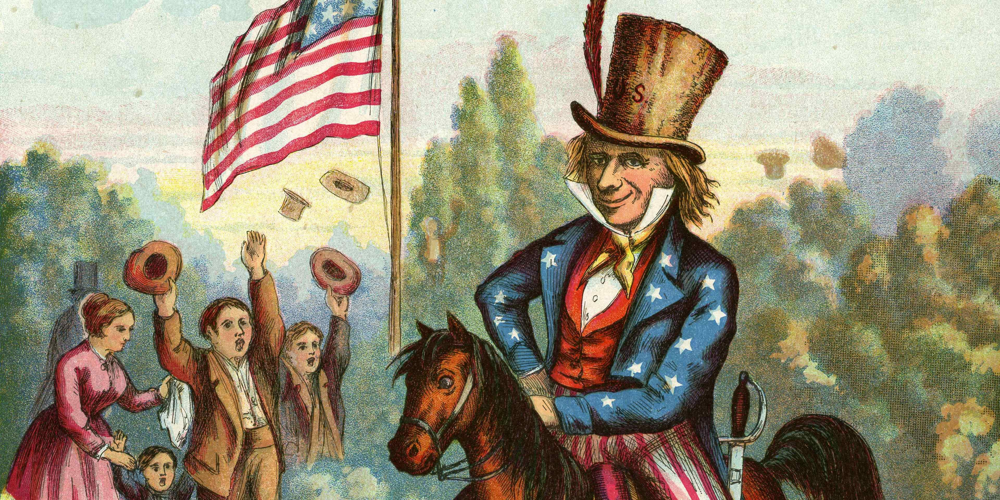

The iconic figure of Uncle Sam has long represented the U.S. government in various capacities, serving as a cultural emblem that resonates with American identity. Originating during the War of 1812, Uncle Sam has transformed over the years, becoming synonymous with patriotism and government authority. This personification extends to diverse areas including military recruitment, where the imagery became especially prominent during World War I with the famous "I Want You" poster. Beyond its role in national defense and propaganda, Uncle Sam symbolizes financial oversight, epitomizing the federal government's role in taxation and economic regulation.

Algorithmic trading, or algo trading, has fundamentally altered the dynamics of financial markets. By employing sophisticated algorithms, trades can be executed at speeds and frequencies unachievable by human traders. This technological advancement has significantly enhanced market efficiency, facilitating increased liquidity and price discovery. However, it also introduces complexities, such as amplified market volatility and the potential for flash crashes, necessitating regulatory oversight.



This article explores how the symbolic figure of Uncle Sam aligns with the rise of algorithmic trading in the U.S. financial landscape. By embodying governmental oversight, Uncle Sam's representation extends into the domain of technology and financial regulation, mirroring contemporary challenges and responsibilities. As financial systems become increasingly intricate, understanding the historical roots and modern implications of Uncle Sam's presence in financial regulation and technology becomes crucial for appreciating the balance between innovation and risk management in today's financial environment.

## Table of Contents

## The History and Evolution of Uncle Sam

Uncle Sam is an iconic figure whose roots can be traced back to the early 19th century. The character's origins are linked to Samuel Wilson, a meat packer from Troy, New York, during the War of 1812. Samuel Wilson supplied barrels of beef to the United States Army, and the barrels were stamped with "U.S." to denote government property. Soldiers began referring to the provisions as "Uncle Sam's," leading to the anthropomorphic personification of the United States government as "Uncle Sam."

Over time, Uncle Sam transformed from this humble beginning into a nationally recognized symbol. His image gained significant prominence during World War I, largely due to the famous recruitment poster created by artist James Montgomery Flagg. The poster, featuring a stern Uncle Sam pointing directly at the viewer with the caption "I Want YOU for U.S. Army," became an enduring symbol of American patriotism and military mobilization. This portrayal during the wartime period served as a powerful tool for rallying public support and encouraging enlistment.

As American culture and society evolved through the 20th century, so did Uncle Sam's image and the scope of his symbolism. He came to embody broader themes of U.S. patriotism and authority, moving beyond military contexts to represent various aspects of the federal government. Uncle Sam became synonymous with governmental policies and decisions, often used in political cartoons and public discourse to critique or support federal actions.

The evolution of Uncle Sam from a wartime propaganda figure to a broader representation of the U.S. government illustrates his flexibility as a cultural symbol. He functions as both a personification of the government and a vehicle for expressing national identity and civic values. Throughout his history, Uncle Sam has remained a fixture of the American sociopolitical landscape, adapting to reflect the nation's changing priorities and challenges.

## Uncle Sam as a Financial Regulator

Uncle Sam, as a symbol, extends beyond mere patriotism and military recruitment to encompass significant roles in financial regulation within the United States. Historically, the term 'Uncle Sam' has been used to personify United States federal bodies, most notably the Internal Revenue Service (IRS) and the Securities and Exchange Commission (SEC). This association underscores the broader perception of federal authority and oversight in economic matters.

The phrase 'paying Uncle Sam' is ingrained in the American lexicon, reflecting the obligation of citizens to contribute taxes to the national treasury. This euphemism highlights Uncle Sam's embodiment of the government's extensive role in taxation, ensuring compliance and financial transparency. The IRS is tasked with enforcing tax laws, collecting taxes, and safeguarding the federal government's revenue stream, thus personifying Uncle Sam's fiscal oversight capabilities. Similarly, the SEC, representing Uncle Sam in securities regulation, enforces laws to protect investors, maintain fair, orderly, and efficient markets, and facilitate capital formation.

In recent years, [algorithmic trading](/wiki/algorithmic-trading)—or algo trading—has emerged as a transformative force in financial markets. This practice involves using algorithms to automatically execute trades at extraordinary speed, influenced by complex mathematical models and high-frequency data analysis. Uncle Sam's influence in this domain is visible through regulatory measures and policies aimed at governing the burgeoning field of algo trading. These measures are crucial in mitigating inherent risks, such as market [volatility](/wiki/volatility-trading-strategies) and systemic shocks, which are characteristic of rapid, automated trading environments.

Government intervention, personified by Uncle Sam, plays a pivotal role in maintaining market integrity and protecting investors. Regulatory frameworks are designed to address potential abuses and technological failings in algo trading that could destabilize financial systems. Agencies like the SEC have imposed stringent regulations requiring transparency and accountability in algorithmic trading practices, to ensure that these high-speed transactions do not undermine market fairness.

In essence, Uncle Sam's symbolic and practical influence in financial regulation is profound, serving as a constant reminder of governmental oversight in economic activities. By leveraging regulatory authority, Uncle Sam helps balance the dual objectives of fostering innovation within the financial sector and safeguarding the economic stability of the nation. This balance is critical in an era where technology continually reshapes the landscape of financial markets.

## The Rise of Algorithmic Trading

Algorithmic trading, commonly referred to as algo trading, leverages computer programs to perform trading activities in financial markets. These programs utilize pre-defined sets of instructions, or algorithms, to execute trades automatically, based on various parameters such as timing, price, and [volume](/wiki/volume-trading-strategy). The core advantage of algos is their ability to execute trades at speeds and frequencies far beyond human capacity. This speed is vital in various trading strategies, including high-frequency trading ([HFT](/wiki/high-frequency-trading-strategies)), which often benefits from small price discrepancies that exist for a fraction of a second.

At its foundation, algorithmic trading involves mathematical models and complex decision-making processes. Consider, for example, a moving average crossover strategy:

```python
# Sample Python code for a simple moving average crossover strategy
def moving_average(series, period):
    return series.rolling(window=period).mean()

def crossover_strategy(prices):
    short_window = 40
    long_window = 100

    signals = pd.DataFrame(index=prices.index)
    signals['short_mavg'] = moving_average(prices, short_window)
    signals['long_mavg'] = moving_average(prices, long_window)
    signals['signal'] = 0.0
    signals['signal'][short_window:] = np.where(signals['short_mavg'][short_window:] > signals['long_mavg'][short_window:], 1.0, 0.0)
    signals['position'] = signals['signal'].diff()

    return signals
```

This code identifies buy signals when the short-term moving average rises above the long-term moving average, suggesting an upward price trend.

Algorithmic trading has significantly enhanced market efficiency by reducing transaction costs and improving [liquidity](/wiki/liquidity-risk-premium). However, it has also introduced new challenges, particularly concerning market volatility. Events such as the 2010 Flash Crash, where the U.S. stock market plunged within minutes, emphasize the potential risks associated with algorithms that can magnify errors and lead to cascading sell-offs.

Despite these challenges, algo trading offers substantial benefits, including minimized human emotion, which can lead to more rational trading decisions. It also allows for diversification through simultaneous trade execution across various markets and instruments.

Yet, the high-speed nature of algorithmic trading raises significant concerns about fairness and transparency in financial markets. Regulators are particularly wary of the potential for manipulative practices such as quote stuffing, where high volumes of orders are rapidly placed and canceled to create confusion and delay.

In sum, algorithmic trading represents a paradigm shift in modern finance. Its continued evolution highlights the importance of robust regulatory frameworks to ensure market stability while fostering innovation.

## Uncle Sam’s Role in Regulating Algorithmic Trading

Government agencies, symbolized by Uncle Sam, play an integral role in overseeing and regulating algorithmic trading within the U.S. financial markets. These regulatory bodies implement a series of measures to mitigate risks associated with algo trading, such as flash crashes, and to ensure market integrity.

Flash crashes, like the one that occurred on May 6, 2010, expose vulnerabilities within algorithmic trading systems. To address these risks, agencies have introduced circuit breakers and limits on trading speeds. Circuit breakers are designed to temporarily halt trading if a stock's price fluctuates excessively in a short period, providing a cooling-off period to stabilize markets. 

The Securities and Exchange Commission (SEC) is one key body involved in formulating policies that impact algorithmic trading. The SEC's role includes mandating certain disclosures and imposing rules to enhance transparency in trading practices. One example is the Regulation National Market System (Reg NMS), which aims to ensure that investors receive the best possible price by fostering competition among markets.

Another agency, the Commodity Futures Trading Commission (CFTC), regulates algo trading in futures markets. The CFTC requires registration of high-frequency trading firms and compliance with certain risk control measures. Additionally, the agency has introduced rules on the reporting of large positions to monitor market activities effectively.

The Federal Trade Commission (FTC) also contributes to the regulation by enforcing antitrust laws to prevent monopolistic practices that could disrupt fair competition in trading activities. 

The impact of these regulatory measures is significant. By ensuring greater transparency and implementing risk control mechanisms, regulatory bodies help maintain market order and investor confidence. Yet, these regulations continue to evolve, reflecting the growing complexity of financial markets and technological advancements.

As algorithmic trading evolves, the role of government agencies, epitomized by Uncle Sam, will likely expand to address new challenges. This involves balancing the promotion of technological innovation in trading with the imperative of safeguarding market stability and investor interests.

## The Future of Uncle Sam in Financial Markets

As technology continues to advance at a rapid pace, the symbolic representation of Uncle Sam within financial markets adapts accordingly. One of the key areas of evolution is the increasing regulation and oversight of fintech innovations. Emerging technologies such as blockchain, [cryptocurrency](/wiki/cryptocurrency), and robo-advisory services challenge traditional regulatory frameworks, necessitating new approaches by government bodies to ensure market stability and investor protection. Uncle Sam, as a personification of U.S. regulatory authorities, represents the efforts to maintain a balance between fostering innovation and safeguarding economic integrity.

Algorithmic trading remains a focal point in discussions about financial regulation. Its ability to execute trades at extraordinary speeds raises significant concerns regarding market dynamics, such as potential flash crashes or systemic risk. The debate over the extent of government intervention centers on striking a balance that allows technological advancements to flourish while mitigating inherent risks. This balancing act is critical to maintaining confidence in financial markets and ensuring that technological disruptions do not lead to unintended economic consequences.

In contemplating future scenarios, several potential developments could reshape U.S. financial policies. For instance, the integration of [artificial intelligence](/wiki/ai-artificial-intelligence) in financial decision-making processes could prompt a reevaluation of existing regulations. AI's capacity to analyze vast datasets and make predictive analyses in real-time might necessitate new safeguards to protect against biases or errors that could adversely affect trading decisions or financial markets.

Moreover, global cooperation on regulatory standards might become increasingly important as financial markets become more interconnected. As the U.S. navigates its regulatory landscape, it may engage more deeply with international partners to harmonize policies, especially concerning cross-border fintech operations and algorithmic trading.

In conclusion, the ongoing adaptation of Uncle Sam's role in financial markets underscores the dynamic nature of financial regulation in the face of technological innovation. As fintech continues to evolve, future regulatory frameworks must be agile and responsive to ensure that markets remain secure, efficient, and fair for all participants. Understanding these potential developments is crucial for comprehending the complexities and future trajectories of U.S. financial regulation.

## Conclusion

Uncle Sam's symbolic presence in financial regulation reflects broader themes of governmental oversight and national identity. This iconic figure, historically associated with the U.S. government's authoritative role, continues to embody its regulatory functions, particularly within the financial sphere. With the advent of algorithmic trading, traditional symbols such as Uncle Sam have found renewed relevance, exhibiting an ability to adapt to modern technological challenges. Algorithmic trading, characterized by its use of complex algorithms to execute trades with unprecedented speed and frequency, necessitates a level of oversight that Uncle Sam epitomizes.

The intersection of personification with algorithmic trading highlights the dynamic nature of regulatory frameworks in addressing both innovation and risk. As financial markets become increasingly influenced by rapid technological advancements, scrutiny and adaptation of regulatory measures remain pivotal. By maintaining oversight, agencies personified by Uncle Sam play a crucial role in mitigating risks, such as flash crashes and market manipulation, while fostering an environment that allows innovation to thrive.

Understanding Uncle Sam's role in these regulatory processes is essential for grasping the complexities of contemporary financial systems and their regulation. The symbolism of Uncle Sam serves as a reminder of the ongoing responsibility of the government to ensure the integrity and stability of financial markets amidst evolving technologies. This balance between innovation and regulation not only reflects traditional values but also anticipates future developments, ensuring that financial systems remain robust and equitable. As the landscape of finance continues to transform, Uncle Sam's role adapts, representing both the continuity and evolution of governmental oversight in safeguarding economic principles.

## FAQs

### FAQs

**What is algorithmic trading and how does it work?**  
Algorithmic trading involves using computer programs to execute large orders in financial markets with speed and efficiency. These programs make use of mathematical models and complex algorithms to make decisions based on various market variables such as price, volume, and time. The algorithms aim at achieving specific financial goals such as reducing costs, enhancing speed, or minimizing risks associated with human error. A typical example is the execution of a large order in smaller, strategically-timed trades to avoid market impact.

**How did Uncle Sam become a symbol of the U.S. government?**  
Uncle Sam originated during the War of 1812, and his identity is often linked to Samuel Wilson, a meat packer who supplied barrels of beef to the U.S. Army. The barrels were branded with "U.S." and soldiers began referring to the meat as "Uncle Sam's." Over time, this figure evolved into a metaphor for the U.S. federal government. His iconic image gained significant traction through James Montgomery Flagg's military recruitment posters during World War I, where Uncle Sam's finger-pointing portrayal became synonymous with national service and duty.

**What are the key challenges associated with algorithmic trading?**  
Algorithmic trading, while highly efficient, presents several challenges. One significant issue is market volatility, as high-frequency trading can lead to drastic price swings, known as flash crashes. Moreover, the opacity of some algorithms makes it difficult for regulators to monitor and manage systemic risk. The reliance on technology also exposes markets to cybersecurity risks. Additionally, errors in algorithmic strategies, whether due to flawed programming or unforeseen market conditions, can result in substantial financial loss.

**How does the U.S. government regulate financial markets?**  
The U.S. government regulates financial markets through various agencies, with the Securities and Exchange Commission (SEC) and the Commodity Futures Trading Commission (CFTC) being two of the primary bodies. They enforce laws to protect investors and ensure fair, efficient, and transparent markets. These regulations include guidelines on trading practices, disclosures, reporting standards, and safeguards against market manipulation. The Dodd-Frank Act, enacted in response to the 2008 financial crisis, introduced significant regulatory reforms aimed at reducing risks in the financial system.

**What future trends could affect algorithmic trading and regulation?**  
With advancements in [machine learning](/wiki/machine-learning) and artificial intelligence, future trends in algorithmic trading could lead to even more sophisticated trading strategies. These technological innovations may require enhanced regulatory frameworks to manage new types of risks. Data privacy concerns and the increasing interconnectedness of global markets could also prompt changes in regulatory approaches. Additionally, the growing importance of environmental, social, and governance ([ESG](/wiki/esg-investing)) criteria in investment strategies might impact how algorithmic trading systems are developed and regulated.

## References & Further Reading

[1]: Bergstra, J., Bardenet, R., Bengio, Y., & Kégl, B. (2011). ["Algorithms for Hyper-Parameter Optimization."](https://dl.acm.org/doi/10.5555/2986459.2986743) Advances in Neural Information Processing Systems 24.

[2]: ["Advances in Financial Machine Learning"](https://www.amazon.com/Advances-Financial-Machine-Learning-Marcos/dp/1119482089) by Marcos Lopez de Prado

[3]: ["Evidence-Based Technical Analysis: Applying the Scientific Method and Statistical Inference to Trading Signals"](https://www.amazon.com/Evidence-Based-Technical-Analysis-Scientific-Statistical/dp/0470008741) by David Aronson

[4]: ["Machine Learning for Algorithmic Trading"](https://github.com/PacktPublishing/Machine-Learning-for-Algorithmic-Trading-Second-Edition) by Stefan Jansen

[5]: ["Quantitative Trading: How to Build Your Own Algorithmic Trading Business"](https://github.com/LucindaYa/quant-resources/blob/master/Quantitative%20Trading%20How%20to%20Build%20Your%20Own%20Algorithmic%20Trading%20Business.pdf) by Ernest P. Chan