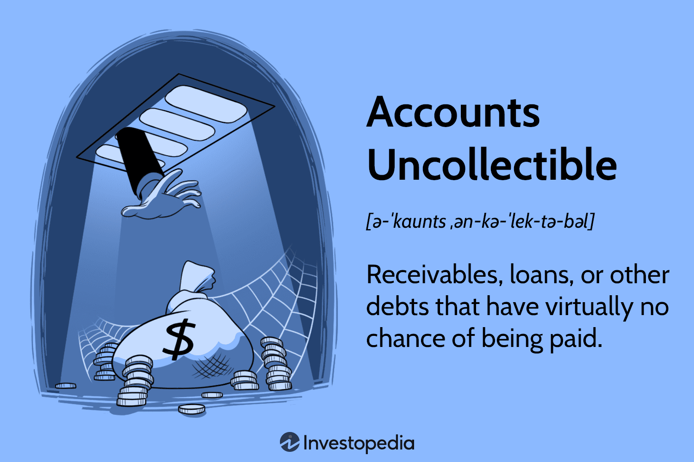

In the intricate world of finance, integrating accounting practices with modern technology is essential for achieving optimal performance. This article examines the intersection of accounting, bad debt management, and algorithmic trading, highlighting their combined influence on financial strategies. Addressing uncollectible accounts and utilizing algorithmic trading enhance financial decision-making and strategic planning. Understanding each component separately before considering their synergies is crucial for businesses seeking to improve financial stability. This journey through the complexities and nuances of these crucial financial concepts aims to provide valuable insights for businesses and financial professionals.

## Table of Contents



## Understanding Bad Debt

Bad debt refers to accounts receivable that a company is unable to collect, affecting its financial statements and overall financial stability. Such debts often arise due to customer insolvency, bankruptcy, or adverse economic conditions that impair a client's ability to fulfill their financial obligations. Recognizing and properly accounting for bad debts is essential as it reflects the true financial condition of a business, providing accurate insights to stakeholders and management.

Accurate accounting for bad debts ensures that financial statements are not overly optimistic, thus protecting the interests of investors, creditors, and management by presenting a realistic view of a company's financial health. Failure to account for bad debts accurately can lead to misleading financial reports, which might cause misguided business decisions and erode stakeholder confidence.

There are two primary methods to estimate bad debts: the direct write-off method and the allowance method.

1. **Direct Write-Off Method**: This method records bad debt only when an account is deemed uncollectible. The bad debt expense is recognized by directly reducing accounts receivable and recording an expense at the time of write-off. Although simple, this method may not comply with the matching principle under Generally Accepted Accounting Principles (GAAP), as it does not match expenses with the revenues they helped generate.

   For instance, in Python, the direct write-off can be illustrated as:
   ```python
   def direct_write_off(accounts_receivable, bad_debt):
       return accounts_receivable - bad_debt

   # Example usage
   accounts_receivable = 10000
   bad_debt = 2000
   updated_accounts_receivable = direct_write_off(accounts_receivable, bad_debt)
   print(f"Updated Accounts Receivable: ${updated_accounts_receivable}")
   ```

2. **Allowance Method**: This involves estimating bad debts in advance of identifying specific uncollectible accounts. A reserve, or "allowance for doubtful accounts," is established based on historical data, industry averages, or other relevant criteria. The estimated bad debt expense is recorded alongside a corresponding credit to the allowance for doubtful accounts, aligning with the accrual basis of accounting.

   The method can be highlighted with this formula to estimate bad debts:
$$
   \text{Bad Debt Expense} = \text{Credit Sales} \times \text{Estimated Bad Debt Percentage}

$$

   For example, if a company with $50,000 in credit sales anticipates 3% will become uncollectible, the bad debt expense is $1,500.

Each method has implications and is chosen based on the business's financial strategy, the nature of its transactions, and regulatory requirements. The direct write-off method suits businesses with minimal or sporadic bad debts but might not provide a precise view of a company's financial position for those with consistent credit sales. In contrast, the allowance method provides a more sophisticated and forward-looking approach, aligning with GAAP requirements by better matching expenses with corresponding revenues.

## Methods for Estimating Bad Debt

Estimating bad debt is a critical component of financial management, essential to ensuring that expenses align accurately with revenues. This process supports the maintenance of financial integrity and aids in portraying a realistic view of a company's financial position. There are two primary accounting methods for bad debt estimation: the allowance method and the direct write-off method. Each has distinct characteristics, benefits, and limitations.

The allowance method is a proactive approach that complies with Generally Accepted Accounting Principles (GAAP). It involves estimating uncollectible accounts to establish a reserve, often referred to as an allowance for doubtful accounts. This method anticipates bad debts before they occur, thereby aligning expenses with the period in which the related revenues are recognized. The allowance is typically calculated using either the percentage of sales method or the accounts receivable aging method:

1. **Percentage of Sales Method**: This method estimates bad debts as a percentage of credit sales. For instance, if a company has $1,000,000 in credit sales and determines that 3% may be uncollectible, it would record an expense of $30,000. The formula used is:
$$
   \text{Bad Debt Expense} = \text{Credit Sales} \times \text{Estimated Percentage of Uncollectible Accounts}

$$

2. **Accounts Receivable Aging Method**: This approach categorizes accounts receivable according to the length of time they have been outstanding. Different percentages are applied to different age categories, reflecting the increasing likelihood of default as accounts age. For example:

   ```
   Age Group      | Amount Outstanding | Estimated Uncollectible
   -------------------------------------------------------------------------------------------------
   0-30 days      | $400,000           | 1% = $4,000
   31-60 days     | $200,000           | 5% = $10,000
   61-90 days     | $100,000           | 10% = $10,000
   Over 90 days   | $50,000            | 20% = $10,000
   ```

   Based on this aging schedule, the total estimated allowance would be $34,000.

The direct write-off method differs fundamentally from the allowance method. It records bad debts only when specific accounts are identified as uncollectible. For example, if a particular customer defaults on a $5,000 debt, the company directly recognizes this amount as a bad debt expense. While this method is straightforward, it can lead to financial statement distortions as it does not match bad debt expenses with the corresponding revenue period. This discrepancy might delay recognition until a future period, potentially overstating assets and net income in the meantime.

Businesses must carefully choose between these methods based on their financial strategy. The allowance method, while more complex, provides more accurate financial statements by adhering to the matching principle. It is preferred by larger corporations with significant receivable balances. Conversely, the direct write-off method might be suitable for smaller businesses with fewer uncollectible accounts, due to its simplicity and reduced administrative burden.

Understanding these methods' implications allows businesses to make informed decisions about their financial reporting strategies. Assessing factors such as the [volume](/wiki/volume-trading-strategy) of credit sales, historical collection patterns, and the economic environment can guide the selection of a method that aligns with a company's overall financial policies and objectives.

## Expense Estimation in Finance

Accurate expense estimation plays a pivotal role in effective financial planning, serving as a foundation for both budgeting and forecasting. This accuracy ensures that businesses can set realistic financial targets, maintain [liquidity](/wiki/liquidity-risk-premium), and align their strategies with broader organizational goals.

Traditional methods of expense estimation, such as the percentage of sales method and accounts receivable aging, are foundational techniques used by businesses to project future costs. The percentage of sales method links expense forecasts directly to projected sales figures. By establishing a consistent percentage, often derived from historical data, businesses can estimate future expenses relative to anticipated sales revenue. For example, if a company typically incurs expenses worth 20% of its sales, a projected sales figure of $1,000,000 would predict expenses of $200,000.

Similarly, the accounts receivable aging method aids in estimating expenses related to potential bad debts. By categorizing outstanding receivables based on how long they have been overdue, businesses can apply different loss percentages to each category. This method provides a more nuanced approach to anticipating uncollectible debts, directly impacting the estimation of bad debt expenses.

Despite the reliability of these traditional methods, the integration of advanced technologies offers enhanced accuracy in expense estimation. Machine learning algorithms and [artificial intelligence](/wiki/ai-artificial-intelligence) tools can analyze vast datasets with greater precision and speed than manual methods. For instance, predictive modeling using [machine learning](/wiki/machine-learning) can identify patterns and trends in past expenditures to forecast future costs more accurately. Python, a widely-used programming language in the finance sector, provides libraries such as Pandas for data manipulation and Scikit-learn for implementing machine learning models, which can be instrumental in this regard.

Consider a Python implementation to predict future expenses using historical data. By employing linear regression—a fundamental machine learning model—we can predict future costs based on historical trends:

```python
import pandas as pd
from sklearn.model_selection import train_test_split
from sklearn.linear_model import LinearRegression
import numpy as np

# Sample dataset
data = {
    'Month': np.arange(1, 13),
    'Expense': [2000, 2200, 1900, 2500, 2700, 3000, 3200, 3100, 3300, 3600, 3900, 4200]
}

df = pd.DataFrame(data)

# Prepare the data
X = df[['Month']]
y = df['Expense']

# Split the dataset
X_train, X_test, y_train, y_test = train_test_split(X, y, test_size=0.2, random_state=0)

# Create and train the model
model = LinearRegression()
model.fit(X_train, y_train)

# Prediction for next month
next_month = np.array([[13]])
predicted_expense = model.predict(next_month)

print(f"Predicted expense for next month: ${predicted_expense[0]:.2f}")
```

By applying advanced analytical techniques, businesses not only enhance the accuracy of their expense predictions but also gain the agility to adjust financial strategies in real-time. This technological integration ensures that companies remain competitive by quickly responding to market changes and maintaining financial stability. As the financial landscape continues to evolve, leveraging both traditional and modern estimation methods will be crucial for businesses aiming to sustain growth and competitive advantage.

## The Role of Algorithmic Trading

Algorithmic trading leverages advanced computer algorithms to execute trades with remarkable speed and precision, providing significant advantages in today's fast-paced financial markets. These systems utilize predefined sets of instructions or rules to automatically [carry](/wiki/carry-trading) out trading decisions, minimizing human intervention and emotional biases. The speed and efficiency of [algorithmic trading](/wiki/algorithmic-trading) allow investors to capitalize on small price movements, increasing the potential for profit.

One of the primary advantages of algorithmic trading is its capacity to analyze vast datasets rapidly. This capability enables it not only to enhance trading efficiency but also to play a crucial role in expense estimation and bad debt management. By processing large volumes of market data in real-time, algorithmic trading systems can dynamically adjust strategies based on current market conditions, leading to more accurate financial estimations and risk assessments.

In the context of expense estimation, algorithms utilize historical data and statistical models to forecast future expenses, thus enabling companies to set more precise budgets and improve financial planning. Machine learning models can be applied to refine these predictions, learning from new data to enhance accuracy over time. For instance, using Python, a simple linear regression model could be implemented to predict future trading expenses based on historical data:

```python
import numpy as np
from sklearn.linear_model import LinearRegression

# Sample historical expense data
historical_expenses = np.array([1000, 1500, 1200, 1300, 1400]).reshape(-1, 1)
future_periods = np.array([6, 7, 8, 9, 10]).reshape(-1, 1)

# Building and fitting the linear regression model
model = LinearRegression().fit(historical_expenses, future_periods)

# Predict future expenses
predicted_expense = model.predict(np.array([[1500]]))  
print("Predicted future expense:", predicted_expense)
```

In addition to expense estimation, algorithmic trading contributes to bad debt management by evaluating creditworthiness and potential credit risks in real-time. Algorithms analyze historical credit data, payment patterns, and economic indicators to predict the likelihood of defaults, enabling financial institutions to make informed decisions on credit approvals and collections.

The benefits of algorithmic trading extend beyond efficiency and data processing. The automated nature of these systems reduces human errors, increases transaction accuracy, and ensures trades are executed at the best possible prices. Furthermore, algorithmic trading can facilitate increased market liquidity and stabilize prices by executing multiple trades simultaneously across different financial instruments and markets.

Overall, the application of algorithmic trading in managing financial operations reflects a strategic advantage for businesses. By integrating these technologies, companies can improve their financial stability, achieve better resource allocation, and respond agilely to market changes, thereby securing a competitive edge in the financial landscape.

## Integration of Financial Methods and Algo Trading

The integration of traditional financial accounting methods with algorithmic trading brings a transformative impact on bad debt management and financial estimations, optimizing strategic decisions for businesses. By harnessing real-time data processing and predictive models, organizations can achieve greater accuracy in identifying potential bad debts and improving expense forecasting.

Real-time data processing is a significant advantage in this integration. It enables continuous monitoring and analysis of financial information, allowing businesses to quickly respond to changes and trends. For instance, financial institutions can utilize advanced algorithms to analyze customer payment patterns and credit histories, identifying accounts that might turn into bad debts. This proactive approach helps in setting aside appropriate reserves, aligning more closely with the allowance method of accounting for bad debts, as outlined by Generally Accepted Accounting Principles (GAAP).

Moreover, predictive modeling enhances the precision of financial estimations. These models leverage machine learning techniques to process historical and current data, enabling businesses to forecast future trends with higher accuracy. For example, predictive models can analyze economic indicators and market conditions to estimate the likelihood of account delinquencies, thereby allowing for better-budgeted bad debt provisions.

In practice, various industries have successfully integrated these methodologies, achieving significant strategic advantages. The fintech industry, for instance, has notably benefited from the synergy between accounting methods and algorithmic trading. By applying algo trading to manage portfolios, fintech companies can adjust their strategies dynamically—responding to market shifts in real-time and avoiding potential losses due to bad debts or inaccurate expense forecasts.

Additionally, retail and e-commerce sectors employ data analytics and algorithmic trading to optimize inventory management and customer credit assessments. These sectors use algorithms to predict demand, manage stock efficiently, and assess customer credit risk, ultimately minimizing bad debts and enhancing financial performance.

This integration leads to improved financial stability and operational efficiency. By reducing the uncertainty associated with bad debts and refining expense estimation practices, businesses can allocate resources more effectively, maintain healthier cash flows, and ensure strategic goal alignment with market realities. Combining these advanced methodologies allows businesses not only to survive but thrive in competitive financial landscapes by ensuring robust financial management that supports sustainable growth.

## Conclusion

As financial landscapes evolve, combining accounting methods with algorithmic trading is crucial for gaining a competitive edge. The integration of these advanced techniques provides businesses with the tools necessary for efficient financial management and strategic planning. Effective management of bad debt, combined with precise expense estimation, strengthens financial health by ensuring accurate financial records and liquidity. These practices help optimize strategic opportunities by allowing businesses to adapt to changing market conditions and make informed decisions.

Businesses that integrate cutting-edge algorithms with traditional accounting practices can navigate market volatilities with increased confidence. By leveraging real-time data processing, predictive analytics, and automation, these organizations enhance their ability to respond to financial challenges swiftly and efficiently. This synergy not only enhances operational efficiency but also secures robust financial performances, minimizing risks associated with market fluctuations.

In conclusion, this article outlines a roadmap for incorporating advanced accounting and algorithmic trading techniques into financial strategies. By adopting these methodologies, businesses are encouraged to enhance their financial strategies, ensuring long-term stability and growth in an increasingly competitive marketplace. The pursuit of financial innovation will continue to be a decisive [factor](/wiki/factor-investing) in shaping successful business outcomes.

## References & Further Reading

- **Advances in Financial Machine Learning by Marcos Lopez de Prado**: This book offers a comprehensive guide to utilizing machine learning techniques within the financial sector. It provides detailed insights on implementing sophisticated models for asset pricing, risk management, and investment strategies, highlighting the intersection of advanced technology and financial practice.

- **Quantitative Trading: How to Build Your Own Algorithmic Trading Business by Ernest P. Chan**: Ernest Chan’s book serves as a practical guide for individuals looking to explore quantitative and algorithmic trading. It offers step-by-step instructions on how to establish an algorithmic trading business, focusing on the development, testing, and deployment of trading strategies. The book emphasizes the importance of a disciplined approach to trading that is backed by data-driven decisions.

- **Machine Learning for Asset Managers by Marcos Lopez de Prado**: In this book, Lopez de Prado explores the application of machine learning algorithms specifically for asset management. The book aims to equip asset managers with the necessary tools to enhance decision-making processes through data analysis and predictive modeling. It covers a range of topics, including portfolio construction and performance evaluation, providing a scientific framework for asset management.

- **Evidence-Based Technical Analysis by David Aronson**: Aronson’s book challenges traditional technical analysis approaches by advocating for evidence-based methodologies. He introduces statistical and quantitative methods to improve the reliability of technical signals and proposes a more empirical approach to analyzing market behavior. This resource is particularly useful for practitioners who seek to validate technical patterns through scientific means.

- **Machine Learning for Algorithmic Trading by Stefan Jansen**: Jansen's work is an extensive resource on how machine learning principles can be applied to algorithmic trading. The book covers various stages of the trading process, from data sourcing and strategy development to execution and management, using Python. It also provides numerous coding examples and practical implementations to demonstrate how machine learning frameworks can optimize trading performance.

These references collectively offer a wealth of knowledge on the integration of modern technology with traditional financial strategies, providing valuable insights for practitioners aiming to enhance their financial operations.

