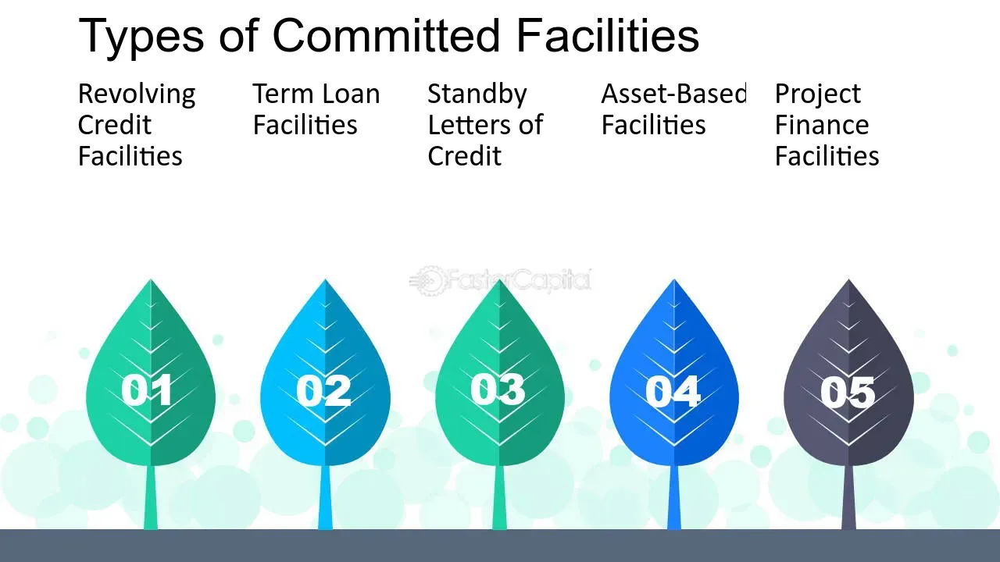

## Table of Contents

## What is an uncommitted facility?

An uncommitted facility is a type of loan agreement between a bank and a borrower where the bank is not obligated to lend money. The borrower can ask for money when they need it, but the bank can say no. This is different from a committed facility, where the bank must lend the money if the borrower asks for it.

Because the bank can say no, uncommitted facilities are less risky for the bank. This means they might offer a lower interest rate compared to a committed facility. For the borrower, it's good because they only have to pay interest on the money they actually use, but it's risky because they might need the money and not get it.

## How does an uncommitted facility differ from a committed facility?

An uncommitted facility is like a flexible loan where the bank doesn't have to give you money even if you ask for it. It's less certain for the borrower because the bank can say no whenever you need money. This type of facility is less risky for the bank, so they might charge a lower interest rate. The borrower only pays interest on the money they actually use, which can be good if they don't need much money at once.

A committed facility is different because the bank promises to give you money when you ask for it, as long as you follow the rules of the loan agreement. This makes it more certain for the borrower, but it's riskier for the bank because they have to lend the money no matter what. Because of this, the bank might charge a higher [interest rate](/wiki/interest-rate-trading-strategies) or a fee just for having the facility available, even if you don't use it.

## What are the typical uses of an uncommitted facility for businesses?

Businesses often use uncommitted facilities to manage their cash flow. This means they can borrow money quickly when they need it, like when they have to pay bills before they get paid by their customers. Because the bank doesn't have to lend the money, the business might not always get what they need, but it's useful for short-term needs. It's like having a backup plan for when cash is tight.

Another common use is for unexpected expenses. If a machine breaks down or there's a sudden need for more inventory, a business can ask for a loan from the uncommitted facility. Since they only pay interest on the money they actually use, it can be a cost-effective way to handle emergencies without a long-term commitment to a loan.

## What are the advantages of using an uncommitted facility?

An uncommitted facility gives businesses a lot of flexibility. They can ask for money when they need it, like when they have to pay bills before getting paid by customers. Because they only pay interest on the money they actually use, it can save them money compared to a big loan they might not need all at once. It's like having a safety net for when cash is tight, without the pressure of a long-term loan.

Another advantage is that it's good for handling unexpected costs. If a machine breaks or they need more inventory quickly, a business can ask for a loan from the uncommitted facility. Since the bank can say no, it's less certain, but it's still a useful tool for emergencies. It helps businesses stay ready for surprises without locking them into a big loan they might not need.

## What are the potential risks or disadvantages of an uncommitted facility?

One big risk with an uncommitted facility is that the bank can say no when you ask for money. This can be a problem if your business really needs the money to pay bills or buy things. If the bank says no, you might have to find money from somewhere else quickly, which can be hard and stressful.

Another disadvantage is that because the bank can say no, an uncommitted facility might not be the best choice for long-term planning. If you're thinking about big projects or investments, you need to know you can get the money when you need it. With an uncommitted facility, you can't be sure, so it's better for short-term needs rather than big plans.

## How is the interest rate determined for an uncommitted facility?

The interest rate for an uncommitted facility is usually set by the bank based on several things. They look at how risky it is to lend money to the business. If the business seems more likely to have trouble paying back the loan, the bank might charge a higher interest rate. The bank also thinks about what's happening in the economy and what other banks are charging for similar loans. This helps them decide on a fair rate that covers their risk but still makes the loan attractive to the business.

Another thing that can affect the interest rate is how much money the business wants to borrow and how often they plan to use the facility. If a business only needs a small amount of money now and then, the bank might offer a lower rate because it's less risky. But if the business wants to borrow a lot of money all the time, the bank might charge more to cover the higher risk. Overall, the interest rate is a balance between what the bank needs to feel safe and what the business can afford to pay.

## What documentation is required to set up an uncommitted facility?

To set up an uncommitted facility, a business usually needs to provide some basic documents to the bank. These include financial statements like balance sheets and income statements, which show the business's financial health. The bank also wants to see the business's tax returns to make sure everything is in order. Sometimes, the bank might ask for a business plan to understand how the business will use the money and how it plans to pay it back.

Besides these financial documents, the bank might need some legal papers. This could include the business's registration documents to prove it's a real company. They might also ask for any existing loan agreements to see if the business already owes money to other banks. All these documents help the bank decide if they want to offer an uncommitted facility and what terms to set.

## Can an uncommitted facility be converted into a committed facility?

Yes, an uncommitted facility can sometimes be converted into a committed facility, but it depends on the bank and the agreement you have with them. If you want to switch, you'll need to talk to your bank and ask if it's possible. The bank will look at your business's financial health and how you've used the uncommitted facility so far. If they think you're a good risk, they might agree to change it to a committed facility.

Changing from an uncommitted to a committed facility can be good for your business because it gives you more certainty. With a committed facility, the bank has to lend you the money when you need it, as long as you follow the rules. But, there might be some downsides. The bank might charge you a higher interest rate or a fee just for having the committed facility available, even if you don't use it. So, it's important to think about whether the benefits are worth the extra costs.

## How do banks assess the creditworthiness for granting an uncommitted facility?

Banks look at a lot of things to decide if a business is a good risk for an uncommitted facility. They start by checking the business's financial statements, like balance sheets and income statements. These documents show how much money the business makes and how much it owes. The bank also looks at the business's credit history to see if it has paid back loans on time before. If the business has a good track record, the bank might feel more comfortable lending money.

Besides financial documents, banks also consider the overall health of the business. They might ask for a business plan to understand how the business plans to use the money and how it will pay it back. The bank also looks at the economy and what's happening in the industry the business is in. If the economy is doing well and the industry is growing, the bank might be more willing to lend money. All these things help the bank decide if the business is a good risk for an uncommitted facility.

## What are the regulatory considerations for banks offering uncommitted facilities?

Banks have to follow rules when they offer uncommitted facilities. These rules come from government agencies that watch over banks to make sure they are lending money safely. The rules can be different depending on where the bank is located, but they usually focus on making sure the bank checks the business's ability to pay back the loan. Banks have to keep good records and report to these agencies about the loans they give out, including uncommitted facilities.

Another important rule is about how much risk the bank can take. Banks have to be careful not to lend too much money in a way that could hurt them if businesses can't pay it back. This means they have to look closely at each business's financial health before offering an uncommitted facility. The rules help make sure that banks are lending money in a way that is safe for both the bank and the business.

## How do uncommitted facilities impact a company's financial statements?

When a company uses an uncommitted facility, it can affect their financial statements in a few ways. If the company borrows money from the facility, it will show up as a short-term loan on the balance sheet. This means the company has more cash to use for its needs, but it also has more debt. The interest they pay on the borrowed money will show up on the income statement as an expense, which can lower the company's profit for that period.

Even if the company doesn't borrow any money, having an uncommitted facility can still have an impact. It might be listed in the notes to the financial statements as a potential source of funding. This tells people looking at the financial statements that the company has a way to get money quickly if it needs to. But because the bank can say no to lending money, it's not as certain as a committed facility, so it might not be seen as a strong sign of financial stability.

## What are some real-world examples of companies using uncommitted facilities effectively?

A small manufacturing company might use an uncommitted facility to buy raw materials when they get a big order. They don't have to borrow money all the time, just when they need it. This helps them keep costs down because they only pay interest on the money they use. If the bank says no to the loan, they might have to find another way to pay for the materials, but usually, it works out well for them.

Another example is a retail store that uses an uncommitted facility to stock up for the holiday season. They can borrow money to buy extra inventory without locking themselves into a long-term loan. This way, they can make more sales during the busy time and pay back the loan quickly. It's a good way for them to manage their cash flow without taking on too much risk.

## References & Further Reading

[1]: ["Advances in Financial Machine Learning"](https://www.amazon.com/Advances-Financial-Machine-Learning-Marcos/dp/1119482089) by Marcos Lopez de Prado

[2]: ["Machine Learning for Algorithmic Trading"](https://github.com/stefan-jansen/machine-learning-for-trading) by Stefan Jansen

[3]: ["Quantitative Trading: How to Build Your Own Algorithmic Trading Business"](https://www.amazon.com/Quantitative-Trading-Build-Algorithmic-Business/dp/1119800064) by Ernest P. Chan

[4]: ["Evidence-Based Technical Analysis: Applying the Scientific Method and Statistical Inference to Trading Signals"](https://www.amazon.com/Evidence-Based-Technical-Analysis-Scientific-Statistical/dp/0470008741) by David Aronson

[5]: Bergstra, J., Bardenet, R., Bengio, Y., & Kégl, B. (2011). ["Algorithms for Hyper-Parameter Optimization."](https://dl.acm.org/doi/10.5555/2986459.2986743) Advances in Neural Information Processing Systems 24.