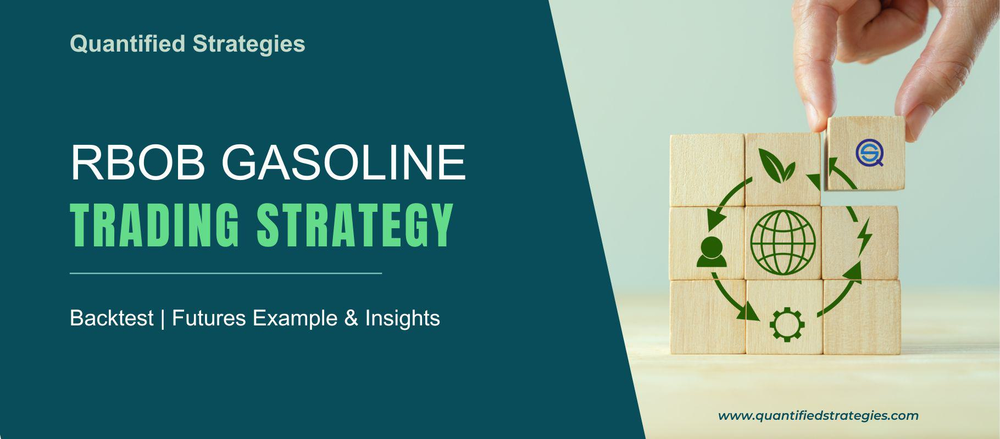

RBOB gasoline, short for Reformulated Blendstock for Oxygenate Blending, serves as a crucial component in the production of motor gasoline. It is specifically designed to be blended with oxygenates such as ethanol to create reformulated gasoline (RFG), intended to burn cleaner and reduce emissions. The formulation of RBOB is tailored to meet regulatory requirements for environmental protection, aiding significantly in decreasing air pollution.

Algorithmic trading has gained prominence in the fuel industry due to its capacity to enhance trading efficiency and precision. It involves the use of computer algorithms to automate the process of trading financial instruments based on pre-set conditions. In the context of the fuel market, algorithmic trading affords traders the ability to swiftly analyze large datasets, execute trades at optimal prices, and adapt to market fluctuations with minimal human intervention. This technological evolution has allowed market participants to react swiftly to pricing signals and market dynamics, conferring a competitive edge.

The RBOB gasoline blendstock market holds substantial sway in the global energy sector. As a critical component of gasoline production, its pricing and availability influence overall fuel prices, affecting economies worldwide. The market is influenced by factors such as crude oil prices, seasonal demand fluctuations, and geopolitical events. Consequently, understanding RBOB market dynamics is vital for stakeholders, including refiners, traders, and policy makers, as they navigate the complexities of global energy trade.

The focus of this article is to examine the transformative impact of algorithmic trading on the RBOB gasoline industry. By employing sophisticated trading algorithms, market participants can optimize their operations, enhance market liquidity, and achieve better alignment with supply and demand. Algorithms reduce the likelihood of human error and provide increased precision in executing trades, fostering a more efficient trading environment. As a result, they contribute to stabilizing prices and improving transparency, which benefits not only traders but also end consumers.

In summary, algorithmic trading is reshaping the RBOB gasoline market by fostering improved efficiency, accuracy, and transparency. This development holds profound implications for the broader fuel industry, as market participants increasingly rely on technological advancements to navigate the complexities of energy trading. Through this article, we aim to explore the multifaceted impact of algorithmic trading, highlighting its potential to revolutionize the RBOB gasoline market while considering the challenges and regulatory considerations that accompany this transformation.

## Table of Contents

## Understanding RBOB Gasoline Blendstock

RBOB, or Reformulated Blendstock for Oxygenate Blending, is a type of gasoline blendstock used primarily in the United States. It is designed to be blended with oxygenates such as ethanol to produce reformulated gasoline, a cleaner-burning fuel that reduces emissions of pollutants like volatile organic compounds (VOCs) and nitrogen oxides (NOx). This reduction is essential for meeting environmental regulations aimed at improving air quality, particularly in areas with high levels of smog.

### Production of RBOB

The production of RBOB involves refining [crude oil](/wiki/crude-oil) to remove undesirable components such as sulfur, which contribute to pollution. The refining process includes several stages, such as distillation, cracking, and reforming, to create a blendstock that meets strict environmental and performance standards. The key advantage of RBOB is its ability to improve air quality and public health by reducing emissions from vehicles when mixed with oxygenates like ethanol.

### Factors Affecting Pricing and Demand

The pricing and demand for RBOB gasoline are influenced by several factors. Seasonal changes impact demand, with higher consumption typically occurring in the summer months due to increased travel activities. Crude oil prices, geopolitical events, and natural disasters can also affect the supply and pricing of RBOB. Additionally, regulatory changes and advancements in vehicle fuel efficiency can influence demand.

### Key Market Players and Regions

The RBOB gasoline market is predominantly centered in the United States, with major refineries located along the Gulf Coast and the Eastern Seaboard. Key players include large oil and gas companies such as ExxonMobil, Chevron, and BP, which operate extensive refining and distribution networks. The infrastructure for blending, storage, and distribution is crucial in making RBOB readily available across various regions to meet consumer demand.

### Regulations and Standards

The production and trade of RBOB gasoline are governed by a framework of regulations designed to ensure environmental protection and fuel quality. The Environmental Protection Agency (EPA) in the United States enforces standards regarding the composition and emissions characteristics of reformulated gasoline. These regulations are part of broader efforts to reduce pollution and enhance energy security. Compliance with these standards requires refiners and traders to invest in technology and infrastructure capable of producing and distributing RBOB blendstock effectively. 

Collectively, these elements define the landscape of RBOB gasoline blendstock, highlighting its significance in promoting cleaner combustion and reducing emissions in the automotive sector.

## The Rise of Algorithmic Trading in the Fuel Industry

Algorithmic trading, often referred to as algo trading, is the use of computer programs and systems to execute trades in financial markets based on predefined criteria and algorithms. In commodity markets, including the fuel industry, these algorithms can be programmed to account for various factors such as price movements, market trends, and trading volumes, enabling rapid, data-driven decisions.

The adoption of [algorithmic trading](/wiki/algorithmic-trading) strategies in the fuel industry has seen a significant rise, as traders seek to capitalize on the speed and efficiency these systems offer. Traditional trading, which relies heavily on human judgment and manual processes, is often slow to react to dynamic market changes. In contrast, algorithmic trading can process vast amounts of data quickly and execute trades within milliseconds, thus offering a competitive edge.

Key technological advancements have propelled the integration of algo trading into the fuel market. Artificial Intelligence (AI) and [machine learning](/wiki/machine-learning) play a crucial role, allowing algorithms to learn and adapt from historical and real-time data. Machine learning models can identify patterns and signals in market data that are not readily apparent to human traders. Furthermore, advancements in computing power and data analytics have made it possible to process and analyze large sets of data with high accuracy and speed.

The advantages of algorithmic trading over traditional methods are manifold. One primary benefit is the efficiency in trade execution, which minimizes transaction costs through optimal timing and execution strategies. Algorithms also reduce human error, emotional biases, and physical limitations, leading to more consistent trading performances. Additionally, algo trading systems can operate around the clock without the need for breaks, ensuring continuous market engagement.

Despite its numerous advantages, algorithmic trading in the fuel sector comes with challenges and risks. One significant challenge is the reliance on data integrity; inaccurate data can lead to erroneous trading decisions. Furthermore, the complexity of algorithms can sometimes result in unexpected behavior in volatile markets, potentially exacerbating market fluctuations. There is also the risk associated with technological failures or breaches, which can disrupt trading operations. Lastly, the high speed and [volume](/wiki/volume-trading-strategy) of automatic trading can sometimes result in reduced market transparency and increased susceptibility to market manipulations.

In conclusion, while algorithmic trading brings considerable benefits to the fuel industry, including enhanced efficiency and reduced human error, it also introduces new challenges and risks that must be carefully managed to ensure market stability and integrity.

## Impact of Algo Trading on the RBOB Gasoline Market

Algorithmic trading has significantly influenced the RBOB gasoline market, particularly in pricing and [liquidity](/wiki/liquidity-risk-premium) dynamics. By utilizing high-speed computers and complex algorithms, traders can swiftly react to market conditions, which is essential in a volatile market characterized by frequent fluctuations in supply and demand.

Algorithms enhance market efficiency as they process vast amounts of historical and real-time data, spotting trends and predicting price movements faster than humanly possible. When encountering market [volatility](/wiki/volatility-trading-strategies), algorithms can deploy strategies like mean reversion and statistical [arbitrage](/wiki/arbitrage) to capitalize on short-term anomalies. For example, algorithms might exploit temporary inefficiencies by buying undervalued RBOB contracts and selling overvalued ones, maintaining liquidity in the process.

Case studies demonstrate the profound impact of algorithmic trading on the RBOB market. One notable instance involved a sudden geopolitical event that spiked crude oil and, consequently, RBOB prices. Algorithmic systems were able to quickly assimilate news and historical data, adjusting positions and stabilizing the market, whereas manual trading might have led to prolonged volatility.

Algo trading substantially improves market transparency by maintaining consistent market conditions and reducing the bid-ask spread, making it easier for smaller market participants to engage. As these systems enhance price discovery and minimize human error, they ensure that prices more accurately reflect the underlying supply and demand conditions, hence improving market efficiency.

For stakeholders, the rise of algorithmic trading presents both opportunities and challenges. Refiners and distributors benefit from more stable and predictable price environments, improving cost management and strategic planning. On the consumer side, increased market efficiency can translate into lower prices at the pump when decreased trading costs are passed down the supply chain.

Overall, the integration of algorithmic trading in the RBOB gasoline market has catalyzed a transformation towards more responsive markets, encouraging stakeholders to adapt to these technological advancements while solving challenges related to ethics, regulation, and the preservation of a competitive trading environment.

## Regulatory and Ethical Considerations

Regulatory frameworks governing algorithmic trading in commodity markets are essential for maintaining fair and competitive trade conditions. In the United States, the Commodity Futures Trading Commission (CFTC) plays a critical role in overseeing algorithmic trading activities. The CFTC implements regulations that require transparency and accountability among market participants, including implementing measures to manage the risks associated with high-frequency trading. These measures ensure market integrity and protect against abusive trading practices.

Ethically, the rise of automation in trading poses significant challenges for human traders. Automation can lead to job displacement as algorithms replace human decision-making in trade execution. This transition necessitates a focus on the ethical implications, emphasizing retraining and adaptation strategies for affected individuals. Moreover, the increased dependence on algorithmic decisions raises concerns about accountability, especially in cases of unintended market disruptions or losses.

Algorithmic trading systems hold the potential for market manipulation, a concern that regulators continuously address. Manipulative practices such as spoofing—intentionally placing large orders to create false market perceptions—necessitate robust surveillance mechanisms. Advanced algorithms are designed to detect and counteract such activities, maintaining market stability.

Regulators worldwide are adapting to the surge in algorithmic trading by updating existing legal frameworks to encompass new trading technologies. For instance, the European Union's Markets in Financial Instruments Directive II (MiFID II) establishes stringent requirements for algorithmic trading firms, including the need for risk controls and compliance measures. This evolving legal landscape aims to balance innovation with market safety.

In the context of the RBOB gasoline market, the equilibrium between fostering technological innovation and ensuring comprehensive regulation is crucial. On the one hand, algorithmic trading contributes to market efficiency and liquidity. On the other, it presents challenges that require vigilant regulatory oversight to prevent potential abuse or systemic risk.

Finally, regulators face the task of promoting a regulatory environment that accommodates cutting-edge trading technologies while safeguarding market fairness. This requires continuous dialogue between industry stakeholders and regulatory bodies to adapt to technological advancements without compromising market integrity.

## Future Trends in RBOB Gasoline Trading

Ongoing advancements in technology are poised to significantly reshape algorithmic trading in the RBOB gasoline market. One of the most prominent emerging trends is the integration of real-time data analytics. By harnessing large datasets and employing sophisticated analytical tools, traders can rapidly assimilate information about market conditions, supply chain logistics, and geopolitical events. This capability enables algorithms to make more informed and timely trading decisions. The use of machine learning algorithms can further enhance predictive accuracy by identifying complex patterns and trends that may not be immediately apparent to human traders.

Blockchain technology is another frontier transforming RBOB gasoline trading. The decentralized and immutable nature of blockchain can foster greater transparency and trust in the market by providing a verifiable and tamper-proof record of all transactions. This could reduce counterparty risk and improve the overall efficiency of trade settlements. Smart contracts, which automatically execute when predefined conditions are met, could further streamline operations by reducing the need for intermediaries and lowering transaction costs.

The potential for further automation in RBOB gasoline trading is considerable. As algorithms continue to evolve, they may take on increasingly complex functions, diminishing the role of human intervention. While this could lead to greater efficiency and faster trading cycles, it might also induce volatility if algorithms react uniformly to market signals. Market participants need to adapt to these changes by developing new skills and strategies to complement automated systems.

Human traders will still play a crucial role, albeit a transformed one. Their expertise will be essential in overseeing algorithmic operations, setting strategic objectives, and making judgment-based decisions that require nuanced understanding and intuition. As technology progresses, the collaboration between human insight and machine efficiency will likely be the cornerstone of successful trading strategies.

Looking ahead, the evolution of global energy markets is anticipated to be profound, driven by innovations in trading technologies. As markets become more interconnected and data-driven, the demand for more agile and responsive trading systems will grow. This evolution will not only affect how RBOB gasoline is traded but could also influence the broader landscape of energy procurement and distribution, fostering a more resilient and adaptable global energy market.

## Conclusion

Algorithmic trading has emerged as a pivotal force in the RBOB gasoline market, revolutionizing how trading is conducted and managed. This advancement has led to increased efficiency, reduced human error, and improved market responsiveness. As a blendstock for motor gasoline, RBOB gasoline plays a crucial role in the global energy market, and algorithmic trading has enabled market participants to navigate this complex environment with greater precision.

The adoption of algorithmic trading strategies is gaining [momentum](/wiki/momentum), driven by technological advancements such as AI and machine learning. These technologies provide traders with tools to analyze vast amounts of data, respond to market fluctuations, and manage supply-demand imbalances swiftly. The benefits extend to enhanced market transparency, liquidity, and operational cost reduction.

Ongoing developments in algorithmic trading continue to shape the fuel industry. Innovations like real-time data analytics and blockchain integration are potentially transformative, promising to further automate the market and alter the role of human traders. As the industry progresses, it is crucial for stakeholders to monitor these trends and their regulatory implications. The emergence of new trading technologies requires an adaptable regulatory framework to ensure fair and secure market operations while preventing manipulation.

Finding the right balance between innovation and market stability is essential. While technological advances offer numerous benefits, maintaining robust regulations ensures that these do not come at the expense of market fairness and human participant welfare. As the RBOB gasoline market and global energy trading continue to evolve, the interplay between technological innovation and regulatory vigilance will define the path forward, ensuring a stable and efficient trading environment.

## References & Further Reading

[1]: Bergstra, J., Bardenet, R., Bengio, Y., & Kégl, B. (2011). ["Algorithms for Hyper-Parameter Optimization."](https://dl.acm.org/doi/10.5555/2986459.2986743) Advances in Neural Information Processing Systems 24.

[2]: ["Advances in Financial Machine Learning"](https://www.amazon.com/Advances-Financial-Machine-Learning-Marcos/dp/1119482089) by Marcos Lopez de Prado

[3]: ["Evidence-Based Technical Analysis: Applying the Scientific Method and Statistical Inference to Trading Signals"](https://www.amazon.com/Evidence-Based-Technical-Analysis-Scientific-Statistical/dp/0470008741) by David Aronson

[4]: ["Machine Learning for Algorithmic Trading"](https://github.com/stefan-jansen/machine-learning-for-trading) by Stefan Jansen

[5]: ["Quantitative Trading: How to Build Your Own Algorithmic Trading Business"](https://www.amazon.com/Quantitative-Trading-Build-Algorithmic-Business/dp/1119800064) by Ernest P. Chan