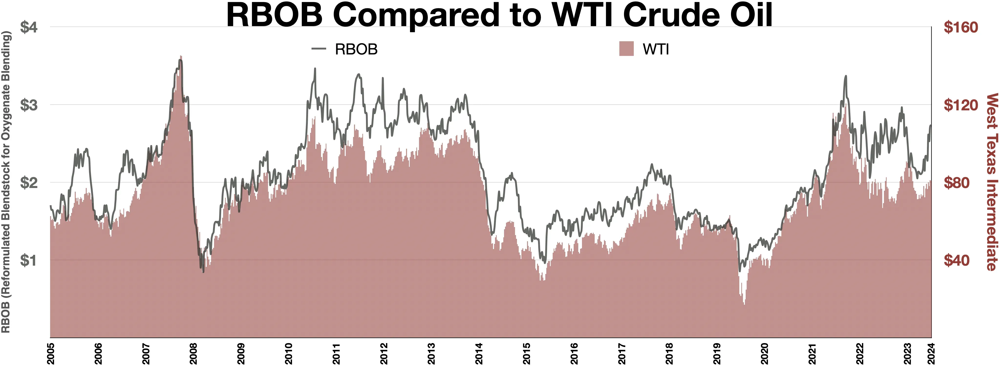

## Table of Contents

## What is reformulated gasoline blendstock for oxygenate blending (RBOB)?

Reformulated Gasoline Blendstock for Oxygenate Blending, or RBOB, is a type of gasoline that is made to be mixed with other substances called oxygenates. Oxygenates are added to help the gasoline burn cleaner and reduce pollution. RBOB is used in many places in the United States, especially during the summer months, to meet environmental regulations that aim to lower the amount of harmful emissions from cars.

RBOB itself does not contain any oxygenates. Instead, it is a base gasoline that is shipped to different locations where oxygenates like ethanol are added. This allows the final gasoline product to meet specific local requirements for cleaner air. By using RBOB, fuel suppliers can adjust the blend to comply with different environmental standards across various regions.

## How does RBOB differ from conventional gasoline?

RBOB, or Reformulated Gasoline Blendstock for Oxygenate Blending, is different from conventional gasoline because it is designed to be mixed with oxygenates like ethanol. Conventional gasoline already has these oxygenates added at the refinery, while RBOB is shipped without them. This means that RBOB can be customized at the point of distribution to meet specific local environmental regulations, which can vary from one area to another.

Another key difference is that RBOB is used to help reduce harmful emissions from vehicles. It is often used in regions with strict air quality standards, especially during the summer months when pollution can be worse. Conventional gasoline, on the other hand, might not meet these stricter standards and is used in areas with less stringent environmental requirements. By using RBOB, fuel suppliers can better control the final product's environmental impact.

## What are the primary components of RBOB?

RBOB is made up of several key parts that come together to form a base gasoline. The main part is hydrocarbons, which are the building blocks of gasoline. These hydrocarbons come from crude oil and are refined to make the liquid fuel we use in cars. RBOB also has additives mixed in to help the engine run smoothly and keep the fuel system clean. These additives can include detergents and corrosion inhibitors.

Another important part of RBOB is that it does not have oxygenates like ethanol added yet. Oxygenates are added later, at the place where the gasoline is going to be sold. This allows RBOB to be adjusted to meet different local rules about air quality. By not having oxygenates, RBOB can be shipped more easily and then customized to fit the needs of different areas.

## Why is RBOB used in certain regions?

RBOB is used in certain regions because it helps to make the air cleaner. Some places have strict rules about how much pollution cars can make, especially in the summer when the air can get really bad. RBOB is a special kind of gasoline that can be mixed with other things to make it burn cleaner. This helps to lower the amount of harmful stuff that comes out of car exhausts.

Another reason RBOB is used in certain regions is that it can be changed to fit different local rules. RBOB does not have the special cleaning stuff, called oxygenates, added to it yet. This means it can be shipped to different places and then mixed with the right amount of oxygenates to meet the local air quality standards. This makes it easier for fuel companies to follow the rules in different areas.

## What environmental benefits does RBOB provide?

RBOB helps make the air cleaner by reducing the harmful stuff that comes out of car exhausts. When RBOB is mixed with oxygenates like ethanol, it burns better and makes less pollution. This is really important in places where the air can get bad, especially during the summer. By using RBOB, these areas can meet strict rules about air quality and help people breathe easier.

Another way RBOB helps the environment is by being flexible. It can be shipped without oxygenates and then mixed with the right amount at the place where it will be sold. This means RBOB can be adjusted to fit different local rules about pollution. This flexibility helps fuel companies follow the law and keep the air clean in different regions.

## How is the production process of RBOB different from other gasoline types?

The production process of RBOB starts at the refinery, just like other types of gasoline. But, RBOB is made without adding oxygenates like ethanol. Instead, it is made as a base gasoline that can be shipped to different places. At the refinery, crude oil is turned into hydrocarbons, which are the main part of gasoline. Then, special additives like detergents and corrosion inhibitors are mixed in to help the engine run smoothly and keep the fuel system clean. This base gasoline, without oxygenates, is what we call RBOB.

The big difference with RBOB is that it is not finished at the refinery. It needs to be mixed with oxygenates later, at the place where it will be sold. This is different from other types of gasoline, which are usually finished at the refinery with oxygenates already added. By not adding oxygenates at the refinery, RBOB can be adjusted to meet different local rules about air quality. This makes it easier to ship and customize RBOB to fit the needs of different areas.

## What are the specific regulations governing the use of RBOB?

RBOB is used to help make the air cleaner, so there are special rules about when and where it can be used. In the United States, the Environmental Protection Agency (EPA) sets these rules. They say that RBOB must be used in certain areas during the summer months, from June 1 to September 15. This is because the air can get really bad in the summer, and RBOB helps to lower the pollution from cars.

The rules also say that RBOB must be mixed with the right amount of oxygenates, like ethanol, before it can be sold to people. This mixing happens at the place where the gasoline will be sold, not at the refinery. This way, RBOB can be changed to fit the different air quality rules in different areas. By following these rules, RBOB helps to keep the air cleaner and healthier for everyone.

## How does the blending of oxygenates affect the performance of RBOB?

When oxygenates like ethanol are added to RBOB, it changes how the gasoline works in a car's engine. The oxygenates help the gasoline burn better, which means the engine can run more smoothly. This can make the car perform better, especially in terms of power and how well it uses fuel. But, adding too much oxygenate can also make the engine run too hot or cause other problems, so it's important to get the mix just right.

The right mix of oxygenates in RBOB also helps to lower the amount of harmful stuff that comes out of the car's exhaust. This is good for the environment because it makes the air cleaner. But, if the blend is not done correctly, it might not help the environment as much as it could. So, the people who mix the oxygenates with RBOB need to follow the rules carefully to make sure the gasoline works well and helps keep the air clean.

## What are the challenges faced in the distribution and storage of RBOB?

One challenge in distributing and storing RBOB is that it needs to be kept separate from other types of gasoline until it is mixed with oxygenates. This means that special tanks and pipelines are needed to make sure RBOB stays pure. If it gets mixed with other gasoline by mistake, it might not meet the strict air quality rules it is supposed to follow. This can make things more complicated and expensive for the companies that handle and store RBOB.

Another challenge is that RBOB can be affected by temperature changes. It needs to be stored in a way that keeps it at the right temperature, or it might not work as well when it is mixed with oxygenates. This can be hard, especially in places where the weather changes a lot. Also, because RBOB is shipped without oxygenates, it has to be carefully mixed at the place where it will be sold. If this mixing is not done right, the final gasoline might not perform well or meet the environmental standards it needs to.

## How do seasonal changes impact the formulation of RBOB?

Seasonal changes affect how RBOB is made because different times of the year need different kinds of gasoline to keep the air clean. In the summer, when it's hot, the air can get really bad because cars make more pollution. So, RBOB used in the summer has to be mixed with more oxygenates like ethanol to help it burn better and make less pollution. This special summer blend helps meet the strict rules about air quality that are in place from June 1 to September 15.

In the winter, the air is not as much of a problem, so the rules about what kind of gasoline can be used are not as strict. RBOB used in the winter might not need as much oxygenate, or it might be mixed with a different kind of oxygenate. This flexibility helps make sure that the gasoline works well in colder weather and still helps the environment, but it does not have to follow the same strict rules as in the summer.

## What advanced technologies are used to monitor and ensure the quality of RBOB?

Advanced technologies help make sure RBOB is good quality and safe to use. One way is by using special machines that check the gasoline as it is being made at the refinery. These machines can tell if the RBOB has the right mix of hydrocarbons and additives. They also check to make sure there are no bad things in the gasoline that could hurt the engine or the environment. By using these machines, the people who make RBOB can fix any problems right away and keep the gasoline high quality.

Another important technology is used when RBOB is being moved and stored. Special sensors and tracking systems keep an eye on the RBOB to make sure it stays at the right temperature and does not get mixed with other kinds of gasoline. These systems can send alerts if something goes wrong, so the people in charge can take care of it quickly. This helps make sure that when RBOB gets to the place where it will be mixed with oxygenates, it is still in good shape and ready to be used to make cleaner-burning gasoline.

## What future trends and innovations are expected in the development of RBOB?

In the future, RBOB might be made even better to help the environment more. Scientists and engineers are working on new ways to make RBOB burn cleaner and make less pollution. They are looking at new kinds of oxygenates that could work even better than ethanol. They are also trying to find ways to make RBOB with less harmful stuff in it from the start. This could mean using new technology at the refinery to clean up the gasoline before it is even made into RBOB.

Another big trend is using more technology to keep track of RBOB. New sensors and computers could help watch the RBOB all the time, from when it is made to when it is mixed with oxygenates. This would make sure that RBOB stays good quality and safe to use. Also, new ways of moving and storing RBOB could make it easier to get it to the places where it is needed. All these changes could help make RBOB even better at keeping the air clean and helping the environment.

## References & Further Reading

[1]: Bergstra, J., Bardenet, R., Bengio, Y., & Kégl, B. (2011). ["Algorithms for Hyper-Parameter Optimization."](https://dl.acm.org/doi/10.5555/2986459.2986743) Advances in Neural Information Processing Systems 24.

[2]: ["Advances in Financial Machine Learning"](https://www.amazon.com/Advances-Financial-Machine-Learning-Marcos/dp/1119482089) by Marcos Lopez de Prado

[3]: ["Evidence-Based Technical Analysis: Applying the Scientific Method and Statistical Inference to Trading Signals"](https://www.amazon.com/Evidence-Based-Technical-Analysis-Scientific-Statistical/dp/0470008741) by David Aronson

[4]: ["Machine Learning for Algorithmic Trading"](https://github.com/stefan-jansen/machine-learning-for-trading) by Stefan Jansen

[5]: ["Quantitative Trading: How to Build Your Own Algorithmic Trading Business"](https://www.amazon.com/Quantitative-Trading-Build-Algorithmic-Business/dp/1119800064) by Ernest P. Chan