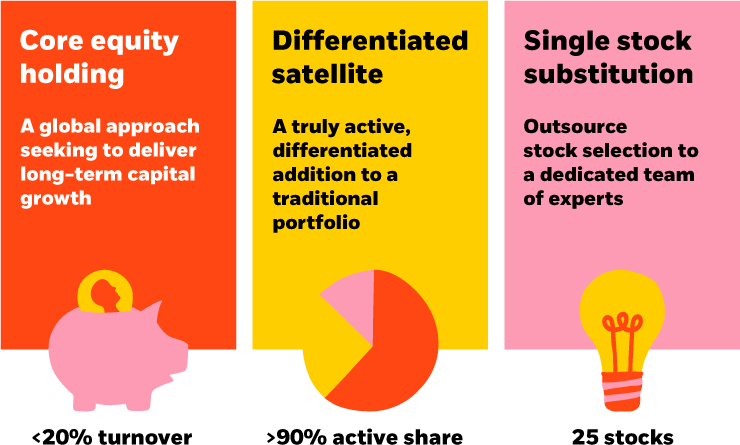

## Table of Contents

## What is unconstrained investing?

Unconstrained investing is a way of managing money where the investor can make choices without following strict rules. Instead of sticking to a certain type of investment or a specific part of the market, an unconstrained investor can pick from anything available. This approach lets them look for the best opportunities, no matter where they are found.

This kind of investing can be good because it gives the investor more freedom to find and take advantage of the best deals. However, it also comes with more risk. Without rules to follow, it can be harder to predict how the investments will do. It's important for investors to understand these risks and be ready for the ups and downs that can come with this approach.

## How does unconstrained investing differ from traditional investing?

Unconstrained investing and traditional investing are different in how they make choices about where to put money. Traditional investing usually follows a set of rules or a plan. For example, it might focus on a certain type of investment, like stocks or bonds, or stick to a specific part of the market, like big companies or small ones. These rules help guide the investor and can make it easier to predict how the investments will do over time.

On the other hand, unconstrained investing doesn't follow these strict rules. Instead, it lets the investor look everywhere for the best opportunities. This means they can choose from a wider range of investments, not limited by the usual categories. This freedom can lead to finding great deals that others might miss, but it also means the investor has to be ready for more ups and downs because there's less predictability.

In summary, traditional investing offers a more structured and predictable approach, while unconstrained investing offers more freedom and potential for higher returns, but with increased risk. Both methods have their own benefits and challenges, and the best choice depends on what the investor is comfortable with and their goals.

## What are the key principles of unconstrained investing?

Unconstrained investing is all about having the freedom to choose from any investment without following strict rules. This means an investor can look at stocks, bonds, real estate, or anything else that might offer a good opportunity. The main idea is to find the best deals wherever they are, not just in one specific area. This approach lets investors be more creative and flexible, trying to make the most money possible.

But with this freedom comes more risk. Because there are no set rules to follow, it can be harder to predict how the investments will do. Unconstrained investing requires a lot of research and a good understanding of the market. Investors need to be ready for the ups and downs that can come with this approach. It's important to balance the potential for high returns with the increased risk that comes from not having a set plan.

## What are the potential benefits of adopting an unconstrained investing approach?

Adopting an unconstrained investing approach can offer the chance to find great investment opportunities that might be missed by sticking to traditional methods. Because there are no strict rules to follow, investors can look everywhere for the best deals. This means they can choose from a wide range of investments, not just sticking to one type like stocks or bonds. This flexibility can lead to higher returns because the investor can take advantage of opportunities that others might not see.

However, this approach also comes with more risk. Without set rules, it can be harder to predict how the investments will do. This means investors need to do a lot of research and really understand the market. They also need to be ready for the ups and downs that can come with this kind of investing. But for those who are willing to take on the extra risk, the potential for higher returns can make it worth it.

## What are the risks associated with unconstrained investing?

Unconstrained investing can be risky because it doesn't follow strict rules. Without these rules, it's harder to predict how your investments will do. This means you might make more money, but you could also lose more. It's like trying to find your way without a map; you might discover a great shortcut, but you could also get lost.

Another risk is that you need to do a lot of research. Because you can choose from anything, you have to know a lot about different kinds of investments. If you don't understand what you're investing in, you could make bad choices. It's important to be ready for the ups and downs that come with this kind of investing. If you're not prepared, the extra risk might not be worth it.

## How can an investor start implementing an unconstrained investing strategy?

To start implementing an unconstrained investing strategy, an investor needs to first understand that this approach means they can choose from any type of investment without following strict rules. This means looking at stocks, bonds, real estate, or anything else that might offer a good opportunity. The key is to be open to finding the best deals wherever they are, not just in one specific area. This requires a lot of research and a good understanding of different markets and investment types.

Once an investor is ready to start, they should begin by setting clear goals for what they want to achieve with their investments. This could be making a certain amount of money, saving for retirement, or something else. With these goals in mind, the investor can then start looking for opportunities that match what they're trying to do. It's important to keep learning and staying updated on market trends and news, as this will help in making smart choices. Remember, with unconstrained investing, there's more freedom but also more risk, so being prepared for ups and downs is crucial.

## What types of assets are typically included in an unconstrained portfolio?

An unconstrained portfolio can include a wide range of assets because it doesn't follow strict rules. This means an investor can choose stocks, bonds, real estate, commodities, and even alternative investments like art or cryptocurrencies. The idea is to look everywhere for the best opportunities, not just in one type of investment.

Because there are no limits, an investor might decide to put money into a mix of these assets. For example, they might invest in tech stocks, government bonds, and some real estate properties all at the same time. This flexibility allows them to try to make the most money possible by taking advantage of different opportunities as they come up.

## How does unconstrained investing handle market volatility?

Unconstrained investing can handle market volatility by giving investors the freedom to move their money around quickly. Because they aren't stuck with certain types of investments, they can switch to different assets that might do better when the market is going up and down a lot. This means they can try to avoid big losses by moving their money to safer places or to investments that might go up when others are going down.

However, this approach also means more risk. Without rules to follow, it can be harder to predict how the investments will do during volatile times. Investors need to be ready for big ups and downs and do a lot of research to make smart choices. If they understand the market well, they can use the freedom of unconstrained investing to find good opportunities even when things are uncertain.

## What role does active management play in unconstrained investing?

Active management is really important in unconstrained investing. Because there are no strict rules to follow, the investor has to make a lot of choices about where to put their money. This means they need to be always looking at the market, trying to find the best opportunities. Active management helps them do this by letting them change their investments quickly when they see something good. They can move their money around to take advantage of new opportunities or to avoid risks.

This kind of investing can be good because it gives the investor the freedom to find the best deals. But it also means they have to be ready for more ups and downs. Active management helps them deal with this by letting them react to changes in the market. They need to do a lot of research and understand the market well to make smart choices. If they can do this, they might be able to make more money, but they also need to be ready for the extra risk that comes with it.

## Can you provide examples of successful unconstrained investment strategies?

One example of a successful unconstrained investment strategy is the approach taken by the hedge fund manager, Michael Burry. Before the 2008 financial crisis, Burry saw that many people were getting loans they couldn't pay back. He decided to bet against the housing market by buying credit default swaps, which are like insurance policies on loans. This was an unconventional move because most investors were still buying into the housing market. When the crisis hit, Burry's bet paid off big time, and he made a lot of money for his investors.

Another example is the investment strategy of Ray Dalio's Bridgewater Associates. They use a strategy called "risk parity," which means they try to balance the risk across different types of investments. Instead of just focusing on stocks or bonds, they look at everything from commodities to currencies. This approach lets them find opportunities that others might miss. By being flexible and looking at the whole market, Bridgewater has been able to make good returns for their investors, even during tough times.

## How does unconstrained investing adapt to different economic cycles?

Unconstrained investing can adapt to different economic cycles because it lets investors look at all kinds of investments, not just one type. When the economy is doing well, an investor might put more money into stocks or real estate, which can grow a lot during good times. But if the economy starts to slow down, they can quickly move their money into safer investments like bonds or even cash. This flexibility means they can try to make the most money when things are good and protect their money when things get tough.

Because there are no strict rules, investors need to keep a close eye on what's happening in the economy. They have to be ready to change their investments as things change. For example, if they see that interest rates are going up, they might move money into investments that do well when rates are high. Or if they think a recession is coming, they might put more money into things that are less risky. This active management helps them take advantage of different economic cycles and try to do well no matter what's happening in the market.

## What advanced techniques are used in managing an unconstrained investment portfolio?

In managing an unconstrained investment portfolio, one advanced technique is using quantitative analysis. This means using math and computers to look at a lot of data about different investments. By doing this, investors can find patterns and make predictions about which investments might do well. They can also use this data to figure out how much risk they are taking and try to balance that risk with the chance of making money. This helps them make smarter choices about where to put their money.

Another technique is called tactical asset allocation. This means changing the mix of investments based on what's happening in the market right now. Instead of sticking to a set plan, investors can move their money around quickly to take advantage of new opportunities or to avoid risks. For example, if they see that one part of the market is doing really well, they might put more money into that area. Or if they think a certain investment is about to go down, they can move their money out of it before it happens. This flexibility helps them try to make the most money possible, even when the market is changing a lot.

## References & Further Reading

[1]: ["Advances in Financial Machine Learning"](https://www.amazon.com/Advances-Financial-Machine-Learning-Marcos/dp/1119482089) by Marcos Lopez de Prado

[2]: ["Quantitative Trading: How to Build Your Own Algorithmic Trading Business"](https://www.amazon.com/Quantitative-Trading-Build-Algorithmic-Business/dp/1119800064) by Ernest P. Chan

[3]: ["Evidence-Based Technical Analysis: Applying the Scientific Method and Statistical Inference to Trading Signals"](https://www.amazon.com/Evidence-Based-Technical-Analysis-Scientific-Statistical/dp/0470008741) by David Aronson

[4]: ["Machine Learning for Algorithmic Trading"](https://github.com/stefan-jansen/machine-learning-for-trading) by Stefan Jansen

[5]: Bergstra, J., Bardenet, R., Bengio, Y., & Kégl, B. (2011). ["Algorithms for Hyper-Parameter Optimization."](https://dl.acm.org/doi/10.5555/2986459.2986743) Advances in Neural Information Processing Systems 24.