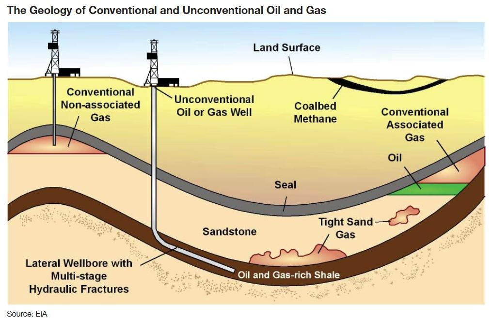

The intersection of unconventional oil extraction and algorithmic trading marks a significant evolution in the oil industry, reflecting a shift from traditional methods to technology-driven approaches. This evolution is shaped by advancements that have made previously inaccessible oil resources viable for extraction, as well as the increasing application of sophisticated trading techniques to oil markets.

Traditionally, oil extraction relied on methods involving drilling wells to tap into large, easily accessible reservoirs of crude oil. However, as these conventional sources became depleted and demand for energy continued to grow, the industry was compelled to innovate. This necessity gave rise to the exploration and extraction of unconventional oil sources, including oil sands, shale oil, and extra-heavy oil. Unconventional oil has reshaped the landscape of extraction by requiring new technologies and methods, such as hydraulic fracturing and horizontal drilling, to economically and efficiently access these resources. These unconventional sources now play an increasingly critical role in meeting the global energy demand and diversifying energy supplies.



Concurrently, the oil market has experienced a parallel transformation through the incorporation of algorithmic trading. This technique involves using algorithms—often driven by high-speed computing, complex mathematical models, and large datasets—to automate trading decisions. Algorithmic trading enhances the efficiency and speed of transactions, enabling traders to operate across multiple time zones and respond to market fluctuations in real-time. The oil market, characterized by its significant volatility due to geopolitical factors, supply-demand imbalances, and natural events, has benefited from the risk management and strategic advantages offered by algorithmic trading.

The convergence of unconventional oil extraction and algorithmic trading represents a fusion of engineering innovation and financial ingenuity. As unconventional oil becomes more prevalent, algorithmic trading strategies are evolving to incorporate the unique variables associated with these resources. This includes accommodating the price volatility stemming from the specific supply dynamics and environmental considerations linked to unconventional oil. The enhanced use of predictive analytics and machine learning further enriches trading strategies, enabling more accurate forecasting of oil price movements and contributing to more robust market stability.

In conclusion, the oil industry's progression from traditional methods to technologically sophisticated techniques underscores a broader trend of innovation in energy production and financial markets. This dynamic interplay between unconventional extraction technologies and algorithmic trading not only signals future developments within the industry but also highlights the continuous need for strategic adaptation among investors and industry players. These advancements promise to redefine how energy resources are harnessed and traded in a rapidly evolving global landscape.

## Table of Contents

## Unconventional Oil: An Overview

Unconventional oil refers to [crude oil](/wiki/crude-oil) resources that require advanced extraction techniques due to their atypical reservoirs and geochemical properties. Unlike conventional oil found in easily accessible underground reservoirs, unconventional oil is located in challenging geological formations or possesses a composition that complicates extraction and processing.

Unconventional oil holds substantial significance in the global energy landscape. With conventional oil resources facing depletion and geopolitical challenges affecting supply stability, unconventional oil provides an alternative source, potentially increasing energy security and market stability. This importance is underscored by increasing investment and technological focus aimed at harnessing these resources to meet growing energy demands.

### Types of Unconventional Oil

1. **Oil Sands**: Also known as tar sands, these consist of a mixture of sand, water, clay, and bitumen, a heavy black viscous oil. The extraction and processing of bitumen involve separating it from sand and upgrading it into synthetic crude oil through techniques like surface mining and in situ methods, such as Steam-Assisted Gravity Drainage (SAGD).

2. **Extra-Heavy Oil**: This type of crude oil is significantly denser and more viscous than conventional oil. It typically requires enhanced recovery methods to be extracted and needs to be mixed with lighter hydrocarbons to facilitate transport through pipelines.

3. **Shale Oil**: Extracted from shale formations, this oil requires hydraulic fracturing (fracking) and horizontal drilling to release oil trapped within the rock. Shale oil extraction has surged due to technological advances making it economically viable.

4. **Gas-to-Liquids (GTL)**: This process converts natural gas into liquid hydrocarbons, typically employing the Fischer-Tropsch synthesis. It helps monetize stranded gas reserves and provides cleaner-burning diesel fuels.

5. **Coal-to-Liquids (CTL)**: Similar in concept to GTL, this technology converts coal into liquid hydrocarbons using direct and indirect liquefaction techniques. The process can create synthetic fuels but is energy-intensive and associated with high carbon emissions.

6. **Biomass-to-Liquids (BTL)**: This involves converting biomass into liquid fuels, offering a renewable alternative that can integrate with existing transportation infrastructure. Technologies such as pyrolysis and gasification are employed in this conversion process.

### Technological Advancements

Technological innovations have been crucial in making unconventional oil extraction economically viable. For instance, the development of horizontal drilling and hydraulic fracturing has significantly boosted shale oil production. These methods maximize reservoir contact, enhancing oil recovery rates.

In oil sands, advancements in in situ extraction techniques, like SAGD, have reduced environmental disturbance and energy usage compared to traditional mining. Similarly, upgrading technologies, such as hydrocracking and coking, enable the conversion of heavy crude into lighter commodities, expanding market potential.

Furthermore, breakthroughs in GTL, CTL, and BTL technologies are making these processes more efficient and commercially competitive. Research into catalysts and process optimization continues to improve yield and reduce the environmental footprint, aligning with the increasing focus on sustainable energy practices.

These technological progressions, coupled with favorable economic conditions and policy support, continue to bolster the role of unconventional oil in satisfying global energy needs.

## Examples of Unconventional Oil Extraction Techniques

Unconventional oil extraction techniques have played a crucial role in expanding the accessible reserves of oil, challenging traditional oil extraction methods and reshaping the energy landscape. These techniques are primarily driven by technological innovations that allow for the economically viable extraction of oil from sources previously deemed too complex or expensive. Here, we explore three principal methods: hydraulic fracturing, directional drilling, and oil sands processing.

### Hydraulic Fracturing

Hydraulic fracturing, often referred to as "fracking," is a process used to extract oil and gas from shale rock formations deep within the Earth. The technique involves injecting a high-pressure fluid mixture into the rock to create and expand fissures, thereby allowing hydrocarbons to flow more freely to the wellbore. This method significantly enhances the permeability of the formation and enables the recovery of oil and gas resources that would otherwise remain trapped in low-permeability rocks.

The environmental impact of fracking has been a topic of considerable debate. Concerns primarily revolve around the potential for groundwater contamination due to the chemicals used in the fracturing fluid, as well as the significant volumes of water required. Furthermore, the release of methane, a potent greenhouse gas, during drilling and flowback operations poses additional environmental challenges. Addressing these issues involves careful regulation and the advancement of cleaner fracturing technologies.

### Directional Drilling

Directional drilling is a crucial technique that complements hydraulic fracturing, allowing for the extraction of oil from reserves that are not directly beneath the drilling rig. By steering the drill bit along a predetermined path, operators can access multiple wells from a single surface location, reducing the environmental footprint and surface disruption associated with traditional vertical drilling.

This technique becomes particularly advantageous when targeting reservoirs situated beneath environmentally sensitive areas or in offshore drilling operations. By using advanced sensors and real-time data analytics, directional drilling enables more precise geosteering, thereby enhancing the efficiency and success of oil extraction projects.

### Oil Sands Processing

Oil sands, also known as tar sands, are deposits of bitumen mixed with sand, clay, and water. Extracting oil from these deposits involves two primary techniques: surface mining and in-situ recovery.

Surface mining is applicable when deposits are near the surface and involves removing large sections of soil and overburden to access the bitumen-rich sands. The material is then transported to processing plants where bitumen is separated from sand through a series of processes, including hot water washing and flotation.

In-situ recovery is used for deeper deposits and involves injecting steam, solvents, or a combination of both to reduce the bitumen's viscosity, allowing it to flow to the wellbore. Steam-assisted gravity drainage (SAGD) is a common in-situ technique wherein pairs of horizontal wells are drilled, and steam is injected into the upper well to heat the bitumen, which then flows into the lower well and is pumped to the surface.

These extraction processes are energy-intensive and present environmental challenges, including greenhouse gas emissions and land disturbance. Continuous technological advancements aim to mitigate these impacts by improving the efficiency of extraction and reducing the associated environmental footprint. 

In summary, unconventional oil extraction techniques have revolutionized the oil industry by unlocking vast reserves previously inaccessible through traditional methods. These innovations, however, come with significant economic and environmental considerations that require ongoing research and regulation.

## Economic and Environmental Impacts of Unconventional Oil

Unconventional oil has emerged as a critical component of the global energy landscape, with significant economic and environmental implications. To better understand its impact, it is crucial to compare its cost-effectiveness with that of traditional oil, consider the market [volatility](/wiki/volatility-trading-strategies) it introduces, and examine the environmental challenges associated with its extraction and use.

### Cost-effectiveness of Unconventional Versus Conventional Oil

Unconventional oil sources, such as oil sands, shale oil, and extra-heavy oil, often entail higher production costs than conventional oil. Factors contributing to these increased costs include the complexity of extraction techniques, the need for advanced technology, and additional processing requirements. For instance, the extraction and upgrading of bitumen from oil sands necessitate substantial energy input and water usage, making it less cost-effective compared to conventional oil wells drilled in fields with easy access and abundant reserves.

Economic analyses often compare the breakeven prices required to make unconventional oil production profitable. While conventional oil might have a breakeven price as low as $20-$40 per barrel, unconventional sources like oil sands and shale oil typically require prices between $60 and $90 per barrel to justify the investment. 

### Market Volatility and Investment Implications

The volatility of the oil market is exacerbated by the reliance on unconventional oil sources. Factors such as geopolitical uncertainty, technological advances, and fluctuations in global demand can lead to significant price swings. Investors in unconventional oil typically face higher risks, as the profitability of these projects is highly sensitive to oil price changes. 

Algorithmic trading, which uses complex algorithms and data analytics to predict market trends, has become increasingly important in managing these risks. By analyzing vast amounts of market data, [algorithmic trading](/wiki/algorithmic-trading) can help investors optimize their portfolios, hedge against potential downturns, and capitalize on price fluctuations in the unconventional oil market.

### Environmental Challenges: Emissions, Land Use, and Pollution

The environmental challenges posed by unconventional oil extraction are significant. The extraction processes for oil sands and shale oil result in higher greenhouse gas emissions compared to conventional oil. According to studies, emissions from oil sands can be approximately 14% to 20% higher per barrel than those from conventional oil production. Moreover, unconventional extraction methods, like hydraulic fracturing, have raised concerns about water contamination and increased seismic activity.

Land use is another environmental consideration, as unconventional oil extraction often requires more extensive land disturbance, negatively impacting ecosystems. Oil sands extraction, for example, results in large tailing ponds that pose a long-term risk to the surrounding environment.

Pollution is also a pressing issue, with the potential for spills, leaks, and other forms of contamination affecting local communities and wildlife. Comprehensive environmental assessments and the implementation of stringent regulatory measures are critical to mitigating these negative impacts.

Overall, while unconventional oil plays a vital role in meeting global energy demands, its economic and environmental impacts present challenges that require careful management and innovative solutions.

## Algorithmic Trading in the Oil Market

Algorithmic trading refers to the use of computer algorithms to automate and execute trading orders at high speed and frequency, leveraging advanced mathematical models and quantitative techniques. In the oil market, algorithmic trading is employed to enhance the efficiency and effectiveness of trading strategies. The application of algorithmic trading in this sector revolves around the utilization of large data sets and sophisticated technologies to make informed, rapid trading decisions that can capitalize on market movements.

The integration of data and technology plays a crucial role in enhancing trading strategies within the oil markets. Traders utilize real-time data on oil prices, supply and demand dynamics, geopolitical events, and economic indicators to inform their algorithms. Machine learning and predictive analytics further bolster these strategies, enabling algorithms to identify patterns, predict price movements, and conduct trades with minimal human intervention. This reliance on vast and diverse data sources, combined with the capacity to process and act upon this data rapidly, is a hallmark of algorithmic trading in the oil market.

One of the primary benefits of algorithmic trading is efficiency. Algorithms can process and analyze data much faster than a human trader, allowing for the rapid execution of trades. This speed is critical in the highly volatile oil markets, where prices can fluctuate within seconds due to geopolitical developments or sudden changes in supply and demand. By minimizing lag time between data analysis and trade execution, algorithmic trading ensures more precise timing, which can lead to better trading outcomes.

Another advantage is risk management. Algorithmic trading systems often incorporate risk management protocols designed to mitigate potential losses. For example, an algorithm might automatically stop trading or adjust its strategy if it detects conditions that exceed predefined risk thresholds. This proactive approach to managing risk helps traders protect their investments while taking advantage of profitable opportunities.

Moreover, algorithmic trading allows for enhanced strategy flexibility. Traders can program algorithms to implement complex strategies that involve multiple markets or asset classes, adapting them quickly in response to market conditions. This flexibility contributes to better diversification and hedging strategies, which are essential in the oil market's dynamic environment.

In summary, the application of algorithmic trading in the oil markets not only increases operational efficiency and trading speed but also significantly improves risk management practices. Through the strategic use of data and cutting-edge technologies, participants in the oil markets can optimize their trading activities, making algorithmic trading an indispensable tool for contemporary market operations.

## The Intersection of Unconventional Oil and Algo Trading

The integration of algorithmic trading in the unconventional oil sector represents a significant evolution in how these markets operate. Algorithmic trading, or algo trading, employs complex algorithms to automate financial trading, harnessing data for rapid execution and decision-making. This approach can be strategically optimized for the nuanced nature of unconventional oil stocks and markets.

One of the key methods by which algo trading can be optimized for these markets is through predictive analytics and [machine learning](/wiki/machine-learning). These technologies allow traders to analyze historical and real-time data to forecast oil price movements more accurately. For example, machine learning models can be trained to identify patterns and trends in vast datasets encompassing market indicators, geopolitical events, and historical price data. Python, with its robust libraries like TensorFlow and Scikit-learn, is widely used for building such predictive models. A simple linear regression model for forecasting could use Python as follows:

```python
from sklearn.model_selection import train_test_split
from sklearn.linear_model import LinearRegression
import numpy as np

# Example data: historical prices and some market indicators
X = np.array([[indicator1, indicator2, ...], ...])  # Feature matrix
y = np.array([price1, price2, ...])                 # Target variable

# Split data into training and testing sets
X_train, X_test, y_train, y_test = train_test_split(X, y, test_size=0.2, random_state=42)

# Initialize and train the model
model = LinearRegression()
model.fit(X_train, y_train)

# Predict and calculate accuracy
predictions = model.predict(X_test)
accuracy = model.score(X_test, y_test)
```

Predictive analytics not only assists in forecasting but also enhances risk management strategies, enabling traders to mitigate potential losses under volatile conditions typical of unconventional oil markets.

There are several case studies where algo trading has been successfully integrated into the unconventional oil sector. One notable example is the utilization of machine learning algorithms by commodity trading firms to optimize their portfolios that include unconventional oil derivatives. These firms often employ [deep learning](/wiki/deep-learning) algorithms to predict market shifts and optimize their buy/sell strategies. The implementation of neural networks, which can process large volumes of unstructured data, provides enhanced predictive accuracy over traditional statistical methods.

Furthermore, firms have begun leveraging high-frequency trading algorithms to capitalize on the thin margins in unconventional oil trading. By executing a high [volume](/wiki/volume-trading-strategy) of trades at lightning speeds, traders can take advantage of minor price discrepancies that may not be visible in longer-term trading strategies. This method is enhanced by the use of big data analytics to track global supply and demand signals in real-time.

In conclusion, the harmonization of unconventional oil markets and algorithmic trading signifies notable advancements in trading efficiency and market intelligence. With continued technological innovation, such practices are likely to lead to more accurate pricing models and optimized trading strategies, despite the inherent challenges posed by the volatility and complexity of these markets.

## Future Trends and Innovations

Expected technological breakthroughs in oil extraction and trading continue to drive the oil industry's evolution. Innovations such as advanced drilling techniques, real-time data analytics, and machine learning are poised to significantly enhance the efficiency and sustainability of unconventional oil extraction. Enhanced oil recovery (EOR) methods, including chemical, thermal, and gas injection, are being refined to increase the yield from unconventional oil deposits. Additionally, digital twin technology, which creates a virtual model of the oil extraction process, allows operators to simulate and optimize operations, reducing costs and minimizing environmental impact.

The growing influence of Environmental, Social, and Governance ([ESG](/wiki/esg-investing)) criteria is reshaping the oil industry. ESG considerations are becoming critical as stakeholders demand more sustainable business practices. Companies are increasingly investing in technologies that reduce carbon emissions, improve resource efficiency, and protect biodiversity. The adoption of cleaner extraction methods and renewable energy sources within operations demonstrates a commitment to sustainability. Innovations such as carbon capture and storage (CCS) and the development of bio-based oils are gaining traction as part of this transition towards greener practices.

Potential policy shifts are likely to impact unconventional oil and trading practices substantially. Regulatory changes aimed at reducing greenhouse gas emissions could limit the expansion of unconventional oil projects. Governments may introduce carbon pricing, stricter emissions standards, and incentives for clean energy transitions. Policies promoting transparency and disclosure of ESG metrics are expected to pressure companies to adapt. Furthermore, geopolitical developments can affect oil markets by influencing supply, demand, and trade dynamics.

These trends suggest a future where technological innovation, sustainability criteria, and policy adaptation will continue to shape the unconventional oil industry, posing both challenges and opportunities for investors and industry participants. As the global energy landscape shifts, strategic adaptation becomes paramount in aligning with these evolving trends.

## Conclusion

Unconventional oil and algorithmic trading are two dynamic components reshaping the oil industry. Each offers unique opportunities and challenges that are intricately intertwined with global energy markets.

Unconventional oil extraction, encompassing methods such as hydraulic fracturing and oil sands processing, has significantly expanded the accessible reserves of oil. Advancements in technology have lowered production costs and increased efficiency, propelling unconventional oil into a critical position within the global energy mix. However, these extraction methods are not without challenges. They pose environmental risks, including emissions, land degradation, and water contamination, necessitating stringent regulations and innovations in sustainable practices.

Algorithmic trading, characterized by the use of computers and algorithms to execute trades at high speed and volume, plays a critical role in modern oil markets. It brings about greater efficiency, transparency, and [liquidity](/wiki/liquidity-risk-premium) but also introduces new complexities such as market volatility and flash crashes. Algorithms can swiftly analyze vast quantities of data to optimize trading strategies, enabling traders to make informed decisions that mitigate risks and maximize returns.

Innovation remains pivotal in shaping the future of the oil industry. Emerging technologies and data analytics can foster improvements in both unconventional oil extraction and trading strategies. For instance, machine learning and predictive analytics play increasingly crucial roles in forecasting oil price movements and enhancing the precision of trading algorithms. The ongoing development of more sustainable extraction techniques and advanced trading technologies will be vital in addressing the environmental and economic challenges posed by these sectors.

Strategic adaptation is essential for investors and industry players operating in this rapidly evolving landscape. The integration of innovative technologies and the alignment with environmental, social, and governance (ESG) criteria are expected to drive competitive advantage and compliance with regulatory requirements. Embracing these changes is crucial for capitalizing on market opportunities and fostering sustainability in the oil industry.

In summary, the convergence of unconventional oil extraction and algorithmic trading presents both opportunities for growth and challenges that require strategic navigation. As innovation continues to define the oil industry, stakeholders must be adaptable and forward-thinking to thrive in this complex environment.

## References & Further Reading

[1]: Gordon, D., & Gordon, E. (2016). ["The New Environment for Unconventional Oil and Gas Development."](https://scholar.google.com/citations?user=fN9rCzIAAAAJ&hl=en) The Environmental Forum, 33(2), 20-25.

[2]: Chima, C., & Valenti, B. (2013). ["Economic and Environmental Impact of Unconventional Oil and Natural Gas Development in the United States and Abroad."](https://thesimpsonsfanon.fandom.com/wiki/Gracie_Films_Lisa_Simpson_Television_in_the_Crossover) In: Unconventional Oil and Gas Resources: Exploitation and Development. PennWell Books.

[3]: Lopez de Prado, M. (2018). ["Advances in Financial Machine Learning."](https://www.amazon.com/Advances-Financial-Machine-Learning-Marcos/dp/1119482089) Wiley.

[4]: Aronson, D. R. (2006). ["Evidence-Based Technical Analysis: Applying the Scientific Method and Statistical Inference to Trading Signals."](https://www.amazon.com/Evidence-Based-Technical-Analysis-Scientific-Statistical/dp/0470008741) Wiley.

[5]: Jansen, S. (2020). ["Machine Learning for Algorithmic Trading: Predictive models for price swings, algorithmic trading, and more."](https://www.jmchemsci.com/?_action=article&au=1458933&_au=Lalandos,%20Jansen%20Loudwik) Packt Publishing.

[6]: Chan, E. P. (2008). ["Quantitative Trading: How to Build Your Own Algorithmic Trading Business."](https://github.com/ftvision/quant_trading_echan_book) Wiley.