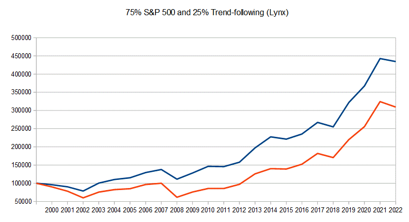

In today's rapidly evolving financial markets, algorithmic trading has emerged as a dominant force, fundamentally altering the landscape of investment strategies and execution. A vital element that underpins successful algorithmic trading is the concept of uncorrelated assets. These assets are characterized by their lack of synchronization in movement, which means their price changes do not mirror one another or the broader market trends systematically. This attribute is central to achieving diversification, a principle that seeks to spread investment risk across various assets to potentially enhance returns while minimizing exposure to volatility.

Uncorrelated assets not only help in diversifying portfolios but also offer a crucial advantage in risk management. By integrating assets that do not move in concert, investors and traders can construct portfolios with more stable performance over time. This stability is achieved because the downturns of some assets can be offset by the stability or upturns of others, thus mitigating significant portfolio drawdowns during turbulent market conditions.



The strategic implementation of uncorrelated assets within algorithmic trading involves identifying assets whose returns exhibit low or negative correlation coefficients, a statistical measure that ranges from -1 (indicating perfect negative correlation) to +1 (indicating perfect positive correlation). A correlation coefficient close to zero suggests that the asset pairs do not move in predictable relation to each other, making them ideal candidates for diversification.

This article examines the multifaceted benefits of leveraging uncorrelated assets in algorithmic trading, assessing practical strategies for deploying them effectively, and highlighting empirical findings from backtests and real-world case studies. These analyses show how traders and institutional investors harness the power of uncorrelated assets to refine their trading algorithms, manage risks better, and pursue enhanced returns across diverse market conditions.

## Table of Contents

## Understanding Correlation in Trading

The concept of correlation is essential in both trading and investing, serving as a foundational component for constructing robust trading strategies and diversified portfolios. Correlation is the statistical measure that describes the degree to which two assets move in relation to each other. This relationship is quantified using the correlation coefficient, which ranges from -1 to +1. A correlation coefficient of +1 indicates a perfect positive correlation, meaning the assets move in the same direction proportionally. Conversely, a coefficient of -1 signifies a perfect negative correlation, where the assets move in opposite directions. A correlation of 0 implies no linear relationship between the movements of the two assets.

In the context of portfolio management, incorporating assets with low or negative correlations is advantageous because it aids in risk mitigation and contributes to more stable portfolio returns. When assets are uncorrelated or negatively correlated, the movements of one asset may counterbalance the movements of another, thus smoothing out potential volatility in the overall portfolio. This balance becomes particularly valuable during periods of market stress, where the negative impact on one asset might be offset by the positive or neutral performance of another.

For practical analysis, consider calculating the correlation coefficient using Python, which provides a straightforward method via the `numpy` library:

```python
import numpy as np

# Assume price data for two assets
asset_1 = np.array([100, 102, 104, 103, 105])
asset_2 = np.array([110, 112, 113, 111, 114])

# Calculate correlation coefficient
correlation_matrix = np.corrcoef(asset_1, asset_2)
correlation_coefficient = correlation_matrix[0, 1]

print("Correlation Coefficient:", correlation_coefficient)
```

This calculation helps traders and investors quantitatively assess how the inclusion of different assets can impact the variance of portfolio returns, thereby enabling more informed and strategic decision-making. By understanding and applying the concept of correlation, traders can better position their portfolios to withstand market fluctuations and pursue consistent, long-term growth.

## What Are Uncorrelated Assets?

Uncorrelated assets are financial instruments that exhibit little to no correlation in their price movements relative to each other. In quantitative terms, correlation measures the degree to which two securities move in relation to one another. It is expressed by the correlation coefficient, which ranges from -1 to +1. A correlation coefficient of 1 implies a perfect positive correlation, meaning the assets move in exactly the same direction. Conversely, a coefficient of -1 indicates a perfect negative correlation, where the assets move in exactly opposite directions. Uncorrelated assets typically have a correlation coefficient close to zero, indicating that their price movements are largely independent of each other.

The primary advantage of incorporating uncorrelated assets into a portfolio is the benefit of diversification. Diversification aims to spread investment risk across a variety of assets to reduce the impact of any single asset's adverse performance on the overall portfolio. When assets are uncorrelated, the likelihood that they will all move negatively in response to a market event is reduced, thus lowering overall portfolio risk.

During periods of market stress or downturns, uncorrelated assets can serve as a buffer. While correlated assets might collectively lose value, uncorrelated assets may maintain their value or even appreciate, depending on their individual characteristics and market conditions. This buffering effect can be instrumental in preserving capital and stabilizing portfolio returns during volatile market phases.

Examples of uncorrelated assets span various asset classes, including:

- **Commodities**: Certain commodities do not always move in tandem with equity markets. For example, precious metals like gold often have a low correlation with stocks, making them a popular choice for diversification.

- **Bonds**: Government and high-quality corporate bonds often exhibit lower correlation with equities, especially during financial crises when flight-to-quality behavior is observed.

- **Currencies**: Foreign exchange investments can offer diversification benefits. Currency movements are driven by different economic factors compared to stocks or bonds, which can result in uncorrelated performance.

- **Alternative Investments**: Assets like real estate, hedge funds, or private equity might not correlate closely with traditional stock and bond markets, providing effective diversification.

To quantify the correlation between two assets, one can use historical price data to calculate the correlation coefficient. In Python, this can be achieved using libraries like Pandas:

```python
import pandas as pd

# Assume df is a DataFrame containing historical prices of two assets
correlation_coefficient = df['asset1'].corr(df['asset2'])
print("Correlation Coefficient:", correlation_coefficient)
```

In conclusion, identifying and incorporating uncorrelated assets into a trading strategy or investment portfolio can significantly mitigate risk and potentially enhance returns over the long term.

## The Power of Combining Uncorrelated Assets in Algo Trading

Integrating uncorrelated assets into [algorithmic trading](/wiki/algorithmic-trading) strategies is a robust method to potentially enhance portfolio performance by reducing the overall risk and increasing return stability. The primary advantage of this integration is that it allows traders to achieve smoother equity curves and reduced drawdowns. This is achieved by ensuring that the assets or strategies employed do not all react identically to market conditions. 

To illustrate the efficacy of combining uncorrelated assets, consider Ray Dalio's All-Weather Portfolio, a well-known example rooted in the principles of diversification. The All-Weather Portfolio is constructed to perform well under various economic conditions by balancing asset classes that typically behave differently over time. This portfolio includes a mix of equities, bonds, commodities, and other financial instruments in specific proportions, exemplifying how uncorrelated assets can stabilize returns during market fluctuations.

Meb Faber's Trend-Following Models offer another exemplary strategy leveraging uncorrelated assets. Faber's models focus on identifying and capturing trends across different asset classes, utilizing strategies like moving averages to guide buying and selling decisions. These models benefit from the inherent uncorrelated nature of the underlying assets, as they specialize in capturing returns from assets trending in opposing directions at different times. This naturally contributes to diversification and mitigates potential losses from isolated market downturns within specific sectors or asset classes.

In practical terms, implementing uncorrelated assets might involve creating a diversified basket of financial instruments wherein their price movements do not exhibit a high correlation with one another. This concept can be encapsulated using the Pearson correlation coefficient formula:

$$
\rho_{xy} = \frac{\text{cov}(X, Y)}{\sigma_X \sigma_Y}
$$

where $\text{cov}(X, Y)$ is the covariance of the asset returns $X$ and $Y$, and $\sigma_X$ and $\sigma_Y$ are the standard deviations of the returns of $X$ and $Y$ respectively. An ideal combination would involve assets where $\rho_{xy}$ is close to zero, signifying little to no linear relationship between their returns.

For algorithmic traders, the implementation of strategies based on uncorrelated assets could be done using programming languages like Python. A simplified Python code snippet to calculate the correlation between two asset price series could look like this:

```python
import numpy as np

# Example price data for two assets
price_series_asset1 = np.array([100, 102, 101, 105, 107])
price_series_asset2 = np.array([200, 198, 202, 201, 199])

# Calculating returns
returns_asset1 = np.diff(price_series_asset1) / price_series_asset1[:-1]
returns_asset2 = np.diff(price_series_asset2) / price_series_asset2[:-1]

# Calculating correlation
correlation = np.corrcoef(returns_asset1, returns_asset2)[0, 1]
print(f"Correlation between asset1 and asset2: {correlation}")
```

This calculation assists in constructing a portfolio that leverages assets with low or negative correlations, thus potentially reducing risk and enhancing the robustness of the trading strategy.

In conclusion, combining uncorrelated assets is a critical component of sophisticated algorithmic trading models, enabling not just risk diversification but also the potential for more consistent positive returns across varying market conditions.

## Types of Uncorrelated Trading Strategies

Mean reversion and [trend following](/wiki/trend-following) are two fundamental strategies that often exhibit uncorrelated characteristics in algorithmic trading. Mean reversion hinges on the assumption that asset prices will revert to their historical average over time. Traders utilizing this strategy typically identify assets that have deviated significantly from their average price and position accordingly, expecting a price reversal.

Trend following, on the other hand, capitalizes on the [momentum](/wiki/momentum) of a market. Traders in this strategy aim to enter trades once a trend is established and continue until it shows signs of reversal. This approach can often be quantified using indicators such as moving averages or the Average Directional Index (ADX). These distinct methodologies—mean reversion seeking to exploit short-term mispricings and trend following capturing sustained price movements—provide diversification by typically performing well under different market conditions.

Breakout and momentum strategies also contribute to the diversification of uncorrelated trading strategies. Breakout strategies focus on significant price movements that occur when an asset price breaks through a defined support or resistance level. This strategy assumes that once the [breakout](/wiki/breakout-trading) occurs, the price will continue in that direction, often resulting in substantial profits. Momentum strategies are similar, relying on the strength and persistence of price movements, and leverage metrics like the Relative Strength Index (RSI) to gauge price acceleration.

These diverse strategies can be implemented programmatically to enhance portfolio diversification. For instance, a simple Python code for a moving average crossover—a common trend-following strategy—might look as follows:

```python
import numpy as np
import pandas as pd

def moving_average_crossover(df, short_window=40, long_window=100):
    signals = pd.DataFrame(index=df.index)
    signals['Signal'] = 0.0

    signals['Short_MA'] = df['Close'].rolling(window=short_window, min_periods=1, center=False).mean()
    signals['Long_MA'] = df['Close'].rolling(window=long_window, min_periods=1, center=False).mean()

    signals['Signal'][short_window:] = np.where(signals['Short_MA'][short_window:] > signals['Long_MA'][short_window:], 1.0, 0.0)
    signals['Position'] = signals['Signal'].diff()

    return signals
```

This simple script illustrates the creation of signals based on the crossover of short-term and long-term moving averages, allowing a trader to identify potential trend-following opportunities.

The incorporation of uncorrelated strategies such as mean reversion, trend following, breakout, and momentum strategies into a trading algorithm enhances diversification. Each strategy's independent reaction to differing market conditions reduces overall portfolio [volatility](/wiki/volatility-trading-strategies) and increases the probability of sustained returns, even during challenging market scenarios.

## Practical Implementation and Backtesting

The practical implementation of using uncorrelated assets in algorithmic trading involves developing well-designed trading strategies, coding these strategies into algorithms, and performing thorough [backtesting](/wiki/backtesting) to evaluate their effectiveness. Each step is crucial in ensuring that the strategies are robust, viable, and capable of withstanding various market conditions.

### Strategy Design

A sound strategy starts with identifying uncorrelated assets that can be part of a trading portfolio. Traders often use statistical techniques to measure the degree of correlation between asset pairs, selecting those that exhibit low or negative correlation. The design process also involves defining entry and [exit](/wiki/exit-strategy) rules, position sizing, and risk management principles.

### Coding Algorithms

Once the strategy is defined, it is translated into a programmable format. Python is a widely used language for algorithmic trading due to its rich ecosystem of libraries such as NumPy, pandas, and scikit-learn. These libraries facilitate data analysis and [machine learning](/wiki/machine-learning), essential components in algorithm development. A basic template of a trading algorithm might look like this:

```python
import pandas as pd

def backtest_strategy(data, strategy):
    # data: pandas DataFrame with pricing information
    # strategy: function that applies trading rules and returns signals

    data['signals'] = strategy(data)
    data['returns'] = data['price'].pct_change()

    # Calculating strategy returns
    data['strategy_returns'] = data['signals'].shift(1) * data['returns']
    total_return = (data['strategy_returns'] + 1).prod() - 1
    return total_return

def example_strategy(data):
    # Implement a simple crossover strategy
    data['short_mavg'] = data['price'].rolling(window=10).mean()
    data['long_mavg'] = data['price'].rolling(window=30).mean()
    signals = data['short_mavg'] > data['long_mavg']
    return signals.astype(int)

# Example usage
price_data = pd.DataFrame({'price': [/* your price data here */]})
print(backtest_strategy(price_data, example_strategy))
```

### Backtesting

Backtesting is a critical step that involves testing the algorithm against historical data to evaluate its performance. The goal is to simulate how the strategy would have performed in real market conditions, helping traders refine their strategies before live deployment. Backtesting can reveal the strategy's profitability, risk, and drawdown [statistics](/wiki/bayesian-statistics).

Metrics such as the Sharpe ratio, maximum drawdown, and volatility are commonly assessed. The Sharpe ratio measures risk-adjusted returns, calculated as:

$$
\text{Sharpe Ratio} = \frac{E[R_p - R_f]}{\sigma_p}
$$

where $R_p$ is the portfolio return, $R_f$ is the risk-free rate, and $\sigma_p$ is the standard deviation of portfolio returns.

### Real-World Example

A real-world example of successfully implementing uncorrelated assets in algo trading is the use of pairs trading. In such strategies, traders identify two assets that are historically correlated and trade them based on the belief that their prices will converge. When the correlation weakens, it creates [arbitrage](/wiki/arbitrage) opportunities. Through backtesting, traders can identify periods when this strategy yields high returns, thus validating its effectiveness.

### Conclusion

Implementing uncorrelated assets in algorithmic trading requires a rigorous approach to strategy design, coding, and backtesting. By carefully assessing and refining these strategies, traders can enhance their odds of success in the dynamic and often unpredictable financial markets.

## Challenges and Considerations

Implementing a portfolio that comprises uncorrelated assets is a strategic endeavor fraught with challenges. Central among these is the difficulty of identifying truly uncorrelated assets. Assets that appear to exhibit low or negative correlation during certain periods may exhibit increased correlation during times of market stress or economic instability, undermining diversification efforts. This phenomenon, known as "correlation breakdown," necessitates a cautious approach to asset selection in algorithmic trading.

The dynamic nature of financial markets requires traders to continuously measure and monitor correlations. The correlation coefficient, typically calculated daily or weekly, provides a snapshot of how assets relate at a given time. However, to capture the evolving market conditions, more sophisticated techniques like moving window correlation analysis can be employed. This involves recalculating correlations across rolling time frames to spot trend changes and adjust strategies accordingly.

```python
import numpy as np
import pandas as pd

# Example of calculating moving window correlations
data = pd.read_csv('asset_prices.csv')  # assuming this file contains historical price data
rolling_window = 30  # 30-day rolling window

# Calculate returns
returns = data.pct_change().dropna()

# Calculate rolling correlations
rolling_corr = returns['Asset1'].rolling(window=rolling_window).corr(returns['Asset2'])

print(rolling_corr.tail())
```

Moreover, there is a pressing need for continuous learning and adaptation in strategy development. This involves regular review and refinement of algorithms to ensure they remain aligned with the current market environment. The use of machine learning techniques can facilitate adaptive strategies, allowing for real-time adjustments based on data-driven insights.

A critical challenge in strategy development is avoiding overfitting—where a model is tailored too closely to historical data, capturing noise rather than signal. Overfitted models may perform excellently in backtests yet fail miserably under live market conditions. To mitigate this risk, it is beneficial to use techniques such as out-of-sample testing and cross-validation during the development phase. Additionally, incorporating a robust risk management framework ensures that strategies can endure unanticipated market movements.

In conclusion, the effective implementation of uncorrelated asset portfolios involves a delicate balance between finding appropriate assets, adapting to market dynamics, and safeguarding against overfitting. Traders who embrace continuous measurement and learning are better positioned to harness the potential advantages of uncorrelated assets, enhancing both the resilience and performance of their trading strategies.

## Conclusion

Incorporating uncorrelated assets into algorithmic trading presents a sophisticated method for both managing risk and enhancing returns. The principal advantage lies in the ability to minimize portfolio volatility by spreading exposure across assets that do not move in sync with each other. As financial markets exhibit inherent dynamism and unpredictability, maintaining flexibility through diversified uncorrelated asset allocation remains paramount for traders seeking to mitigate potential losses.

The modern trading environment, characterized by rapid technology-driven changes, demands strategic approaches to portfolio management. Uncorrelated assets serve this purpose by providing a cushion against market volatility, thereby smoothing the equity curve and reducing the likelihood of significant drawdowns. This becomes increasingly relevant in times of market distress, where correlation between traditionally independent asset classes may increase, posing an additional challenge.

For traders and investors pursuing long-term success, the understanding and effective implementation of uncorrelated strategies are indispensable. These strategies involve constant monitoring and reassessment of asset correlations to ensure the portfolio remains balanced and resilient against market shifts. Moreover, strategic use of algorithmic trading platforms enables more precise execution of trades involving uncorrelated assets, thus optimizing returns.

In sum, the judicious incorporation of uncorrelated assets within algorithmic trading frameworks not only shields traders and investors from undue risk but also positions them to seize opportunities for enhanced financial performance. As markets continue to evolve, leveraging these strategies will remain a critical component of a successful trading arsenal.

## FAQ

### Why are uncorrelated assets important in algorithmic trading?

Uncorrelated assets are crucial in algorithmic trading because they enhance portfolio diversification. When assets do not move in tandem, the volatility of the overall portfolio is reduced, allowing for more stable returns. This means that the adverse movements of one asset are likely to be offset by neutral or positive movements of another, balancing the portfolio's performance. In quantitative terms, if asset A and asset B have near-zero correlation, variations in their performance will not compound each other, thus mitigating risk.

### How do uncorrelated assets help in mitigating risk?

Uncorrelated assets mitigate risk by reducing the overall volatility of a portfolio. In statistical terms, the standard deviation of returns, often used as a risk measure, can be lowered by including assets with low correlation. The mathematical foundation for this lies in the formula for the variance of a two-asset portfolio:

$$
\sigma_p^2 = w_1^2 \sigma_1^2 + w_2^2 \sigma_2^2 + 2w_1w_2\rho\sigma_1\sigma_2
$$

where $\sigma_p^2$ is the portfolio variance, $\sigma_1$ and $\sigma_2$ are the standard deviations of assets 1 and 2, $w_1$ and $w_2$ are the weights of the two assets in the portfolio, and $\rho$ is the correlation coefficient between the assets. A lower or negative $\rho$ reduces the covariance term, thus lowering the overall variance and associated risk.

### Can implementing uncorrelated strategies lead to higher returns?

While uncorrelated strategies themselves are not a guarantee for higher returns, they can improve the risk-adjusted returns, which is the return per unit of risk taken. By smoothing out the equity curve and reducing drawdowns, investors can achieve a higher Sharpe Ratio—a measure of risk-adjusted return. Over time, this allows for better compounding of returns, as the portfolio is less likely to experience significant losses that erode capital. In algorithmic trading, combining uncorrelated strategies allows traders to exploit various market conditions, potentially leading to superior returns compared to a correlated portfolio.

### What are challenges in finding and implementing uncorrelated assets?

One of the main challenges of finding uncorrelated assets is that correlation between assets can change over time, particularly during periods of market stress when correlations tend to increase. This makes it difficult to maintain a consistent level of portfolio diversification. Additionally, implementing such assets in algorithmic strategies requires continuous monitoring and adjustment. Overfitting poses another significant challenge; relying too heavily on historical correlation data can lead to models that do not perform well in live markets. Constant adaptation, rigorous backtesting, and stress testing are necessary to ensure the robustness of uncorrelated strategies.

## References & Further Reading

[1]: Bergstra, J., Bardenet, R., Bengio, Y., & Kégl, B. (2011). ["Algorithms for Hyper-Parameter Optimization."](https://dl.acm.org/doi/10.5555/2986459.2986743) Advances in Neural Information Processing Systems 24.

[2]: ["Advances in Financial Machine Learning"](https://www.amazon.com/Advances-Financial-Machine-Learning-Marcos/dp/1119482089) by Marcos Lopez de Prado

[3]: ["Evidence-Based Technical Analysis: Applying the Scientific Method and Statistical Inference to Trading Signals"](https://www.amazon.com/Evidence-Based-Technical-Analysis-Scientific-Statistical/dp/0470008741) by David Aronson

[4]: ["Machine Learning for Algorithmic Trading"](https://github.com/stefan-jansen/machine-learning-for-trading) by Stefan Jansen

[5]: ["Quantitative Trading: How to Build Your Own Algorithmic Trading Business"](https://books.google.com/books/about/Quantitative_Trading.html?id=j70yEAAAQBAJ) by Ernest P. Chan