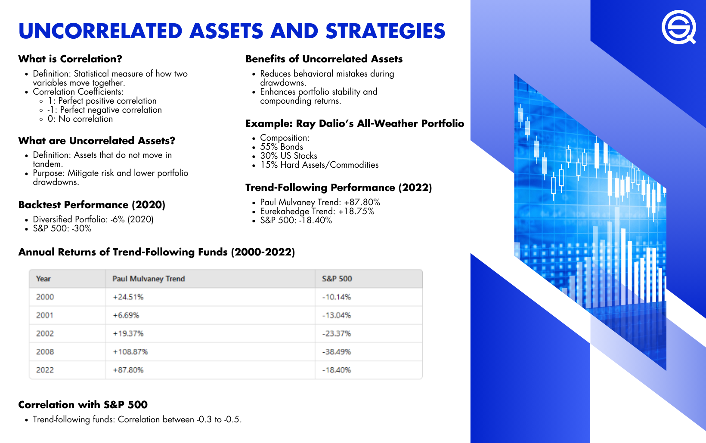

## Table of Contents

## What are uncorrelated assets?

Uncorrelated assets are investments that don't move in the same way as other investments. When one goes up, the other might stay the same or even go down. This is important because it helps spread out risk in a portfolio. If all your investments were the same, they might all go down at the same time, which would be bad. But if you have some that are uncorrelated, they might help balance things out.

For example, stocks and bonds are often considered uncorrelated. When the stock market is doing well, bond prices might not change much or might even drop a little. But when the stock market goes down, people often buy more bonds because they are seen as safer. This means that having both stocks and bonds in your portfolio can help protect you from big losses. By mixing different types of investments, you can create a more stable and potentially more profitable portfolio.

## Why is it important to include uncorrelated assets in a portfolio?

Including uncorrelated assets in a portfolio is important because it helps reduce risk. When all your investments move in the same way, a drop in one can cause your whole portfolio to lose value. But if you have some investments that don't move together, a drop in one might be balanced out by stability or gains in another. This can protect your money from big losses and make your investments more stable over time.

Another reason to include uncorrelated assets is to improve the overall performance of your portfolio. When different types of investments are combined, they can work together to create a smoother return. For example, if stocks go down but bonds stay steady or go up, the bonds can help cushion the blow. This mix can lead to better long-term growth and help you reach your financial goals more reliably.

## Can you give examples of uncorrelated assets?

Stocks and bonds are often seen as uncorrelated assets. When the stock market goes up, bond prices might not change much or might even go down a little. But when the stock market goes down, people often buy more bonds because they are seen as safer. So, if you have both stocks and bonds in your portfolio, they can help balance each other out. This means that if stocks lose value, bonds might help protect your money from big losses.

Another example is real estate and commodities like gold. Real estate prices can go up when the economy is doing well, but gold often goes up when people are worried about the economy. So, if the real estate market goes down, gold might go up because people see it as a safe place to put their money. By having both real estate and gold in your portfolio, you can reduce the risk of losing money when one of them goes down.

Cryptocurrencies and traditional investments like stocks or bonds can also be uncorrelated. Cryptocurrencies like Bitcoin can go up or down for reasons that don't affect stocks or bonds. For example, if there's a new technology that makes people excited about cryptocurrencies, their prices might go up even if the stock market is doing poorly. So, having some cryptocurrencies in your portfolio can help you spread out your risk and potentially make more money.

## How do you measure the correlation between assets?

To measure the correlation between assets, you use a number called the correlation coefficient. This number goes from -1 to +1. If the number is close to +1, it means the assets move together a lot. If it's close to -1, it means they move in opposite ways. And if it's close to 0, it means they don't move together much at all. You can find this number by looking at how the prices of the assets change over time and doing some math.

You can use a tool called a scatter plot to help you see the correlation. On a scatter plot, you put the prices of one asset on one axis and the prices of the other asset on the other axis. If the dots on the plot make a line that goes up from left to right, the assets are positively correlated. If the line goes down, they are negatively correlated. And if the dots are all over the place without making a clear line, the assets are not correlated much. This can help you see how well your assets work together in your portfolio.

## What is the difference between negative correlation and low correlation?

Negative correlation means that when one asset goes up, the other one goes down. It's like a see-saw: when one side goes up, the other side goes down. If two assets have a negative correlation, they move in opposite directions. This can be good for your portfolio because if one investment loses money, the other one might make money and help balance things out.

Low correlation means that the two assets don't move together very much. They might go up and down at different times, but there's no clear pattern. It's like two people walking in a park who aren't trying to walk together. One might go left while the other goes right, but they're not really connected. Having assets with low correlation in your portfolio can still help reduce risk because they don't all go up or down at the same time.

## How can uncorrelated assets help in risk management?

Uncorrelated assets help in risk management by spreading out the risk in your portfolio. When you have different types of investments that don't move in the same way, a drop in one might be balanced out by the others staying the same or going up. This means that if one investment loses value, the others can help protect your money from big losses. It's like having a safety net for your investments, making your portfolio more stable and less likely to lose a lot of money all at once.

For example, if you have stocks and bonds in your portfolio, and the stock market goes down, the bonds might stay steady or even go up a little. This can help cushion the blow and keep your overall investment from dropping too much. By mixing different kinds of assets, you can create a more balanced portfolio that can handle ups and downs in the market better. This way, you can feel more secure about your investments and work towards your financial goals with less worry.

## What are some strategies for incorporating uncorrelated assets into a portfolio?

One way to include uncorrelated assets in your portfolio is to mix different types of investments. For example, you can have some stocks and some bonds. Stocks and bonds often don't move together, so if the stock market goes down, the bonds might stay the same or go up a little. This can help protect your money from big losses. You can also add real estate and commodities like gold. Real estate might go up when the economy is doing well, but gold often goes up when people are worried about the economy. So, having both can help balance out your investments.

Another strategy is to use funds that focus on different sectors or regions. For example, you can invest in a fund that only buys technology stocks and another that buys healthcare stocks. These two sectors might not move together, so if tech stocks go down, healthcare stocks might stay the same or go up. You can also look at funds that invest in different countries. The stock market in one country might go down while another country's market goes up. By spreading your money across different sectors and regions, you can reduce the risk of losing money if one area does badly.

A third way is to include alternative investments like cryptocurrencies or hedge funds. Cryptocurrencies like Bitcoin can go up or down for reasons that don't affect stocks or bonds. So, having some cryptocurrencies in your portfolio can help you spread out your risk. Hedge funds can also be uncorrelated because they use different strategies to make money. They might invest in things that don't move with the stock market, like distressed companies or commodities. By adding these alternative investments, you can make your portfolio more stable and potentially make more money.

## How does the concept of correlation affect portfolio diversification?

The concept of correlation is really important when you're trying to make your portfolio more diverse. When you put different types of investments in your portfolio, you want them to not move in the same way. This means that if one investment goes down, another might stay the same or even go up. By choosing investments that don't move together, you can spread out the risk. This way, if one part of your portfolio loses money, the other parts can help balance things out and keep your overall investment from dropping too much.

Correlation helps you pick the right mix of investments. If all your investments are the same kind, they might all go up or down at the same time. But if you have some stocks, some bonds, and maybe some real estate or gold, these things might not move together. Stocks might go down when bonds go up, or real estate might go up when gold goes down. By understanding how different investments move, you can choose ones that will work well together and make your portfolio more stable. This can help you feel more secure about your investments and work towards your financial goals with less worry.

## What are the challenges in finding truly uncorrelated assets?

Finding truly uncorrelated assets can be hard because things in the world are often connected in ways we don't always see. For example, even if stocks and bonds usually don't move together, they can both go down if there's a big problem like a financial crisis. Also, as more people use computers to trade and make decisions, different kinds of investments can start to move together more than they used to. This makes it tricky to find assets that really don't move together at all.

Another challenge is that what seems uncorrelated today might not be tomorrow. The world changes, and so do the reasons why investments go up or down. For instance, a new law or a big event can suddenly make two things that used to be different start moving together. This means you have to keep watching and learning about your investments to make sure they stay uncorrelated. It takes a lot of work and understanding to keep your portfolio balanced and safe.

## How do macroeconomic factors influence the correlation between assets?

Macroeconomic factors like interest rates, inflation, and economic growth can make different investments move in similar ways. For example, if the economy is doing really well, both stocks and real estate might go up because people have more money to spend and invest. On the other hand, if the economy is doing badly, both stocks and commodities like oil might go down because people are worried and not spending as much. So, these big economic changes can make assets that usually don't move together start to move together.

It's also important to know that these macroeconomic factors can change over time. What affects the correlation between assets today might be different next year. For instance, if a country raises its interest rates, bonds might go down while stocks might go up or down depending on how people think the economy will do. By keeping an eye on these big economic changes, you can better understand how they might make your investments move and adjust your portfolio to stay balanced and safe.

## What advanced statistical methods can be used to analyze asset correlations?

One advanced statistical method to analyze asset correlations is called time-series analysis. This method looks at how the prices of different assets change over time. By studying past data, you can see if there are patterns in how the assets move together. For example, you might find that stocks and bonds usually move in opposite ways, but during certain times like a financial crisis, they start moving together. Time-series analysis can help you understand these patterns and make better decisions about which assets to include in your portfolio to reduce risk.

Another useful method is regression analysis. This helps you see how much one asset's price depends on another asset's price. You can use regression to figure out if the price of gold, for example, goes up when the stock market goes down. By doing this, you can understand how strong the relationship is between different assets. This information can help you pick the right mix of investments to make your portfolio more stable and less likely to lose a lot of money all at once.

A third method is copula modeling. This is a bit more complicated, but it's great for understanding how different assets move together in different situations. Copulas help you see how the correlation between assets changes when the market is doing well versus when it's doing badly. This can give you a better idea of how your investments might behave in different economic conditions. By using copula modeling, you can make smarter choices about how to balance your portfolio and manage risk more effectively.

## How can machine learning and AI be utilized to identify and manage uncorrelated assets?

Machine learning and AI can help find and manage uncorrelated assets by looking at a lot of data really fast. They can study how different investments move over time and find patterns that people might miss. For example, AI can look at the prices of stocks, bonds, and other things like gold or real estate, and see if they go up and down together or in different ways. By doing this, AI can help you pick investments that don't move together, which can make your portfolio more stable and less likely to lose a lot of money all at once.

AI can also keep watching your investments and change your portfolio as things change. The world and the economy are always moving, so what's uncorrelated today might not be tomorrow. AI can keep learning from new data and tell you when you need to change your investments to stay balanced. This way, you can feel more secure about your money because AI is always working to make sure your portfolio is as safe as possible.

## What is the power of combining uncorrelated assets in algo trading?

Integrating uncorrelated assets into [algorithmic trading](/wiki/algorithmic-trading) strategies is a robust method to potentially enhance portfolio performance by reducing the overall risk and increasing return stability. The primary advantage of this integration is that it allows traders to achieve smoother equity curves and reduced drawdowns. This is achieved by ensuring that the assets or strategies employed do not all react identically to market conditions. 

To illustrate the efficacy of combining uncorrelated assets, consider Ray Dalio's All-Weather Portfolio, a well-known example rooted in the principles of diversification. The All-Weather Portfolio is constructed to perform well under various economic conditions by balancing asset classes that typically behave differently over time. This portfolio includes a mix of equities, bonds, commodities, and other financial instruments in specific proportions, exemplifying how uncorrelated assets can stabilize returns during market fluctuations.

Meb Faber's Trend-Following Models offer another exemplary strategy leveraging uncorrelated assets. Faber's models focus on identifying and capturing trends across different asset classes, utilizing strategies like moving averages to guide buying and selling decisions. These models benefit from the inherent uncorrelated nature of the underlying assets, as they specialize in capturing returns from assets trending in opposing directions at different times. This naturally contributes to diversification and mitigates potential losses from isolated market downturns within specific sectors or asset classes.

In practical terms, implementing uncorrelated assets might involve creating a diversified basket of financial instruments wherein their price movements do not exhibit a high correlation with one another. This concept can be encapsulated using the Pearson correlation coefficient formula:

$$
\rho_{xy} = \frac{\text{cov}(X, Y)}{\sigma_X \sigma_Y}
$$

where $\text{cov}(X, Y)$ is the covariance of the asset returns $X$ and $Y$, and $\sigma_X$ and $\sigma_Y$ are the standard deviations of the returns of $X$ and $Y$ respectively. An ideal combination would involve assets where $\rho_{xy}$ is close to zero, signifying little to no linear relationship between their returns.

For algorithmic traders, the implementation of strategies based on uncorrelated assets could be done using programming languages like Python. A simplified Python code snippet to calculate the correlation between two asset price series could look like this:

```python
import numpy as np

# Example price data for two assets
price_series_asset1 = np.array([100, 102, 101, 105, 107])
price_series_asset2 = np.array([200, 198, 202, 201, 199])

# Calculating returns
returns_asset1 = np.diff(price_series_asset1) / price_series_asset1[:-1]
returns_asset2 = np.diff(price_series_asset2) / price_series_asset2[:-1]

# Calculating correlation
correlation = np.corrcoef(returns_asset1, returns_asset2)[0, 1]
print(f"Correlation between asset1 and asset2: {correlation}")
```

This calculation assists in constructing a portfolio that leverages assets with low or negative correlations, thus potentially reducing risk and enhancing the robustness of the trading strategy.

In conclusion, combining uncorrelated assets is a critical component of sophisticated algorithmic trading models, enabling not just risk diversification but also the potential for more consistent positive returns across varying market conditions.

## How can one practically implement and backtest strategies?

The practical implementation of using uncorrelated assets in algorithmic trading involves developing well-designed trading strategies, coding these strategies into algorithms, and performing thorough [backtesting](/wiki/backtesting) to evaluate their effectiveness. Each step is crucial in ensuring that the strategies are robust, viable, and capable of withstanding various market conditions.

### Strategy Design

A sound strategy starts with identifying uncorrelated assets that can be part of a trading portfolio. Traders often use statistical techniques to measure the degree of correlation between asset pairs, selecting those that exhibit low or negative correlation. The design process also involves defining entry and [exit](/wiki/exit-strategy) rules, position sizing, and risk management principles.

### Coding Algorithms

Once the strategy is defined, it is translated into a programmable format. Python is a widely used language for algorithmic trading due to its rich ecosystem of libraries such as NumPy, pandas, and scikit-learn. These libraries facilitate data analysis and [machine learning](/wiki/machine-learning), essential components in algorithm development. A basic template of a trading algorithm might look like this:

```python
import pandas as pd

def backtest_strategy(data, strategy):
    # data: pandas DataFrame with pricing information
    # strategy: function that applies trading rules and returns signals

    data['signals'] = strategy(data)
    data['returns'] = data['price'].pct_change()

    # Calculating strategy returns
    data['strategy_returns'] = data['signals'].shift(1) * data['returns']
    total_return = (data['strategy_returns'] + 1).prod() - 1
    return total_return

def example_strategy(data):
    # Implement a simple crossover strategy
    data['short_mavg'] = data['price'].rolling(window=10).mean()
    data['long_mavg'] = data['price'].rolling(window=30).mean()
    signals = data['short_mavg'] > data['long_mavg']
    return signals.astype(int)

# Example usage
price_data = pd.DataFrame({'price': [/* your price data here */]})
print(backtest_strategy(price_data, example_strategy))
```

### Backtesting

Backtesting is a critical step that involves testing the algorithm against historical data to evaluate its performance. The goal is to simulate how the strategy would have performed in real market conditions, helping traders refine their strategies before live deployment. Backtesting can reveal the strategy's profitability, risk, and drawdown [statistics](/wiki/bayesian-statistics).

Metrics such as the Sharpe ratio, maximum drawdown, and volatility are commonly assessed. The Sharpe ratio measures risk-adjusted returns, calculated as:

$$
\text{Sharpe Ratio} = \frac{E[R_p - R_f]}{\sigma_p}
$$

where $R_p$ is the portfolio return, $R_f$ is the risk-free rate, and $\sigma_p$ is the standard deviation of portfolio returns.

### Real-World Example

A real-world example of successfully implementing uncorrelated assets in algo trading is the use of pairs trading. In such strategies, traders identify two assets that are historically correlated and trade them based on the belief that their prices will converge. When the correlation weakens, it creates [arbitrage](/wiki/arbitrage) opportunities. Through backtesting, traders can identify periods when this strategy yields high returns, thus validating its effectiveness.

### Conclusion

Implementing uncorrelated assets in algorithmic trading requires a rigorous approach to strategy design, coding, and backtesting. By carefully assessing and refining these strategies, traders can enhance their odds of success in the dynamic and often unpredictable financial markets.

## What are the Frequently Asked Questions?

### Why are uncorrelated assets important in algorithmic trading?

Uncorrelated assets are crucial in algorithmic trading because they enhance portfolio diversification. When assets do not move in tandem, the volatility of the overall portfolio is reduced, allowing for more stable returns. This means that the adverse movements of one asset are likely to be offset by neutral or positive movements of another, balancing the portfolio's performance. In quantitative terms, if asset A and asset B have near-zero correlation, variations in their performance will not compound each other, thus mitigating risk.

### How do uncorrelated assets help in mitigating risk?

Uncorrelated assets mitigate risk by reducing the overall volatility of a portfolio. In statistical terms, the standard deviation of returns, often used as a risk measure, can be lowered by including assets with low correlation. The mathematical foundation for this lies in the formula for the variance of a two-asset portfolio:

$$
\sigma_p^2 = w_1^2 \sigma_1^2 + w_2^2 \sigma_2^2 + 2w_1w_2\rho\sigma_1\sigma_2
$$

where $\sigma_p^2$ is the portfolio variance, $\sigma_1$ and $\sigma_2$ are the standard deviations of assets 1 and 2, $w_1$ and $w_2$ are the weights of the two assets in the portfolio, and $\rho$ is the correlation coefficient between the assets. A lower or negative $\rho$ reduces the covariance term, thus lowering the overall variance and associated risk.

### Can implementing uncorrelated strategies lead to higher returns?

While uncorrelated strategies themselves are not a guarantee for higher returns, they can improve the risk-adjusted returns, which is the return per unit of risk taken. By smoothing out the equity curve and reducing drawdowns, investors can achieve a higher Sharpe Ratio—a measure of risk-adjusted return. Over time, this allows for better compounding of returns, as the portfolio is less likely to experience significant losses that erode capital. In algorithmic trading, combining uncorrelated strategies allows traders to exploit various market conditions, potentially leading to superior returns compared to a correlated portfolio.

### What are challenges in finding and implementing uncorrelated assets?

One of the main challenges of finding uncorrelated assets is that correlation between assets can change over time, particularly during periods of market stress when correlations tend to increase. This makes it difficult to maintain a consistent level of portfolio diversification. Additionally, implementing such assets in algorithmic strategies requires continuous monitoring and adjustment. Overfitting poses another significant challenge; relying too heavily on historical correlation data can lead to models that do not perform well in live markets. Constant adaptation, rigorous backtesting, and stress testing are necessary to ensure the robustness of uncorrelated strategies.

## References & Further Reading

[1]: Bergstra, J., Bardenet, R., Bengio, Y., & Kégl, B. (2011). ["Algorithms for Hyper-Parameter Optimization."](https://dl.acm.org/doi/10.5555/2986459.2986743) Advances in Neural Information Processing Systems 24.

[2]: ["Advances in Financial Machine Learning"](https://www.amazon.com/Advances-Financial-Machine-Learning-Marcos/dp/1119482089) by Marcos Lopez de Prado

[3]: ["Evidence-Based Technical Analysis: Applying the Scientific Method and Statistical Inference to Trading Signals"](https://www.amazon.com/Evidence-Based-Technical-Analysis-Scientific-Statistical/dp/0470008741) by David Aronson

[4]: ["Machine Learning for Algorithmic Trading"](https://github.com/stefan-jansen/machine-learning-for-trading) by Stefan Jansen

[5]: ["Quantitative Trading: How to Build Your Own Algorithmic Trading Business"](https://books.google.com/books/about/Quantitative_Trading.html?id=j70yEAAAQBAJ) by Ernest P. Chan