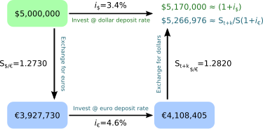

## Table of Contents

## What is uncovered interest arbitrage?

Uncovered interest arbitrage is a financial strategy where investors borrow money in a country with a low interest rate and invest it in a country with a higher interest rate. The goal is to make a profit from the difference in interest rates between the two countries. Unlike covered interest arbitrage, which uses forward contracts to hedge against currency fluctuations, uncovered interest arbitrage does not use such protection. This means that investors are exposed to the risk that the currency of the country with the higher interest rate might depreciate against the currency of the country with the lower interest rate.

Because of this risk, uncovered interest arbitrage can be more profitable but also more dangerous. If the currency of the country with the higher interest rate falls in value, the investor could lose money even if the interest rate difference was favorable. For example, if an investor borrows in a country with a 2% interest rate and invests in a country with a 5% interest rate, they could make a 3% profit if the exchange rates stay the same. However, if the currency of the country with the 5% interest rate drops by more than 3%, the investor would end up losing money. This makes uncovered interest arbitrage a high-risk, high-reward strategy that requires careful consideration of currency movements.

## How does uncovered interest arbitrage differ from covered interest arbitrage?

Uncovered interest arbitrage and covered interest arbitrage are two ways to try to make money from differences in interest rates between countries. In uncovered interest arbitrage, you borrow money from a country with a low interest rate and invest it in a country with a higher interest rate. You do this without any protection against changes in currency values. This means you could make a lot of money if the exchange rates stay the same, but you could also lose money if the currency of the country with the higher interest rate goes down in value.

Covered interest arbitrage is different because it uses something called a forward contract to protect against changes in currency values. A forward contract is like a promise to exchange currencies at a set rate in the future. So, if you borrow money from a country with a low interest rate and invest it in a country with a higher interest rate, you use the forward contract to make sure you can change the money back at a good rate. This makes covered interest arbitrage safer than uncovered interest arbitrage, but it might not be as profitable because you have to pay for the forward contract.

## What are the basic steps involved in executing an uncovered interest arbitrage?

To do uncovered interest arbitrage, you first need to find two countries where one has a higher interest rate than the other. You borrow money from the country with the lower interest rate. Let's say you borrow money from a country where the interest rate is 2%. Then, you take that money and invest it in a country where the interest rate is higher, like 5%. You hope to make money from the difference between these two rates, which in this case is 3%.

The next step is to wait until the end of the investment period. Since you didn't use any protection against changes in currency values, you are taking a risk. If the currency of the country where you invested your money stays the same or goes up in value, you will make a profit. But if that currency goes down in value by more than the 3% interest rate difference, you could lose money. This makes uncovered interest arbitrage a risky but potentially rewarding strategy.

## What are the key assumptions behind uncovered interest arbitrage?

Uncovered interest arbitrage works on the idea that you can make money by borrowing in a country with low interest rates and investing in a country with high interest rates. The main assumption here is that the difference in interest rates between the two countries will be enough to make a profit. This means you believe the interest you earn in the high-rate country will be more than the interest you pay in the low-rate country.

Another key assumption is that the exchange rate between the two countries' currencies will not change enough to wipe out your profit. Since you are not using any protection against changes in currency values, you are betting that the currency of the country where you invested will stay the same or go up in value. If it goes down too much, you could lose money even if the interest rate difference was in your favor. So, uncovered interest arbitrage assumes both a favorable interest rate difference and stable or favorable currency movements.

## What are the potential risks associated with uncovered interest arbitrage?

Uncovered interest arbitrage can be risky because it depends on the exchange rate between two countries' currencies staying the same or moving in your favor. If you borrow money from a country with low interest rates and invest it in a country with high interest rates, you hope to make money from the difference in interest rates. However, if the currency of the country where you invested your money goes down in value, you could lose more money than you made from the interest rate difference. This means you could end up losing money instead of making a profit.

Another risk is that interest rates can change unexpectedly. If the interest rate in the country where you borrowed money goes up, or if the interest rate in the country where you invested your money goes down, the difference in interest rates that you were counting on could disappear. This could make your investment less profitable or even cause you to lose money. Because uncovered interest arbitrage doesn't use any protection against these risks, it can be a high-risk strategy that requires careful consideration and monitoring of both interest rates and currency movements.

## How can one identify opportunities for uncovered interest arbitrage?

To find opportunities for uncovered interest arbitrage, you need to look at the interest rates in different countries. You want to find a country with a low interest rate where you can borrow money, and another country with a high interest rate where you can invest that money. The bigger the difference between these two interest rates, the more potential profit there is. You can find this information by checking financial news, using economic reports, or looking at data from central banks.

Once you have found countries with a good interest rate difference, you also need to think about the exchange rates between their currencies. Since you are not using any protection against changes in currency values, you need to believe that the currency of the country where you are investing will stay the same or go up in value. You can look at past trends and current economic conditions to guess how the exchange rate might change. If you think the exchange rate will stay stable or move in your favor, then you might have found a good opportunity for uncovered interest arbitrage.

## What role do interest rate differentials play in uncovered interest arbitrage?

Interest rate differentials are the key to making money with uncovered interest arbitrage. This strategy works by borrowing money from a country with a low interest rate and then investing that money in a country with a higher interest rate. The difference between these two interest rates is what you hope to make as profit. For example, if you borrow at a 2% interest rate and invest at a 5% interest rate, you could earn a 3% profit if everything else stays the same.

However, the success of uncovered interest arbitrage depends a lot on these interest rate differentials staying in your favor. If the interest rates change, like if the borrowing rate goes up or the investing rate goes down, your potential profit could shrink or even turn into a loss. That's why it's important to keep an eye on interest rates and make sure the difference between them is big enough to cover any risks, especially since you're not using any protection against changes in currency values.

## How does exchange rate volatility impact the success of uncovered interest arbitrage?

Exchange rate volatility can make uncovered interest arbitrage risky. When you do uncovered interest arbitrage, you borrow money from a country with a low interest rate and invest it in a country with a higher interest rate. You hope to make money from the difference in these interest rates. But if the currency of the country where you invested your money goes down in value, it can wipe out your profit or even cause you to lose money. This is because you are not using any protection against changes in currency values, so you are betting that the exchange rate will stay the same or move in your favor.

If the exchange rate is very volatile, it means it can change a lot and quickly. This makes it harder to predict what will happen to the currency of the country where you invested your money. If the currency drops a lot, the money you get back from your investment might not be worth as much when you convert it back to the currency you borrowed in. So, even if the interest rate difference was good, big swings in the exchange rate can turn a potential profit into a loss. That's why exchange rate volatility is a big risk when doing uncovered interest arbitrage.

## Can you explain the concept of interest rate parity in the context of uncovered interest arbitrage?

Interest rate parity is an idea that says the difference in interest rates between two countries should be balanced out by changes in their exchange rates. In the context of uncovered interest arbitrage, this means that if you borrow money from a country with a low interest rate and invest it in a country with a higher interest rate, the currency of the country with the higher interest rate should go down in value by the same amount as the interest rate difference. This would mean you wouldn't make any extra money from doing uncovered interest arbitrage because the loss from the currency change would cancel out your profit from the interest rate difference.

However, in real life, interest rate parity doesn't always work perfectly. Sometimes the exchange rates don't change exactly as expected, which can create opportunities for uncovered interest arbitrage. If you think the currency of the country with the higher interest rate won't go down as much as the interest rate difference, you might decide to do uncovered interest arbitrage to try to make a profit. But it's risky because if the currency does go down a lot, you could lose money instead of making a profit.

## What historical examples illustrate the application of uncovered interest arbitrage?

One famous example of uncovered interest arbitrage happened in the 1980s with the "carry trade" involving the Japanese yen and the U.S. dollar. During this time, Japan had very low interest rates, while the U.S. had higher interest rates. Investors would borrow yen at the low interest rate, convert it to dollars, and invest in U.S. assets to earn the higher U.S. interest rate. The idea was to make money from the difference in interest rates. Many investors did well with this strategy, but it was risky because if the yen got stronger against the dollar, they could lose money. In fact, when the yen did get stronger in the late 1980s and early 1990s, some investors lost a lot.

Another example can be seen in the early 2000s with the carry trade involving the Swiss franc and the Australian dollar. Switzerland had very low interest rates, while Australia had much higher rates. Investors borrowed Swiss francs at the low rate, converted them to Australian dollars, and invested in Australian assets. This worked well for a while, and many investors made money from the interest rate difference. But like before, it was risky. If the Swiss franc got stronger against the Australian dollar, the profits could turn into losses. And that's what happened when the global financial crisis hit in 2008, causing big swings in currency values and hurting many investors who were doing uncovered interest arbitrage.

## How do market inefficiencies affect the feasibility of uncovered interest arbitrage?

Market inefficiencies can make uncovered interest arbitrage more feasible because they create opportunities for profit. If markets were perfectly efficient, the difference in interest rates between two countries would be exactly balanced out by changes in their exchange rates. This means you wouldn't be able to make any extra money from doing uncovered interest arbitrage. But in real life, markets are not always perfect. Sometimes, the exchange rates don't change as much as they should to match the interest rate difference. When this happens, you might be able to borrow money from a country with a low interest rate, invest it in a country with a higher interest rate, and make a profit because the currency doesn't go down as much as expected.

However, these market inefficiencies also make uncovered interest arbitrage riskier. Because the exchange rates don't always move in a predictable way, you can't be sure if you will make money or lose it. If the currency of the country where you invested your money goes down more than you expected, you could lose more than you made from the interest rate difference. So, while market inefficiencies can create opportunities for uncovered interest arbitrage, they also mean you need to be careful and ready to take on more risk.

## What advanced strategies can be employed to optimize returns from uncovered interest arbitrage?

To optimize returns from uncovered interest arbitrage, one strategy is to use careful timing and market analysis. This means watching the interest rates and exchange rates closely to find the best moments to borrow and invest. For example, if you see that the interest rate difference between two countries is about to get bigger, you might want to borrow and invest right before that happens. Also, looking at economic news and reports can help you guess how exchange rates might change. If you think the currency of the country where you are investing will stay strong or get stronger, it could be a good time to do uncovered interest arbitrage.

Another strategy is to diversify your investments. Instead of putting all your money into one country with a high interest rate, you could spread it out across several countries. This way, if the currency of one country goes down a lot, you might still make money from the other countries. It's like not putting all your eggs in one basket. Also, you can use stop-loss orders to limit your losses. A stop-loss order is like a safety net that automatically sells your investment if the currency goes down too much. This can help protect your money and make sure you don't lose too much if things don't go as planned.

## References & Further Reading

[1]: Froot, K. A., & Thaler, R. H. (1990). ["Anomalies: Foreign Exchange."](https://pubs.aeaweb.org/doi/pdfplus/10.1257/jep.4.3.179) Journal of Economic Perspectives, 4(3), 179-192.

[2]: Taylor, M. P. (1995). ["The Economics of Exchange Rates."](https://www.jstor.org/stable/2728909) Journal of Economic Literature, 33(1), 13-47.

[3]: Burnside, C., Eichenbaum, M., & Rebelo, S. (2007). ["The Returns to Currency Speculation."](https://www.nber.org/system/files/working_papers/w16942/w16942.pdf) National Bureau of Economic Research Working Paper No. 12916.

[4]: Akram, Q. F., Rime, D., & Sarno, L. (2008). ["Arbitrage in the Foreign Exchange Market: Turning on the Microscope."](https://www.sciencedirect.com/science/article/pii/S0022199608000706) Journal of International Economics, 76(2), 237-253.

[5]: Avramov, D., & Chordia, T. (2006). ["Asset Pricing Models and Financial Market Anomalies."](https://www.jstor.org/stable/3844019) The Review of Financial Studies, 19(3), 1001-1040.

[6]: ["Interest Rate Parity, Exchange Rates, and Forex Trading"](https://www.investopedia.com/terms/i/interestrateparity.asp) - Investopedia

[7]: Brealey, R., Myers, S., & Allen, F. (2020). ["Principles of Corporate Finance"](https://www.mheducation.com/highered/product/principles-corporate-finance-brealey-myers/M9781264080946.html) (13th Edition). McGraw-Hill Education.

[8]: ["Algorithmic Trading & DMA: An Introduction to Direct Access Trading Strategies"](https://www.amazon.com/Algorithmic-Trading-DMA-introduction-strategies/dp/0956399207) by Barry Johnson