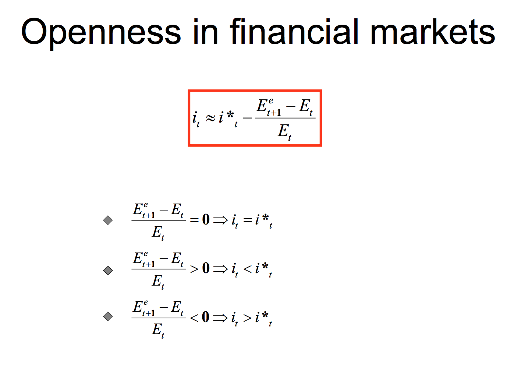

## Table of Contents

## What is Uncovered Interest Rate Parity (UIP)?

Uncovered Interest Rate Parity (UIP) is an economic theory that explains how differences in interest rates between two countries can affect their exchange rates. The basic idea is that if one country has higher interest rates than another, investors will move their money to the country with the higher rates to get a better return. However, this movement of money should cause the currency of the country with higher interest rates to appreciate, or go up in value, compared to the other country's currency.

In theory, UIP suggests that the expected change in the exchange rate between two currencies should offset the difference in their interest rates. This means that even though an investor might earn more interest in a country with higher rates, any gains could be lost if that country's currency depreciates, or goes down in value, over time. While UIP is a useful concept, it doesn't always hold true in the real world because other factors, like economic stability and political events, can also influence exchange rates.

## How does Uncovered Interest Rate Parity differ from Covered Interest Rate Parity?

Uncovered Interest Rate Parity (UIP) and Covered Interest Rate Parity (CIP) both deal with how interest rates affect exchange rates, but they handle risk differently. In UIP, investors move money to a country with higher interest rates expecting to earn more, but they face the risk that the currency might lose value by the time they want to exchange it back. It's like betting on the future value of the currency without any protection.

On the other hand, Covered Interest Rate Parity (CIP) involves using financial tools, like forward contracts, to protect against currency risk. With CIP, if you invest in a country with higher interest rates, you can use a forward contract to lock in an exchange rate for the future. This means you know exactly how much your money will be worth when you convert it back, no matter what happens to the currency in the meantime. So, CIP is safer because it covers the risk, while UIP leaves you uncovered and exposed to potential losses.

## What are the basic assumptions underlying the Uncovered Interest Rate Parity theory?

The Uncovered Interest Rate Parity theory rests on a few key assumptions. First, it assumes that investors are always looking for the best returns and will move their money to wherever they can earn the highest interest rates. This means that if one country has higher interest rates than another, investors will shift their money there, expecting to make more money. 

Second, UIP assumes that these movements of money will cause changes in exchange rates. If a lot of money flows into a country with high interest rates, its currency should become more valuable compared to other currencies. The theory says that this change in the currency's value should be just enough to cancel out the extra interest earned, so in the end, investors won't really gain more by moving their money around.

## Can you explain the formula used to express Uncovered Interest Rate Parity?

The formula for Uncovered Interest Rate Parity is simple but tells us a lot. It says that the expected change in the exchange rate between two currencies should equal the difference in their interest rates. If you write it out, it looks like this: (E[e]/e) - 1 = i_foreign - i_domestic. Here, 'e' is today's exchange rate, 'E[e]' is what people think the exchange rate will be in the future, 'i_foreign' is the interest rate in the foreign country, and 'i_domestic' is the interest rate in your own country.

What this formula means is that if the foreign country's interest rate is higher, people expect its currency to go down in value by the time they want to change their money back. For example, if the foreign interest rate is 5% and the domestic rate is 3%, the foreign currency should drop by about 2% in value. That way, even though you earn more interest, you don't end up with more money overall because of the currency change.

## What is the expected relationship between interest rates and exchange rates according to UIP?

According to Uncovered Interest Rate Parity, there's a clear link between interest rates and exchange rates. If one country has higher interest rates than another, people will want to move their money there to earn more interest. But, this movement of money should make the currency of the country with the higher interest rates go up in value compared to the other country's currency.

The theory says that the expected change in the exchange rate should be the same as the difference in interest rates between the two countries. So, if you earn more interest in a country with higher rates, you should expect its currency to go down in value by the time you want to change your money back. This means you won't end up with more money overall, even though you earned more interest.

## What are some common criticisms of the Uncovered Interest Rate Parity theory?

One big criticism of Uncovered Interest Rate Parity is that it doesn't always work in real life. People have studied it a lot, and they've found that the theory often doesn't match what actually happens with exchange rates and interest rates. For example, even if one country has much higher interest rates, its currency might not go down in value like the theory says it should. This is called the "forward premium puzzle," and it shows that other things, like how much risk people are willing to take or what they think will happen in the future, can mess up the simple idea behind UIP.

Another problem with UIP is that it assumes everyone knows exactly what will happen to exchange rates in the future. But in the real world, predicting exchange rates is really hard because so many things can change, like politics, economics, or even big events like natural disasters. Also, UIP doesn't take into account that people might not always move their money just to get the highest interest rate. They might care more about keeping their money safe or about other investment options, so they don't always follow the theory's predictions.

## How does empirical evidence support or contradict the Uncovered Interest Rate Parity hypothesis?

Empirical evidence often contradicts the Uncovered Interest Rate Parity (UIP) hypothesis. Many studies have shown that when one country has higher interest rates than another, its currency doesn't always go down in value as UIP predicts. This is called the "forward premium puzzle." For example, if a country has higher interest rates, you might expect its currency to weaken over time, but often the opposite happens, and the currency gets stronger. This means that investors who move their money to the country with higher interest rates can actually make more money than UIP says they should, because they earn more interest and the currency doesn't lose value like expected.

There are several reasons why empirical evidence doesn't support UIP. One reason is that it's really hard to predict future exchange rates accurately. UIP assumes that everyone knows exactly what will happen, but in reality, exchange rates can be influenced by many unpredictable factors like politics, economic news, or even natural disasters. Another reason is that investors might not always move their money just to chase the highest interest rates. They might care more about safety or other investment opportunities, so they don't always follow the predictions of UIP. Overall, while UIP is a useful theory, the real world is much more complicated, and the evidence shows that it doesn't always hold true.

## What is the 'forward premium puzzle' in relation to UIP?

The 'forward premium puzzle' is a big problem for the Uncovered Interest Rate Parity (UIP) theory. It happens when a country has higher interest rates than another, but its currency doesn't go down in value like UIP says it should. Instead, the currency often stays strong or even gets stronger. This means that investors who move their money to the country with higher interest rates can end up making more money than they expected, because they earn more interest and the currency doesn't lose value as predicted.

This puzzle shows that the real world doesn't always follow the simple rules of UIP. Many things can affect exchange rates, like politics, economic news, or unexpected events, making it hard to predict what will happen. Also, investors might care more about keeping their money safe or looking at other investment options, rather than just chasing the highest interest rates. So, even though UIP is a useful theory, the 'forward premium puzzle' shows that it doesn't always work in practice.

## How do investors use Uncovered Interest Rate Parity in forex trading?

Investors use Uncovered Interest Rate Parity (UIP) in [forex](/wiki/forex-system) trading to try to make money from the difference in interest rates between two countries. They might move their money to a country with higher interest rates, hoping to earn more interest. But they know that UIP says the currency of that country should go down in value over time. So, they're betting that the interest they earn will be more than any loss they might have because of the currency dropping in value.

In practice, though, things can get tricky. The 'forward premium puzzle' shows that sometimes the currency of a country with higher interest rates doesn't go down like UIP predicts. It might even get stronger. This means investors can end up making more money than they expected. Because of this, many investors use UIP as just one part of their trading strategy. They look at other things too, like what's happening in the world, to help them decide when and where to move their money.

## What role do risk premiums play in the deviations from UIP?

Risk premiums play a big part in why Uncovered Interest Rate Parity (UIP) doesn't always work in real life. A risk premium is extra money that investors want because they're worried about losing their money. If a country has higher interest rates, it might also be riskier to invest there. So, investors might want a bigger reward to take that risk. This means they might not move their money just because of higher interest rates, which can make the currency not go down in value like UIP says it should.

Because of risk premiums, the expected changes in exchange rates can be different from what UIP predicts. If investors think a country is really risky, they might not invest there even if the interest rates are high. Or, they might want to be paid more to take that risk. This can make the currency of the country with high interest rates stay strong or even get stronger, instead of weakening like UIP expects. So, risk premiums can explain a lot of the times when UIP doesn't match what actually happens in the real world.

## Can you discuss any advanced models that attempt to explain deviations from Uncovered Interest Rate Parity?

One advanced model that tries to explain why Uncovered Interest Rate Parity (UIP) doesn't always work is called the "Risk-Adjusted UIP" model. This model says that investors don't just look at interest rates when they decide where to put their money. They also think about how risky it is to invest in different countries. If a country has high interest rates but is also risky, investors might want to be paid more to take that risk. This extra money they want is called a risk premium. So, even if a country has high interest rates, its currency might not go down in value like UIP predicts, because investors are getting paid more to take the risk.

Another model is the "Behavioral Finance" model. This model says that people don't always make smart choices about money. Sometimes, they follow what everyone else is doing, or they make decisions based on feelings instead of facts. This can make exchange rates move in ways that don't match UIP. For example, if everyone suddenly wants to invest in a country because they think it's the next big thing, its currency might go up in value, even if the interest rates aren't that high. So, understanding how people think and act can help explain why UIP doesn't always work in the real world.

## How has the global financial environment affected the validity of UIP in recent years?

The global financial environment has made it harder for Uncovered Interest Rate Parity (UIP) to work well in recent years. With more money moving around the world quickly and easily, things like interest rates and exchange rates can change a lot and very fast. Also, big events like financial crises, changes in government policies, and even pandemics can shake up the economy and make it hard to predict what will happen next. These things can make the currency of a country with high interest rates go up instead of down, which is the opposite of what UIP says should happen.

On top of that, central banks around the world have been doing things like setting very low or even negative interest rates to help their economies. This makes it tricky for investors to figure out where to put their money for the best return. Also, with so much information available online, people's feelings and guesses about what might happen can move money around quickly, adding more unpredictability. All these changes mean that UIP, which is based on simple ideas about interest rates and exchange rates, often doesn't match what's really happening in the world today.

## What is Uncovered Interest Rate Parity (UIP)?

Uncovered Interest Rate Parity (UIP) is an economic concept that establishes a link between disparate national interest rates and the fluctuations in currency exchange rates. This principle is predicated on the notion that differences in interest rates between two countries should be mirrored by corresponding movements in exchange rates. Specifically, the theory suggests that a currency of a nation with a lower interest rate should appreciate relative to a currency with a higher interest rate. This ensures that investors, regardless of the currency they are dealing with, can expect comparable returns over equivalent time periods, adjusting for exchange rate changes.

Unlike its counterpart, Covered Interest Rate Parity (CIP), UIP does not incorporate the usage of forward contracts as a means of risk mitigation. While CIP involves forward agreements to lock in future exchange rates and thus eliminate exchange rate risk, UIP disregards such hedging instruments. Instead, UIP operates under the assumption of market efficiency, presuming that currency markets naturally adjust without external interventions to reflect [interest rate](/wiki/interest-rate-trading-strategies) differentials.

The theoretical foundation of UIP can be traced back to the law of one price, which posits that identical goods should command the same price globally when expressed in a common currency, assuming no transportation costs and no trade barriers. This law implies that financial markets should self-correct any discrepancies between interest rates and exchange rates, maintaining a state of equilibrium.

Mathematically, UIP can be expressed as:

$$
E(S_{t+1}) = S_t \times \left(1 + i_d \right) / \left(1 + i_f \right)
$$

Where:
- $E(S_{t+1})$ is the expected future spot exchange rate.
- $S_t$ is the current spot exchange rate.
- $i_d$ is the domestic interest rate.
- $i_f$ is the foreign interest rate.

In practice, however, UIP does not always hold due to market imperfections, differences in risk preferences among investors, and other external factors such as political events or sudden economic shifts. Despite these challenges, UIP remains an essential pillar in understanding the dynamics of foreign exchange markets and is frequently utilized as a foundational theory for more sophisticated models of exchange rate determination. Understanding and applying UIP can offer crucial insights for traders analyzing potential currency movements based on interest rate disparities.

## How do you calculate uncovered interest rate parity?

Uncovered Interest Rate Parity (UIP) is a vital concept for traders aiming to exploit differences between interest rates and exchange rate expectations. The UIP condition suggests that the expected appreciation or depreciation of a currency is equal to the interest rate differential between two countries. The traditional mathematical representation of UIP can be written as:

$$
E(S_{t+1}) = S_t \times (1 + i_d) / (1 + i_f)
$$

Where:
- $E(S_{t+1})$ is the expected future spot exchange rate.
- $S_t$ is the current spot exchange rate.
- $i_d$ is the domestic interest rate.
- $i_f$ is the foreign interest rate.

This equation assumes that the spot exchange rate adjusts to reflect differences in interest rates between two countries. If the domestic interest rate is higher than the foreign interest rate, UIP predicts a future depreciation of the domestic currency to maintain economic equilibrium.

### Computational Steps and Variables

1. **Spot Exchange Rate ($S_t$)**: This is the current rate at which one currency can be exchanged for another. It serves as the baseline for calculating expected changes.

2. **Interest Rate Differential**: Calculate the difference between the domestic and foreign interest rates. This differential is a critical driver of expected currency appreciation or depreciation under UIP.

3. **Expected Future Spot Rate ($E(S_{t+1})$)**: Using the UIP formula, estimate the future spot rate based on the interest rate differential. This step involves projecting future rates, often using economic models or market expectations.

A simplified Python script to calculate the expected future spot rate using UIP might look like this:

```python
def calculate_future_spot_rate(current_spot_rate, domestic_interest_rate, foreign_interest_rate):
    future_spot_rate = current_spot_rate * (1 + domestic_interest_rate) / (1 + foreign_interest_rate)
    return future_spot_rate

current_spot_rate = 1.20  # Example spot rate
domestic_interest_rate = 0.03  # 3% domestic interest rate
foreign_interest_rate = 0.01  # 1% foreign interest rate

future_rate = calculate_future_spot_rate(current_spot_rate, domestic_interest_rate, foreign_interest_rate)
print(f"Expected Future Spot Rate: {future_rate}")
```

### Historical Examples and Real-World Applications

Historically, deviations from UIP have been observed, primarily due to market inefficiencies, transaction costs, and risk premia. For instance, during periods of high financial turbulence, currency movements can diverge significantly from UIP predictions. In practice, traders and investors may adjust their strategies if they anticipate such divergences, using them as potential opportunities to gain from market inefficiencies.

In the real world, UIP is used by analysts and traders to set rational expectations about future exchange rates, guiding their decision-making processes. Financial institutions and multinational corporations might incorporate UIP assessments to hedge risk, manage currency exposure, or predict financial statements' impact due to currency fluctuations.

While UIP provides a theoretical framework, it is essential to consider other market factors, such as investor sentiment and geopolitical events, that could influence exchange rate movements. Integrating UIP within a broader economic analysis allows for a more comprehensive understanding of potential market directions.

## What is the difference between Uncovered and Covered Interest Rate Parity?

Uncovered Interest Rate Parity (UIP) and Covered Interest Rate Parity (CIP) are pivotal concepts in understanding the interplay between interest rates and currency values. Both seek to explain how interest rate differentials between countries influence exchange rates, yet they differ in their approach to managing risk and assumptions about market behavior.

CIP relies on the use of forward contracts as a hedging tool to eliminate foreign exchange risk. According to CIP, the difference between the forward exchange rate and the spot exchange rate should equal the interest rate differential between two countries. Mathematically, CIP is expressed as:

$$
F = S \times \left( \frac{1 + i_d}{1 + i_f} \right)
$$

where $F$ is the forward exchange rate, $S$ is the spot exchange rate, $i_d$ is the domestic interest rate, and $i_f$ is the foreign interest rate. In a perfectly efficient market, any discrepancy between the forward rate and the rate implied by the interest differential is arbitraged away by traders, thus ensuring equilibrium.

UIP, conversely, is predicated on the assumption of market efficiency without hedging. It posits that the expected future spot exchange rate will adjust to reflect interest rate differentials, meaning that currency with a higher interest rate will depreciate against a currency with a lower interest rate. The UIP condition can be written as:

$$
E(S_t) = S_0 \times \left( \frac{1 + i_d}{1 + i_f} \right)^t
$$

where $E(S_t)$ represents the expected future spot exchange rate. Unlike CIP, UIP does not provide an arbitrage mechanism to guarantee parity, instead relying on traders' expectations to align with future spot rates.

Theoretically, both UIP and CIP serve to explain how international capital flows respond to interest rate changes, yet in practice, they exhibit distinct implications. CIP holds more consistently in reality due to its reliance on [arbitrage](/wiki/arbitrage) and forward contracts, which are commonly used in currency markets to lock in exchange rates and stabilize earnings.

UIP, dependent on the assumption of rational expectations and market efficiency, faces challenges from empirical inconsistencies. Factors such as market barriers, transaction costs, and unexpected economic events can impede the realization of UIP, leading to deviations between expected and actual outcomes.

In trading, awareness of these parity conditions can inform strategies. CIP offers a more robust framework for managing risk via forward contracts, appealing to risk-averse traders. Meanwhile, UIP provides opportunities for speculative strategies centered on predictions about future exchange rate movements, albeit with higher risk due to its reliance on market expectations.

A comprehensive understanding of both UIP and CIP is essential in navigating the foreign exchange markets, each offering distinct insights and approaches to currency trading.

## References & Further Reading

[1]: Bank for International Settlements. (2021). ["Triennial Central Bank Survey. Foreign exchange and over-the-counter derivatives markets in 2021."](https://www.bis.org/publ/arpdf/ar2021e.htm)

[2]: MacDonald, R., & Taylor, M. P. (1992). ["Exchange Rate Economics: A Survey."](https://www.jstor.org/stable/3867200) International Monetary Fund Staff Papers, 39(1), 1-57.

[3]: Engel, C. (1996). ["The Forward Discount Anomaly and the Risk Premium: A Survey of Recent Evidence."](https://www.nber.org/papers/w5312) Journal of Empirical Finance, 3(2), 123-192.

[4]: Fama, E. F. (1984). ["Forward and Spot Exchange Rates."](https://www.sciencedirect.com/science/article/pii/0304393284900461) Journal of Monetary Economics, 14(3), 319-338.

[5]: Rosenberg, M. (2003). ["Exchange Rate Determination: Models and Strategies for Exchange Rate Forecasting"](https://archive.org/details/exchangeratedete0000rose) (1st ed.). McGraw-Hill.

[6]: Sarno, L., & Taylor, M. P. (2001). ["Official Intervention in the Foreign Exchange Market: Is It Effective and, If So, How Does It Work?"](https://www.aeaweb.org/articles?id=10.1257/jel.39.3.839) The World Bank Economic Review, 15(3), 257-270.