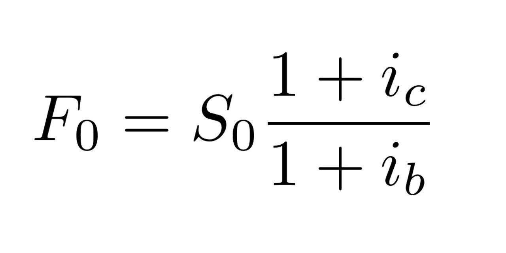

The foreign exchange market, commonly known as the forex market, is a pivotal component of the global financial system, characterized by its high liquidity and volatile nature. It stands as the largest financial market in the world, with daily trading volumes exceeding $6 trillion as of 2021[^1^]. This environment presents myriad opportunities for traders and investors aiming to capitalize on currency fluctuations. One crucial concept in understanding the dynamics of forex trading is the Uncovered Interest Rate Parity (UIP).

Uncovered Interest Rate Parity is an essential economic theory connecting foreign and domestic interest rates with exchange rate expectations. It posits that the difference in interest rates between two countries is inherently related to changes in their exchange rates, suggesting that any excess return from currency investments should, in theory, be neutralized by currency depreciation or appreciation. UIP serves not only as a theoretical construct but also as an analytical tool, enabling market participants to forecast currency movements. This theory, unlike its counterpart, Covered Interest Rate Parity (CIP), operates without the safety net of forward contracts, thereby exposing traders to potential risks and rewards associated with currency fluctuations.



In this article, we will explore the calculation methodology of UIP, examining the factors influencing its application and relevance in interest rate parity. Additionally, the significance of UIP in the domain of algorithmic trading will be discussed, as it offers a quantitative framework for developing automated trading strategies. Understanding these concepts equips traders with a robust foundation for making informed decisions, potentially enhancing their ability to navigate the complexities of the forex market and harnessing opportunities for profit.

---

[^1^]: Bank for International Settlements. (2021). Triennial Central Bank Survey. Foreign exchange and over-the-counter derivatives markets in 2021.

## Table of Contents

## Understanding Uncovered Interest Rate Parity (UIP)

Uncovered Interest Rate Parity (UIP) is an economic concept that establishes a link between disparate national interest rates and the fluctuations in currency exchange rates. This principle is predicated on the notion that differences in interest rates between two countries should be mirrored by corresponding movements in exchange rates. Specifically, the theory suggests that a currency of a nation with a lower interest rate should appreciate relative to a currency with a higher interest rate. This ensures that investors, regardless of the currency they are dealing with, can expect comparable returns over equivalent time periods, adjusting for exchange rate changes.

Unlike its counterpart, Covered Interest Rate Parity (CIP), UIP does not incorporate the usage of forward contracts as a means of risk mitigation. While CIP involves forward agreements to lock in future exchange rates and thus eliminate exchange rate risk, UIP disregards such hedging instruments. Instead, UIP operates under the assumption of market efficiency, presuming that currency markets naturally adjust without external interventions to reflect [interest rate](/wiki/interest-rate-trading-strategies) differentials.

The theoretical foundation of UIP can be traced back to the law of one price, which posits that identical goods should command the same price globally when expressed in a common currency, assuming no transportation costs and no trade barriers. This law implies that financial markets should self-correct any discrepancies between interest rates and exchange rates, maintaining a state of equilibrium.

Mathematically, UIP can be expressed as:

$$
E(S_{t+1}) = S_t \times \left(1 + i_d \right) / \left(1 + i_f \right)
$$

Where:
- $E(S_{t+1})$ is the expected future spot exchange rate.
- $S_t$ is the current spot exchange rate.
- $i_d$ is the domestic interest rate.
- $i_f$ is the foreign interest rate.

In practice, however, UIP does not always hold due to market imperfections, differences in risk preferences among investors, and other external factors such as political events or sudden economic shifts. Despite these challenges, UIP remains an essential pillar in understanding the dynamics of foreign exchange markets and is frequently utilized as a foundational theory for more sophisticated models of exchange rate determination. Understanding and applying UIP can offer crucial insights for traders analyzing potential currency movements based on interest rate disparities.

## Calculating Uncovered Interest Rate Parity

Uncovered Interest Rate Parity (UIP) is a vital concept for traders aiming to exploit differences between interest rates and exchange rate expectations. The UIP condition suggests that the expected appreciation or depreciation of a currency is equal to the interest rate differential between two countries. The traditional mathematical representation of UIP can be written as:

$$
E(S_{t+1}) = S_t \times (1 + i_d) / (1 + i_f)
$$

Where:
- $E(S_{t+1})$ is the expected future spot exchange rate.
- $S_t$ is the current spot exchange rate.
- $i_d$ is the domestic interest rate.
- $i_f$ is the foreign interest rate.

This equation assumes that the spot exchange rate adjusts to reflect differences in interest rates between two countries. If the domestic interest rate is higher than the foreign interest rate, UIP predicts a future depreciation of the domestic currency to maintain economic equilibrium.

### Computational Steps and Variables

1. **Spot Exchange Rate ($S_t$)**: This is the current rate at which one currency can be exchanged for another. It serves as the baseline for calculating expected changes.

2. **Interest Rate Differential**: Calculate the difference between the domestic and foreign interest rates. This differential is a critical driver of expected currency appreciation or depreciation under UIP.

3. **Expected Future Spot Rate ($E(S_{t+1})$)**: Using the UIP formula, estimate the future spot rate based on the interest rate differential. This step involves projecting future rates, often using economic models or market expectations.

A simplified Python script to calculate the expected future spot rate using UIP might look like this:

```python
def calculate_future_spot_rate(current_spot_rate, domestic_interest_rate, foreign_interest_rate):
    future_spot_rate = current_spot_rate * (1 + domestic_interest_rate) / (1 + foreign_interest_rate)
    return future_spot_rate

current_spot_rate = 1.20  # Example spot rate
domestic_interest_rate = 0.03  # 3% domestic interest rate
foreign_interest_rate = 0.01  # 1% foreign interest rate

future_rate = calculate_future_spot_rate(current_spot_rate, domestic_interest_rate, foreign_interest_rate)
print(f"Expected Future Spot Rate: {future_rate}")
```

### Historical Examples and Real-World Applications

Historically, deviations from UIP have been observed, primarily due to market inefficiencies, transaction costs, and risk premia. For instance, during periods of high financial turbulence, currency movements can diverge significantly from UIP predictions. In practice, traders and investors may adjust their strategies if they anticipate such divergences, using them as potential opportunities to gain from market inefficiencies.

In the real world, UIP is used by analysts and traders to set rational expectations about future exchange rates, guiding their decision-making processes. Financial institutions and multinational corporations might incorporate UIP assessments to hedge risk, manage currency exposure, or predict financial statements' impact due to currency fluctuations.

While UIP provides a theoretical framework, it is essential to consider other market factors, such as investor sentiment and geopolitical events, that could influence exchange rate movements. Integrating UIP within a broader economic analysis allows for a more comprehensive understanding of potential market directions.

## Uncovered vs. Covered Interest Rate Parity

Uncovered Interest Rate Parity (UIP) and Covered Interest Rate Parity (CIP) are pivotal concepts in understanding the interplay between interest rates and currency values. Both seek to explain how interest rate differentials between countries influence exchange rates, yet they differ in their approach to managing risk and assumptions about market behavior.

CIP relies on the use of forward contracts as a hedging tool to eliminate foreign exchange risk. According to CIP, the difference between the forward exchange rate and the spot exchange rate should equal the interest rate differential between two countries. Mathematically, CIP is expressed as:

$$
F = S \times \left( \frac{1 + i_d}{1 + i_f} \right)
$$

where $F$ is the forward exchange rate, $S$ is the spot exchange rate, $i_d$ is the domestic interest rate, and $i_f$ is the foreign interest rate. In a perfectly efficient market, any discrepancy between the forward rate and the rate implied by the interest differential is arbitraged away by traders, thus ensuring equilibrium.

UIP, conversely, is predicated on the assumption of market efficiency without hedging. It posits that the expected future spot exchange rate will adjust to reflect interest rate differentials, meaning that currency with a higher interest rate will depreciate against a currency with a lower interest rate. The UIP condition can be written as:

$$
E(S_t) = S_0 \times \left( \frac{1 + i_d}{1 + i_f} \right)^t
$$

where $E(S_t)$ represents the expected future spot exchange rate. Unlike CIP, UIP does not provide an arbitrage mechanism to guarantee parity, instead relying on traders' expectations to align with future spot rates.

Theoretically, both UIP and CIP serve to explain how international capital flows respond to interest rate changes, yet in practice, they exhibit distinct implications. CIP holds more consistently in reality due to its reliance on [arbitrage](/wiki/arbitrage) and forward contracts, which are commonly used in currency markets to lock in exchange rates and stabilize earnings.

UIP, dependent on the assumption of rational expectations and market efficiency, faces challenges from empirical inconsistencies. Factors such as market barriers, transaction costs, and unexpected economic events can impede the realization of UIP, leading to deviations between expected and actual outcomes.

In trading, awareness of these parity conditions can inform strategies. CIP offers a more robust framework for managing risk via forward contracts, appealing to risk-averse traders. Meanwhile, UIP provides opportunities for speculative strategies centered on predictions about future exchange rate movements, albeit with higher risk due to its reliance on market expectations.

A comprehensive understanding of both UIP and CIP is essential in navigating the foreign exchange markets, each offering distinct insights and approaches to currency trading.

## Algorithmic Trading and Interest Rate Parity

Algorithmic trading has revolutionized the foreign exchange market by leveraging computational power to make rapid trading decisions based on predefined strategies. A crucial aspect of these strategies involves identifying and exploiting discrepancies in Uncovered Interest Rate Parity (UIP). When such discrepancies appear, algorithmic systems are designed to take advantage of potential arbitrage opportunities through high-speed trading, aiming to profit before the markets self-correct.

Algorithms rely heavily on historical data and predictive analytics to trade [forex](/wiki/forex-system) based on UIP models. By analyzing historical exchange rates and interest rate differentials, these algorithms can forecast future currency price movements. Machine learning techniques and statistical models, such as autoregressive integrated moving average (ARIMA) or GARCH (Generalized Autoregressive Conditional Heteroskedasticity), are often employed to enhance the accuracy of these predictions. Moreover, these tools help algorithms identify patterns or anomalies that could signal lucrative trading opportunities.

In terms of technical setups, major components include data feeds, programming environments, and execution platforms. Real-time and historical data feeds are vital, as algorithms must process vast amounts of information to make informed decisions. Languages such as Python are commonly used due to their extensive libraries and ease of use in data processing and financial modeling. Python libraries like NumPy, pandas, and statsmodels facilitate complex calculations, while [machine learning](/wiki/machine-learning) frameworks like TensorFlow and scikit-learn add predictive modeling capabilities.

The strategies employed in [algorithmic trading](/wiki/algorithmic-trading) of UIP are typically designed for speed and precision. These algorithms monitor global interest rate announcements, economic indicators, and geopolitical events. Upon detecting a market shift or disparity between the expected and current exchange rates, the algorithm might execute trades almost instantaneously. High-frequency trading ([HFT](/wiki/high-frequency-trading-strategies)) strategies are particularly effective in this context, as they capitalize on brief inefficiencies in the market, often holding positions for mere seconds or minutes.

A simple Python example to illustrate the calculation of expected forward rates based on interest rate differentials might look like this:

```python
def calculate_forward_rate(spot_rate, domestic_rate, foreign_rate, period):
    """
    Calculate the expected forward rate based on interest rate differential.

    :param spot_rate: current spot exchange rate
    :param domestic_rate: domestic interest rate as a decimal
    :param foreign_rate: foreign interest rate as a decimal
    :param period: time period for the forward rate in years
    :return: expected forward rate
    """
    return spot_rate * (1 + domestic_rate * period) / (1 + foreign_rate * period)

# Example usage
spot_rate = 1.10  # current spot exchange rate
domestic_rate = 0.02  # 2% domestic interest rate
foreign_rate = 0.03  # 3% foreign interest rate
period = 1  # 1-year forward rate

forward_rate = calculate_forward_rate(spot_rate, domestic_rate, foreign_rate, period)
print(f"The expected forward rate is {forward_rate:.4f}")
```

This example demonstrates how an algorithm could compute whether the actual forward rate aligns with UIP predictions, flagging potential discrepancies for trading decisions. Algorithmic trading systems equipped with the capability to quickly analyze and react to unsteady UIP conditions offer substantial advantages in the highly volatile forex market.

## Limitations and Challenges of UIP

Uncovered Interest Rate Parity (UIP) is a pivotal concept in forex trading, positing that currency exchange rate movements should offset interest rate differentials between countries. However, its practical application encounters several challenges and limitations.

One significant limitation is the presence of market imperfections. The global foreign exchange market is influenced by various factors, including transaction costs, capital controls, and asymmetric information, which can hinder the seamless operation predicted by UIP. These imperfections can cause deviations from the expected parity, leading to discrepancies between theoretical forecasts and actual market behavior.

Policy changes are another crucial [factor](/wiki/factor-investing). Governments and central banks frequently intervene in currency markets to stabilize their national economies, often implementing monetary policies that can disrupt the natural flow of interest rate adjustments. Such interventions can skew the interest rate differential and the expected exchange rate movement, thereby challenging the assumptions of UIP.

Unforeseen economic events also pose a challenge to the UIP hypothesis. Events such as financial crises, geopolitical tensions, or sudden economic shifts can lead to abrupt changes in investor sentiment and capital flows, resulting in exchange rate fluctuations that do not align with interest rate differentials. These events can introduce [volatility](/wiki/volatility-trading-strategies) that is unaccounted for by UIP, further highlighting its practical limitations.

Historical evidence provides real-world examples where UIP has diverged from theoretical predictions. For instance, during the European sovereign debt crisis, the interest rate differentials in European countries did not always align with the movements in exchange rates as predicted by UIP. Similarly, during times of economic uncertainty, such as the 2008 global financial crisis, massive shifts in capital flows and risk aversion significantly deviated from the UIP model.

In summary, while UIP offers valuable insights into the expected relationship between interest rates and exchange rates, its empirical application is fraught with challenges. Market imperfections, policy changes, and unpredictable economic events introduce complexities that can lead to disparities between UIP predictions and actual market outcomes. Understanding these limitations is crucial for traders and economists when applying UIP to real-world currency markets.

## Conclusion

In the landscape of forex trading, interest rate parity theories such as Uncovered Interest Rate Parity (UIP) provide valuable insights for developing effective trading and investment strategies. UIP posits that the difference in interest rates between two countries should equate to the expected change in their currency exchange rates. This theoretical framework allows traders to evaluate potential currency movements, offering a structured approach to prognosticating market behavior. Despite its theoretical elegance, UIP is not without its limitations. Factors such as market imperfections, policy shifts, and unexpected economic events can lead to deviations from predicted outcomes. Nevertheless, a solid grasp of UIP empowers traders to better anticipate and respond to sudden market changes, enhancing their strategic decision-making.

Incorporating UIP into algorithmic trading strategies represents a significant opportunity for exploiting market inefficiencies. By leveraging predictive analytics and historical data, advanced algorithms can identify and act upon discrepancies in interest and exchange rate differentials. Such automated approaches enhance the precision and speed of executing trades, potentially leading to substantial gains in the currency markets.

As with any trading strategy, due diligence remains crucial. Traders must continually update their understanding of market dynamics and refine their strategies to adapt to evolving conditions. Educational resources, robust analytical tools, and a disciplined approach to risk management form the backbone of successful trading. Through continuous learning and adaptability, traders can leverage UIP to improve their performance in the highly competitive world of forex trading.

## References & Further Reading

[1]: Bank for International Settlements. (2021). ["Triennial Central Bank Survey. Foreign exchange and over-the-counter derivatives markets in 2021."](https://www.bis.org/publ/arpdf/ar2021e.htm)

[2]: MacDonald, R., & Taylor, M. P. (1992). ["Exchange Rate Economics: A Survey."](https://www.jstor.org/stable/3867200) International Monetary Fund Staff Papers, 39(1), 1-57.

[3]: Engel, C. (1996). ["The Forward Discount Anomaly and the Risk Premium: A Survey of Recent Evidence."](https://www.nber.org/papers/w5312) Journal of Empirical Finance, 3(2), 123-192.

[4]: Fama, E. F. (1984). ["Forward and Spot Exchange Rates."](https://www.sciencedirect.com/science/article/pii/0304393284900461) Journal of Monetary Economics, 14(3), 319-338.

[5]: Rosenberg, M. (2003). ["Exchange Rate Determination: Models and Strategies for Exchange Rate Forecasting"](https://archive.org/details/exchangeratedete0000rose) (1st ed.). McGraw-Hill.

[6]: Sarno, L., & Taylor, M. P. (2001). ["Official Intervention in the Foreign Exchange Market: Is It Effective and, If So, How Does It Work?"](https://www.aeaweb.org/articles?id=10.1257/jel.39.3.839) The World Bank Economic Review, 15(3), 257-270.