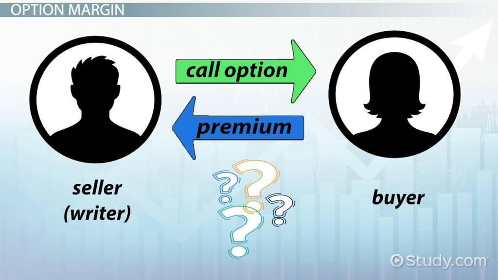

## Table of Contents

## What are uncovered options?

Uncovered options, also known as naked options, are a type of options trading where the seller does not own the underlying asset. When someone sells an uncovered call option, they are promising to sell a stock they don't own at a certain price if the buyer decides to exercise the option. This can be risky because if the stock price goes up a lot, the seller has to buy the stock at the higher market price and then sell it at the lower agreed price, which can lead to big losses.

On the other hand, selling an uncovered put option means the seller agrees to buy the stock at a set price if the buyer exercises the option. If the stock price drops significantly, the seller will have to buy the stock at a higher price than the market value, which can also result in losses. Because of these risks, uncovered options are considered advanced trading strategies and are usually only recommended for experienced traders who understand the potential downsides.

## How do uncovered options differ from covered options?

Uncovered options, also called naked options, are when someone sells an option without owning the actual stock. If it's a call option, the seller promises to sell the stock at a set price even though they don't have it. If the stock price goes up a lot, the seller has to buy the stock at the higher price and then sell it at the lower price they promised, which can lead to big losses. If it's a put option, the seller agrees to buy the stock at a set price if the buyer wants to sell it. If the stock price drops a lot, the seller ends up buying the stock at a higher price than it's worth, which can also lead to losses.

Covered options are different because the seller actually owns the stock they're selling the option for. When someone sells a covered call, they already have the stock, so if the buyer exercises the option, the seller just gives them the stock they already own. This limits the risk because the most the seller can lose is the difference between the stock's price when they bought it and the price they sell it at. Selling a covered put is less common, but it means the seller is ready to buy more of the stock they already own if the buyer exercises the option. Covered options are generally seen as safer because the risk is lower since the seller has the stock to back up their promise.

## What are the basic types of uncovered options?

Uncovered options come in two basic types: uncovered calls and uncovered puts. An uncovered call is when someone sells a call option without owning the stock. This means they promise to sell the stock at a certain price if the buyer wants it, even though they don't have the stock. If the stock price goes up a lot, the seller has to buy the stock at the higher price and then sell it at the lower price they promised, which can lead to big losses.

An uncovered put is when someone sells a put option without owning the stock. This means they agree to buy the stock at a set price if the buyer wants to sell it, even though they don't have the stock. If the stock price drops a lot, the seller ends up buying the stock at a higher price than it's worth, which can also lead to losses. Both types of uncovered options are risky because the seller doesn't have the stock to back up their promise.

## What are the risks associated with trading uncovered options?

Trading uncovered options can be very risky. When you sell an uncovered call, you're promising to sell a stock you don't own at a certain price. If the stock price goes up a lot, you have to buy it at the higher price and then sell it at the lower price you promised. This can lead to big losses because you're losing money on the difference between the two prices. It's like betting that the stock won't go up too much, but if it does, you can lose a lot.

Selling an uncovered put is also risky. You're agreeing to buy a stock at a set price even though you don't own it. If the stock price drops a lot, you'll have to buy it at a higher price than it's worth. This means you're losing money because you're paying more for the stock than it's currently worth. Both types of uncovered options are risky because you don't have the stock to back up your promise, so the potential for big losses is high.

## How can someone start trading uncovered options?

To start trading uncovered options, you first need to open a brokerage account that allows options trading. Not all brokerages let you trade uncovered options because they're risky, so you might need to look for one that does. Once you have an account, you'll need to get approved for options trading. This usually involves filling out an options trading application and answering questions about your experience and financial situation. The brokerage will review your application to make sure you understand the risks and have enough money to cover potential losses.

After you're approved, you can start selling uncovered options. You'll use the trading platform provided by your brokerage to place your orders. When selling an uncovered call, you're promising to sell a stock you don't own at a certain price. If the stock price goes up a lot, you'll have to buy it at the higher price and sell it at the lower price you promised, which can lead to big losses. When selling an uncovered put, you're agreeing to buy a stock at a set price even though you don't own it. If the stock price drops a lot, you'll have to buy it at a higher price than it's worth, which can also lead to losses. Because of these risks, it's important to understand what you're doing and be ready for the possibility of losing money.

## What are the margin requirements for uncovered options?

When you trade uncovered options, you need to have enough money in your account to cover potential losses. This is called the margin requirement. For uncovered calls, the margin requirement is usually the full value of the stock you're promising to sell, minus the premium you get from selling the option. This is because if the stock price goes up a lot, you'll have to buy it at the higher price and then sell it at the lower price you promised, which can lead to big losses. The margin requirement helps make sure you have enough money to cover that loss.

For uncovered puts, the margin requirement is usually the full value of the stock you're agreeing to buy, minus the premium you get from selling the option. This is because if the stock price drops a lot, you'll have to buy it at a higher price than it's worth, which can also lead to losses. The margin requirement makes sure you have enough money to cover that loss too. Brokerages can have different rules for margin requirements, so it's important to check with your brokerage to know exactly how much money you need to have in your account before you start trading uncovered options.

## What strategies can be used with uncovered options?

One strategy people use with uncovered options is called selling naked calls. This means you're betting that a stock won't go up too much. You sell someone the right to buy the stock at a certain price, even though you don't own the stock. If the stock stays below that price, you keep the money you got from selling the option. But if the stock goes up a lot, you have to buy it at the higher price and sell it at the lower price you promised, which can lead to big losses. This strategy can be risky, but it can also make you money if you're right about the stock not going up too much.

Another strategy is selling naked puts. This means you're betting that a stock won't go down too much. You sell someone the right to sell you the stock at a certain price, even though you don't own the stock. If the stock stays above that price, you keep the money you got from selling the option. But if the stock goes down a lot, you have to buy it at the higher price you promised, which can lead to losses. This strategy can also be risky, but it can make you money if you're right about the stock not going down too much. Both strategies need careful thinking because the risks can be high.

## How do market conditions affect the performance of uncovered options?

Market conditions can really change how well uncovered options do. If the market is going up a lot, selling uncovered calls can be risky. That's because if you sell a call and the stock price goes way up, you have to buy the stock at the higher price and sell it at the lower price you promised. This can lead to big losses. On the other hand, if the market is going down or staying the same, selling uncovered calls might be safer because the stock price is less likely to go up a lot.

If the market is going down a lot, selling uncovered puts can be risky. That's because if you sell a put and the stock price drops a lot, you have to buy the stock at the higher price you promised, which can also lead to big losses. But if the market is going up or staying the same, selling uncovered puts might be safer because the stock price is less likely to drop a lot. So, it's important to think about what the market is doing before you start trading uncovered options.

## What are the tax implications of trading uncovered options?

When you trade uncovered options, you need to think about taxes. If you make money from selling uncovered options, that money is usually taxed as ordinary income. This means it's added to your other income and taxed at your regular tax rate. If you lose money, you can use those losses to lower your taxes. You can take up to $3,000 of those losses off your income each year. If you have more losses than that, you can [carry](/wiki/carry-trading) them over to future years.

The tax rules can be different depending on how long you hold the options. If you hold them for less than a year, any gains are short-term capital gains and taxed as ordinary income. If you hold them for more than a year, they might be long-term capital gains, which can have a lower tax rate. But with uncovered options, it's usually hard to hold them for a year because they often expire or get exercised before then. So, it's important to keep good records and maybe talk to a tax professional to make sure you're doing everything right.

## How can one manage the risks of uncovered options?

Managing the risks of uncovered options can be tricky, but there are some things you can do to help. One way is to use stop-loss orders. This means you set a price where you'll automatically close your position if the stock moves against you too much. It can help limit your losses, but it's not perfect because the price might keep moving before your order goes through. Another way is to keep an eye on the market and be ready to act fast. If you see the stock moving in a way that could hurt you, you might want to close your position early to avoid bigger losses.

Another important thing is to not put all your money into one trade. Spread your risk by trading different stocks or using different strategies. This way, if one trade goes bad, you won't lose everything. Also, make sure you have enough money in your account to cover the margin requirements. This can help you avoid getting a margin call, which is when your broker asks for more money because your account balance is too low. By being careful and using these strategies, you can better manage the risks of trading uncovered options.

## What advanced techniques can be used to optimize returns from uncovered options?

One advanced technique to optimize returns from uncovered options is to use a strategy called delta hedging. This means you keep an eye on how much the price of the option changes when the stock price changes. If the stock price goes up and your option loses value, you can buy or sell the stock to balance things out. This can help you make money even if the stock price moves against you. It's like trying to keep your risk level steady, so you can make the most of the money you get from selling the option.

Another technique is to use a straddle or strangle strategy. With a straddle, you sell both a call and a put option on the same stock at the same price. With a strangle, you sell them at different prices. These strategies can make you money if the stock price stays the same or moves a lot in either direction. The key is to pick the right stock and the right time to do it. Both strategies need careful planning and a good understanding of the market, but they can help you get the most out of your uncovered options.

## How do regulatory frameworks impact the trading of uncovered options?

Regulatory frameworks can have a big impact on trading uncovered options. Different countries have different rules about who can trade them and how they can be traded. For example, in the United States, the Financial Industry Regulatory Authority (FINRA) and the Securities and Exchange Commission (SEC) set rules that brokers must follow. These rules can include things like making sure traders have enough money in their accounts to cover potential losses, and that they understand the risks involved. Some brokers might not let you trade uncovered options at all, or they might require you to have a lot of experience before they approve you.

These regulations are there to protect investors from losing too much money. Because uncovered options can be very risky, regulators want to make sure people know what they're doing before they start trading them. This means you might have to fill out special forms or go through training before you can trade uncovered options. The rules can also change over time, so it's important to stay up to date with what your broker and the regulators say about uncovered options trading.

## References & Further Reading

[1]: Hull, John C. ["Options, Futures, and Other Derivatives."](https://www.pearson.com/en-us/subject-catalog/p/options-futures-and-other-derivatives/P200000005938/9780136939917) Pearson Education.

[2]: Chan, Ernest P. ["Quantitative Trading: How to Build Your Own Algorithmic Trading Business."](https://github.com/ftvision/quant_trading_echan_book) Wiley.

[3]: Jansen, Stefan. ["Machine Learning for Algorithmic Trading."](https://github.com/stefan-jansen/machine-learning-for-trading) Packt Publishing.

[4]: Lopez de Prado, Marcos. ["Advances in Financial Machine Learning."](https://www.amazon.com/Advances-Financial-Machine-Learning-Marcos/dp/1119482089) Wiley.

[5]: Aronson, David R. ["Evidence-Based Technical Analysis: Applying the Scientific Method and Statistical Inference to Trading Signals."](https://www.amazon.com/Evidence-Based-Technical-Analysis-Scientific-Statistical/dp/0470008741) Wiley.

[6]: Bergstra, J., Bardenet, R., Bengio, Y., & Kégl, B. (2011). ["Algorithms for Hyper-Parameter Optimization."](https://dl.acm.org/doi/10.5555/2986459.2986743) Advances in Neural Information Processing Systems 24.