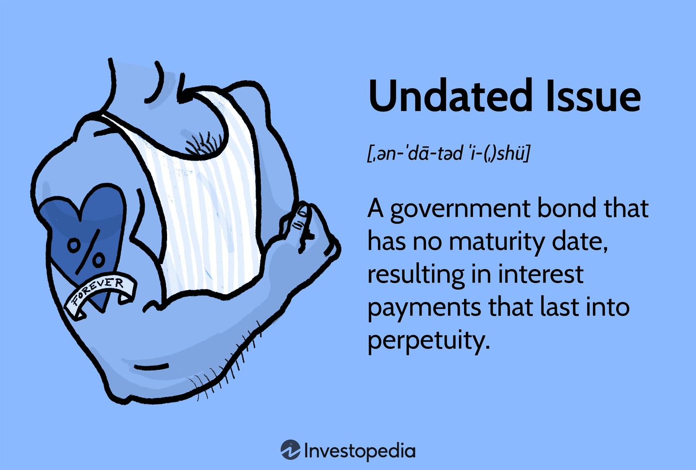

In today’s fast-paced digital era, the importance of effective data management and categorization is more significant than ever before. The financial sector, in particular, faces the intricate challenges of managing undated issue documents, which have garnered attention due to their relevance to algorithmic trading. Undated issue documents, often linked to complex financial instruments like perpetual bonds, present unique categorization challenges that require precise handling for accurate data interpretation and decision-making.

This article examines the critical intersection of date classification, document categorization, and algorithmic trading. It focuses on the strategies and technologies implemented to address these complexities. As data-driven decision-making becomes increasingly pivotal in financial markets, understanding the synergies among these components provides substantial benefits to financial analysts, traders, and data scientists.



Date classification and document categorization are essential for processing the vast volumes of financial data that underpin algorithmic trading. The interplay between these elements supports the reliability and accuracy of trading operations, ultimately enhancing financial processes and outcomes. By unraveling how each component contributes to this ecosystem, stakeholders can optimize their strategic positioning and operational efficiency in a rapidly evolving financial landscape.

## Table of Contents

## Understanding Undated Issues

Undated issues, often referred to as perpetual bonds, represent a distinctive class of financial instruments that lack a predefined maturity date. These instruments are engineered to provide continuous interest payments, allowing them to serve as a stable income source. Typically utilized by sovereign entities and large corporations, perpetual bonds enable these issuers to secure long-term capital without the pressure of a repayment timeline.

The architectural framework of undated issues is such that they offer fixed interest payments indefinitely. These payments function similarly to dividends in equities, thereby endowing these bonds with investment characteristics akin to stocks. This equity-like behavior is partly due to the absence of maturity, which turns the focus of investors towards the income generation potential of these bonds rather than capital repayment.

The historical context of undated issues can be traced back to instruments such as the British government's consols. Established in the 18th century, consols were among the earliest forms of undated bonds and set a precedent for the structure of perpetual bonds today. Consols were a strategic financing tool during war times, allowing the government to borrow extensively without immediate repayment obligations. As such, they underscore the long-standing utilization of undated issues in financial markets.

The British consols illustrate the evolution and enduring significance of perpetual bonds. Initially created as a mechanism for government financing, consols have transitioned into a more generalized instrument for raising capital, reflecting the broader shift toward perpetual financial products. Their legacy highlights the capacity of undated issues to adapt and sustain relevance across different economic contexts.

Investors often approach undated issues with a strategy that mirrors equity investments, given their perpetual nature and income-producing capabilities. The emphasis is on the yield and cash flow these bonds can deliver over time, which necessitates a thorough understanding of the issuer's creditworthiness and market conditions.

In summary, undated issues serve as a critical tool for financial markets, providing an avenue for sustained interest income and long-term capital management. Their unique nature requires careful consideration and strategic management by those engaged in financial operations.

## The Role of Document Classification in Financial Documents

Document classification refers to the organization of textual data into specified categories or taxonomies. This process has been significantly enhanced by [artificial intelligence](/wiki/ai-artificial-intelligence) (AI) and [machine learning](/wiki/machine-learning) (ML) technologies, which have introduced automated systems capable of handling large volumes of complex data with high precision. These innovations have become particularly important in the financial sector, where the sheer [volume](/wiki/volume-trading-strategy) and complexity of documents necessitate efficient and accurate classification systems.

One of the primary challenges in document classification is dealing with unstructured data. Unlike structured data, which is organized and easily searchable, unstructured data comes in various forms, such as emails, PDFs, and word documents, making it more challenging to categorize. Machine learning models, particularly those based on natural language processing (NLP), are often utilized to address this challenge. NLP techniques allow for the extraction of meaning and context from text, enabling machines to classify documents more accurately.

Scalability is another significant challenge. Financial institutions must process a large number of documents quickly, which requires systems that can scale efficiently without sacrificing accuracy. Machine learning algorithms, such as Support Vector Machines (SVM) and neural networks, are well-suited for this task, as they can learn from data iteratively and improve their performance over time.

To enhance accuracy, financial institutions often employ advanced AI models that undergo continuous training. These models are exposed to new data regularly, allowing them to adapt to changes and refine their classification capabilities. This adaptive learning process is crucial in maintaining the reliability and precision of document classification systems.

In the financial trading sector, precise document classification is critical for regulatory compliance and operational efficiency. Misclassification can lead to regulatory breaches and financial losses. Therefore, accurate categorization ensures that documents are correctly processed and stored, which aids in maintaining compliance with financial regulations and standards.

Organizations are leveraging big data analytics and cloud computing to further improve classification systems. Cloud-based platforms offer the necessary computational power and storage needed to handle vast amounts of data, while APIs enable seamless integration of classification tools into existing systems.

In summary, document classification has become a vital component in financial document management. By harnessing the power of AI and machine learning, financial institutions can address the challenges of unstructured data, scalability, and accuracy, thereby ensuring regulatory compliance and enhancing operational efficiency.

## Algorithmic Trading and Its Dependence on Data Accuracy

Algorithmic trading is a sophisticated domain within the financial markets, defined by the use of computer algorithms to automate trading decisions that are executed at high speeds and volumes. A critical aspect of [algorithmic trading](/wiki/algorithmic-trading) is the reliance on accurate and timely data, where the precision and immediacy of information directly affect trading strategies and outcomes.

### Importance of Data Accuracy

Data accuracy and proper categorization, particularly regarding dates, are paramount. Algorithms ingest vast amounts of data — from transaction records to financial reports — and a single misclassification can cascade into erroneous trades and substantial financial losses. Accurate date classification ensures that trading algorithms can correctly sequence events and make informed predictions, which is vital for strategies based on historical performance or time-sensitive signals.

### The Role of Date Classification

Date classification is crucial in verifying the chronological order of financial events. Algorithms depend on the correct temporal placement of data points to make predictive decisions, such as forecasting prices, executing [arbitrage](/wiki/arbitrage) strategies, or assessing market sentiment. For example, if a financial report is incorrectly tagged as current rather than archival, it could skew historical analysis, leading to flawed predictions and trading decisions.

### Mitigating Risks through Classification Algorithms

To mitigate the risks associated with data misclassification, trading firms integrate advanced classification algorithms that leverage machine learning and artificial intelligence. These sophisticated models improve the accuracy of data categorization, adapting over time to recognize new patterns and nuances. By refining these models continuously, firms can reduce the incidence of errors, thereby increasing the reliability of trading algorithms.

### Strategies for Ensuring Data Integrity

Algorithmic trading firms employ a variety of strategies to enhance data integrity. These include implementing rigorous data validation protocols, using redundant data sources to cross-verify information, and employing real-time monitoring systems to detect and correct anomalies swiftly. Additionally, employing technologies such as blockchain can offer decentralized verification, adding another layer of security and accuracy to data handling processes.

In conclusion, the intricate interplay between data accuracy and algorithmic trading underscores the necessity for meticulous data management. Firms that adeptly manage these elements can significantly enhance their trading performance, while those that neglect data integrity may face substantial risks.

## Technological Innovations in Document Classification and Trading

Innovations in AI and machine learning have fundamentally altered the landscape of financial document classification and analysis. At the core of this transformation is the ability of advanced tools to rapidly process and accurately analyze large volumes of documents, thus facilitating quicker and more informed decision-making for traders. Natural Language Processing (NLP) models, like BERT (Bidirectional Encoder Representations from Transformers), have emerged as powerful assets, processing text data with remarkable precision and understanding context more effectively than earlier models. This comprehension is crucial in financial contexts where nuanced language can significantly impact interpretation.

In addition to NLP, machine learning algorithms leverage historical trading data and document metadata to classify and categorize documents efficiently. These algorithms can identify patterns and relationships within data that might not be immediately evident to human analysts, thus enhancing operational efficiencies.

FinTech solutions capitalize on big data analytics to refine trading strategies. By analyzing large datasets, these technologies help in identifying trends, predicting market movements, and optimizing portfolio allocations. The ability to process diverse datasets in real-time allows trading entities to maintain a competitive edge and adjust strategies dynamically based on market conditions.

The integration of Application Programming Interfaces (APIs) and cloud-based platforms is pivotal in achieving seamless data integration. APIs facilitate the rapid exchange of information between systems, ensuring that trading algorithms have access to the latest data. Cloud-based platforms offer scalable and flexible storage solutions, enabling the handling of vast amounts of data without significant infrastructure investments. This capability is particularly valuable for algorithmic trading, where data integrity and accessibility are critical for successful execution.

Overall, these technological advancements are integral to the modern trading ecosystem. They not only enhance the speed and accuracy of document classification but also improve the robustness and adaptability of trading strategies. As AI and machine learning continue to evolve, their impact on document classification and trading is expected to grow, further pushing the boundaries of what is possible in algorithmic trading.

## Challenges in Adapting to New Financial Instruments

With the introduction of new financial instruments, classification systems must adapt rapidly to address the complexities and nuances these innovations bring. Emerging markets, such as cryptocurrencies, introduce unique challenges that traditional algorithms may not be equipped to handle. For instance, cryptocurrencies often exhibit high [volatility](/wiki/volatility-trading-strategies), a lack of historical data, and unique transaction structures that differ significantly from traditional assets. As a result, existing models may struggle to accurately interpret and classify such instruments, necessitating the development of more sophisticated solutions.

To maintain classification accuracy and system robustness, continuous training and model adjustments are crucial. Machine learning models, particularly those used for document classification, require updated datasets that reflect the current landscape of financial instruments. In practice, this can mean regular retraining on new data to incorporate recent trends and anomalies into model predictions. In Python, this retraining process could involve using libraries such as TensorFlow or PyTorch to update neural networks with new information:

```python
import tensorflow as tf

# Assuming `new_data` is a dataset containing recent financial trends
model = tf.keras.models.load_model('existing_model.h5')
model.fit(new_data, epochs=5, batch_size=32)
model.save('updated_model.h5')
```

Furthermore, a flexible architecture for classification systems is essential. Such systems must be capable of integrating new modules and functionalities to accommodate evolving market dynamics. Adopting microservices architectures or modular frameworks can offer the required scalability and adaptability, enabling swift responses to changes and reducing the need for extensive system overhauls.

Financial institutions that proactively manage these challenges by investing in infrastructure and algorithmic flexibility are better positioned to capitalize on emerging opportunities. By doing so, they can enhance their ability to quickly adapt to and benefit from new instruments, thereby securing a competitive edge in the financial industry. This adaptability not only helps in absorbing market shocks but also in leveraging novel financial products that may offer substantial returns. As technology and financial markets continue to intertwine, the capacity to swiftly and accurately classify new financial instruments becomes a cornerstone of strategic success in finance.

## Conclusion

The integration of document classification, undated issues, and algorithmic trading is critical to the development of contemporary trading strategies. As the landscape of financial markets is continually shifting, it's imperative for technologies and methodologies to concurrently advance. This necessity stems from the increasing complexity and volume of financial data that require efficient management solutions. Document classification serves not only to streamline workflows but also to ensure compliance with regulatory frameworks, which is vital in maintaining operational integrity.

Financial enterprises that commit to investing in emerging classification technologies and enhanced algorithmic trading models are likely to gain a significant competitive edge. This advantage arises from their ability to process large quantities of data with high precision and speed, enabling them to make informed and timely trading decisions. Moreover, the seamless integration of data analytics and AI-driven tools has become a cornerstone for achieving operational excellence and strategic dominance in the market.

The future trajectory of the financial sector hinges on the adept processing and categorization of data. Financial entities that master these domains can elevate their standing in an increasingly competitive marketplace. By leveraging the synergy among document classification, the unique characteristics of undated issues, and the sophistication of algorithmic trading, businesses can refine their strategic positioning and enhance operational efficiency. In conclusion, the intertwined nature of these elements underscores the profound impact they collectively impart on the evolution and optimization of financial practices.

## References & Further Reading

[1]: ["Advances in Financial Machine Learning"](https://www.amazon.com/Advances-Financial-Machine-Learning-Marcos/dp/1119482089) by Marcos Lopez de Prado

[2]: ["Machine Learning for Algorithmic Trading"](https://github.com/stefan-jansen/machine-learning-for-trading) by Stefan Jansen

[3]: ["Quantitative Trading: How to Build Your Own Algorithmic Trading Business"](https://github.com/LucindaYa/quant-resources/blob/master/Quantitative%20Trading%20How%20to%20Build%20Your%20Own%20Algorithmic%20Trading%20Business.pdf) by Ernest P. Chan

[4]: ["Evidence-Based Technical Analysis: Applying the Scientific Method and Statistical Inference to Trading Signals"](https://www.amazon.com/Evidence-Based-Technical-Analysis-Scientific-Statistical/dp/0470008741) by David Aronson

[5]: ["Algorithms for Hyper-Parameter Optimization."](https://papers.nips.cc/paper/4443-algorithms-for-hyper-parameter-optimization.pdf) by Bergstra, J., Bardenet, R., Bengio, Y., & Kégl, B. Advances in Neural Information Processing Systems 24.