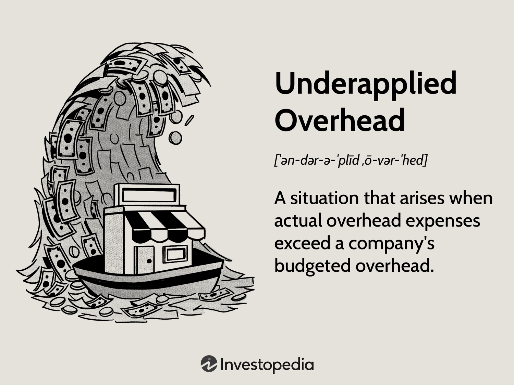

In the dynamic world of finance and accounting, understanding key concepts is crucial for business success. Among these principles, the notions of underapplied and overapplied overhead hold significant importance. These concepts are integral to effective budgeting, ensuring that financial operations reflect accurate cost management and resource allocation.

Overhead, in an accounting context, consists of costs that are not directly attributable to any specific product or service but are essential for the smooth functioning of the company's operations. These general operational costs need careful management to influence strategic business decisions, particularly in setting prices and maintaining profitability. Proper understanding and application of overhead within budgeting processes allow businesses to predict financial outcomes more accurately and allocate resources where most needed.



The interplay between budgeting and overhead management further extends into modern financial strategies like algorithmic trading. Utilizing algorithms to automate trading activities requires a nuanced grasp of financial variables, including overhead costs. When actual overhead costs diverge from budgeted figures, they create underapplied or overapplied overhead, influencing an organization's financial statements and requiring adjustments to maintain accurate financial portrayals.

Exploring these concepts provides a foundation for understanding how they impact business operations and strategic decisions. These insights offer valuable implications for traders and businesses aiming to refine their financial strategies and operations through informed decision-making. By comprehensively acknowledging these concepts, organizations better position themselves to achieve financial stability and leverage competitive advantages in the evolving market landscape.

## Table of Contents

## Understanding Overhead in Budgeting

Overhead costs are integral to the functioning of any organization, representing expenses that support operations but are not tied to specific products or services. These include utilities, rent, administrative salaries, and maintenance, among others. In budgeting, overhead plays a crucial role as it aids in forecasting future financial requirements by identifying standard operational expenses not directly influenced by production levels or service delivery.

Incorporating overhead into budgeting is essential for setting precise budgetary allocations and product pricing strategies. This involves estimating the anticipated overhead expenses and integrating them into the overall budget to ensure financial plans are comprehensive and realistic. Effective budgeting accounts for overhead by using historical data, market trends, and economic forecasts to project future operational costs accurately.

Proper management of overhead is vital to maintaining an organization's financial health. By meticulously budgeting these costs, businesses can avoid financial discrepancies, optimize resource allocation, and ensure sustainability. This management involves regularly reviewing and adjusting overhead allocations based on actual expenditures and operational changes.

Furthermore, strategic overhead budgeting allows companies to set pricing strategies that reflect true production costs. By understanding the full spectrum of overhead expenses, organizations can better position their products in the market and make informed pricing decisions. This approach not only supports accurate financial planning but also ensures that businesses remain competitive and profitable.

Overall, effective overhead management is an indispensable element of sound financial strategy, essential for sustaining operations, driving growth, and achieving long-term business success.

## Underapplied vs. Overapplied Overhead

Underapplied overhead occurs when the actual overhead costs surpass the budgeted amount, resulting in an unfavorable variance. This discrepancy indicates that a business has underestimated its anticipated indirect costs, which can impact its profitability analysis and financial reporting accuracy. Conversely, overapplied overhead arises when actual costs are lower than the budgeted figures, leading to a favorable variance. This suggests an overestimation of overhead expenses, which might distort the cost of goods sold and subsequently inflate reported profits.

Both scenarios necessitate adjustments to the company's financial statements. Specifically, the cost of goods sold and inventory accounts are adjusted to align reported earnings with actual costs. This ensures that the balance sheet accurately reflects the true expenses incurred during a financial period. For instance, if overhead is underapplied, the company will need to increase the cost of goods sold or decrease inventory values to account for the higher actual overhead. Conversely, overapplied overhead leads to decreasing the cost of goods sold or increasing inventory values to correct for the lower than expected costs.

The formula for calculating the applied overhead is expressed as:

$$
\text{Applied Overhead} = \text{Predetermined Overhead Rate} \times \text{Actual Activity Base}
$$

Where:
- **Predetermined Overhead Rate** is derived from dividing the estimated total manufacturing overhead for the period by the estimated total amount of the activity base (e.g., labor hours, machine hours).
- **Actual Activity Base** represents the actual number of labor or machine hours incurred.

Understanding these variances assists managers in refining operational strategies. By identifying patterns such as consistent underapplication or overapplication of overhead, companies can modify budgeting practices to enhance accuracy. Such insights contribute to more precise resource allocation and operational planning, thereby optimizing financial performance and maintaining market competitiveness.

## The Role of Budgeting in Business Strategy

Effective budgeting serves as a cornerstone in strategic planning for business growth. It extends beyond mere cost management by providing a structured approach to forecasting and allocating financial resources. Anticipating financial needs allows companies to distribute their resources efficiently, minimizing unexpected disruptions and capitalizing on growth opportunities. By preparing for unforeseen challenges, budgeting helps ensure financial stability and operational continuity.

Moreover, budgeting plays a crucial role in evaluating the financial feasibility of projects and investments. By meticulously analyzing anticipated revenues and expenses, businesses can make informed decisions about where to allocate resources, ensuring that investments align with corporate goals and generate desired returns. This process inherently incorporates risk assessment, allowing companies to quantify uncertainties and devise strategies to mitigate potential financial setbacks.

Incorporating overhead analysis into budgeting systems significantly enhances their effectiveness. Overhead, which encompasses costs not directly linked to specific products or services, must be carefully assessed and allocated. Properly managing overhead ensures that all expenditures are accounted for, leading to more precise budgeting. This comprehensive cost allocation helps avoid underestimations that could result in financial shortfalls or overestimations that might tie up capital unnecessarily.

Understanding and managing overhead—whether underapplied or overapplied—are vital skills for companies aiming to strengthen their financial strategy. By continuously refining their budgeting processes to incorporate thorough overhead analysis, businesses can achieve improved financial outcomes. It provides a clearer picture of operational costs, allowing for strategic adjustment and optimization. This alignment not only supports sound financial planning but also underpins sustainable growth, giving businesses a competitive edge in the marketplace.

## Algorithmic Trading: Integrating Financial Strategies

Algorithmic trading employs sophisticated algorithms to automate the execution of trade orders in financial markets, enhancing efficiency and reaction speed during trading sessions. These algorithms evaluate multiple market variables to determine optimal trading opportunities, minimizing human intervention.

Integrating overhead management insights into these algorithms can significantly improve their predictive accuracy. Understanding financial complexities, such as underapplied and overapplied overhead, allows algorithms to account for real-world discrepancies in financial data. This integration ensures that algorithms are not purely reliant on historical data but also consider current financial conditions that might affect market behaviors. For instance, if certain overhead costs are consistently underapplied, leading to unexpected market conditions, an algorithm can be programmed to adjust its trading strategy accordingly.

Automation through algorithms maximizes operational efficiency by reducing the time needed to execute trades. By leveraging insights from financial budgeting, specifically related to overhead analysis, [algorithmic trading](/wiki/algorithmic-trading) systems can refine their decision-making processes. For example, accurate overhead allocation in a company's budgeting can predict cash flow constraints or surpluses, enabling algorithms to make more informed trading decisions. This information can be coded into algorithms to adjust trading thresholds or risk parameters, thereby aligning trading strategies with financial realities. Python, commonly used for such algorithmic development, benefits from extensive libraries such as NumPy and pandas, which are instrumental in processing financial datasets and conducting real-time analyses. Here is a basic outline for an algorithm that includes overhead data considerations:

```python
import numpy as np
import pandas as pd

# Load historical market and overhead data
market_data = pd.read_csv('market_data.csv')
overhead_data = pd.read_csv('overhead_data.csv')

# Calculate average overhead for enhanced predictive adjustment
average_overhead = np.mean(overhead_data['cost'])

# Define trading signal based on market trend and overhead variance
def trading_signal(market, overhead):
    if market['price'] > market['moving_average'] and overhead < average_overhead:
        return 'buy'
    elif market['price'] < market['moving_average'] and overhead > average_overhead:
        return 'sell'
    return 'hold'

# Apply signal to market data
market_data['signal'] = market_data.apply(lambda row: trading_signal(row, overhead_data.loc[row.name]['cost']), axis=1)
```

In this example, the algorithm evaluates market price trends against moving averages and adjusts its trade signals based on overhead variances. Such automation allows traders to benefit from comprehensive strategies that [factor](/wiki/factor-investing) in not only market metrics but also financial budgetary insights, ensuring more balanced and informed trading outcomes.

## Case Studies: Practical Applications of Overhead Management

Various industries apply overhead management to gain strategic advantages, ranging from manufacturing to financial services. Organizations that succeed in this area often maintain robust balance sheets and demonstrate exceptional financial management.

One example is Toyota, a global leader in the automotive industry, which employs overhead management principles to streamline production and reduce costs. Toyota's application of the Just-In-Time (JIT) production system minimizes inventory overhead, thereby reducing waste and improving efficiency. This approach aligns with the principles of lean manufacturing, where controlling overhead costs directly impacts profitability and competitiveness.

In the technology sector, Apple Inc. consistently showcases expertise in overhead management by tightly controlling its supply chain expenses and optimizing production processes. Apple's strategy to reduce overhead includes outsourcing manufacturing to countries with lower labor costs and employing advanced forecasting methods to adjust production in response to market demand. This enables Apple to maintain flexibility and cost control, contributing to its robust balance sheet and strong market position.

Financial services companies also benefit from overhead management. For instance, JPMorgan Chase continually analyzes its overhead costs related to branch operations and digital platforms. By leveraging technology, the company has streamlined operations and reduced physical branch reliance, effectively lowering fixed costs and reallocating resources to technological innovations. This practice allows JPMorgan to adapt to changing market conditions and consumer preferences, ultimately enhancing its operational efficiency.

These cases reveal valuable insights into cost control and strategic planning. By diligently analyzing overhead variances and employing innovative management strategies, these organizations achieve financial stability and maintain a competitive edge in their respective industries. Quantitative techniques and analytical tools are essential for these companies, enabling them to accurately forecast, manage, and optimize overhead costs. Businesses can draw lessons from these examples to enhance their financial strategies and align operational processes with long-term strategic goals.

## Conclusion

Effectively managing underapplied and overapplied overhead is crucial for maintaining precision in budgeting and strategic planning. These practices ensure that financial resources are allocated efficiently and that any discrepancies between estimated and actual overhead costs are promptly addressed. When a company experiences underapplied overhead, it indicates that actual costs exceeded projections, necessitating an adjustment to prevent budget shortfalls. Conversely, overapplied overhead suggests that budget estimates were higher than necessary, highlighting potential cost-saving opportunities.

Algorithmic trading, which relies on data-driven financial strategies, benefits greatly from precise overhead management. By incorporating insights from overhead adjustments, algorithms can be refined to reflect more accurate financial conditions, leading to informed decision-making processes. This integration allows trading systems to respond adeptly to market changes, enhancing their predictive capabilities and ultimately improving performance.

For businesses to stay competitive, continuously refining their budgeting processes and financial strategies is essential. This involves adopting a dynamic approach to budgeting, where regular reviews and adjustments are made to account for operational variances. Companies equipped with robust financial strategies are better positioned to handle economic uncertainties, invest in growth opportunities, and maintain a sustainable competitive edge.

Improvements in overhead management and strategic budgeting foster better financial outcomes by enabling businesses to identify inefficiencies quickly and respond with agility. This proactive stance not only safeguards against financial discrepancies but also empowers companies to navigate complex market environments with confidence.

## References & Further Reading

[1]: Drury, C. (2013). ["Management and Cost Accounting."](https://link.springer.com/book/10.1007/978-1-4899-6828-9) Cengage Learning.

[2]: Nicholson, T., & Avery, S. (2020). ["Cost Accounting: Tools for Managerial Decision Making."](https://www.researchgate.net/publication/363737367_Accounting_Tools_and_Measures_for_Decision_Making) Wiley.

[3]: ["Lean Thinking: Banish Waste and Create Wealth in Your Corporation"](https://www.researchgate.net/publication/200657172_Lean_Thinking_Banish_Waste_and_Create_Wealth_in_Your_Corporation) by James P. Womack and Daniel T. Jones

[4]: ["Budgeting Basics and Beyond"](https://onlinelibrary.wiley.com/doi/book/10.1002/9781118387023) by Jae K. Shim and Joel G. Siegel

[5]: Montgomorie, W. (2023). ["The Role of Overhead Management in Business Strategy."](https://www.researchgate.net/profile/Llewellyn-Thomas/publication/369027169_Strategy-Making_and_Organizational_Evolution_A_Managerial_Agency_Perspective/links/640c4643315dfb4cce707d54/Strategy-Making-and-Organizational-Evolution-A-Managerial-Agency-Perspective.pdf?origin=publication_detail) Journal of Accounting and Economics. 

[6]: ["Algorithmic Trading and DMA: An Introduction to Direct Market Access"](https://archive.org/details/algorithmictradi0000john) by Barry Johnson

[7]: ["Operations and Supply Chain Management"](https://www.uagc.edu/blog/operations-management-vs-supply-chain-management-whats-difference) by William J. Stevenson

[8]: Horngren, C. T., Datar, S. M., & Rajan, M. V. (2015). ["Cost Accounting: A Managerial Emphasis."](https://archive.org/details/20240317_20240317_0811) Pearson.