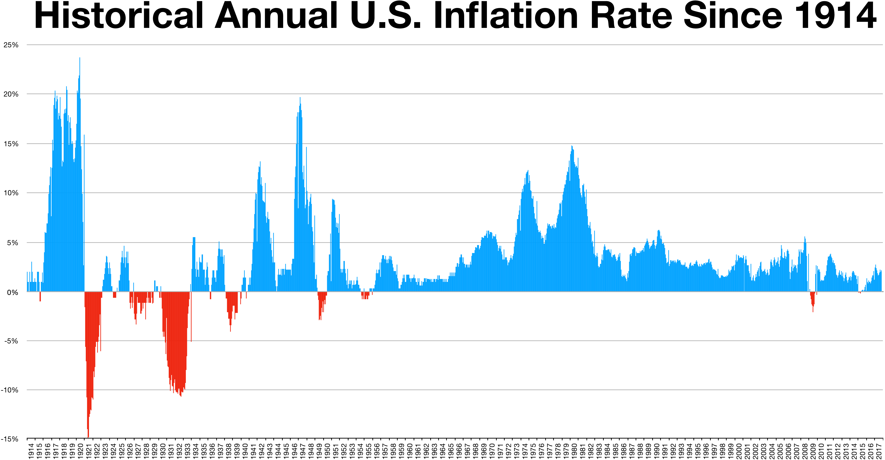

## Table of Contents

## What is underconsumption?

Underconsumption is when people are not buying enough goods and services. This can happen for many reasons, like not having enough money or feeling unsure about the future. When people don't buy as much, businesses sell less and may have to cut jobs or lower prices.

This can lead to a cycle where fewer people have money to spend, causing even less buying. Economists worry about underconsumption because it can slow down the whole economy. If it goes on for a long time, it might even lead to a recession, where the economy shrinks and many people lose their jobs.

## How does underconsumption differ from overconsumption?

Underconsumption and overconsumption are opposite problems in an economy. Underconsumption happens when people aren't buying enough stuff. This can be because they don't have enough money or they're worried about the future. When people don't buy enough, businesses can't sell their products and might have to cut jobs or lower prices. This can make the economy slow down and might even lead to a recession if it keeps happening.

On the other hand, overconsumption is when people buy too much. This can happen when people have a lot of money or when they want to keep up with others. When people buy too much, it can lead to waste and harm the environment. It can also cause inflation, where prices go up because everyone is trying to buy things. Overconsumption can make it hard for businesses to keep up with demand and can lead to other economic problems.

Both underconsumption and overconsumption can cause trouble for the economy, but they do it in different ways. Underconsumption slows things down because there's not enough buying, while overconsumption can speed things up too much and lead to waste and other issues. Finding a balance is important for a healthy economy.

## What are the basic economic theories behind underconsumption?

The basic idea behind underconsumption is that if people don't spend enough money, the economy can slow down. This theory was talked about by economists like John Maynard Keynes. He said that when people don't buy enough goods and services, businesses can't sell what they make. If businesses can't sell their stuff, they might have to lay off workers or close down. This can lead to less money in people's pockets, which means they can buy even less. It's a cycle that can keep going and make the economy weaker.

Another economist, Karl Marx, also talked about underconsumption, but in a different way. Marx thought that underconsumption happens because workers don't get paid enough. If workers don't earn enough money, they can't buy all the things that businesses make. This means businesses can't sell everything they produce, which can lead to economic problems. Marx believed that this was a big flaw in the capitalist system, where the rich get richer and the poor can't buy enough to keep the economy going.

Both Keynes and Marx pointed out that underconsumption can cause big problems for the economy. They saw it as a situation where people not buying enough can lead to a cycle of less spending, fewer jobs, and a weaker economy overall.

## What are the main causes of underconsumption?

Underconsumption happens when people don't buy enough stuff. One big reason for this is that people might not have enough money to spend. This can happen if they lose their jobs or if their wages are too low. When people don't have money, they have to be careful with what they buy, and they might only get the things they really need. This means businesses can't sell all their products, and they might have to cut jobs or lower prices, which can make the problem even worse.

Another reason for underconsumption is when people feel unsure about the future. If people think the economy might get worse or they might lose their jobs, they might decide to save their money instead of spending it. This is called being cautious, and it can lead to less buying overall. When everyone starts saving more and spending less, it can slow down the whole economy because businesses can't sell as much.

Sometimes, underconsumption can also happen because of big changes in the economy, like a financial crisis or a sudden drop in people's confidence. These events can make people feel like they need to hold onto their money, which means they buy less. This can create a cycle where businesses struggle to sell their goods, leading to more job cuts and even less spending, making the economy weaker.

## How does underconsumption affect the economy?

When people don't buy enough stuff, it's called underconsumption. This can slow down the whole economy. When people don't spend money, businesses can't sell all their products. If businesses can't sell what they make, they might have to lay off workers or close down. This means even fewer people have money to spend, which can make the problem worse. It's like a cycle that keeps going, making the economy weaker and weaker.

Underconsumption can also lead to a big problem called a recession. A recession is when the economy gets smaller and a lot of people lose their jobs. It happens when people are not buying enough for a long time. When businesses see that people aren't spending, they might cut back on making things or hiring people. This can make more people lose their jobs, and then they can't buy as much either. So, underconsumption can really hurt the economy by making it hard for businesses to keep going and for people to keep their jobs.

## Can underconsumption lead to economic recessions?

Yes, underconsumption can lead to economic recessions. When people don't buy enough stuff, businesses can't sell all their products. If businesses can't sell what they make, they might have to lay off workers or close down. This means fewer people have money to spend, which makes the problem worse. It's like a cycle that keeps going, making the economy weaker and weaker.

This cycle of underconsumption can lead to a big problem called a recession. A recession is when the economy gets smaller and a lot of people lose their jobs. It happens when people are not buying enough for a long time. When businesses see that people aren't spending, they might cut back on making things or hiring people. This can make more people lose their jobs, and then they can't buy as much either. So, underconsumption can really hurt the economy by making it hard for businesses to keep going and for people to keep their jobs.

## What are some historical examples of underconsumption?

One big example of underconsumption happened during the Great Depression in the 1930s. People didn't have enough money to buy things because many lost their jobs. When people couldn't buy stuff, businesses sold less and had to let go of even more workers. This made the problem worse, and the economy got smaller and smaller. The Great Depression showed how underconsumption can lead to a big economic problem like a recession.

Another example was during the 2008 financial crisis. People were scared about the future and started saving their money instead of spending it. This led to less buying, and businesses struggled to sell their products. As a result, many companies had to cut jobs, which meant even fewer people had money to spend. The 2008 crisis showed again how underconsumption can make the economy weaker and cause a recession.

## How can underconsumption be measured in an economy?

Underconsumption can be measured by looking at how much people are spending on things. Economists keep track of something called "consumer spending," which is all the money people spend on goods and services. If consumer spending goes down a lot, it might mean that underconsumption is happening. They also look at how much stuff is sitting in stores without being sold. If there's a lot of unsold stuff, it can be a sign that people are not buying enough.

Another way to measure underconsumption is by looking at how many people are working. When people don't buy enough, businesses might have to lay off workers because they can't sell all their products. So, if the unemployment rate goes up, it could be a sign of underconsumption. Economists also look at how fast the economy is growing. If the economy is growing slowly or even shrinking, it might be because people are not spending enough money, which means underconsumption could be a problem.

## What policies can governments implement to combat underconsumption?

Governments can use different policies to fight underconsumption. One way is by giving people more money to spend. They can do this by lowering taxes or giving out money directly to people, like through stimulus checks. When people have more money, they can buy more stuff, which helps businesses sell their products. Another way is by creating jobs. Governments can spend money on projects like building roads or schools, which gives people jobs and more money to spend. This can help get the economy moving again.

Another policy is to help people feel more sure about the future. Governments can do this by making sure banks are safe and by helping businesses stay open. When people feel more confident, they might spend more money instead of saving it. Governments can also make it easier for people to borrow money, like through lower interest rates. This can help people buy things they need, like houses or cars, which can boost the economy and fight underconsumption.

## How do different economic schools of thought view underconsumption?

Different schools of economic thought have their own views on underconsumption. Keynesian economists, following the ideas of John Maynard Keynes, believe that underconsumption is a big problem for the economy. They think that when people don't spend enough money, it can lead to a cycle where businesses sell less, lay off workers, and the economy gets weaker. Keynesians say that the government should step in to help by spending more money or giving people more money to spend, to get the economy moving again.

On the other hand, classical and neoclassical economists see underconsumption differently. They believe that markets usually fix themselves without much help from the government. They think that if people aren't buying enough, prices will go down until people start buying again. These economists worry more about saving and investing than about spending. They believe that if people save more, it can help businesses grow and create jobs in the long run, even if it means less spending right now.

Marxist economists have yet another view. They think that underconsumption is a big problem in capitalist systems because workers don't earn enough money to buy all the things businesses make. Karl Marx believed this leads to a situation where businesses can't sell everything they produce, causing economic problems. Marxists argue that the only way to fix this is to change the whole economic system, so that workers get paid more and can buy more, leading to a more balanced economy.

## What role does consumer confidence play in underconsumption?

Consumer confidence is how sure people feel about the future of the economy. It's really important because it can change how much people spend. If people feel good about the future, they might spend more money on things they want, not just what they need. But if people are worried and not sure about what's going to happen, they might decide to save their money instead of spending it. This can lead to underconsumption, where people aren't buying enough stuff, and it can make the economy slow down.

When consumer confidence goes down, it can start a cycle of underconsumption. People start saving more and buying less, which means businesses can't sell all their products. If businesses can't sell what they make, they might have to lay off workers or close down. This makes even fewer people have money to spend, which can make the problem worse. So, keeping consumer confidence up is important for avoiding underconsumption and keeping the economy strong.

## How does globalization impact underconsumption in different regions?

Globalization can affect underconsumption in different regions in a few ways. When countries trade with each other more, it can help some places by giving people more things to buy and more jobs. For example, if a country can sell its products to other countries, businesses might grow and hire more people. This means more people have money to spend, which can help stop underconsumption. But, if a country's businesses can't compete with cheaper products from other countries, they might have to close down or lay off workers. This can lead to less money for people to spend and more underconsumption.

Globalization can also make underconsumption worse in some regions. If jobs move to other countries where it's cheaper to make things, people in the original country might lose their jobs. When people lose their jobs, they have less money to spend, which can lead to underconsumption. Also, if people in one country feel unsure about the future because of changes from globalization, they might save their money instead of spending it. This can slow down the economy and make underconsumption a bigger problem. So, globalization can help or hurt underconsumption depending on how it affects jobs and spending in different places.

## What is the relationship between demand, underconsumption, and economic theory?

Demand theory explores how the desires and purchasing capacities of consumers influence market prices and allocation of resources. It is a central tenet of economic theory that explains the relationship between price levels and consumer demand for goods and services. The law of demand stipulates that, ceteris paribus, when the price of a good declines, the quantity demanded increases, and vice versa. This relationship is typically illustrated by a downward-sloping demand curve on a graph where the price is plotted on the vertical axis and quantity on the horizontal axis. The concept of elasticity further refines demand theory by quantifying how changes in price or income levels affect the quantity demanded. 

Underconsumption is a historical economic theory positing that recessions occur due to insufficient consumer demand relative to the available supply of goods and services. This perspective suggests that inadequate consumption leads to economic stagnation, as unsold goods accumulate and production is subsequently scaled back, resulting in unemployment and reduced income. Underconsumption theories gained prominence in the 19th and early 20th centuries as a critique of the classical economic view that markets would naturally clear and self-correct without intervention.

In contemporary economics, underconsumption is frequently associated with Keynesian economics, which underscores the role of government intervention in mitigating demand deficiencies during economic downturns. John Maynard Keynes, a principal figure in macroeconomic theory, argued that during periods of economic slack or recession, private sector demand may be too weak to achieve full employment. In such scenarios, he advocated for the use of fiscal and monetary policies to boost aggregate demand. Keynes proposed that government spending could compensate for insufficient private consumption and investment, thus stabilizing economic cycles.

One of the key equations in Keynesian economics that relates to demand is the aggregate demand equation:

$$
AD = C + I + G + (X - M)
$$

where $AD$ represents aggregate demand, $C$ is consumption, $I$ is investment, $G$ is government spending, and $(X - M)$ is net exports. This equation highlights the components of demand that policymakers can influence to address underconsumption.

Modern developments in economic thought and modeling often rely on these foundational concepts to better predict and address fluctuations in consumer demand. With the integration of technology and data analytics, economists and analysts have enhanced their ability to assess demand patterns, thus refining strategies for economic stabilization. By leveraging these insights, policymakers and market participants can better navigate economic challenges and foster stable growth.

## How can economic theories be integrated into algorithmic trading?

Economic models, such as demand theory, play a crucial role in shaping algorithmic trading strategies by offering insights into consumer behavior dynamics. These models help traders understand how fluctuations in demand influence market prices and resource allocation, thereby informing automated trading decisions.

A fundamental concept in demand theory is price elasticity, which measures the responsiveness of the quantity demanded to a change in price. By incorporating elasticity calculations into trading algorithms, traders can adapt strategies to react to market changes more efficiently. The formula for price elasticity of demand is represented as:

$$

E_d = \frac{\% \text{ change in quantity demanded}}{\% \text{ change in price}} 
$$

When elasticity is high, a small change in price leads to a significant change in the quantity demanded, emphasizing the need for algorithms that can quickly adjust trading positions to maximize profits or minimize losses. Conversely, low elasticity indicates that price changes have little effect on demand, allowing for more stable strategic planning.

Modern trading platforms increasingly integrate these theoretical insights, using real-time data to refine algorithmic responses to market conditions. Python, a widely-used programming language in financial analytics, facilitates these integrations with libraries such as NumPy and pandas, which can manage and analyze vast datasets.

For instance, consider a Python function that uses elasticity to guide trading decisions:

```python
import numpy as np

def calculate_elasticity(price_change, quantity_change):
    return np.divide(quantity_change, price_change)

def trading_strategy(price_data, quantity_data):
    elasticity = calculate_elasticity(np.diff(price_data), np.diff(quantity_data))
    trade_actions = []
    for e in elasticity:
        if e > 1:
            trade_actions.append("Buy")
        elif e < 1:
            trade_actions.append("Sell")
        else:
            trade_actions.append("Hold")
    return trade_actions

# Sample price and quantity data
price_data = np.array([100, 102, 98, 101, 99])
quantity_data = np.array([50, 55, 48, 52, 49])

actions = trading_strategy(price_data, quantity_data)
print(actions)  # Output: ['Buy', 'Sell', 'Buy', 'Sell']
```

Real-world applications highlight the potential of demand-based algorithms. In volatile markets, these algorithms outperform traditional methods by swiftly adapting to demand signals and mitigating risks associated with price movements. For example, during the 2008 financial crisis, funds that leveraged demand-based insights were better equipped to navigate market turbulence compared to their less adaptive counterparts.

Incorporating economic theories into algorithmic trading not only enhances execution efficiency but also offers competitive advantages by aligning trading actions with market realities. As financial markets become more sophisticated, the integration of these models will continue to drive innovation and stability, supporting informed investment decisions in an ever-evolving landscape.

## References & Further Reading

[1]: Bergstra, J., Bardenet, R., Bengio, Y., & Kégl, B. (2011). ["Algorithms for Hyper-Parameter Optimization."](https://dl.acm.org/doi/10.5555/2986459.2986743) Advances in Neural Information Processing Systems 24.

[2]: ["Advances in Financial Machine Learning"](https://www.amazon.com/Advances-Financial-Machine-Learning-Marcos/dp/1119482089) by Marcos Lopez de Prado

[3]: ["Evidence-Based Technical Analysis: Applying the Scientific Method and Statistical Inference to Trading Signals"](https://www.amazon.com/Evidence-Based-Technical-Analysis-Scientific-Statistical/dp/0470008741) by David Aronson

[4]: ["Machine Learning for Algorithmic Trading"](https://github.com/stefan-jansen/machine-learning-for-trading) by Stefan Jansen

[5]: ["Quantitative Trading: How to Build Your Own Algorithmic Trading Business"](https://www.amazon.com/Quantitative-Trading-Build-Algorithmic-Business/dp/1119800064) by Ernest P. Chan