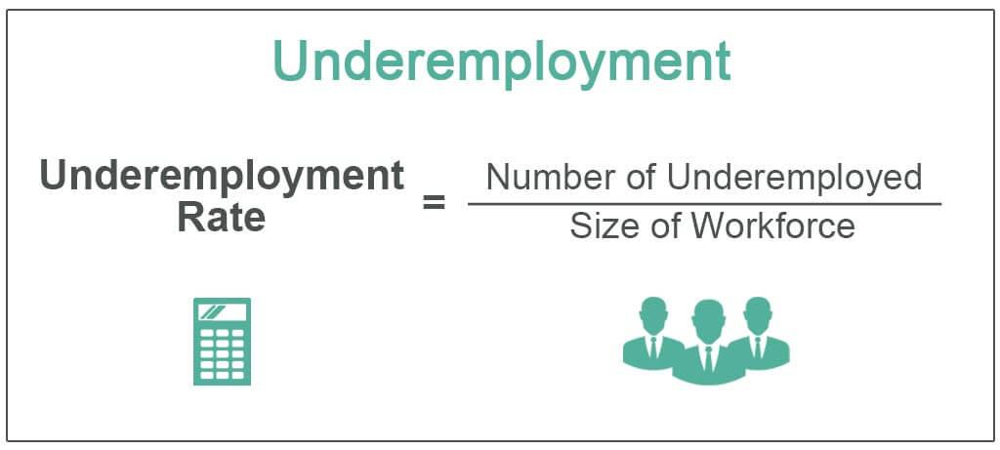

The global job market is undergoing significant transformations, with underemployment and algorithmic trading standing out as critical interconnected issues influencing contemporary economic dynamics. Underemployment, where individuals find themselves in positions that neither fully utilize their skills nor offer adequate compensation, reflects broader structural inefficiencies in labor markets and has emerged as a persistent challenge to economic stability. Simultaneously, the rise of algorithmic trading, characterized by the use of complex algorithms and high-speed computations to execute financial trades, introduces both opportunities and potential disruptions to market equilibrium. 

These developments carry profound implications not only for individuals seeking meaningful employment but also for businesses striving to operate efficiently and policymakers tasked with maintaining economic equilibrium. Underemployment contributes to wage stagnation and restricts economic mobility, thus potentially constraining broader economic growth by limiting consumer spending power. Meanwhile, algorithmic trading's reliance on economic indicators means employment data can directly influence trading strategies, impacting market liquidity and volatility.

By examining these issues, the article aims to provide a comprehensive understanding of how underemployment and algorithmic trading are reshaping economic landscapes. Addressing these challenges requires an integrated approach, leveraging employment data to anticipate market behaviors and inform strategic economic decisions, thereby safeguarding economic stability and fostering growth.

## Table of Contents

## Understanding Underemployment

Underemployment is a condition where individuals occupy positions that fail to fully harness their skills or provide commensurate financial rewards. It manifests in two main forms: visible and invisible underemployment. Visible underemployment is characterized by individuals who work fewer hours than they prefer, often finding themselves in part-time roles due to economic constraints or personal circumstances. These workers may actively seek full-time employment but are limited by the availability of suitable job opportunities.

Invisible underemployment, on the other hand, involves workers who hold jobs that do not require their full level of expertise or education. This often results from a mismatch between the worker's qualifications and the skill requirements of available jobs. For example, an engineering graduate might find employment in a retail service position, which neither demands their technical skills nor offers appropriate compensation. 

Several factors contribute to underemployment, such as economic downturns and advancements in technology. Economic recessions can lead to a surplus of labor, forcing individuals to accept positions below their skill level or work fewer hours. Likewise, technological changes, while beneficial in increasing productivity and creating new job categories, can render certain skills obsolete, leading to workforce displacement. Automation and [artificial intelligence](/wiki/ai-artificial-intelligence), for instance, have significantly altered job scopes in various industries, necessitating new skills and leaving some workers underutilized.

Understanding these dynamics is crucial for policymakers and businesses aiming to address employment challenges. Solutions must focus on aligning education and training with the evolving job market, increasing job flexibility, and enhancing access to jobs that match workers' skills. This alignment can help reduce underemployment's negative impacts, such as diminished income, job dissatisfaction, and hindered economic growth.

## Impact of Underemployment on the Job Market

Underemployment has a pronounced effect on the job market, influencing economic conditions by causing wage stagnation and limited job satisfaction. These effects, in turn, have substantial implications for consumer spending and overall economic growth. When individuals are underemployed, they often earn less than their skills warrant, resulting in restricted income growth. This wage stagnation limits the purchasing power of workers, which is a critical driver of consumer spending. As consumer spending constitutes a significant portion of economic activity, underemployment can ultimately impede economic growth.

Consider an example involving engineering graduates who find themselves working in low-wage service jobs. This scenario highlights a significant mismatch between their qualifications and the opportunities available to them. This mismatch not only affects individual satisfaction and career progression but also indicates inefficiencies in the labor market. These graduates often enter the labor market with high expectations and specific skill sets, yet are unable to find commensurate employment due to various factors, including economic conditions and evolving industry demands.

The persistent mismatch between skills and job opportunities reflects broader economic conditions and can point to underlying structural issues in the job market. For instance, the prevalence of underemployment during periods of economic downturns often signals that there are insufficient suitable job openings for the available skilled workforce. This situation calls for concerted efforts by policymakers and educational institutions to ensure that the labor force is equipped with skills that match the current and future demands of the job market.

Moreover, the psychological and social impacts of underemployment cannot be overlooked. Limited job satisfaction, resulting from the inability to adequately use one's skills and education, can lead to decreased morale and productivity among workers. This phenomenon impacts not only individual well-being but also the overall efficiency of the workforce, further stalling economic progress.

In summary, underemployment is a multifaceted issue affecting wage dynamics, consumer behavior, and economic growth. Addressing these challenges requires a comprehensive understanding of both the labor market and the broader economic landscape. Only through targeted policy interventions and adaptive educational frameworks can the gap between skills and job opportunities be bridged, thereby fostering more robust economic growth and stability.

## Employment Data and Its Role in Economic Indicators

Employment [statistics](/wiki/bayesian-statistics), such as unemployment and underemployment rates, are essential tools for evaluating the health of an economy. These metrics serve as critical indicators of labor market efficacy, providing insight into the availability and quality of job opportunities. They also play a pivotal role in shaping economic policy, as policymakers rely on these data to craft strategies that address labor market imbalances and stimulate economic growth.

Unemployment rates offer a direct measure of how many individuals within the active labor force are without jobs but are actively seeking work. Conversely, underemployment captures those who may be working but in capacities that do not fully utilize their skills or offer desirable working conditions. The granularity provided by underemployment metrics highlights inefficiencies within the labor market, such as over-qualification for roles or insufficient working hours, which traditional unemployment figures might overlook.

The utility of employment data extends beyond assessing labor market conditions; it forms the backbone of economic forecasting models. Tools like the Sahm Rule, which employs unemployment rates to predict the onset of economic recessions, demonstrate the critical importance of comprehensive employment data. The Sahm Rule is defined by a simple metric: a significant increase in the unemployment rate over a short period suggests that the economy might be entering a recession. Mathematically, this can be expressed as:

$$
\Delta U = U_{\text{current}} - U_{\text{low}}
$$

Where $\Delta U$ is the change in the unemployment rate, $U_{\text{current}}$ is the current unemployment rate, and $U_{\text{low}}$ is the lowest unemployment rate observed in the previous twelve months. If $\Delta U$ surpasses a given threshold, it signals potential economic downturns. 

The reliance on such data-driven approaches underscores the significance of accurate and timely employment statistics. These figures not only inform immediate policy decisions, such as adjustments to interest rates or fiscal stimulus but also guide long-term strategies aimed at fostering sustainable economic growth. Additionally, employment data are indispensable for businesses and investors as they assess economic conditions to make informed decisions.

By understanding the broader economic landscape through employment metrics, stakeholders can better anticipate market dynamics and respond to changes effectively. This capability is vital in reducing economic uncertainty and enhancing the resilience of economies to global fluctuations.

## Algorithmic Trading and Its Economic Implications

Algorithmic trading has become a cornerstone in modern finance, heavily relying on the efficient processing of vast economic data to make rapid, informed trading decisions. This form of trading employs rigorous computational algorithms to process real-time market data, including employment statistics, which can significantly influence trading strategies and outcomes.

High-frequency traders utilize powerful algorithms that allow them to conduct trades within microseconds by analyzing current economic indicators, including publicly released employment data such as unemployment rates and job growth figures. These metrics provide instantaneous insights into the health of the economy, which traders then use to adjust their portfolios according to anticipated market movements. For instance, a sudden rise in unemployment may prompt sell-signals for stocks perceived to be sensitive to consumer spending, while an unexpected increase in employment could boost confidence in consumer-driven equities.

The impact of employment data on [algorithmic trading](/wiki/algorithmic-trading) is particularly evident in its effect on market [liquidity](/wiki/liquidity-risk-premium) and [volatility](/wiki/volatility-trading-strategies). Market liquidity, defined as the ability to quickly buy or sell assets without causing significant price changes, can be profoundly influenced by algorithmic trading activities. During the release of critical employment figures, these algorithms can increase liquidity by executing a high [volume](/wiki/volume-trading-strategy) of trades. However, they can also exacerbate volatility if a substantial amount of trades is triggered simultaneously, leading to swift and significant shifts in asset prices.

Algorithms are often designed to identify not only the immediate numerical changes in employment data but also the sentiment and market expectations surrounding these numbers. For example, an algorithm might be programmed to consider not just the headline unemployment rate but also underlying trends such as labor force participation rates or average hourly earnings. This comprehensive analysis allows the algorithm to make nuanced trading decisions that take into account both the current state and future directions of the economy.

In addition to traditional employment indicators, algorithms increasingly integrate [alternative data](/wiki/best-alternative-data) sources, such as social media trends and online job postings, to gain a more immediate and granular perspective on employment dynamics. This integration helps in refining the timing and precision of trades, potentially offering a competitive edge in predicting market reactions to labor market fluctuations.

In summary, the interplay between algorithmic trading and employment data exemplifies the sophisticated mechanisms that drive modern financial markets. Understanding the profound influence of such data on trading behaviors is crucial for both traders and policymakers to anticipate market trends and mitigate potential risks associated with heightened volatility and liquidity changes.

## Challenges and Opportunities within Algorithmic Trading

Algorithmic trading harnesses advanced algorithms to execute trades at high speed, thereby improving trading efficiency and market liquidity. However, its benefits are accompanied by risks, particularly heightened market volatility during economic uncertainty. The precision of algorithmic trading systems allows them to capitalize on microsecond-level fluctuations in the market, yet this responsiveness can exacerbate volatility when new, unexpected data emerges.

During times of economic upheaval, such as the COVID-19 pandemic, algorithmic trading faced both opportunities and challenges. The pandemic's onset led to unprecedented fluctuations in employment data, which algorithms were designed to react to swiftly. In response, traders sought to adjust their strategies for increased volatility. Algorithms, configured to interpret economic indicators like employment rates, rapidly processed these signals, sometimes leading to significant shifts in trading strategies.

For example, in early 2020, sudden changes in employment data caused by lockdown measures affected market dynamics, triggering algorithms to adjust their trading behaviors. These algorithms, leveraging real-time data analysis, could either seize new opportunities or increase market stress by magnifying short-term trends. This dual nature of algorithmic trading reveals its inherent challenge: while designed for stability and efficiency, the very mechanisms that enable rapid trading can also undermine market stability through feedback loops, where the price movements of one day's trades influence the models and decisions for the next.

Case studies during the pandemic underscore these dynamics. Algorithms that adapted quickly to volatile employment figures managed to optimize returns or at least mitigate losses by modifying their strategies dynamically. Others, less nimble, compounded market instability as they executed a cascade of trades that mirrored each other's actions, amplifying trends rather than cushioning them.

These situations highlight an essential consideration for market participants and regulators. While algorithmic trading systems are optimized for speed and efficiency, there is a critical need for robust controls and oversight to ensure they do not inadvertently destabilize markets during periods of economic distress. Additionally, developing algorithms with adaptive capabilities, which can withstand unexpected data anomalies and market disruptions, represents a significant opportunity for the future of trading strategies. 

The pandemic, thus, serves as a lesson in the importance of flexible algorithms that can interpret nuanced economic signs and adjust trades in a manner that aligns with both short and long-term market health. As economic conditions continue to evolve, the role of algorithmic trading in either mitigating or contributing to market volatility will remain a key area of discussion and development.

## Conclusion

The interplay between underemployment, economic trends, and algorithmic trading is a multifaceted and intricate relationship that significantly impacts the global economy. Underemployment, characterized by the underutilization of skills and inadequate compensation, can lead to reduced consumer spending and stagnation in economic growth. These effects are further compounded by the rapid advancements in technology and fluctuating economic conditions, which continue to alter the landscape of employment and create uncertainties within the job market.

Algorithmic trading adds another layer of complexity to economic dynamics through its reliance on economic indicators and data, including employment statistics. The speed and efficiency of algorithmic systems can influence market liquidity and volatility, especially during periods of economic uncertainty. Algorithms can react swiftly to employment data releases, causing shifts in market activity that may not always align with fundamental values or long-term trends.

For economic stakeholders, integrating comprehensive employment data and analyzing its implications is crucial for developing robust economic strategies. Employment statistics provide insights into labor market health and can signal potential economic downturns, guiding policymakers in making informed decisions. Tools like algorithmic trading models that incorporate employment metrics can aid in predicting and mitigating market volatility, ensuring stability in financial markets.

To navigate this intricate web effectively, businesses, policymakers, and investors must prioritize an understanding of underemployment and its broader economic impact. Future economic policies should consider these factors to anticipate market reactions adequately and prepare for inevitable economic shifts. By doing so, stakeholders can foster economic resilience and support more balanced growth, ultimately benefiting the wider economy.

## Further Reading and Resources

For a deeper understanding of the topics discussed, academic papers and resources offer valuable insights. Specifically, research focused on the Sahm Rule could be beneficial. The Sahm Rule uses real-time unemployment data to identify the beginning of economic recessions with the formula:

$$
x_t = \text{Unemployment rate}_t - \text{Minimum unemployment rate over the previous 12 months}
$$

When this value exceeds 0.5 percentage points, it signals a recession. Academic papers analyzing the effectiveness of the Sahm Rule in real-world economic predictions can provide detailed insights into its practical applications.

Algorithmic trading strategies also warrant a thorough examination. Books such as *"Algorithmic Trading and DMA: An introduction to direct access trading strategies"* by Barry Johnson could be valuable. This resource covers the mathematical foundations of algorithmic trading, different strategies implemented, and the role of economic indicators in decision-making.

Courses related to economic indicators provide foundational knowledge necessary for understanding market movements. Online platforms like Coursera and edX offer courses that break down complex economic concepts and their implications for trading strategies.

Staying informed through financial newsletters is critical for grasping ongoing economic patterns and transitions. Renowned publications such as *The Financial Times*, *The Wall Street Journal*, and newsletters from Bloomberg offer regular updates on global economic conditions and market responses.

Finally, accessing economic reports from institutions like the Bureau of Labor Statistics (BLS) and Organisation for Economic Co-operation and Development (OECD) can enhance one's grasp of employment trends and indicators essential for formulating predictions about forthcoming economic shifts. These resources are indispensable for stakeholders aiming to navigate global economic intricacies effectively.

## References & Further Reading

[1]: Landefeld, J. S., & Tersigni, M. (2000). ["Role of underemployment in unemployment estimates: A reexamination of data for 1990–99."](https://www.bls.gov/opub/mlr/2000/10/art5full.pdf) Monthly Labor Review, Bureau of Labor Statistics.

[2]: Johnson, B. (2010). ["Algorithmic Trading and DMA: An Introduction to Direct Access Trading Strategies."](https://archive.org/details/algorithmictradi0000john) 4Myeloma Press.

[3]: DeLong, J. B. (2002). ["Macroeconomic Policy and Underemployment."](https://archive.org/details/macroeconomics0000delo_y8z3) National Bureau of Economic Research Working Paper Series.

[4]: Chandler, D. (2016). ["Algorithmic Trading: Winning Strategies and Their Rationale."](https://www.wiley.com/en-us/Algorithmic+Trading%3A+Winning+Strategies+and+Their+Rationale-p-9781118460146) Wiley.

[5]: Pakravan, K. (2011). ["Algorithmic Trading’s Impact on the Market."](https://www.researchgate.net/publication/355469189_Algorithmic_Trading_Efficiency_and_its_Impact_on_Market-Quality) The Journal of Trading.

[6]: Goolsbee, A., & Syverson, C. (2019). ["The Future of Work: Implications for Income Inequality, Productivity, and Employment."](https://www.nber.org/papers/w30845) National Bureau of Economic Research Working Paper No. 24449.

[7]: Bureau of Labor Statistics. ["Employment Projections and Occupational Outlook Handbook."](https://www.bls.gov/news.release/ecopro.toc.htm) 

[8]: OECD (2020). ["Underemployment rate (indicator)."](https://www.oecd.org/en/data/indicators/unemployment-rate.html) Organisation for Economic Co-operation and Development.