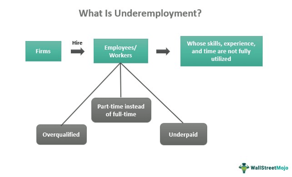

## Table of Contents

## What is underemployment?

Underemployment happens when people have jobs that don't use their skills, education, or experience fully. It can also mean working fewer hours than someone wants or needs. For example, a person with a college degree might be working in a job that only needs a high school education. This can make people feel unhappy and frustrated because they are not using their full potential.

Underemployment can affect the economy too. When people are underemployed, they might not earn as much money as they could. This means they have less money to spend on things, which can slow down the economy. Also, underemployment can lead to higher job turnover because people might keep looking for better jobs that match their skills and experience. This can be a problem for businesses that need stable and skilled workers.

## How is underemployment different from unemployment?

Underemployment and unemployment are two different things. Unemployment means someone doesn't have a job at all. They want to work but can't find a job. On the other hand, underemployment means someone has a job, but it's not the right job for them. They might be working fewer hours than they want, or the job might not use their skills and education fully.

For example, if a person with a degree in engineering is working as a cashier, they are underemployed. They have a job, but it doesn't match their skills. Unemployment is more straightforward because it's about not having any job. Underemployment can be harder to spot because the person is working, but not in the way they should be. Both situations can make people unhappy and can affect the economy, but they are different problems.

## What are the common causes of underemployment?

One common cause of underemployment is a mismatch between a person's skills and the jobs that are available. Sometimes, people go to school and learn a lot, but when they look for a job, they find that there are not enough jobs that need their skills. For example, someone might have a degree in a specific field, but the job market might not have many openings in that field. This can lead to them taking a job that doesn't use their education fully.

Another cause is economic conditions. When the economy is not doing well, companies might not have enough money to hire full-time workers or to create new jobs that match people's skills. This can force people to take part-time jobs or jobs that are below their skill level just to have some income. During tough economic times, underemployment can become more common because people are willing to take any job they can get.

Lastly, changes in industries can also lead to underemployment. Technology and other changes can make some jobs disappear or change a lot. Workers in these industries might find that their skills are no longer needed, or they might need to learn new skills to keep up. If they can't find new jobs that match their old skills, they might end up underemployed.

## Can you provide examples of underemployment?

One example of underemployment is when someone with a college degree in engineering is working as a retail salesperson. The person has the skills and education to work as an engineer, but they can't find a job in that field. So, they take a job in retail, which doesn't use their engineering skills. This makes them underemployed because they are not working in a job that matches their education and skills.

Another example is when someone wants to work full-time but can only find part-time work. For instance, a person who used to work full-time as a teacher might lose their job and then only be able to find part-time work as a tutor. They want to work more hours, but there are no full-time jobs available. This is underemployment because the person is working fewer hours than they need or want.

A third example is when someone's industry changes and their skills are no longer needed. Imagine a factory worker who knows how to operate old machinery. If the factory switches to new technology, the worker might not know how to use it. They might have to take a job with lower pay or less responsibility because they can't find work that uses their old skills. This is underemployment because the job they take does not match their previous level of skill and experience.

## How does underemployment affect individuals and the economy?

Underemployment can make people feel unhappy and frustrated. When someone has a job that doesn't use their skills or education, they might feel like they are not reaching their full potential. This can lead to stress and lower self-esteem. Also, if someone is working fewer hours than they want, they might struggle to pay their bills and support their family. This can cause financial stress and make it hard for them to plan for the future.

Underemployment can also hurt the economy. When people are underemployed, they often earn less money than they could if they had a job that matched their skills. This means they have less money to spend on things like food, clothes, and entertainment. When people spend less, businesses make less money, which can slow down the economy. Also, underemployment can lead to higher job turnover because people might keep looking for better jobs. This can be a problem for businesses that need stable and skilled workers to grow and succeed.

## What role does education play in underemployment?

Education is important when we talk about underemployment. Sometimes, people go to school and learn a lot, but when they look for a job, they find that there are not enough jobs that need their skills. For example, someone might have a degree in a specific field, but the job market might not have many openings in that field. This can lead to them taking a job that doesn't use their education fully. So, even though they worked hard to get their education, they end up underemployed.

On the other hand, education can also help reduce underemployment. If people keep learning new skills and stay up-to-date with what jobs need, they might find it easier to get a job that matches their education. For example, someone might go back to school to learn about new technology or take classes to improve their skills. This can help them find a better job and avoid being underemployed. So, education can be both a cause and a solution to underemployment, depending on how it is used and what jobs are available.

## How can underemployment be measured statistically?

To measure underemployment, statisticians look at a few things. One way is to see how many people are working part-time but want to work full-time. They ask people if they are working fewer hours than they want and if they would take more hours if they could. This helps to understand if someone is underemployed because they can't find enough work. Another way is to look at people's education and skills compared to their jobs. If someone has a lot of education but is working in a job that doesn't need it, they might be underemployed.

Statisticians also use surveys to gather this information. They ask people about their jobs, how many hours they work, and what their education and skills are. By comparing this data, they can figure out how many people are underemployed. This helps governments and economists understand how big the problem is and what they can do to help. It's important to have good data so that everyone can work towards solving underemployment.

## What are the long-term consequences of underemployment for workers?

Underemployment can have big effects on workers over a long time. When someone is stuck in a job that doesn't use their skills or education, they might feel unhappy and frustrated. This can make them lose confidence and feel like they are not doing well in their career. Over time, this can lead to stress and even health problems. Also, if someone is working fewer hours than they want, they might have trouble paying their bills and saving money for the future. This can make it hard for them to buy a house, plan for retirement, or support their family.

In the long run, underemployment can also hurt a worker's career. If someone stays in a job that is below their skill level for a long time, they might miss out on chances to learn new things and grow in their career. This can make it harder for them to find a better job later on. Also, being underemployed can make people feel less motivated to keep learning and improving their skills. This can trap them in underemployment and make it even harder to move up in their career. So, underemployment can have big effects on a worker's life and future.

## How do economic cycles influence levels of underemployment?

Economic cycles can change how much underemployment there is. When the economy is doing well, there are more jobs and people can find work that matches their skills. Companies have more money to hire full-time workers and create new jobs. This means fewer people are underemployed because they can find jobs that use their education and skills. But when the economy is not doing well, it's harder to find good jobs. Companies might not have enough money to hire full-time workers or create new jobs that match people's skills. This can make more people underemployed because they have to take part-time jobs or jobs that are below their skill level just to have some income.

During a recession, underemployment can become a bigger problem. When businesses are struggling, they might cut back on hours or lay off workers. This means more people might have to take part-time jobs or jobs that don't use their skills. It can be hard for people to find work that matches their education and experience. When the economy starts to get better, companies might start hiring more and creating better jobs. This can help reduce underemployment because people can find work that uses their skills and education. So, economic cycles play a big role in how much underemployment there is.

## What policies can governments implement to reduce underemployment?

Governments can do a few things to help reduce underemployment. One way is to create more jobs that match people's skills and education. They can do this by investing in industries that need more workers, like technology or health care. Governments can also offer training programs to help people learn new skills that are in demand. This can make it easier for people to find jobs that use their education and experience. Another way is to support small businesses, which can create new jobs and help the economy grow. By making it easier for small businesses to start and grow, more people can find work that matches their skills.

Another thing governments can do is to help people who are working part-time but want full-time work. They can create policies that encourage businesses to offer more full-time jobs. For example, they might give tax breaks to companies that hire more full-time workers. Governments can also help by making sure there are enough jobs available in different areas. This can mean building new factories or supporting local businesses in places where there are not many jobs. By doing these things, governments can help reduce underemployment and make sure more people can find work that matches their skills and needs.

## How does underemployment vary across different industries and sectors?

Underemployment can be different in different industries and sectors. In some industries, like technology and health care, there might be more jobs that match people's skills and education. These industries often need workers with specific skills, so people with the right education can find good jobs. But in other industries, like retail or hospitality, there might be more underemployment. These jobs often don't need a lot of education, so someone with a college degree might end up working in a job that doesn't use their skills.

Also, underemployment can change a lot depending on what is happening in the economy. When the economy is doing well, industries like construction and manufacturing might have more jobs, and people can find work that matches their skills. But when the economy is not doing well, these industries might cut back on jobs, and more people might end up underemployed. In industries that are always growing, like technology, underemployment might be less of a problem because there are always new jobs being created. So, underemployment can be different depending on the industry and what is happening in the economy.

## What are some global trends in underemployment, and how do they differ by region?

Underemployment is a big problem around the world, but it looks different in different places. In richer countries, like those in Europe and North America, underemployment often happens when people with college degrees can't find jobs that match their skills. They might end up working in jobs that don't need a lot of education, like being a cashier or a server. In these places, the economy can change a lot, and when it's not doing well, more people might be underemployed. But when the economy is good, there are more jobs, and underemployment goes down.

In poorer countries, like those in Africa and parts of Asia, underemployment can be different. A lot of people might work in farming or small businesses, but they might not have enough work or earn enough money. This can happen even if they are working full-time. In these places, underemployment is often because there aren't enough good jobs, and the economy might not be growing fast enough. But in some fast-growing countries, like India and China, underemployment can be less of a problem because there are more new jobs being created. So, underemployment can look very different depending on where you are in the world.

## What is the role of employment data in economic indicators?

Employment [statistics](/wiki/bayesian-statistics), such as unemployment and underemployment rates, are essential tools for evaluating the health of an economy. These metrics serve as critical indicators of labor market efficacy, providing insight into the availability and quality of job opportunities. They also play a pivotal role in shaping economic policy, as policymakers rely on these data to craft strategies that address labor market imbalances and stimulate economic growth.

Unemployment rates offer a direct measure of how many individuals within the active labor force are without jobs but are actively seeking work. Conversely, underemployment captures those who may be working but in capacities that do not fully utilize their skills or offer desirable working conditions. The granularity provided by underemployment metrics highlights inefficiencies within the labor market, such as over-qualification for roles or insufficient working hours, which traditional unemployment figures might overlook.

The utility of employment data extends beyond assessing labor market conditions; it forms the backbone of economic forecasting models. Tools like the Sahm Rule, which employs unemployment rates to predict the onset of economic recessions, demonstrate the critical importance of comprehensive employment data. The Sahm Rule is defined by a simple metric: a significant increase in the unemployment rate over a short period suggests that the economy might be entering a recession. Mathematically, this can be expressed as:

$$
\Delta U = U_{\text{current}} - U_{\text{low}}
$$

Where $\Delta U$ is the change in the unemployment rate, $U_{\text{current}}$ is the current unemployment rate, and $U_{\text{low}}$ is the lowest unemployment rate observed in the previous twelve months. If $\Delta U$ surpasses a given threshold, it signals potential economic downturns. 

The reliance on such data-driven approaches underscores the significance of accurate and timely employment statistics. These figures not only inform immediate policy decisions, such as adjustments to interest rates or fiscal stimulus but also guide long-term strategies aimed at fostering sustainable economic growth. Additionally, employment data are indispensable for businesses and investors as they assess economic conditions to make informed decisions.

By understanding the broader economic landscape through employment metrics, stakeholders can better anticipate market dynamics and respond to changes effectively. This capability is vital in reducing economic uncertainty and enhancing the resilience of economies to global fluctuations.

## What are some further reading materials and resources available?

For a deeper understanding of the topics discussed, academic papers and resources offer valuable insights. Specifically, research focused on the Sahm Rule could be beneficial. The Sahm Rule uses real-time unemployment data to identify the beginning of economic recessions with the formula:

$$
x_t = \text{Unemployment rate}_t - \text{Minimum unemployment rate over the previous 12 months}
$$

When this value exceeds 0.5 percentage points, it signals a recession. Academic papers analyzing the effectiveness of the Sahm Rule in real-world economic predictions can provide detailed insights into its practical applications.

Algorithmic trading strategies also warrant a thorough examination. Books such as *"Algorithmic Trading and DMA: An introduction to direct access trading strategies"* by Barry Johnson could be valuable. This resource covers the mathematical foundations of [algorithmic trading](/wiki/algorithmic-trading), different strategies implemented, and the role of economic indicators in decision-making.

Courses related to economic indicators provide foundational knowledge necessary for understanding market movements. Online platforms like Coursera and edX offer courses that break down complex economic concepts and their implications for trading strategies.

Staying informed through financial newsletters is critical for grasping ongoing economic patterns and transitions. Renowned publications such as *The Financial Times*, *The Wall Street Journal*, and newsletters from Bloomberg offer regular updates on global economic conditions and market responses.

Finally, accessing economic reports from institutions like the Bureau of Labor Statistics (BLS) and Organisation for Economic Co-operation and Development (OECD) can enhance one's grasp of employment trends and indicators essential for formulating predictions about forthcoming economic shifts. These resources are indispensable for stakeholders aiming to navigate global economic intricacies effectively.

## References & Further Reading

[1]: Landefeld, J. S., & Tersigni, M. (2000). ["Role of underemployment in unemployment estimates: A reexamination of data for 1990–99."](https://www.bls.gov/opub/mlr/2000/10/art5full.pdf) Monthly Labor Review, Bureau of Labor Statistics.

[2]: Johnson, B. (2010). ["Algorithmic Trading and DMA: An Introduction to Direct Access Trading Strategies."](https://archive.org/details/algorithmictradi0000john) 4Myeloma Press.

[3]: DeLong, J. B. (2002). ["Macroeconomic Policy and Underemployment."](https://archive.org/details/macroeconomics0000delo_y8z3) National Bureau of Economic Research Working Paper Series.

[4]: Chandler, D. (2016). ["Algorithmic Trading: Winning Strategies and Their Rationale."](https://www.wiley.com/en-us/Algorithmic+Trading%3A+Winning+Strategies+and+Their+Rationale-p-9781118460146) Wiley.

[5]: Pakravan, K. (2011). ["Algorithmic Trading’s Impact on the Market."](https://www.researchgate.net/publication/355469189_Algorithmic_Trading_Efficiency_and_its_Impact_on_Market-Quality) The Journal of Trading.

[6]: Goolsbee, A., & Syverson, C. (2019). ["The Future of Work: Implications for Income Inequality, Productivity, and Employment."](https://www.nber.org/papers/w30845) National Bureau of Economic Research Working Paper No. 24449.

[7]: Bureau of Labor Statistics. ["Employment Projections and Occupational Outlook Handbook."](https://www.bls.gov/news.release/ecopro.toc.htm) 

[8]: OECD (2020). ["Underemployment rate (indicator)."](https://www.oecd.org/en/data/indicators/unemployment-rate.html) Organisation for Economic Co-operation and Development.