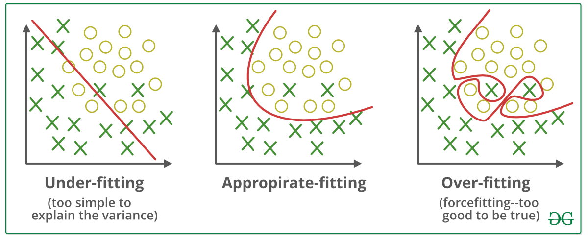

## Table of Contents

## What is underfitting in machine learning?

Underfitting in machine learning happens when a model is too simple to capture the underlying pattern in the data. Imagine trying to fit a straight line to data that actually follows a curve. The straight line won't be able to represent the data well, and this is what underfitting looks like. A model that underfits has high bias, meaning it makes strong assumptions about the data that are too simple and often wrong.

When a model underfits, it performs poorly not just on the training data but also on new, unseen data. This is because the model hasn't learned enough from the training data to make accurate predictions. To fix underfitting, you might need to use a more complex model, like switching from a linear model to a polynomial one, or you might need to add more features to your dataset to give the model more information to learn from. By doing this, you can help the model better capture the true patterns in the data.

## How does underfitting differ from overfitting?

Underfitting and overfitting are two problems that can happen when you're trying to teach a computer to learn from data. Underfitting happens when the model you're using is too simple. It can't learn the patterns in the data well enough. Imagine trying to draw a straight line through points that actually form a curve. The straight line won't fit the points well, and that's what underfitting is like. When a model underfits, it doesn't do a good job on the data it was trained on, and it also won't do well on new data it hasn't seen before.

Overfitting is the opposite problem. It happens when the model is too complicated and learns too much from the training data, including the random noise or errors in it. Think of it like memorizing a list of numbers instead of understanding the rule that generates them. An overfitted model might do really well on the training data because it's learned it perfectly, but it won't do well on new data because it's too specific to the training set. To fix overfitting, you might need to simplify the model or use less data to train it, so it learns the general patterns instead of the noise.

Both underfitting and overfitting can be spotted by looking at how well the model does on training data versus new data. If the model does poorly on both, it's probably underfitting. If it does great on the training data but poorly on new data, it's likely overfitting. The goal is to find a balance, where the model is just right – not too simple, not too complex – so it can learn the true patterns in the data and work well on new data too.

## What are the common causes of underfitting?

Underfitting happens when a model is too simple to learn the patterns in the data. Imagine trying to use a straight line to fit data that actually follows a curve. The straight line won't match the data well, and this is what underfitting looks like. A common cause of underfitting is using a model that's not complex enough for the problem. For example, if you're trying to predict house prices and you only use the size of the house as a feature, your model might underfit because it's missing important information like the location or the number of bedrooms.

Another cause of underfitting is not using enough features in your dataset. If you're trying to predict whether it will rain and you only look at the current temperature, your model might underfit because it's not considering other important factors like humidity or wind speed. By adding more relevant features, you can help the model learn more about the data and reduce underfitting. Sometimes, underfitting can also happen if you don't train the model long enough. If you stop training too early, the model might not have had enough time to learn the patterns in the data properly.

To fix underfitting, you might need to use a more complex model or add more features to your dataset. For example, if you're using a linear model like $$y = mx + b$$ and it's underfitting, you might switch to a polynomial model like $$y = ax^2 + bx + c$$ to capture more complex patterns. Or, if you're using a simple machine learning algorithm, you might try a more advanced one. By doing this, you can help the model better understand the data and make more accurate predictions.

## How can you identify if a model is underfitting?

You can tell if a model is underfitting by looking at how well it does on both the training data and new data it hasn't seen before. If the model performs poorly on the training data, it means it's not able to learn the patterns in the data well enough. This is a sign of underfitting because the model is too simple to capture the complexity of the data. For example, if you're using a simple linear model like $$y = mx + b$$ to predict house prices, but the model's predictions are way off, it might be underfitting because it can't handle the many factors that affect house prices.

Another way to spot underfitting is by comparing the model's performance on the training data to its performance on a separate set of test data. If the model does poorly on both, it's likely underfitting. This happens because the model is too simple to learn the underlying patterns in the data, so it struggles to make accurate predictions no matter what data it's given. To fix underfitting, you might need to use a more complex model, like switching from a linear model to a polynomial one like $$y = ax^2 + bx + c$$, or you might need to add more features to your dataset to give the model more information to learn from.

## What are the consequences of underfitting in a model?

Underfitting happens when a model is too simple to learn the patterns in the data well. Imagine trying to fit a straight line to data that actually forms a curve. The straight line won't match the data well, and this is what underfitting looks like. When a model underfits, it doesn't do a good job at predicting the outcomes for both the data it was trained on and new data it hasn't seen before. This means the model has high bias, making strong assumptions about the data that are too simple and often wrong. For example, if you're using a simple linear model like $$y = mx + b$$ to predict house prices, but the model's predictions are way off, it might be underfitting because it can't handle the many factors that affect house prices.

The consequences of underfitting can be serious. If a model underfits, it won't be able to make accurate predictions, which can lead to poor decision-making. For instance, if a bank uses an underfitted model to decide whether to give someone a loan, it might make the wrong decision because the model isn't capturing the important patterns in the data. This can result in the bank either giving loans to people who won't be able to pay them back or denying loans to people who would have been good customers. To fix underfitting, you might need to use a more complex model, like switching from a linear model to a polynomial one like $$y = ax^2 + bx + c$$, or you might need to add more features to your dataset to give the model more information to learn from. By doing this, you can help the model better understand the data and make more accurate predictions.

## Can underfitting occur in both simple and complex models?

Underfitting can happen in both simple and complex models, but it's more common in simple ones. Imagine you're trying to fit a straight line to data that actually forms a curve. If you use a simple linear model like $$y = mx + b$$, it might not be able to capture the curve, and this is underfitting. Simple models are more likely to underfit because they can't handle the complexity of the data well.

Even complex models can underfit if they're not used correctly. For example, if you use a complex model like a neural network but don't give it enough data or features to learn from, it might still underfit. This happens because the model doesn't have enough information to learn the patterns in the data, even though it has the capacity to do so. So, underfitting can happen in any model if it's not given the right tools or data to learn properly.

## What are some strategies to prevent underfitting?

To prevent underfitting, you can start by using a more complex model. If you're using a simple model like a straight line, $$y = mx + b$$, and it's not fitting the data well, try switching to a more complex model like a curve, $$y = ax^2 + bx + c$$. This can help the model capture the patterns in the data better. Another way to prevent underfitting is to add more features to your dataset. If you're trying to predict house prices and only using the size of the house, add more features like the number of bedrooms or the location. This gives the model more information to learn from, making it less likely to underfit.

Another strategy to prevent underfitting is to make sure you're training the model long enough. Sometimes, if you stop training too early, the model won't have had enough time to learn the patterns in the data properly. By letting the model train for a longer time, you can help it learn more about the data and reduce underfitting. Also, make sure you're using enough data to train the model. If you don't have enough data, the model might not be able to learn the patterns well, leading to underfitting. By using these strategies, you can help your model learn the true patterns in the data and make more accurate predictions.

## How does the choice of model complexity affect underfitting?

The choice of model complexity plays a big role in whether a model underfits or not. Underfitting happens when a model is too simple to capture the patterns in the data. Imagine trying to fit a straight line, $$y = mx + b$$, to data that actually forms a curve. The straight line won't match the data well, and this is what underfitting looks like. If you use a simple model, like a linear one, it might not be able to handle the complexity of the data, leading to underfitting. By choosing a more complex model, like a polynomial one, $$y = ax^2 + bx + c$$, you can help the model learn the patterns better and reduce underfitting.

However, even complex models can underfit if they're not used correctly. For example, if you use a complex model like a neural network but don't give it enough data or features to learn from, it might still underfit. This happens because the model doesn't have enough information to learn the patterns in the data, even though it has the capacity to do so. So, the key is to match the model's complexity to the complexity of the data. By choosing the right level of complexity and giving the model enough data and features, you can help it learn the true patterns in the data and make more accurate predictions.

## What role does the amount of training data play in underfitting?

The amount of training data you use can really affect whether your model underfits or not. Underfitting happens when a model is too simple to learn the patterns in the data well. Imagine trying to fit a straight line, $$y = mx + b$$, to data that actually forms a curve. If you don't have enough data, the model might not see the full pattern and will struggle to make accurate predictions. This is because the model needs enough examples to learn from, and without them, it can't capture the complexity of the data.

Even if you use a complex model, like a neural network, it can still underfit if you don't give it enough data. A complex model has the capacity to learn more, but without enough examples, it won't be able to do so. So, making sure you have enough training data is important to help your model learn the true patterns in the data and make better predictions. By using more data, you give the model a better chance to understand the patterns and reduce underfitting.

## How can feature engineering help mitigate underfitting?

Feature engineering can help a lot in reducing underfitting. Underfitting happens when a model is too simple to learn the patterns in the data well. Imagine trying to fit a straight line, $$y = mx + b$$, to data that actually forms a curve. If you only use a few features, like the size of a house to predict its price, your model might underfit because it's missing important information. By adding more features, like the number of bedrooms or the location, you give the model more information to learn from. This can help the model capture the patterns in the data better and make more accurate predictions.

For example, if you're trying to predict whether it will rain and you only look at the current temperature, your model might underfit because it's not considering other important factors like humidity or wind speed. By adding these features, you can help the model learn more about the data and reduce underfitting. Feature engineering is about finding the right features that help the model understand the data better, making it less likely to underfit.

## What are the advanced techniques to address underfitting in deep learning?

In deep learning, one advanced technique to address underfitting is to use more complex neural network architectures. For example, you might switch from a simple feedforward neural network to a more complex model like a convolutional neural network (CNN) or a recurrent neural network (RNN). These models have more layers and more parameters, which can help them learn more intricate patterns in the data. If you're using a simple model like $$y = mx + b$$ and it's not fitting the data well, trying a more complex model like a CNN can help capture the patterns better and reduce underfitting.

Another technique is to use transfer learning. This means you start with a pre-trained model that has already learned from a large dataset, and then you fine-tune it on your specific data. This can be especially helpful if you don't have a lot of data to train your model on. By using a model that has already learned some general patterns, you can help it learn the specific patterns in your data more quickly and reduce underfitting. For example, you might use a pre-trained model from a large image dataset and then fine-tune it on your smaller dataset of specific images.

Lastly, you can use techniques like data augmentation to increase the amount of training data. Data augmentation involves creating new training examples by applying transformations to your existing data, like rotating images or adding noise. This can help your model see more variations of the data and learn the patterns better. By using data augmentation, you can give your model more examples to learn from, which can help reduce underfitting.

## How do you balance between underfitting and overfitting in model tuning?

Balancing between underfitting and overfitting is like finding the right amount of seasoning for a dish. Underfitting happens when your model is too simple and can't learn the patterns in the data well. Imagine trying to fit a straight line, $$y = mx + b$$, to data that actually forms a curve. The straight line won't match the data well, and this is what underfitting looks like. To fix underfitting, you might need to use a more complex model, like switching to a polynomial one, $$y = ax^2 + bx + c$$, or add more features to your dataset. This helps the model capture the true patterns in the data better.

On the other hand, overfitting happens when your model is too complex and learns too much from the training data, including the random noise or errors. It's like memorizing a list of numbers instead of understanding the rule that generates them. An overfitted model might do really well on the training data but won't do well on new data because it's too specific to the training set. To fix overfitting, you might need to simplify the model or use less data to train it, so it learns the general patterns instead of the noise. The goal is to find a balance where the model is just right – not too simple, not too complex – so it can learn the true patterns in the data and work well on new data too.