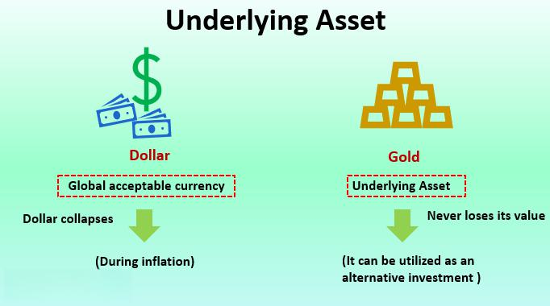

In today's rapidly evolving financial landscape, the interconnectedness of financial instruments, underlying asset derivatives, and algorithmic trading creates a sophisticated framework that significantly contributes to innovation and efficiency in markets. Financial instruments serve as the building blocks for modern markets, encompassing a wide array of objects, such as stocks, bonds, commodities, and currencies. Each instrument represents a contract that holds economic value, often derived from an underlying asset. Derivatives, such as options, futures, and swaps, play a pivotal role in these markets by providing mechanisms for hedging, speculation, and managing risk, allowing participants to respond to market signals effectively.

Algorithmic trading has emerged as a transformative force within this ecosystem. It leverages advanced computational techniques to facilitate automatic, high-frequency trading operations that respond to market fluctuations in real time. With the integration of derivative-based strategies, algorithmic trading offers enhanced opportunities for traders to optimize their returns by exploiting inefficiencies and adapting to market dynamics. These strategies utilize complex mathematical models and vast datasets to make informed decisions swiftly, often exceeding human capabilities.



This article investigates the complex relationship between financial instruments, underlying asset derivatives, and algorithmic trading. It aims to elucidate their functions and interdependencies, shedding light on how they collectively redefine contemporary finance. By comprehending these intricate connections, market participants are better positioned to explore possibilities, mitigate risks, and achieve financial success in today's competitive environment.

## Table of Contents

## Understanding Financial Instruments and Underlying Assets

Financial instruments are contracts structured around underlying assets, serving as a pivotal component in modern finance by creating means for capital allocation and risk management. Stocks, bonds, commodities, and currencies constitute typical underlying assets, directly influencing the valuation and trading of financial instruments. The relationship between these underlying assets and their corresponding financial products is intricate yet essential for participants aiming to harness the dynamics of financial markets.

Stocks are shares representing partial ownership in a corporation, offering potential dividends and capital appreciation to their holders. Bonds are fixed-income instruments issued by corporations and governments, promising periodic interest payments and principal repayment at maturity. Commodities, such as gold, oil, and agricultural products, are tangible goods traded on standardized contracts, often influenced by supply-demand factors and geopolitical tensions. Currencies form the backbone of foreign exchange market trading, reflecting national economic health and fiscal policies.

The value of financial instruments like derivatives, which include options, futures, and swaps, is fundamentally linked to the value of their underlying assets. For instance, a call option on a stock provides the right to purchase shares at a predetermined price, thus its worth fluctuates in response to the underlying stock's price movements. The formula for pricing such an option often involves mathematical models like the Black-Scholes model:

$$

C = S_0 N(d_1) - X e^{-rT} N(d_2)
$$

where $C$ is the call option price, $S_0$ is the current stock price, $X$ is the strike price, $r$ is the risk-free interest rate, $T$ is the time to expiration, and $N$ represents the cumulative distribution function of a standard normal distribution with parameters $d_1$ and $d_2$.

The correlation between underlying assets and the derivative instruments allows traders to develop effective trading strategies, such as hedging or speculation. Understanding this correlation is crucial; traders can hedge potential risks by leveraging derivatives to offset adverse movements in underlying asset prices. Conversely, speculation can be pursued by betting on favorable market movements, thus yielding potential profits.

To excel, traders need sophisticated quantitative skills and market insight to interpret complex relationships between underlying assets and financial instruments. This knowledge is pivotal in constructing strategic allocations and positionings that align with market conditions, ultimately determining the success of trading endeavors.

## The Role of Derivatives in Financial Markets

Derivatives serve as vital instruments in financial markets, providing traders with tools to manage risk, participate in speculative activities, and exploit market inefficiencies effectively. These financial contracts derive their value from underlying assets, such as stocks, bonds, currencies, or commodities, and are indispensable in the construction of sophisticated trading strategies.

A fundamental aspect of derivatives is their ability to offer leverage, which allows traders to control large positions with relatively small capital investments. This leverage is advantageous for amplifying potential returns but also heightens exposure to risk. Therefore, a sound understanding of derivatives' mechanics is essential for informed trading decisions.

Common types of derivatives include options, futures, and swaps. Options grant the holder the right, but not the obligation, to buy or sell an underlying asset at a predetermined price, known as the strike price, before or at the expiration date. This flexibility provides a mechanism for hedging against price movements and [volatility](/wiki/volatility-trading-strategies). Futures contracts obligate the parties to transact an asset at a predetermined future date and price, often utilized for hedging and price discovery. Swaps, on the other hand, typically involve the exchange of cash flows based on specified criteria, such as interest rates or currencies, facilitating risk management for financial institutions.

The pricing of derivatives hinges on the valuation of their underlying assets. The Black-Scholes model for options pricing, for instance, uses variables such as the current price of the asset, the strike price, time to expiration, risk-free [interest rate](/wiki/interest-rate-trading-strategies), and asset volatility to calculate the option's theoretical value. The formula is represented as:

$$
C = S_0N(d_1) - Xe^{-rt}N(d_2)
$$

where:

- $C$ is the call option price,
- $S_0$ is the current stock price,
- $X$ is the strike price,
- $t$ is the time to expiration,
- $r$ is the risk-free interest rate,
- $N$ is the cumulative distribution function of a standard normal distribution,
- $d_1 = \frac{\ln(S_0/X) + (r + \sigma^2/2)t}{\sigma\sqrt{t}}$,
- $d_2 = d_1 - \sigma\sqrt{t}$,
- $\sigma$ represents the volatility of the stock.

This model illuminates the influence of market dynamics and asset volatility on option valuation, enabling traders to construct strategies that hedge risk effectively and enhance speculative opportunities.

Derivatives' flexibility in offering tailored risk management solutions and opportunities for return enhancement underscores their integral role in financial markets. Mastering their pricing and application is crucial for developing robust trading strategies, allowing participants to navigate the complexities of modern finance while achieving their investment objectives.

## Algorithmic Trading: Transforming Financial Strategies

Algorithmic trading has revolutionized financial markets by introducing automation, high-speed execution, and data-driven strategies, fundamentally altering how trading decisions are made. By leveraging sophisticated algorithms, traders can automate the entire trading process, from market analysis to trade execution, leading to increased efficiency and precision. The integration of derivatives into these frameworks enhances strategic flexibility, allowing traders to manage risks and exploit market opportunities more effectively.

Derivatives are integral to [algorithmic trading](/wiki/algorithmic-trading) as they offer unique capabilities for constructing complex strategic approaches. These include hedging against potential adverse price movements and speculating on future price levels. For instance, options can be used to develop strategies that benefit from volatility, while futures contracts enable traders to lock in prices and hedge against market fluctuations.

Algorithmic trading frameworks are designed to execute predefined strategies based on mathematical models and market data analysis. These algorithms continuously monitor market conditions, adapting dynamically to capitalize on favorable circumstances or mitigate risk. For example, an algorithm might be programmed to take advantage of [arbitrage](/wiki/arbitrage) opportunities by simultaneously buying and selling correlated assets to profit from price discrepancies.

Python is a popular language used in algorithmic trading due to its versatility and comprehensive libraries for data analysis and quantitative finance. A basic example of an algorithmic trading strategy in Python might use the `numpy` library for calculations and the `pandas` library for handling time-series data. Here's a simple example of a moving average crossover strategy:

```python
import pandas as pd

# Sample market data
data = {'Price': [110, 112, 111, 113, 115, 117, 116, 118]}
df = pd.DataFrame(data)

# Calculate short-term and long-term moving averages
short_window = 3
long_window = 5
df['Short_MA'] = df['Price'].rolling(window=short_window, min_periods=1).mean()
df['Long_MA'] = df['Price'].rolling(window=long_window, min_periods=1).mean()

# Generate buy/sell signals
df['Signal'] = 0
df['Signal'][short_window:] = np.where(df['Short_MA'][short_window:] > df['Long_MA'][short_window:], 1, -1)

# Display signals
print(df[['Price', 'Short_MA', 'Long_MA', 'Signal']])
```

Incorporating derivatives in such strategies can further enhance profitability. For example, adding an options-based hedging layer could protect against downside risk, or using futures contracts could leverage the trader's position, amplifying gains from favorable trends. The key advantage of algorithmic trading lies in its ability to process vast amounts of data rapidly, allowing traders to react swiftly to changing market dynamics. This capability is vital in markets characterized by high volatility and rapid price changes, where human traders would struggle to keep pace.

Algorithmic trading is not without its challenges, with risk management being a crucial consideration. Effective algorithms must account for market anomalies, [liquidity](/wiki/liquidity-risk-premium) risks, and potential adverse movements. By doing so, traders can optimize their strategies to achieve higher returns while minimizing exposure to significant losses. The continuous evolution of technology and data analytics promises to further refine and enhance algorithmic trading methods in the future.

## Popular Derivative Strategies in Algorithmic Trading

Trend-following strategies utilizing futures contracts are a widely adopted method in algorithmic trading. These strategies capitalize on sustained market movements and are designed to identify and follow the direction of a market trend. The liquidity of futures markets allows for significant positions to be taken without greatly impacting prices, and their leverage enables traders to amplify returns from small capital allocations. Trend-following algorithms often employ moving averages or channel breakouts as signals for entering and exiting trades. For instance, a common strategy might involve buying a futures contract when its price crosses above its 50-day moving average.

Options strategies, such as straddles and strangles, provide traders with mechanisms to hedge against volatility risks and profit from price fluctuations. A straddle involves buying both a call and a put option at the same strike price and expiration date, allowing traders to benefit from large movements in either direction. Conversely, a strangle involves buying a call and a put with different strike prices but the same expiration, typically offering a cheaper alternatives. These strategies are particularly useful in volatile markets where predicting the direction of price movement is challenging, enabling traders to capitalize on the magnitude of price changes instead.

Arbitrage strategies are fundamental in algorithmic trading, focusing on exploiting discrepancies between the prices of derivatives and their underlying assets. This typically involves a simultaneous purchase and sale of identical or equivalent financial instruments in different markets or forms to take advantage of differing prices. Statistical arbitrage, for example, uses algorithms to identify short-term price anomalies and mean reversion opportunities. These tactics require high-frequency trading systems capable of executing numerous trades in milliseconds to capture minimal price differences before they vanish due to market efficiency.

Overall, these derivative strategies highlight the capacity of algorithmic trading to harness advanced computational models and vast datasets, allowing for dynamic engagement with market opportunities while managing associated risks.

## Challenges and Risks of Derivative Strategies

Derivatives, while offering traders significant leverage opportunities, present a suite of challenges and risks inherent in their complexity and the volatile nature of financial markets. These instruments allow large position exposures by committing relatively small amounts of capital, but this leverage can amplify both gains and losses. A critical source of risk is market volatility, which can lead to dramatic swings in the prices of underlying assets and, consequently, the derivatives. The reliance on assumptions about market behavior and asset pricing models also introduces uncertainties. For instance, an unexpected event can cause sudden market shifts, leading to substantial financial exposure.

The regulatory environment is another area of concern, as derivatives trading is subject to stringent regulations to prevent excessive risk-taking and to promote market stability. Traders must ensure compliance with jurisdiction-specific rules, such as reporting obligations and capital requirements, set by regulatory bodies like the U.S. Securities and Exchange Commission (SEC) and the Commodity Futures Trading Commission (CFTC). Non-compliance can lead to penalties and restrictions on trading activities, thus requiring constant vigilance and adaptation to evolving legal frameworks.

Risk management is a pivotal aspect of trading derivative instruments. Effective strategies to manage these risks include diversification, hedging, and the use of stop-loss orders to limit potential losses. Additionally, traders must engage in continuous market monitoring. This involves real-time tracking of market conditions and the performance of assets affecting derivatives to adjust positions accordingly. Advanced analytics and risk management software can aid in this continuous assessment and decision-making process.

Crucially, traders must be prepared to adapt strategies dynamically in response to market changes. Algorithmic trading systems, for example, can be designed to automatically alter trading approaches based on predefined risk parameters and market signals, yet these systems must be rigorously tested and validated under various market scenarios to ensure robustness and effectiveness. By integrating such adaptive mechanisms, traders can mitigate some of the inherent risks associated with derivatives trading.

Despite these challenges, by employing robust risk management practices, maintaining regulatory compliance, and adopting a dynamic approach to trading strategies, traders can navigate the complexities of derivatives markets, potentially enhancing their overall performance and achieving favorable financial outcomes.

## Future Trends in Derivative Strategies for Algo Trading

The landscape of derivative strategies in algorithmic trading is evolving rapidly, driven by technological advancements and emerging data paradigms. A key trend is the integration of [machine learning](/wiki/machine-learning), which significantly enhances the capability of algorithms to process vast and complex datasets for informed trading decisions. Machine learning models, such as supervised learning algorithms, are employed to analyze historical price patterns and predict future movements, thereby refining trading strategies with improved accuracy.

Incorporation of [alternative data](/wiki/best-alternative-data) sources is another trend shaping the future of algorithmic trading. Traditionally, traders relied on fundamental and technical data extracted from financial reports and historical price movements. However, the advent of big data analytics has opened up new avenues, including the analysis of social media sentiment, news feeds, and even satellite imagery. Social media platforms provide real-time sentiment analysis, allowing algorithms to detect market sentiment shifts almost instantaneously. Satellite imagery, on the other hand, can offer insights into macroeconomic factors such as crop yields or industrial activity levels, which can influence commodity and equity markets.

Sustainability considerations are increasingly influencing trading strategies through the integration of Environmental, Social, and Governance ([ESG](/wiki/esg-investing)) factors. Traders are beginning to account for ESG ratings in their algorithmic models, responding to a growing demand for ethical investment practices and sustainable financial products. Incorporating ESG criteria not only aligns with corporate social responsibility but may also offer a competitive edge as regulators and investors emphasize sustainability.

The mathematical and programming frameworks supporting these trends continue to advance. Machine learning models, such as neural networks and decision trees, are used within programming environments like Python to implement these strategies. Here is a simple example using Python and the `scikit-learn` library to implement a basic predictive model:

```python
from sklearn.model_selection import train_test_split
from sklearn.ensemble import RandomForestRegressor
from sklearn.metrics import mean_squared_error

# Assume X is a dataframe of features and y is the target variable
X_train, X_test, y_train, y_test = train_test_split(X, y, test_size=0.2, random_state=42)

# Create a Random Forest Model
model = RandomForestRegressor(n_estimators=100, random_state=42)
model.fit(X_train, y_train)

# Make predictions
predictions = model.predict(X_test)

# Evaluate the model
mse = mean_squared_error(y_test, predictions)
print(f'Model Mean Squared Error: {mse}')
```

This illustrative code shows how machine learning can be used to predict asset prices based on historical data and features derived from alternative sources. As these technologies continue to evolve, they will no doubt play a crucial role in defining the landscape of derivative strategies in algorithmic trading.

## Conclusion

The intersection of financial instruments, derivatives, and algorithmic trading is increasingly shaping the modern financial landscape, presenting a myriad of opportunities and challenges for traders. This dynamic interplay enables traders to engage with markets in innovative ways, leveraging technologies and strategies that enhance efficiency and precision. However, success in this complex environment requires more than just access to fast trading platforms and sophisticated derivatives.

A critical component in navigating this landscape is a comprehensive understanding of derivative pricing. Derivative pricing involves intricate mathematical models and formulas, such as the Black-Scholes model for options pricing or Monte Carlo simulations for more complex derivatives. Proficiency in these areas allows traders to accurately assess the value and risks associated with various financial instruments, tailoring strategies to capitalize on price movements effectively.

Algorithmic strategy implementation is equally crucial. Algorithmic trading, characterized by the automation and rapid execution of trades based on a set of defined criteria, demands a combination of computer science and financial acumen. Developing and refining such algorithms necessitates a robust understanding of coding languages like Python, alongside the capacity to update and optimize the algorithms in response to continuously shifting market conditions. Effective [backtesting](/wiki/backtesting), which involves applying algorithms to historical data to predict future performance, is also essential in refining these strategies.

Understanding market dynamics, encapsulating liquidity, volatility, and the impact of macroeconomic indicators, further complements derivative pricing and algorithmic strategies. Traders must continuously monitor these factors, adapting strategies as required to mitigate risks and capture opportunities.

By mastering these components—derivative pricing, algorithmic strategy implementation, and market dynamics—traders can substantially enhance their trading performance. This mastery enables traders to exploit market inefficiencies, capitalize on trends, and effectively manage risks, ultimately ensuring robust financial outcomes amidst the evolving market landscape. The integration of these elements represents a significant advance in trading strategies, paving the way for innovative approaches that meet the demands of a fast-paced financial ecosystem.

## References & Further Reading

[1]: Bergstra, J., Bardenet, R., Bengio, Y., & Kégl, B. (2011). ["Algorithms for Hyper-Parameter Optimization."](https://dl.acm.org/doi/10.5555/2986459.2986743) Advances in Neural Information Processing Systems 24.

[2]: ["Advances in Financial Machine Learning"](https://www.amazon.com/Advances-Financial-Machine-Learning-Marcos/dp/1119482089) by Marcos Lopez de Prado

[3]: ["Evidence-Based Technical Analysis: Applying the Scientific Method and Statistical Inference to Trading Signals"](https://www.amazon.com/Evidence-Based-Technical-Analysis-Scientific-Statistical/dp/0470008741) by David Aronson

[4]: ["Machine Learning for Algorithmic Trading"](https://github.com/PacktPublishing/Machine-Learning-for-Algorithmic-Trading-Second-Edition) by Stefan Jansen

[5]: ["Quantitative Trading: How to Build Your Own Algorithmic Trading Business"](https://www.amazon.com/Quantitative-Trading-Build-Algorithmic-Business/dp/1119800064) by Ernest P. Chan

[6]: Black, F., & Scholes, M. (1973). ["The Pricing of Options and Corporate Liabilities."](https://www.jstor.org/stable/1831029) Journal of Political Economy, 81(3), 637-654.

[7]: Hull, J. C. (2018). ["Options, Futures, and Other Derivatives."](https://www.semanticscholar.org/paper/Options%2C-Futures%2C-and-Other-Derivatives-Hull/89bdee500c8623864fc9eb7a471546aa713acc44) 10th Edition, Pearson.

[8]: Taleb, N. N. (2010). ["The Black Swan: The Impact of the Highly Improbable"](https://www.jstor.org/stable/23045073) 2nd Edition, Random House.