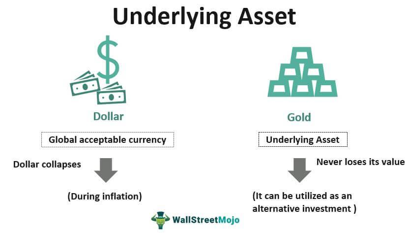

## Table of Contents

## What is an underlying asset in the context of derivatives?

An underlying asset in the context of derivatives is the financial asset on which a derivative contract is based. This can be anything from stocks and bonds to commodities like gold or oil, or even currencies. The value of the derivative depends on the price movements of this underlying asset. For example, if you buy a stock option, the underlying asset is the stock itself, and the option's value will rise or fall based on the stock's price.

Derivatives are financial instruments like options, futures, and swaps that derive their value from the performance of the underlying asset. They are used by investors to hedge risks or to speculate on the future price movements of the underlying asset without actually owning it. For instance, a farmer might use a futures contract to lock in a price for his crops, with the crops being the underlying asset. This way, he can protect himself against price drops before the harvest.

## How does the value of a derivative depend on its underlying asset?

The value of a derivative goes up and down based on what happens to the price of its underlying asset. If you think of a derivative like a bet on the future price of something, the underlying asset is what you're betting on. For example, if you buy a call option on a stock, you're betting that the stock's price will go up. If the stock's price does go up, your call option becomes more valuable because you can buy the stock at a lower price than it's currently worth.

On the other hand, if the price of the underlying asset goes down, the value of the derivative will usually go down too. Using the same example, if the stock's price falls, your call option loses value because it lets you buy the stock at a price that's now higher than the market price. This connection between the derivative and its underlying asset is what makes derivatives useful for both protecting against risk and trying to make money from price changes.

## Can you list some common types of underlying assets used in derivatives?

Underlying assets in derivatives can be many different things. Some common ones are stocks, which are shares in a company, and bonds, which are loans to a company or government. Commodities like gold, oil, and agricultural products like wheat or corn are also often used as underlying assets. These are physical goods that people buy and sell.

Another type of underlying asset is currencies, like the US dollar or the Euro. People use currency derivatives to bet on or protect against changes in exchange rates. Interest rates are also used as underlying assets, especially in financial derivatives like interest rate swaps, where people agree to exchange cash flows based on different interest rates.

Lastly, there are also derivatives based on stock market indexes, like the S&P 500 or the Dow Jones Industrial Average. These indexes represent a basket of stocks, and derivatives on them let investors bet on or hedge against the overall performance of the stock market.

## What role does the underlying asset play in the pricing of derivatives?

The underlying asset is super important when it comes to figuring out how much a derivative is worth. Think of a derivative like a bet on what will happen to the price of the underlying asset. If the price of the underlying asset goes up, the value of the derivative usually goes up too. For example, if you have a call option on a stock and the stock's price rises, your option becomes more valuable because you can buy the stock at a cheaper price than it's currently worth. The opposite happens if the underlying asset's price goes down; the derivative's value will typically drop as well.

There are also other things that help decide the price of a derivative, like how much time is left until the derivative expires and how much the price of the underlying asset tends to jump around. But no matter what, the underlying asset is the main thing that drives the derivative's value. It's like the heartbeat of the derivative, keeping it alive and changing with every beat. Without the underlying asset, there wouldn't be any way to know what the derivative should be worth.

## How do changes in the underlying asset affect different types of derivative contracts?

Changes in the underlying asset affect different types of derivative contracts in unique ways. For example, with a call option, which gives you the right to buy the underlying asset at a set price, if the price of the underlying asset goes up, the value of your call option also goes up. This is because you can buy the asset cheaper than its current market price. But if the underlying asset's price goes down, your call option loses value because you're stuck buying it at a higher price than it's worth now. On the other hand, a put option, which gives you the right to sell the underlying asset at a set price, works the opposite way. If the underlying asset's price drops, your put option becomes more valuable because you can sell it at a higher price than it's currently worth.

Futures contracts, which are agreements to buy or sell the underlying asset at a future date, also react to changes in the underlying asset's price. If the price of the underlying asset goes up, the value of a futures contract to buy that asset also goes up, and if the price goes down, the value of the futures contract drops. Swaps, where parties agree to exchange cash flows based on different variables like interest rates, also depend on the underlying asset. For example, in an interest rate swap, if the underlying interest rate changes, the payments one party has to make will change, affecting the value of the swap. So, no matter what kind of derivative you're dealing with, the underlying asset's price movements are the key to understanding how its value changes.

## What are the risks associated with the underlying asset in derivative trading?

When you trade derivatives, the price of the underlying asset can be a big risk. If the price of the underlying asset moves a lot, it can make your derivative worth a lot more or a lot less. For example, if you buy a call option on a stock and the stock's price goes down a lot, your option could become almost worthless. On the other hand, if the stock's price goes up a lot, you could make a lot of money. But it's hard to predict what the price will do, and that uncertainty is a risk you have to deal with.

Another risk is that the underlying asset might not be easy to buy or sell. If it's hard to trade the underlying asset, it can be hard to figure out what the derivative is really worth. This can make the derivative's price jump around a lot, which is called volatility. High volatility can be good if you're trying to make money from big price swings, but it can also mean you lose a lot if the price moves against you. So, understanding how easy or hard it is to trade the underlying asset is important when you're thinking about the risks of trading derivatives.

## How can investors hedge against movements in the underlying asset using derivatives?

Investors can use derivatives to protect themselves from big price swings in the underlying asset. One way to do this is by buying put options. A put option gives you the right to sell the underlying asset at a set price, no matter how low the market price goes. So, if you own a stock and you're worried its price might drop, you can buy a put option on that stock. If the stock's price does go down, the put option will become more valuable, helping to make up for the money you lose on the stock. This is like having insurance on your investment.

Another way to hedge is by using futures contracts. A futures contract is an agreement to buy or sell the underlying asset at a future date for a price you decide on now. If you're a farmer and you're worried that the price of your crops might go down before you sell them, you can sell a futures contract on those crops. This way, you lock in a price now, so even if the market price drops later, you're protected. Futures can also be used to hedge against rising prices. If you need to buy something in the future and you're worried its price will go up, you can buy a futures contract to lock in today's price. This helps you plan your costs better and avoid surprises.

## What is the difference between a derivative and its underlying asset?

A derivative is like a bet on what will happen to the price of something else, which we call the underlying asset. The underlying asset is the actual thing, like a stock, a barrel of oil, or a currency, that the derivative's value depends on. For example, if you buy a call option on a stock, the stock itself is the underlying asset, and the option's value goes up or down based on what happens to the stock's price.

The big difference between a derivative and its underlying asset is that you don't actually own the underlying asset when you buy a derivative. With a derivative, you're just making a bet on its future price without having to buy the real thing. This can be useful for protecting yourself against price changes or trying to make money from them, but it also means you're dealing with a lot of uncertainty because the derivative's value can swing wildly based on what happens to the underlying asset.

## Can the underlying asset in a derivative be another derivative?

Yes, the underlying asset in a derivative can be another derivative. This is called a derivative on a derivative, or sometimes a second-order derivative. Imagine you have a bet on the price of a stock, which is a derivative. Now, you can make another bet on how that first bet will change in value. That second bet is a derivative where the underlying asset is the first derivative.

This might sound complicated, but it's used by some investors to try to make more money or protect their investments in more complex ways. For example, you might buy an option on a futures contract. The futures contract is a derivative because its value depends on the price of something like oil. The option you buy is another derivative, but its value depends on the futures contract, not directly on the oil. So, the underlying asset for your option is the futures contract, which is itself a derivative.

## How do regulatory frameworks address the risks related to underlying assets in derivatives?

Regulatory frameworks aim to manage the risks related to underlying assets in derivatives by setting rules that make trading safer and more transparent. They often require that people trading derivatives have enough money or assets to cover potential losses. This is called margin requirements. Regulators also make sure that there's enough information available about the underlying assets so that everyone knows what they're getting into. They might ask for regular reports on the prices and risks of the underlying assets, which helps keep the market honest and helps prevent big surprises.

Another way regulators address these risks is by keeping an eye on the overall market to make sure it's not getting too risky. They might set limits on how much someone can bet on an underlying asset to stop one person or group from having too much control. They also work to make sure that the people who trade derivatives follow the rules and don't do anything shady. By doing all this, regulators try to protect investors and keep the financial system stable, even when the prices of underlying assets move around a lot.

## What are some advanced strategies that use the underlying asset in derivatives for portfolio management?

One advanced strategy that uses the underlying asset in derivatives for portfolio management is called delta hedging. Imagine you own a stock and you're worried its price might drop. You can buy a put option on that stock, which gives you the right to sell it at a set price. The 'delta' of the option tells you how much the option's price will change for every dollar change in the stock's price. By buying the right amount of put options, you can make sure that any loss in the stock's value is offset by a gain in the option's value. This way, you protect your portfolio from big swings in the stock's price.

Another strategy is called gamma [scalping](/wiki/gamma-scalping). This is a bit more complicated and is used by traders who want to make money from small changes in the price of the underlying asset. They buy options and then keep buying or selling the underlying asset to keep their portfolio balanced. The 'gamma' of an option tells you how fast the delta changes as the price of the underlying asset moves. By constantly adjusting their positions based on gamma, traders can make small profits from these tiny price movements. It's like playing a game where you're always trying to stay one step ahead of the market.

## How do market conditions influence the choice of underlying assets for new derivative products?

Market conditions play a big role in deciding which underlying assets are used for new derivative products. When the market is doing well and prices are going up, people might want to bet on things like stocks or stock indexes because they think they'll keep going up. On the other hand, if the market is shaky and prices are all over the place, people might look for ways to protect themselves. They might choose underlying assets like commodities or currencies, which can help them hedge against big swings in the market. Also, if there's a lot of news or events that affect certain assets, like changes in oil production or interest rates, those assets might become more popular for new derivatives.

Sometimes, new trends or technologies can also influence what underlying assets are used. For example, if there's a lot of buzz about a new technology like electric cars, investors might start trading derivatives based on the stocks of companies making those cars or the commodities they need, like lithium for batteries. Regulators also have a say in what underlying assets are used for new derivatives. They might step in if they think a certain asset is too risky or if they want to encourage trading in assets that help the economy. So, market conditions, trends, and rules all come together to decide which underlying assets are hot for new derivative products.

## What is the understanding of financial instruments and underlying assets?

Financial instruments are contracts structured around underlying assets, serving as a pivotal component in modern finance by creating means for capital allocation and risk management. Stocks, bonds, commodities, and currencies constitute typical underlying assets, directly influencing the valuation and trading of financial instruments. The relationship between these underlying assets and their corresponding financial products is intricate yet essential for participants aiming to harness the dynamics of financial markets.

Stocks are shares representing partial ownership in a corporation, offering potential dividends and capital appreciation to their holders. Bonds are fixed-income instruments issued by corporations and governments, promising periodic interest payments and principal repayment at maturity. Commodities, such as gold, oil, and agricultural products, are tangible goods traded on standardized contracts, often influenced by supply-demand factors and geopolitical tensions. Currencies form the backbone of foreign exchange market trading, reflecting national economic health and fiscal policies.

The value of financial instruments like derivatives, which include options, futures, and swaps, is fundamentally linked to the value of their underlying assets. For instance, a call option on a stock provides the right to purchase shares at a predetermined price, thus its worth fluctuates in response to the underlying stock's price movements. The formula for pricing such an option often involves mathematical models like the Black-Scholes model:

$$

C = S_0 N(d_1) - X e^{-rT} N(d_2)
$$

where $C$ is the call option price, $S_0$ is the current stock price, $X$ is the strike price, $r$ is the risk-free interest rate, $T$ is the time to expiration, and $N$ represents the cumulative distribution function of a standard normal distribution with parameters $d_1$ and $d_2$.

The correlation between underlying assets and the derivative instruments allows traders to develop effective trading strategies, such as hedging or speculation. Understanding this correlation is crucial; traders can hedge potential risks by leveraging derivatives to offset adverse movements in underlying asset prices. Conversely, speculation can be pursued by betting on favorable market movements, thus yielding potential profits.

To excel, traders need sophisticated quantitative skills and market insight to interpret complex relationships between underlying assets and financial instruments. This knowledge is pivotal in constructing strategic allocations and positionings that align with market conditions, ultimately determining the success of trading endeavors.

## What is the role of derivatives in financial markets?

Derivatives serve as vital instruments in financial markets, providing traders with tools to manage risk, participate in speculative activities, and exploit market inefficiencies effectively. These financial contracts derive their value from underlying assets, such as stocks, bonds, currencies, or commodities, and are indispensable in the construction of sophisticated trading strategies.

A fundamental aspect of derivatives is their ability to offer leverage, which allows traders to control large positions with relatively small capital investments. This leverage is advantageous for amplifying potential returns but also heightens exposure to risk. Therefore, a sound understanding of derivatives' mechanics is essential for informed trading decisions.

Common types of derivatives include options, futures, and swaps. Options grant the holder the right, but not the obligation, to buy or sell an underlying asset at a predetermined price, known as the strike price, before or at the expiration date. This flexibility provides a mechanism for hedging against price movements and [volatility](/wiki/volatility-trading-strategies). Futures contracts obligate the parties to transact an asset at a predetermined future date and price, often utilized for hedging and price discovery. Swaps, on the other hand, typically involve the exchange of cash flows based on specified criteria, such as interest rates or currencies, facilitating risk management for financial institutions.

The pricing of derivatives hinges on the valuation of their underlying assets. The Black-Scholes model for options pricing, for instance, uses variables such as the current price of the asset, the strike price, time to expiration, risk-free [interest rate](/wiki/interest-rate-trading-strategies), and asset volatility to calculate the option's theoretical value. The formula is represented as:

$$
C = S_0N(d_1) - Xe^{-rt}N(d_2)
$$

where:

- $C$ is the call option price,
- $S_0$ is the current stock price,
- $X$ is the strike price,
- $t$ is the time to expiration,
- $r$ is the risk-free interest rate,
- $N$ is the cumulative distribution function of a standard normal distribution,
- $d_1 = \frac{\ln(S_0/X) + (r + \sigma^2/2)t}{\sigma\sqrt{t}}$,
- $d_2 = d_1 - \sigma\sqrt{t}$,
- $\sigma$ represents the volatility of the stock.

This model illuminates the influence of market dynamics and asset volatility on option valuation, enabling traders to construct strategies that hedge risk effectively and enhance speculative opportunities.

Derivatives' flexibility in offering tailored risk management solutions and opportunities for return enhancement underscores their integral role in financial markets. Mastering their pricing and application is crucial for developing robust trading strategies, allowing participants to navigate the complexities of modern finance while achieving their investment objectives.

## References & Further Reading

[1]: Bergstra, J., Bardenet, R., Bengio, Y., & Kégl, B. (2011). ["Algorithms for Hyper-Parameter Optimization."](https://dl.acm.org/doi/10.5555/2986459.2986743) Advances in Neural Information Processing Systems 24.

[2]: ["Advances in Financial Machine Learning"](https://www.amazon.com/Advances-Financial-Machine-Learning-Marcos/dp/1119482089) by Marcos Lopez de Prado

[3]: ["Evidence-Based Technical Analysis: Applying the Scientific Method and Statistical Inference to Trading Signals"](https://www.amazon.com/Evidence-Based-Technical-Analysis-Scientific-Statistical/dp/0470008741) by David Aronson

[4]: ["Machine Learning for Algorithmic Trading"](https://github.com/PacktPublishing/Machine-Learning-for-Algorithmic-Trading-Second-Edition) by Stefan Jansen

[5]: ["Quantitative Trading: How to Build Your Own Algorithmic Trading Business"](https://www.amazon.com/Quantitative-Trading-Build-Algorithmic-Business/dp/1119800064) by Ernest P. Chan

[6]: Black, F., & Scholes, M. (1973). ["The Pricing of Options and Corporate Liabilities."](https://www.jstor.org/stable/1831029) Journal of Political Economy, 81(3), 637-654.

[7]: Hull, J. C. (2018). ["Options, Futures, and Other Derivatives."](https://www.semanticscholar.org/paper/Options%2C-Futures%2C-and-Other-Derivatives-Hull/89bdee500c8623864fc9eb7a471546aa713acc44) 10th Edition, Pearson.

[8]: Taleb, N. N. (2010). ["The Black Swan: The Impact of the Highly Improbable"](https://www.jstor.org/stable/23045073) 2nd Edition, Random House.