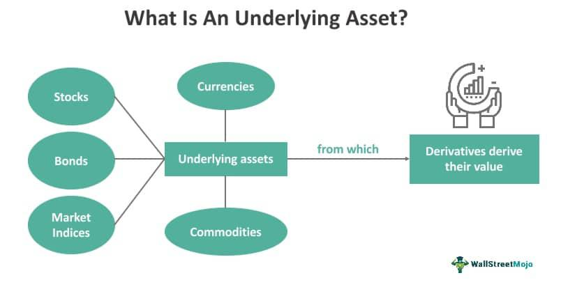

Algorithmic trading, also known as algo trading, involves using computer algorithms to automate trading decisions in financial markets. These algorithms are predefined sets of rules or processes that are designed to execute trades at optimal prices and timings. The rise of algorithmic trading has transformed how modern financial markets operate, significantly increasing the speed and volume at which trades can be executed. This transformation is largely due to technological advancements, which have enabled the development of sophisticated trading systems capable of processing vast amounts of data instantaneously.

The term "underlying" is crucial in the context of algorithmic trading as it refers to the financial instruments upon which derivative contracts are based. These instruments, which include assets like stocks, commodities, forex pairs, and indices, form the foundation upon which algorithmic trading strategies are built. The effective incorporation of underlying assets into algorithms allows traders to exploit market efficiencies and enhance strategy performance.



This article aims to explore the advantages and disadvantages associated with the use of underlying assets in algorithmic trading strategies. By examining these aspects, the article will provide a comprehensive understanding of how underlying assets influence trading outcomes and the strategic decisions involved. This is an important topic for traders, investors, and financial professionals, as understanding the role of underlying assets in algorithmic trading can result in more informed decision-making and potentially improved trading performance.

In a rapidly evolving financial landscape, knowledge of algorithmic trading's nuances, particularly the concept of underlying assets, is invaluable. As algorithms continue to play a pivotal role in markets, the ability to effectively leverage these tools is essential for anyone engaged in trading activities.

## Table of Contents

## What is Algorithmic Trading?

Algorithmic trading, often referred to as algo trading, is the use of computer algorithms to automate the process of buying and selling securities. These algorithms are coded sets of rules and instructions that aim to execute trading strategies at speeds and frequencies impossible for human traders. At its core, algorithmic trading takes advantage of computing power to enable rapid decision-making in financial markets, where time is of the essence.

Historically, the genesis of algorithmic trading can be traced back to the late 20th century, when financial markets began to integrate electronic trading platforms. The 1970s marked the advent of early automated trading systems, which used simple rules for trade execution. However, it wasn't until the 1990s, with the proliferation of powerful computers and the internet, that algorithmic trading began to flourish. Advancements in technology during this period allowed for the development of sophisticated models and execution algorithms, culminating in the high-frequency trading strategies we observe today.

Algorithmic trading involves several key concepts and terms. A commonly used concept is the trading algorithm itself, which can range from simple linear-regression models to complex [machine learning](/wiki/machine-learning) frameworks. Other terms include 'execution algorithms,' which focus on how trades are carried out in the market, and 'alpha-generating algorithms,' which are designed to identify profitable trading opportunities. Market data, historical data, predictive analytics, and quantitative models are fundamental components that guide algorithmic strategies.

Discretionary trading, in contrast to [algorithmic trading](/wiki/algorithmic-trading), is driven by human judgment and intuition. Discretionary traders rely on their personal experience, market observations, and qualitative information to make trading decisions. Algorithmic trading, on the other hand, eliminates the human element, relying solely on pre-defined instructions and data analysis to execute trades. This shift from discretionary to algorithmic trading reflects the broader trend towards data-driven decision-making in finance.

Technology and automation play pivotal roles in the evolution of algorithmic trading. Advanced computing infrastructure enables the processing of vast amounts of data in real-time. Trading platforms equipped with application programming interfaces (APIs) allow algorithms to interact seamlessly with the market. Furthermore, the adoption of machine learning and [artificial intelligence](/wiki/ai-artificial-intelligence) has enhanced the capability of algorithms to adapt and improve their performance over time. Here's a basic example of how a simple moving average crossover strategy can be implemented in Python:

```python
import pandas as pd

# Load historical market data
data = pd.read_csv('market_data.csv')

# Calculate moving averages
data['SMA20'] = data['Close'].rolling(window=20).mean()
data['SMA50'] = data['Close'].rolling(window=50).mean()

# Define trading signals
data['Signal'] = 0
data['Signal'][data['SMA20'] > data['SMA50']] = 1
data['Signal'][data['SMA20'] < data['SMA50']] = -1

# Evaluate strategy performance
data['Strategy_Return'] = data['Signal'].shift(1) * data['Close'].pct_change()
cumulative_return = (1 + data['Strategy_Return']).cumprod() - 1

print("Cumulative Strategy Return: ", cumulative_return[-1])
```

This code calculates the 20-day and 50-day simple moving averages for a given stock and generates buy/sell signals based on their crossover. Such automated strategies highlight the efficiencies gained from algorithmic trading, primarily through the reduction of human error and emotional biases.

As algorithmic trading continues to evolve, it represents a significant paradigm shift in financial markets. The advantages of speed, accuracy, and scalability make it an indispensable tool for modern traders and institutions. However, it also requires a robust understanding of both technological and market dynamics to leverage its full potential effectively.

## Understanding the 'Underlying' in Algo Trading

In financial markets, the term "underlying" refers to the financial instrument upon which derivatives or other financial products are based. These could include a wide range of assets such as stocks, commodities, foreign exchange ([forex](/wiki/forex-system)), and indices, which form the foundation for trading strategies and instruments like options, futures, and various derivatives. Understanding the underlying assets is critical for traders and investors, particularly in algorithmic trading, where decision-making is automated and relies heavily on the characteristics of these assets.

The significance of underlying assets in algorithmic trading is profound, as these assets determine the behavior and pricing of derivatives. By analyzing underlying assets, algorithms can make informed decisions on when to enter or [exit](/wiki/exit-strategy) trades. These assets provide the necessary data that algorithms analyze to detect patterns, evaluate risks, and execute trades efficiently. For instance, the price movement of a stock would directly affect the pricing of options based on that stock, making the underlying asset a crucial [factor](/wiki/factor-investing) in algorithmic trading strategies.

Algorithms incorporate underlying assets into their strategies by continuously monitoring market data related to these assets. For example, an algorithm trading in forex might utilize real-time currency exchange rates to make split-second trading decisions. Trading strategies may involve statistical [arbitrage](/wiki/arbitrage), where an algorithm might exploit price discrepancies between an underlying asset and its derivative. Python, a frequently used programming language in algorithmic trading, allows for the development of models that can process vast amounts of data efficiently. A simple example of code that might be used in algorithmic trading to track the price of an underlying asset is:

```python
import yfinance as yf  # For more datasets, visit: https://paperswithbacktest.com/datasets

def get_asset_price(ticker):
    asset = yf.Ticker(ticker)
    history = asset.history(period="1d")
    return history['Close'].iloc[-1]

# Example usage
price = get_asset_price("AAPL")
print(f"The current closing price of AAPL is: {price}")
```

This script uses the `yfinance` library to fetch current closing prices for a given stock, such as Apple Inc. (AAPL), facilitating real-time decision-making in an algorithmic trading strategy.

Examples of underlying assets include:
- **Stocks:** Shares of companies, which are the most common underlying for options and other derivatives.
- **Commodities:** Physical goods like gold, oil, and wheat, traded in futures markets.
- **Forex:** Currency pairs, where the exchange rate between two currencies determines the trade.
- **Indices:** Aggregates of multiple stocks, such as the S&P 500, used to gauge market performance.

The importance of understanding these underlying assets cannot be overstated for effective algorithmic trading. Knowledge of how these assets behave helps traders develop stronger strategies, assess market conditions, and optimize performance. Misjudging the characteristics or dynamics of an underlying asset could lead to substantial financial loss, underscoring the necessity for thorough analysis.

By leveraging detailed insights into underlying assets, algorithmic strategies can be fine-tuned for improved accuracy and profitability. As financial markets evolve, the focus on robust data analysis and understanding of underlying assets will continue to play a pivotal role in the success of algorithmic trading endeavors.

## Advantages of Algorithmic Trading

Algorithmic trading offers a host of advantages that have significantly transformed the financial markets. The efficiency and speed with which trades can be executed are major benefits, allowing traders to capitalize on short-lived opportunities. By leveraging high-frequency trading algorithms, traders are able to execute thousands of trades in fractions of a second, a feat impossible for human traders. This rapid order execution minimizes market impact and can further enhance the profitability of trading strategies.

One of the more compelling advantages of algorithmic trading is the reduction of human error and emotional influence, both of which can adversely affect trading decisions. Emotional factors such as fear and greed can lead to inconsistent decision-making, whereas algorithms operate based on pre-defined criteria, ensuring a level of objectivity and rationality. This systematic approach helps traders stick to their strategies without deviation, thereby reducing the likelihood of error.

The ability to backtest strategies and optimize performance is another key advantage of algorithmic trading. Traders can use historical data to simulate the performance of a trading strategy, allowing them to refine and improve it before deploying it in live markets. This testing ensures that strategies are robust and that they account for various market conditions, enhancing their potential for success. The following Python snippet illustrates a simple backtest framework:

```python
import pandas as pd

def backtest_strategy(data, strategy):
    # Sample strategy function
    def apply_strategy(row):
        return strategy(row['Open'], row['Close'])

    # Apply strategy and calculate returns
    data['Positions'] = data.apply(apply_strategy, axis=1)
    data['Returns'] = data['Positions'] * (data['Close'].pct_change().fillna(0))
    return data['Returns'].sum()

# Example usage with sample data
data = pd.DataFrame({'Open': [100, 105, 102], 'Close': [105, 102, 108]})
sample_strategy = lambda open_price, close_price: 1 if close_price > open_price else -1

cumulative_return = backtest_strategy(data, sample_strategy)
print(f"Cumulative Return: {cumulative_return}")
```

Algorithmic trading also brings increased consistency and discipline to trading execution. By adhering strictly to the predefined rules and strategies encoded within algorithms, traders can ensure a disciplined approach to market participation. This consistency helps mitigate the risks associated with impulsive behaviors, often resulting in improved trading outcomes over time.

Finally, algorithmic trading provides access to advanced trading strategies and techniques that can involve complex calculations and predictive models. These sophisticated strategies, such as [statistical arbitrage](/wiki/statistical-arbitrage), algorithmic execution, and [market making](/wiki/market-making), can exploit market inefficiencies and provide competitive edges that would otherwise be inaccessible to individual traders relying solely on manual trading methods. As a result, traders and institutional players can explore new avenues for generating returns, further illustrating the transformative power of algorithmic trading within the financial industry.

## Disadvantages of Algorithmic Trading

Algorithmic trading, while highly efficient, presents several disadvantages that must be considered by traders. One significant risk involves technical failures and the inherent dangers of automation. Trading algorithms depend on complex software architectures operating across multiple hardware systems. Any technical failure in software or hardware, network malfunctions, or issues with data feeds can lead to missed opportunities or unintended trading actions. The reliance on a robust technological infrastructure means that disruptions, even minor, can have significant financial consequences.

Moreover, the reliance on technology introduces a potential lack of human oversight. Algorithmic systems are designed to operate autonomously, executing trades based on predefined criteria. This can lead to situations where traders are unaware of market changes or errors within the algorithm itself. Human intervention is sometimes critical in interpreting unprecedented market events, where algorithms may not be sufficiently adaptive or responsive. Consequently, excessive reliance on automated systems can leave traders vulnerable to unforeseen events, lacking the nuanced judgment that human oversight can provide.

Algorithmic trading also raises market impacts and regulatory concerns. These systems can execute a large number of trades in a fraction of a second. While this increases market [liquidity](/wiki/liquidity-risk-premium), it can also contribute to market [volatility](/wiki/volatility-trading-strategies), particularly during significant market events. The nature of these rapid trades has raised concerns among regulators regarding potential market manipulation and fairness, leading to increased scrutiny and the imposition of stricter regulations.

Furthermore, there is a potential for increased market volatility, which can sometimes culminate in flash crashes. A flash crash is a very rapid, deep, and volatile fall in security prices occurring within an extremely short time period. Algorithmic trading amplifies these events by rapidly executing large trade volumes based on erroneous data or feedback loops, resulting in extreme price movements. An infamous example is the May 6, 2010, flash crash when the Dow Jones Industrial Average dropped nearly 1,000 points within minutes, primarily driven by algorithmic trades.

Finally, maintaining and updating trading algorithms present ongoing challenges. Financial markets are dynamic, influenced by numerous variables that can change rapidly. Algorithms require constant monitoring and tuning to ensure they perform optimally in varying market conditions. Updating algorithms to respond to new data feeds, changes in market structures, or regulatory adjustments can be resource-intensive. The complexity of these systems necessitates a deep understanding of both financial markets and programming, which can pose significant barriers to continuous improvement and adaptation.

## Examples of Underlying Meaning in Algo Trading

Algorithmic trading utilizes underlying assets as fundamental components to design effective trading strategies. Understanding these components can significantly improve trading outcomes, as evidenced by various case studies and real-world implementations.

One notable case study is the use of underlying stocks in arbitrage strategies. For instance, statistical arbitrage algorithms often exploit temporary discrepancies in the price of dual-listed stocks or related financial instruments by referencing the underlying stock prices. These algorithms can swiftly execute trades to profit from small price differences with [high frequency](/wiki/high-frequency-trading), showcasing the critical role of underlying stock values in driving trading decisions.

Another example includes commodity-focused algorithms employed by large trading firms. These algorithms monitor underlying futures contracts and spot prices of commodities like oil and gold. Changes in these underlying asset prices, influenced by geopolitical events or supply chain disruptions, are incorporated into the algorithm's trading logic to anticipate market shifts. Financial institutions leverage these insights to adjust their portfolios promptly, highlighting how underlying assets guide decision-making in algorithmic trading.

Market conditions play a pivotal role in determining the value of underlying assets and, consequently, the outcomes of algorithmic strategies. For example, during periods of high volatility, the correlation between underlying asset prices and derived instruments, such as options, becomes crucial. Algorithms designed to track these correlations can better predict option price movements, thereby executing more profitable trades.

Real-world scenarios where understanding underlying assets proved beneficial include the 2008 financial crisis. Many trading algorithms, programmed to assess the risk of underlying financial derivatives like mortgage-backed securities, helped identify market vulnerabilities. These algorithms allowed traders to hedge against potential losses effectively. The crisis demonstrated the necessity of comprehending the underlying constructs to navigate complex financial landscapes.

Overall, leveraging the meaning of underlying assets in trading strategies facilitates better risk management and profitability. It allows traders to respond to market dynamics with precision and informed judgment, underscoring the importance of these assets in algorithmic trading.

## Conclusion

Algorithmic trading has significantly transformed financial markets by bringing efficiency, reducing errors, and enhancing the precision of trading strategies. Key advantages, such as executing trades with unmatched speed and reliability, have made algo trading an indispensable tool for traders and financial professionals. It mitigates human error and the influence of emotions, offering a disciplined approach to trading that allows for the [backtesting](/wiki/backtesting) and optimization of strategies. These factors contribute to improved performance and facilitate access to sophisticated trading methodologies.

Conversely, algorithmic trading is not without its drawbacks. Technical failures can pose substantial risks, with the potential for catastrophic market impacts should they occur. The over-reliance on technology may diminish necessary human oversight, while regulatory concerns linger around the implications of automated systems on market stability, including the potential exacerbation of volatility or the incidence of flash crashes. Developers and traders alike must remain vigilant in maintaining and updating algorithms to ensure their continued efficacy and relevance.

Underlying assets serve as the bedrock of algorithmic trading strategies. Their significance is underscored by their ability to determine investment outcomes and guide algorithmic decisions. Understanding these assets—whether they involve stocks, commodities, forex, or indices—enables the crafting of more effective and tailored trading strategies. Knowledge of underlying assets allows traders and investors to better anticipate market movements and improve outcomes.

Traders and investors stand to gain considerably by appreciating the intricacies of underlying assets in algorithmic strategies. Keen insights into these assets enable more informed decision-making and can illuminate opportunities that may otherwise remain unnoticed. This understanding fosters agility and adaptability in the rapidly changing financial landscape.

Looking ahead, algorithmic trading will undoubtedly continue to evolve, with underlying assets retaining their fundamental role within these strategies. As technology and market conditions develop, so too will the need for robust understanding, continuous research, and informed adaptation by market participants. Advancements in machine learning and data analytics promise to elevate algorithmic strategies, further highlighting the importance of mastering this concept.

Readers are encouraged to remain engaged and informed in this dynamic sphere. Continuous research and education are vital in adapting to new trends and technologies within algorithmic trading. By doing so, traders and investors can effectively leverage the benefits of algorithmic strategies while mitigating their inherent risks, ensuring sustained success in the modern financial markets.

## References & Further Reading

[1]: Bergstra, J., Bardenet, R., Bengio, Y., & Kégl, B. (2011). ["Algorithms for Hyper-Parameter Optimization."](https://papers.nips.cc/paper/4443-algorithms-for-hyper-parameter-optimization) Advances in Neural Information Processing Systems 24.

[2]: ["Advances in Financial Machine Learning"](https://www.amazon.com/Advances-Financial-Machine-Learning-Marcos/dp/1119482089) by Marcos Lopez de Prado

[3]: ["Evidence-Based Technical Analysis: Applying the Scientific Method and Statistical Inference to Trading Signals"](https://www.amazon.com/Evidence-Based-Technical-Analysis-Scientific-Statistical/dp/0470008741) by David Aronson

[4]: ["Machine Learning for Algorithmic Trading"](https://github.com/stefan-jansen/machine-learning-for-trading) by Stefan Jansen

[5]: ["Quantitative Trading: How to Build Your Own Algorithmic Trading Business"](https://www.amazon.com/Quantitative-Trading-Build-Algorithmic-Business/dp/1119800064) by Ernest P. Chan