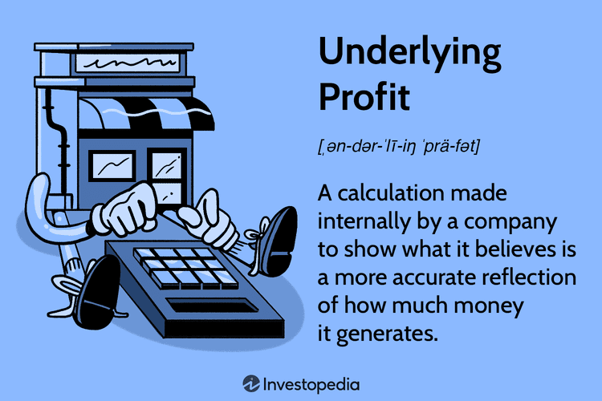

Understanding the dynamics of financial analysis is essential for devising effective investment strategies in today's rapidly evolving markets. Two fundamental concepts that stand out in modern financial analysis are underlying profit and algorithmic trading. Underlying profit offers a more refined measurement of a company’s performance by excluding irregular, non-recurring costs that might obscure a true reflection of operational success. This metric provides investors with a clearer view of a company's core profitability, as opposed to figures distorted by one-time financial events.

Simultaneously, algorithmic trading represents a technological advancement that has transformed trading practices, allowing market participants to execute trades at unprecedented speed and accuracy through computerized systems. This approach utilizes pre-defined, quantitative rules to determine trading strategies, which minimizes human errors and emotional decision-making, thus optimizing trade execution.



In this article, we analyze both the advantages and challenges associated with underlying profit analysis and algorithmic trading. By exploring these modern financial tools, we aim to equip investors and financial professionals with the necessary understanding to enhance their investment strategies. This comprehensive evaluation serves to empower readers by aiding them in making informed decisions regarding their investment approaches, ensuring they leverage the strengths of both financial analysis and technological tools in their pursuit of robust financial performance.

## Table of Contents

## What is Underlying Profit?

Underlying profit is an important financial metric that focuses on a company's profitability by excluding irregular and non-recurring costs, offering a more accurate reflection of the company's core operational performance. Unlike accounting profit, which includes all income and expenses regardless of their nature, underlying profit is adjusted to eliminate one-time charges such as those resulting from natural disasters, asset sales, or other extraordinary events that do not occur during the regular course of business.

The calculation of underlying profit is generally conducted internally by companies to provide a clearer picture of operational efficiency and sustainable profitability. By focusing on the regular accounting cycle, this metric excludes volatile items that could boost or deteriorate reported profits temporarily, ensuring consistent evaluations over time.

For example, a company might report an accounting profit of $10 million, but this figure includes a $2 million gain from the sale of a building and a $1 million loss due to a natural disaster. The underlying profit in this scenario would be $9 million ($10 million - $2 million + $1 million), presenting a clearer view of the company's ongoing profitability.

Calculating underlying profit involves understanding the company's regular revenue-generating activities and carefully distinguishing these from non-recurring transactions. Consistency in these adjustments is crucial across reporting periods, allowing stakeholders to make nuanced assessments of operational performance. Here is a basic Python function illustrating a simplified calculation of underlying profit:

```python
def calculate_underlying_profit(total_profit, one_time_gains, one_time_losses):
    return total_profit - one_time_gains + one_time_losses

# Example usage
total_profit = 10_000_000  # Company's accounting profit
one_time_gains = 2_000_000  # Gains from asset sales
one_time_losses = 1_000_000  # Losses from a natural disaster

underlying_profit = calculate_underlying_profit(total_profit, one_time_gains, one_time_losses)
print(f"Underlying Profit: ${underlying_profit}")
```

The concept of underlying profit is crucial for investors and analysts who look beyond superficial earnings reports. By focusing on operational aspects, this metric aids in devising effective business planning and assessing a company's long-term financial health with greater accuracy.

## Advantages of Underlying Profit

Understanding underlying profit offers several advantages that can significantly aid investors and financial professionals in deciphering the core operational efficiency of a business. This metric, which isolates the consistent, recurring elements of a company's profits by excluding one-time distortions like extraordinary expenses or irregular income, provides a clearer representation of fundamental business performance.

First, the transparency achieved through underlying profit analysis helps investors focus on the stable profit generation capacity of the company, devoid of anomalous events. This approach facilitates more informed investment decisions by highlighting the sustainability of a business model over time. For instance, if a company reports an exceptionally high accounting profit due to a one-off asset sale, the underlying profit metric would help investors recognize that the core profitability is unchanged.

Moreover, the emphasis on regular expenses in underlying profit metrics aids in more effective business planning. By stripping out irregular costs, management can gain a better understanding of recurring financial commitments and true operational efficiency. This knowledge is essential when strategizing budgeting and cost control measures.

Additionally, presenting profit figures consistently, without the noise of path-breaking yet non-recurring items, supports investors and analysts in conducting a long-term financial assessment. By focusing on underlying profit, companies provide investors with a more reliable measure for trend analysis and comparison over different accounting periods.

For internal management, this metric serves as a critical tool for strategizing future growth. By understanding the stable basis of their profits, managers can set realistic growth targets and make informed decisions related to expansion, capital investment, or resource allocation. This consistency in understanding helps organizations pursue growth strategies that are aligned with their long-term operational capabilities.

In summary, the underlying profit metric ensures a sharp focus on the core earnings potential of a company, providing the necessary clarity for both external investors and internal planners to make well-founded decisions.

## Disadvantages of Underlying Profit

Underlying profit, while offering insights into a company's core operations, comes with notable drawbacks. A primary issue is the lack of standardized calculation guidelines, leading to varied figures across companies. This inconsistency arises because businesses have the latitude to exclude different types of non-recurring costs, impacting comparability. 

For instance, one company might exclude restructuring costs and another might choose to include them, resulting in figures that aren't directly comparable. This variability can pose challenges for investors attempting to analyze companies side by side or make sector-wide assessments. When underlying profit is not calculated uniformly, it undermines its reliability as a benchmark.

Moreover, there's the risk of misuse if a company consistently excludes significant negative impacts under the guise of one-time occurrences. By persistently excluding detrimental factors, a company may present an artificially enhanced picture of its profitability. Such practices might mislead investors about the genuine health of the business, inadvertently influencing investment decisions based on manipulated data.

This metric also necessitates transparency and a nuanced understanding from investors. Without clear disclosure from companies regarding what has been excluded or included in the underlying profit calculation, investors can struggle to accurately interpret the figures. The onus is on both companies to maintain transparency and on investors to critically evaluate these disclosures to ensure a comprehensive understanding of a company's financial performance.

In essence, while underlying profit is a useful measure, its effectiveness is contingent upon consistent calculation, truthful reporting, and informed interpretation.

 to Algorithmic Trading

Algorithmic trading is a method of executing orders using automated and pre-programmed trading instructions to account for variables such as timing, price, and [volume](/wiki/volume-trading-strategy). This innovative approach to trading has fundamentally transformed the landscape of modern financial markets by significantly enhancing the speed and precision of trading activities.

At its core, [algorithmic trading](/wiki/algorithmic-trading) harnesses advanced mathematical models and data analysis techniques to identify and capitalize on market opportunities. These algorithms operate on pre-defined rules and models that dictate when and how trades should be executed. A typical algorithm might be structured to pursue trades when certain market conditions are met, such as specific price points or technical indicators. For example, a moving average crossover can serve as a trigger for buying or selling a stock. This kind of deterministic decision making allows trades to be executed with a high degree of accuracy and in real-time, often in fractions of a second, effectively minimizing the lag traditionally associated with human-mediated trading.

The rise of algorithmic trading is closely linked to the proliferation of high-frequency trading ([HFT](/wiki/high-frequency-trading-strategies)), which allows firms to execute large volumes of trades in extremely short periods. This capacity to process immense quantities of market data swiftly and react to trading signals almost instantaneously adds a powerful edge in competitive financial markets. Algorithms excel in environments requiring the rapid analysis of high-dimensional data, allowing them to outpace human traders who may struggle with the same level of complexity.

Another crucial aspect of algorithmic trading is its capacity to systematically remove emotional factors from decision-making processes. Unlike human traders, algorithms operate purely on logic and data, considerably reducing errors stemming from emotional bias or fatigue. This lends algorithms an advantage in executing trades based on empirical and statistical evidence, leading to more consistent outcomes.

Despite these advancements, algorithmic trading's implementation requires a sophisticated understanding of both financial markets and the technical skills necessary to design, develop, and fine-tune trading strategies. Traders and financial institutions often employ programming languages such as Python or C++ to build algorithms due to their robust libraries and computational efficiencies. For instance, a simple moving average crossover strategy in Python might use libraries like Pandas for data manipulation and NumPy for numerical processing:

```python
import pandas as pd

def moving_average_crossover_strategy(data, short_window, long_window):
    signals = pd.DataFrame(index=data.index)
    signals['signal'] = 0.0

    # Short moving average
    signals['short_mavg'] = data['price'].rolling(window=short_window, min_periods=1, center=False).mean()

    # Long moving average
    signals['long_mavg'] = data['price'].rolling(window=long_window, min_periods=1, center=False).mean()

    # Generate signals
    signals['signal'][short_window:] = np.where(signals['short_mavg'][short_window:] > signals['long_mavg'][short_window:], 1.0, 0.0)   

    # Generate trading orders
    signals['positions'] = signals['signal'].diff()

    return signals
```

In this snippet, `data` represents a DataFrame with a 'price' column against which moving averages are computed to generate buy/sell signals.

The transformation driven by algorithmic trading also underscores the necessity for robust market regulation and infrastructure capable of handling vast volumes of trade data while ensuring equitable market conditions. As technological advancements continue to unfold, algorithmic trading will incessantly evolve, offering both opportunities and challenges in the pursuit of financial market efficiencies.

## Advantages of Algorithmic Trading

Algorithmic trading has distinct advantages that have transformed the trading landscape in financial markets. One of the primary benefits is the increase in trading speed, allowing for rapid decision-making and execution. Computers can process vast amounts of data and execute orders in milliseconds, significantly faster than human traders. This speed advantage is crucial in markets characterized by high [volatility](/wiki/volatility-trading-strategies) and rapid changes.

Furthermore, algorithmic trading reduces human error and emotional influence, leading to more consistent trade outcomes. Traders are often susceptible to emotional biases and decision-making errors under pressure; algorithms operate based on pre-defined rules that eliminate these influences. This consistency is vital for maintaining disciplined trading strategies and minimizing mistakes caused by impulsive decisions.

Another significant advantage is the ability to backtest trading strategies using historical data. By simulating trades on past market data, traders can evaluate the effectiveness of various strategies and refine them before implementation in live markets. This process helps identify potential pitfalls and optimize trading algorithms for better performance.

Algorithmic trading also facilitates high-frequency trading (HFT), which involves executing a large number of trades within very short time frames. HFT strategies leverage the speed of algorithmic systems to capitalize on small price discrepancies, enabling large-volume trades with minimal market impact. This efficiency can be particularly beneficial in enhancing [liquidity](/wiki/liquidity-risk-premium) and tightening bid-ask spreads in the markets, although it also necessitates sophisticated infrastructure and technology.

In conclusion, algorithmic trading increases speed, ensures consistency by reducing human error, allows for strategic refinement through [backtesting](/wiki/backtesting), and supports high-frequency trading, each contributing to its vital role in modern financial markets.

## Disadvantages of Algorithmic Trading

Algorithmic trading, while offering numerous advantages, also presents notable challenges and disadvantages. One primary concern is its susceptibility to technical failures. These failures can arise from software bugs, hardware malfunctions, or network issues, potentially leading to unintended trades or significant financial losses. For instance, a bug in an algorithm could execute multiple erroneous trades if left unchecked, highlighting the need for robust error-handling mechanisms.

Another disadvantage is the lack of human oversight in algorithmic trading systems. These systems operate autonomously, which means that any errors not identified in the algorithm's logic may go unnoticed. Additionally, market conditions can shift rapidly, and algorithms might not always be equipped to adapt to unforeseen changes without human intervention. This limitation underscores the importance of continually monitoring algorithms to ensure they remain effective under varying market conditions.

Algorithmic trading can also contribute to increased market volatility. The speed and volume of trades executed by algorithms can lead to dramatic price swings, especially in high-frequency trading scenarios. These fluctuations may result in systemic risks, where the actions of multiple trading algorithms create a feedback loop of rapid buying and selling, further destabilizing the market.

Finally, the successful implementation of algorithmic trading requires significant expertise in both programming and financial markets. Traders must be proficient in coding to design and maintain effective trading algorithms. Moreover, they need a deep understanding of financial principles to ensure that their strategies are sound and align with market conditions. This barrier to entry means that algorithmic trading is typically more accessible to institutions with substantial resources dedicated to research and development, rather than individual investors.

Overall, while algorithmic trading offers efficiency and speed, it is accompanied by risks which require careful management and specialized skills to mitigate.

## Strategic Integration of Underlying Profit and Algorithmic Trading

The strategic integration of underlying profit analysis with algorithmic trading presents a unique opportunity to refine and enhance trading strategies. By focusing on underlying profit, investors and financial professionals can gain a clearer picture of a company's core operating performance. This financial metric, which excludes non-recurring and irregular costs, offers valuable insights into the consistent, operational efficiency of a business. When this depth of understanding is applied to algorithmic trading, the result is a more precise and informed approach to executing trades.

Algorithmic trading utilizes computerized algorithms to execute trades at high speeds, often based on complex mathematical and statistical models. The synergy between understanding core business operations and leveraging this rapid decision-making technology becomes apparent. By integrating underlying profit insights, algorithms can be tailored to respond more accurately to market movements that reflect a company's fundamental strength rather than temporary fluctuations caused by non-recurring events.

To illustrate this integration, consider an algorithm designed to trade stocks based on the underlying profit margins of target companies. Python, a popular programming language for algorithmic trading due to its extensive libraries and ease of use, can be employed to develop such an algorithm. Here's a basic example of how one might structure this:

```python
import pandas as pd
import numpy as np

# Sample data representing underlying profits and stock prices
data = {
    'Company': ['A', 'B', 'C'],
    'Underlying_Profit': [100, 150, 80],
    'Stock_Price': [10, 15, 8]
}

df = pd.DataFrame(data)

# Calculate a simple metric - profit per stock price ratio
df['Profit_to_Price_Ratio'] = df['Underlying_Profit'] / df['Stock_Price']

# Decision rule based on the ratio
trading_decision = df['Profit_to_Price_Ratio'].apply(lambda x: 'Buy' if x > 10 else 'Sell')

df['Decision'] = trading_decision

print(df)
```

In this code snippet, a dataset comprising company names, underlying profits, and stock prices is created. We then calculate a basic financial ratio that reflects the company's profit relative to its stock price. The algorithm makes a simplistic decision to buy or sell based on this ratio, illustrating how underlying profit can guide algorithmic decisions.

Integrating the insights of underlying profit with algorithmic trading enhances trading strategies' robustness by ensuring that decisions are grounded in fundamental performance data. This integration leads to adaptable trading strategies that align closely with a company's financial health, allowing investors to react swiftly and precisely to market changes. This harmonious fusion of analysis and technology bolsters the capability of investors to achieve more reliable and consistent results in their investment ventures.

## Conclusion

Both underlying profit analysis and algorithmic trading represent pivotal methodologies in the financial sector, each presenting distinct advantages and limitations. The strategic utilization of these concepts can greatly enhance an investor’s capability to navigate the financial markets with greater acuity.

For investors, mastering underlying profit analysis facilitates a clear understanding of a company's core operational efficacy, independent of external anomalies. By focusing on the sustainable aspects of corporate profitability, investors can make more informed predictions regarding a company’s long-term financial health. On the other hand, algorithmic trading allows for swift, data-driven decisions, minimizing human error and optimizing trading efficiency.

Advancements in technology and ongoing research continue to enrich these tools, influencing their evolution and increasing their relevance in ever-changing market conditions. The development of sophisticated algorithms and the integration of [machine learning](/wiki/machine-learning) techniques into trading strategies are enhancing precision and adaptability, providing investors with material advantages in identifying and capitalizing on market opportunities.

To maximize benefits and mitigate associated risks, investors should pursue a harmonized approach that integrates these strategies. A balanced investment strategy leverages the comprehensive analysis of underlying profit to ascertain the intrinsic value of investments while employing algorithmic trading to execute transactions with precision and efficiency. Such an integrated approach not only enhances decision-making but also optimizes return on investment by uniting fundamental financial insights with technological prowess. As the financial landscape continues to evolve, investors who adeptly apply both underlying profit analysis and algorithmic trading will be better equipped to achieve sustained success in the markets.

## References & Further Reading

Bergstra, J., et al. (2011). Algorithms for Hyper-Parameter Optimization. Advances in Neural Information Processing Systems. This paper discusses various strategies for optimizing algorithm parameters, which is crucial for enhancing the efficiency and effectiveness of algorithmic trading systems.

**Advances in Financial Machine Learning** by Marcos Lopez de Prado. This book provides comprehensive insights into how machine learning can be applied to solve complex problems in financial markets, an essential read for those looking to understand the implications and applications of algorithmic trading.

**Evidence-Based Technical Analysis** by David Aronson. Aronson offers a scientific approach to technical analysis, debunking many myths and providing foundations for a systematic trading method, essential for anyone engaged in quantitative trading and investment strategies.

**Quantitative Trading** by Ernest P. Chan. Chan's book is an invaluable resource for understanding quantitative trading strategies. Covering essential topics like backtesting and algorithmic trading, it serves as a practical guide for those interested in developing systematic trading approaches.

Articles from Investopedia on [fundamental analysis](/wiki/fundamental-analysis) and financial terms. Investopedia provides a wealth of articles that clarify financial concepts, making it a beneficial resource for understanding underlying profit and other related metrics essential for informed investment decisions.

These references offer a solid foundation for understanding both underlying profit analysis and algorithmic trading, equipping readers with the knowledge needed to navigate and leverage these concepts effectively in modern financial markets.

