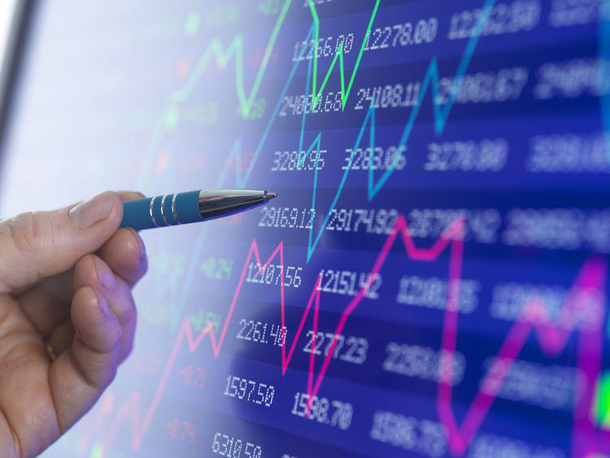

In the modern financial landscape, the interplay between financial instruments, underlying securities, and algorithmic trading plays a pivotal role. Financial instruments such as equities, bonds, and derivatives form the building blocks of financial markets, enabling investors to channel funds and manage risks. Underlying securities, which include assets like stocks and commodities, serve as the foundation for derivatives, impacting their valuation and trading dynamics. Algorithmic trading further transforms these interactions by automating the process of trade execution, significantly enhancing speed and efficiency.

Understanding these components is essential for investors seeking to enhance their investment strategies. Algorithmic trading, driven by financial instruments such as Exchange-Traded Funds (ETFs), futures, and options, has revolutionized trading practices. For instance, automated trading systems leverage complex algorithms and immense datasets to execute trades with precision, reducing both transaction costs and the influence of human emotion.



This article aims to provide a comprehensive overview of how these concepts interlink and their impact on market efficiency. By tracing the relationships among financial instruments, underlying securities, and algorithmic strategies, the discussion will highlight their collective role in fostering a more efficient and dynamic financial environment. This convergence not only facilitates improved liquidity and effective market operation but also empowers investors with refined tools for strategic decision-making. Through examples and detailed analysis, the intricacies and benefits of this collaboration will be elucidated, offering insights into the evolving domain of modern finance.

## Table of Contents

## What are Financial Instruments?

Financial instruments are pivotal constructs in modern finance, acting as contracts that result in the creation of financial assets for one party and corresponding liabilities for another. These instruments are integral to the operation of financial markets, as they facilitate a wide range of economic activities by allowing the redistribution of capital and risk.

The spectrum of financial instruments encompasses various categories such as equities, bonds, derivatives, and hybrid instruments. Each of these categories serves distinct purposes within the financial markets:

1. **Equities:** Equities, commonly referred to as stocks, represent ownership interests in corporations. When an investor purchases shares of a company, they acquire a portion of ownership, which entitles them to a share of the profits and losses. Equity holders may benefit from capital gains if the stock’s price increases and potentially receive dividends, which are distributions of earnings. The price of equities can be influenced by a myriad of factors including company performance, economic conditions, and market sentiment.

2. **Bonds:** Bonds are debt instruments representing loans made by an investor to a borrower, typically corporate or governmental entities. When an entity issues a bond, it agrees to pay the bondholder a specified interest rate over a defined period and repay the principal amount upon maturity. Bonds are considered a lower-risk investment compared to equities, as they generally provide regular interest payments (known as coupons) and the return of principal upon maturity. The value of bonds can fluctuate based on interest rates, credit risk, and other economic factors.

3. **Derivatives:** Derivative instruments derive their value from the performance of an underlying asset, which can be stocks, bonds, indices, or currencies, among others. Common types of derivatives include options, futures, and swaps. For example, options give the holder the right, but not the obligation, to buy or sell an asset at a predetermined price before a designated expiration date. Derivatives are often used for hedging risks or speculating on the future price movements of the underlying assets.

4. **Hybrid Instruments:** Hybrid instruments combine characteristics of both debt and equity. Convertible bonds are a typical example, which can be converted into a predetermined number of the issuer's equity shares. These instruments aim to provide investors with fixed income like bonds while offering the potential for capital appreciation if converted to equity.

Understanding financial instruments is critical for making informed trading and investment decisions. Investors use these instruments to diversify portfolios, manage risks, and optimize returns. Each instrument category contributes to the broader financial ecosystem by enabling a variety of strategies tailored to specific investment objectives and risk profiles. As markets evolve, the development and utilization of financial instruments continue to expand, offering new opportunities and challenges for investors.

## Understanding Underlying Securities

An underlying security is a fundamental asset from which derivative instruments such as futures and options derive their value. These can be stocks, bonds, indices, or commodities, serving as the reference point for pricing and trading derivatives. The intrinsic connection between a derivative and its underlying security is crucial, as changes in the price of the underlying asset directly affect the derivative's market value. For example, a call option on Google stock confers the right, but not the obligation, to purchase the stock at a predetermined price, known as the strike price, before the option expires. This stock's price movements, [volatility](/wiki/volatility-trading-strategies), and other market factors will directly influence the option's premium, or the price at which the option might be bought or sold in the market.

Understanding the pricing of derivatives necessitates a comprehension of the underlying security's behavior, often modeled using financial theories such as the Black-Scholes equation for options pricing. The formula considers several variables related to the underlying security, including its price ($S$), the option's strike price ($K$), the time to expiration ($T$), the risk-free [interest rate](/wiki/interest-rate-trading-strategies) ($r$), and the volatility ($\sigma$):

$$
C = S_0N(d_1) - Ke^{-rT}N(d_2)
$$

where

$$
d_1 = \frac{\ln\left(\frac{S_0}{K}\right) + \left(r + \frac{\sigma^2}{2}\right) T}{\sigma\sqrt{T}}
$$

$$
d_2 = d_1 - \sigma \sqrt{T}
$$

In these equations, $C$ represents the theoretical call option price, and $N(d)$ denotes the cumulative distribution function of the standard normal distribution. These formulas illustrate the sensitivity of derivative pricing to the underlying security's characteristics.

For traders focusing on derivatives, understanding the nuances of underlying securities is vital. This includes assessing the security's historical performance, volatility, and correlation with other market factors. As market participants strategize their investments, they must consider how shifts in the underlying assets can create opportunities or pose risks. Consequently, a comprehensive analysis of underlying securities is essential for informed trading and effective risk management in the derivatives market.

## Examples of Underlying Security in Investment

Investors use derivatives as versatile tools to speculate on or hedge against the future price movements of underlying securities. A common example is options on futures, where traders place bets on the future prices of contracts. These futures contracts are directly influenced by the price of their underlying assets, which could be commodities, currencies, or stock indices. 

Consider call options on Microsoft Corporation stock. Here, the derivative's value is contingent upon the movements of Microsoft’s stock price. If the stock price rises above the strike price of the option before expiration, the call option holder can exercise the option, purchasing the stock at the lower strike price. Therefore, the profit potential from call options increases with positive movements in the stock’s price.

The pricing of derivatives like options is significantly impacted by the volatility and risk profile of the underlying securities. Higher volatility often results in higher option premiums, as the probability of the stock price reaching the option's strike price increases. The Black-Scholes model is commonly used to estimate option pricing, incorporating factors such as the current stock price, strike price, time to expiration, risk-free interest rate, and volatility of the underlying asset.

```python
from scipy.stats import norm
import numpy as np

# Black-Scholes option pricing model
def black_scholes_call(S, K, T, r, sigma):
    d1 = (np.log(S / K) + (r + 0.5 * sigma ** 2) * T) / (sigma * np.sqrt(T))
    d2 = d1 - sigma * np.sqrt(T)
    call_price = S * norm.cdf(d1) - K * np.exp(-r * T) * norm.cdf(d2)
    return call_price

# Example variables
S = 150  # Current stock price
K = 160  # Strike price
T = 1    # Time to expiration in years
r = 0.05 # Risk-free interest rate
sigma = 0.2 # Volatility of underlying stock

call_price = black_scholes_call(S, K, T, r, sigma)
print(f"The Black-Scholes call option price is: {call_price:.2f}")
```

Moreover, effective investment strategies integrate a variety of financial instruments to leverage different market conditions for potential profitability. For instance, combining options with stocks or bonds can provide a balanced approach, mitigating risks while capitalizing on favorable market movements. By understanding these interactions, investors can craft more sophisticated portfolios aimed at maximizing returns while minimizing risk.

## Algorithmic Trading: An Overview

Algorithmic trading is a sophisticated approach that employs algorithms to automate and enhance trading strategies, effectively transforming how financial markets operate. These algorithms utilize mathematical models and data analysis to execute trades with increased precision and remarkable speed, which is often unattainable by human traders alone. A key feature of [algorithmic trading](/wiki/algorithmic-trading) is its ability to manage and execute large volumes of orders rapidly, a practice commonly seen in high-frequency trading ([HFT](/wiki/high-frequency-trading-strategies)). HFT strategies are designed to exploit market inefficiencies by entering and exiting positions within fractions of a second, thereby capitalizing on minuscule price movements.

The reduction of human error and emotion stands as one of the primary advantages of algorithmic trading. By automating trading activities, algorithms ensure trades are executed in a consistent and systematic manner, adhering strictly to predefined criteria. This minimizes the potential for emotional decision-making, which can lead to irrational trading behaviors. Additionally, algorithmic trading enables the implementation of complex strategies like [arbitrage](/wiki/arbitrage) and trend-following, both of which require the rapid processing and analysis of substantial datasets.

Arbitrage strategies in algorithmic trading might involve the simultaneous purchase and sale of an asset to profit from a price discrepancy across different markets or forms. For instance, if an asset is priced differently on two exchanges, an algorithm can automatically conduct transactions to exploit this difference, locking in a risk-free profit. Trend-following strategies, on the other hand, aim to capture gains through identifying and riding market trends. Here, algorithms are engineered to detect trends in price movements and execute trades aligned with the direction of these trends.

The effectiveness and efficiency of algorithmic trading hinge on the quality and speed of data analysis. Algorithms continuously analyze market data to identify trading signals, determine optimal entry and [exit](/wiki/exit-strategy) points, and swiftly adjust to new information. This capability enables algorithms to maintain a competitive edge in increasingly dynamic and complex financial markets.

Overall, algorithmic trading has revolutionized the execution of trades by leveraging technological advancements, providing traders with tools to enhance decision-making, minimize risks, and improve market outcomes. As financial markets continue to evolve, the role of algorithmic trading is likely to expand, further integrating advanced technologies like [machine learning](/wiki/machine-learning) and [artificial intelligence](/wiki/ai-artificial-intelligence) to optimize trading performance and strategy development.

## Synergy Between Financial Instruments and Algorithmic Trading

Algorithmic trading has become a cornerstone in the modern landscape of financial markets, enhancing both [liquidity](/wiki/liquidity-risk-premium) and efficiency. By leveraging sophisticated algorithms, traders can execute orders with increased precision, notably in complex financial instruments such as asset-backed securities (ABS) and derivatives. This precise pricing capability allows for more accurate market valuations and helps tighten the bid-ask spreads, thereby increasing market liquidity.

The integration of big data analytics within algorithmic trading frameworks enables traders to process and analyze vast datasets rapidly. This capability is crucial for structuring and valuing intricate financial instruments. Algorithms can identify patterns and correlations within data, informing strategies that maximize profit potentials while minimizing risks. This data-driven approach allows for real-time adjustments to trading strategies, particularly beneficial in volatile markets.

Machine learning further amplifies the potential of algorithmic trading by allowing models to learn from historical data and adapt to new market conditions over time. For instance, machine learning algorithms can execute sophisticated strategies such as [statistical arbitrage](/wiki/statistical-arbitrage)—capitalizing on price differences between related securities—or trend-following strategies that react dynamically to market movements. The adaptive nature of machine learning contributes to more robust trading systems that evolve with changing market dynamics.

The interplay between financial instruments and algorithmic trading results in improved risk management and market functionality. By systematically assessing risk factors and capitalizing on algorithm-generated insights, traders can optimize capital allocation, ensuring more efficient use of financial resources. This synergy not only benefits individual traders but also contributes to the overall stability and functionality of financial markets.

Ultimately, the convergence of these technologies empowers investors with tools to make informed decisions, increasing the efficiency of capital markets and fostering a more resilient financial environment. As technology continues to advance, the symbiotic relationship between algorithmic trading and financial instruments is likely to deepen, offering even greater potential for optimized strategies and enhanced market efficiency.

## Challenges and Risks in Algorithmic Trading

Algorithmic trading, despite its numerous advantages, presents several challenges and risks. Market manipulation remains a significant concern, as algorithms can be exploited to create artificial price movements and trading volumes, often misleading other market participants. Moreover, these manipulations can destabilize market conditions, leading to distorted pricing mechanisms.

Flash crashes exemplify the systemic risks associated with algorithmic trading. These abrupt market movements can result in rapid loss of value across numerous securities, emphasizing the need for robust risk management frameworks. For instance, the flash crash of May 6, 2010, serves as a landmark event where the U.S. stock market experienced an unprecedented drop in a matter of minutes, partially attributed to trading algorithms. The importance of developing advanced risk assessment and mitigation strategies is underscored by such events.

Technological failures also pose significant risks in algorithmic trading. These failures can arise from software bugs, hardware malfunctions, or network outages, disrupting trading operations. Ensuring the reliability of technology infrastructure is crucial. Implementing backup systems and conducting regular tests are essential measures to minimize these risks. Additionally, continuous monitoring systems can help promptly detect and address anomalies.

The complexity of trading algorithms and their lack of transparency can lead to unforeseen market impacts. Algorithms operate based on predefined criteria, which may not always align with market realities. The opacity surrounding these systems can hinder the ability to anticipate and rectify detrimental effects promptly. Developing algorithms with greater transparency and incorporating mechanisms for real-time adjustments can mitigate such issues.

Regulatory oversight plays a critical role in balancing innovation with security and stability in trading environments. Regulators must establish frameworks that encourage technological advancements while ensuring fairness and transparency. This often involves setting stringent guidelines for algorithmic trading practices and conducting regular audits to ensure compliance. Collaborative efforts between regulators and market participants can help create a more secure and efficient trading ecosystem.

In summary, the challenges and risks inherent in algorithmic trading necessitate careful consideration and proactive management. By addressing these issues, the financial industry can harness the benefits of algorithmic trading while safeguarding market integrity and stability.

## Conclusion

The intersection of financial instruments, underlying securities, and algorithmic trading is a transformative force in modern finance. These components not only enhance market efficiencies but also provide investors with unique opportunities to optimize their investment strategies. By understanding the intricate relationships among these elements, financial professionals are better equipped to navigate the complexities of today's financial landscape. 

Algorithmic trading, in particular, facilitates quicker, more precise, and data-driven trading decisions. By employing advanced algorithms and leveraging big data analytics, it minimizes human error and optimizes execution. This leads to more efficient markets where prices more accurately reflect available information.

Staying informed about emerging trends and technological advancements is essential for maximizing potential returns. As machine learning and artificial intelligence continue to evolve, their integration could further refine algorithmic models, leading to superior risk-adjusted returns and innovation in financial products.

The future of finance is inherently dynamic, characterized by continuous technological progress and regulatory changes. This evolving environment requires market participants to remain adaptable, seeking continuous education and agility in their strategies to seize opportunities and mitigate risks effectively. This adaptability, coupled with an in-depth understanding of financial instruments and trading technologies, will be crucial for thriving in this ever-changing domain.

## References & Further Reading

[1]: Lopez de Prado, M. (2018). ["Advances in Financial Machine Learning"](https://www.amazon.com/Advances-Financial-Machine-Learning-Marcos/dp/1119482089). Wiley.

[2]: Chan, E. P. (2008). ["Quantitative Trading: How to Build Your Own Algorithmic Trading Business"](https://github.com/ftvision/quant_trading_echan_book). John Wiley & Sons.

[3]: Jansen, S. (2018). ["Machine Learning for Algorithmic Trading"](https://github.com/stefan-jansen/machine-learning-for-trading). Packt Publishing.

[4]: Black, F., & Scholes, M. (1973). ["The Pricing of Options and Corporate Liabilities."](https://www.cs.princeton.edu/courses/archive/fall09/cos323/papers/black_scholes73.pdf) Journal of Political Economy.

[5]: Aronson, D. R. (2006). ["Evidence-Based Technical Analysis: Applying the Scientific Method and Statistical Inference to Trading Signals"](https://www.amazon.com/Evidence-Based-Technical-Analysis-Scientific-Statistical/dp/0470008741). Wiley.