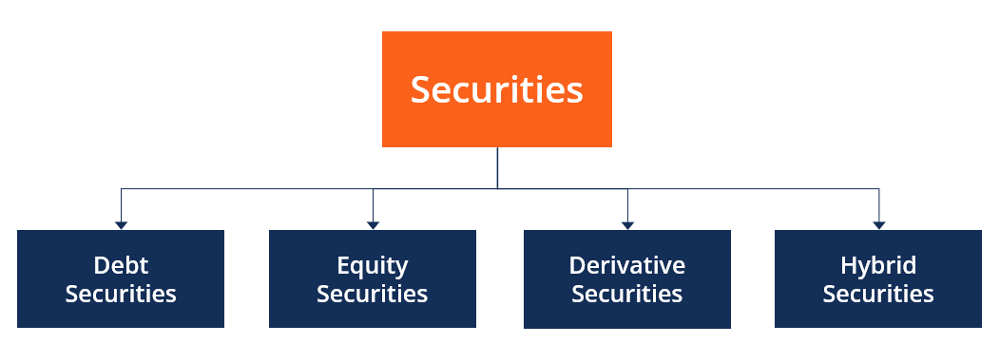

## Table of Contents

## What is an underlying security?

An underlying security is the financial asset on which a derivative's price is based. Derivatives are financial instruments like options and futures that derive their value from the performance of an underlying asset. This underlying asset can be a stock, bond, commodity, currency, or even an index. For example, if you buy an option on a stock, the stock itself is the underlying security. The price of the option will move based on changes in the price of the stock.

Understanding the underlying security is important because it directly affects the value of the derivative. If the price of the underlying security goes up, the value of a call option (which gives the right to buy the security) will generally increase. On the other hand, if the price of the underlying security goes down, the value of a put option (which gives the right to sell the security) will typically increase. By keeping an eye on the underlying security, investors can make better decisions about buying and selling derivatives.

## Why are underlying securities important in financial markets?

Underlying securities are really important in financial markets because they help create other financial products called derivatives. These derivatives, like options and futures, get their value from how the underlying security is doing. For example, if you have a stock option, the stock itself is the underlying security. The price of the option will go up or down based on what happens to the stock's price. This connection makes it possible for investors to bet on the future price movements of the underlying security without actually owning it.

This is useful for a lot of reasons. First, it lets investors manage risk. If someone thinks a stock's price might go down, they can buy a put option to protect themselves. Second, it allows for more ways to make money. Traders can use derivatives to make profits from small price changes in the underlying security. This adds a lot of flexibility and activity to the financial markets. Overall, underlying securities are the foundation that makes the complex world of derivatives possible, helping markets work better and giving investors more choices.

## Can you explain the relationship between an underlying security and a derivative?

An underlying security is like the base that a derivative is built on. Think of it this way: if you have an option to buy a stock, the stock itself is the underlying security. The option's value changes based on what happens to the stock's price. If the stock price goes up, the value of the option to buy it usually goes up too. If the stock price goes down, the value of the option usually goes down. This connection between the derivative and the underlying security is what makes derivatives work.

Derivatives are useful because they let people bet on what will happen to the price of the underlying security without actually owning it. For example, if you think a stock's price will go up, you can buy a call option on that stock. If you're right and the stock price does go up, you can make money from the option. On the other hand, if you think the stock's price will go down, you can buy a put option. This way, you can protect yourself from losing money if the stock's price falls. So, the relationship between the underlying security and the derivative is all about using the movements of the security to create new ways to make money or manage risk.

## What are some common examples of underlying securities?

Underlying securities are the things that the value of other financial products, called derivatives, depends on. Some common examples of underlying securities are stocks, bonds, and commodities. A stock can be an underlying security for options and futures. For example, if you buy an option to buy Apple stock, the Apple stock is the underlying security. The price of the option will change based on what happens to the price of Apple's stock. Bonds are another type of underlying security. If you have a futures contract on a government bond, the bond itself is the underlying security, and the value of the futures contract will move with the bond's price.

Commodities are also often used as underlying securities. For example, oil can be an underlying security for futures contracts. If you buy a futures contract on oil, the price of that contract will go up or down based on what happens to the price of oil. Another example is gold. If you buy an option on gold, the price of the option will change with the price of gold. These examples show how different kinds of assets can be used as the base for derivatives, helping people bet on future price movements or manage their risks.

## How do underlying securities affect the pricing of options and futures?

Underlying securities are really important for deciding how much options and futures cost. An option gives you the right to buy or sell the underlying security at a certain price. If the price of the underlying security goes up, the value of a call option, which lets you buy the security, will usually go up too. This is because the option becomes more useful if the security is worth more. On the other hand, if the price of the underlying security goes down, the value of a put option, which lets you sell the security, will usually go up. This is because the option helps you sell at a higher price than the current market value.

Futures work a bit differently but still depend a lot on the underlying security. A futures contract is an agreement to buy or sell the underlying security at a set price on a future date. If the price of the underlying security, like oil or gold, goes up, the value of a futures contract to buy that security will also go up. This is because you can buy the security at a lower price than what it's worth at the time of the contract. If the price of the underlying security goes down, the value of the futures contract to sell the security will go up, because you can sell it at a higher price than the current market value. So, the price of options and futures always moves with the price of the underlying security.

## What role do underlying securities play in investment strategies?

Underlying securities are super important for people who want to make smart investment choices. They help investors use different strategies to make money or protect their investments. For example, if someone thinks a stock's price will go up, they can buy a call option on that stock. The call option gives them the right to buy the stock at a set price later. If the stock's price does go up, they can make money by buying the stock at the lower price and then selling it at the higher price. This way, they can bet on the stock's future without actually owning it right away.

On the other hand, if someone thinks a stock's price will go down, they might buy a put option. A put option lets them sell the stock at a set price in the future. If the stock's price does drop, they can buy the stock at the lower market price and then use the put option to sell it at the higher set price. This helps them make money from the falling stock price or protect other investments they have in that stock. By using underlying securities like stocks, bonds, or commodities, investors can come up with many different ways to handle risk and make profits.

## How can changes in the value of an underlying security impact a portfolio?

Changes in the value of an underlying security can really shake up a portfolio. If you own stocks, bonds, or commodities, and their prices go up or down, it affects how much your whole investment collection is worth. For example, if you have a lot of a certain stock in your portfolio and that stock's price goes up, your portfolio's value will go up too. But if the stock's price goes down, your portfolio's value will drop. This is because the underlying securities are like the building blocks of your investments, and their value directly impacts the overall worth of your portfolio.

Also, if you have options or futures based on these underlying securities, changes in their value can have a big effect too. Options and futures are like bets on what will happen to the price of the underlying security. If you have a call option on a stock and the stock's price goes up, the option becomes more valuable, helping your portfolio. But if you have a put option and the stock's price goes up, the option loses value, which can hurt your portfolio. So, keeping an eye on the underlying securities is really important because they can make your portfolio grow or shrink depending on how their prices move.

## What are the risks associated with investing in underlying securities?

Investing in underlying securities like stocks, bonds, and commodities can be risky because their prices can go up and down a lot. If you own a stock and its price drops, you could lose money. The same goes for bonds and commodities. Sometimes, things like bad news about a company, changes in the economy, or even natural disasters can make the price of these securities fall. This is called market risk, and it's something every investor has to deal with. If you put a lot of your money into just one or a few securities, the risk is even bigger because if something bad happens to those specific investments, you could lose a lot.

Another risk is liquidity risk. This happens when it's hard to buy or sell a security quickly without changing its price a lot. If you need to sell your investment fast but there aren't many people wanting to buy it, you might have to sell it for less than you wanted. This can hurt your portfolio's value. Also, there's something called interest rate risk, especially with bonds. If interest rates go up, the value of existing bonds usually goes down, which can affect your investments. So, it's important to understand these risks and think about how they might affect your money before you invest in underlying securities.

## How do regulatory bodies oversee the trading of underlying securities?

Regulatory bodies keep an eye on the trading of underlying securities to make sure everything is fair and safe. They set rules that everyone in the market has to follow. For example, in the United States, the Securities and Exchange Commission (SEC) watches over stocks and bonds. They make sure companies tell the truth about their businesses and that people trading these securities don't cheat or lie. This helps keep the market honest and protects investors from losing money because of bad behavior.

Regulatory bodies also check that the markets run smoothly. They look out for things like too much buying or selling that could mess up prices, and they step in if needed. They also make sure that there are enough buyers and sellers so that people can trade securities easily. By doing all this, regulatory bodies help make sure that the markets work well and that investors can trust them.

## Can you describe a real-world example of how an underlying security influenced a financial product?

In 2021, a real-world example of how an underlying security influenced a financial product was seen with GameStop, a video game retailer. GameStop's stock was the underlying security for many options traded on it. A group of retail investors on a social media platform called Reddit decided to buy a lot of GameStop stock and call options, believing the stock price would go up. Because so many people were buying these options, the demand for GameStop stock increased, pushing its price higher. This caused the value of the call options to skyrocket, as they became more valuable with the rising stock price. Many investors made big profits from this, but it also showed how the price of an underlying security can directly affect the value of financial products like options.

This situation also had broader impacts on the market. Hedge funds that had bet against GameStop by short-selling its stock faced huge losses as the stock price soared. They had to buy back the stock at much higher prices to cover their short positions, which pushed the stock price even higher. This created a feedback loop where the rising stock price made the call options more valuable, which in turn attracted more investors, further driving up the stock price. It was a clear example of how movements in the underlying security, in this case, GameStop's stock, can lead to significant changes in the value of related financial products and even affect the broader market dynamics.

## What advanced strategies involve the use of underlying securities in complex financial instruments?

Advanced strategies that use underlying securities often involve options and other derivatives to make money or manage risk in smart ways. One popular strategy is called a "straddle." In a straddle, an investor buys both a call option and a put option on the same underlying security, like a stock, at the same time and with the same expiration date. They do this when they think the stock's price will move a lot but aren't sure which way. If the stock's price goes up a lot, the call option becomes more valuable and can make money. If the stock's price goes down a lot, the put option becomes more valuable and can make money. This way, the investor can profit no matter which direction the stock moves, as long as the move is big enough.

Another strategy is called "delta hedging." This is used to reduce the risk of price changes in the underlying security. For example, if an investor owns a stock and wants to protect against a price drop, they can buy put options on that stock. The "delta" of an option tells how much the option's price will change for every dollar change in the stock's price. By carefully choosing the right number of put options, the investor can balance out the risk of the stock losing value. This way, if the stock's price goes down, the put options will go up in value, helping to cover any losses from the stock. Delta hedging is a way to keep the portfolio stable even when the market is moving around a lot.

## How do global economic factors influence the performance of underlying securities?

Global economic factors can really change how well underlying securities do. Things like interest rates, inflation, and how strong different countries' economies are can make stock, bond, and commodity prices go up or down. For example, if the U.S. raises interest rates, it can make borrowing money more expensive. This can slow down businesses and make people less likely to spend money, which can cause stock prices to drop. On the other hand, if a country's economy is doing well, it can make investors feel more confident, pushing up the prices of securities from that country.

Also, what happens in one part of the world can affect securities everywhere. If there's a big problem in a major economy like China, it can make investors worried and cause them to sell off stocks and other securities around the world. This is called a "global market shock." Commodities like oil and gold can be influenced by global events too. If there's a war or a big change in how much oil countries produce, it can make oil prices jump up or down, which affects the value of any financial products based on oil. So, keeping an eye on what's happening around the world is important for understanding how underlying securities might perform.

## What is the understanding of underlying securities?

An underlying security is a fundamental asset from which derivative instruments such as futures and options derive their value. These can be stocks, bonds, indices, or commodities, serving as the reference point for pricing and trading derivatives. The intrinsic connection between a derivative and its underlying security is crucial, as changes in the price of the underlying asset directly affect the derivative's market value. For example, a call option on Google stock confers the right, but not the obligation, to purchase the stock at a predetermined price, known as the strike price, before the option expires. This stock's price movements, [volatility](/wiki/volatility-trading-strategies), and other market factors will directly influence the option's premium, or the price at which the option might be bought or sold in the market.

Understanding the pricing of derivatives necessitates a comprehension of the underlying security's behavior, often modeled using financial theories such as the Black-Scholes equation for options pricing. The formula considers several variables related to the underlying security, including its price ($S$), the option's strike price ($K$), the time to expiration ($T$), the risk-free [interest rate](/wiki/interest-rate-trading-strategies) ($r$), and the volatility ($\sigma$):

$$
C = S_0N(d_1) - Ke^{-rT}N(d_2)
$$

where

$$
d_1 = \frac{\ln\left(\frac{S_0}{K}\right) + \left(r + \frac{\sigma^2}{2}\right) T}{\sigma\sqrt{T}}
$$

$$
d_2 = d_1 - \sigma \sqrt{T}
$$

In these equations, $C$ represents the theoretical call option price, and $N(d)$ denotes the cumulative distribution function of the standard normal distribution. These formulas illustrate the sensitivity of derivative pricing to the underlying security's characteristics.

For traders focusing on derivatives, understanding the nuances of underlying securities is vital. This includes assessing the security's historical performance, volatility, and correlation with other market factors. As market participants strategize their investments, they must consider how shifts in the underlying assets can create opportunities or pose risks. Consequently, a comprehensive analysis of underlying securities is essential for informed trading and effective risk management in the derivatives market.

## References & Further Reading

[1]: Lopez de Prado, M. (2018). ["Advances in Financial Machine Learning"](https://www.amazon.com/Advances-Financial-Machine-Learning-Marcos/dp/1119482089). Wiley.

[2]: Chan, E. P. (2008). ["Quantitative Trading: How to Build Your Own Algorithmic Trading Business"](https://github.com/ftvision/quant_trading_echan_book). John Wiley & Sons.

[3]: Jansen, S. (2018). ["Machine Learning for Algorithmic Trading"](https://github.com/stefan-jansen/machine-learning-for-trading). Packt Publishing.

[4]: Black, F., & Scholes, M. (1973). ["The Pricing of Options and Corporate Liabilities."](https://www.cs.princeton.edu/courses/archive/fall09/cos323/papers/black_scholes73.pdf) Journal of Political Economy.

[5]: Aronson, D. R. (2006). ["Evidence-Based Technical Analysis: Applying the Scientific Method and Statistical Inference to Trading Signals"](https://www.amazon.com/Evidence-Based-Technical-Analysis-Scientific-Statistical/dp/0470008741). Wiley.