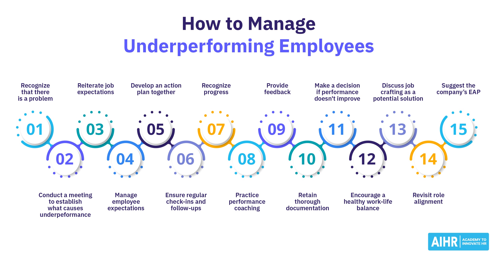

## Table of Contents

## What is underperformance?

Underperformance is when someone or something does not do as well as expected or needed. This can happen in school, at work, or in other areas of life. For example, if a student usually gets good grades but starts getting lower marks, they might be underperforming. Or, if a company's sales are lower than what they planned, the company is underperforming.

There are many reasons why underperformance can happen. Sometimes, it might be because of personal issues like stress or health problems. Other times, it could be because the goals set were too hard to reach. At work, underperformance might happen if an employee does not have the right skills or tools to do their job well. Understanding why underperformance is happening is important so that steps can be taken to fix it.

## How is underperformance typically measured?

Underperformance is usually measured by comparing results to certain standards or goals. For example, at school, a student's grades might be compared to what they usually get or to what the teacher expects. At work, a company might look at how much they sold compared to their sales targets. If the results are lower than these standards, it's called underperformance.

There are different ways to measure underperformance depending on the situation. In sports, it might be about how fast an athlete runs or how many points they score compared to their personal best or the team's goals. In a business, it could be about how well a project is going compared to the plan, or how happy customers are with the service compared to what the company aims for. By using these measures, people can see if they are underperforming and figure out what to do next.

## What are common causes of underperformance in the workplace?

Underperformance in the workplace can happen for many reasons. One big reason is not having the right skills or training for the job. If someone doesn't know how to do their work well, they might not meet their goals. Another reason is not having the right tools or resources. If workers don't have what they need to do their jobs, it can be hard for them to perform well. Also, if the goals set by the company are too hard to reach, workers might feel stressed and struggle to meet them.

Personal issues can also lead to underperformance. Things like health problems, family issues, or stress can make it hard for someone to focus on their work. If someone is feeling overwhelmed or not well, they might not be able to do their best. Poor management can be another cause. If managers don't give clear instructions or support, workers might feel lost and unsure about what to do. All these factors can make it tough for people to perform well at work.

## Can underperformance be an issue in personal life as well? How?

Yes, underperformance can be an issue in personal life too. It can happen when someone does not meet their own goals or expectations in areas like health, relationships, or hobbies. For example, if someone wants to lose weight but keeps gaining, they might feel like they are underperforming. Or, if someone aims to spend more time with family but ends up working late, they might feel they are not doing well in that part of their life.

Underperformance in personal life can be caused by many things. Sometimes, it might be because someone sets goals that are too hard to reach. Other times, it could be due to personal issues like stress or health problems that make it hard to focus on personal goals. Understanding why underperformance is happening can help someone make changes to improve their personal life.

## What are the psychological impacts of underperformance on individuals?

Underperformance can make people feel bad about themselves. When someone does not do as well as they hoped, they might feel sad, worried, or even ashamed. These feelings can make them think they are not good enough or that they will never do better. This can hurt their confidence and make them scared to try new things because they are afraid of failing again.

Over time, these feelings can lead to bigger problems like stress, anxiety, or depression. If someone keeps feeling like they are not doing well, it can wear them down. They might start to pull away from friends and family or lose interest in things they used to enjoy. It's important for people to understand that it's okay to have setbacks and that they can work on getting better without feeling bad about themselves all the time.

## How can underperformance affect a team or organization?

When someone in a team or organization is not doing well, it can make the whole group struggle. If one person is underperforming, others might have to do more work to make up for it. This can make the team feel stressed and tired. Also, if the team has goals to meet, like finishing a project on time, underperformance can slow everything down. This can make it hard for the team to reach their targets and can hurt the organization's overall success.

Underperformance can also make the team feel less motivated. When people see that someone is not doing their part, it can make them feel let down or frustrated. This can lead to less teamwork and more arguments. If the underperformance goes on for a long time, it might make the team feel like they can't trust each other. This can make the work environment unhappy and can even make good workers want to leave the organization.

## What strategies can be used to identify underperformance early?

To find out if someone is underperforming early, it's important to keep a close eye on how they are doing compared to what is expected. This can be done by setting clear goals and checking progress regularly. For example, at work, managers can have regular meetings with their team to talk about how things are going. They can look at numbers like sales or project deadlines to see if anyone is falling behind. In school, teachers can use tests and homework to see if a student is doing worse than before. By catching underperformance early, it's easier to help the person get back on track.

Another way to spot underperformance early is by talking to the person and asking them how they feel. Sometimes, people might be struggling but not say anything. By having open and honest talks, it's possible to find out if someone is having a hard time before it becomes a big problem. Also, watching for changes in behavior, like if someone seems more stressed or less happy, can be a sign that they need help. By paying attention to these signs and talking about them, it's easier to address underperformance before it gets worse.

## What are effective interventions for addressing underperformance?

To help someone who is not doing well, it's important to first find out why they are struggling. Sometimes, it might be because they need more training or better tools to do their job. If that's the case, giving them the right training or tools can make a big difference. Other times, the person might be dealing with personal problems like stress or health issues. Talking to them and offering support, like time off or counseling, can help them feel better and do better at work or school.

Another good way to help is by setting clear and realistic goals. If the goals are too hard, it can make the person feel overwhelmed and more likely to fail. By setting smaller, easier goals, the person can see progress and feel more motivated. It's also important to give regular feedback and praise when they do well. This can boost their confidence and make them want to keep trying. By working together and understanding what the person needs, it's possible to turn underperformance around and help them succeed.

## How does leadership style influence underperformance?

The way a leader acts can really affect how well people do their jobs. If a leader is bossy and doesn't listen to their team, it can make people feel scared and not want to try new things. This can make them underperform because they might not feel safe to ask for help or share their ideas. On the other hand, if a leader is kind and talks openly with their team, it can make people feel supported and more likely to do their best. A good leader helps their team grow and learn, which can stop underperformance before it starts.

Leadership style can also change how people see their work. If a leader only cares about results and doesn't care about how people feel, it can make the team feel like they are just numbers. This can make them less motivated and more likely to underperform. But if a leader shows they care about their team's well-being and listens to their problems, it can make people feel valued. When people feel important and cared for, they are more likely to work hard and do well, which can help prevent underperformance.

## What role does training and development play in mitigating underperformance?

Training and development are very important in helping to stop underperformance. When someone does not have the right skills for their job, they might struggle to do well. By giving them the right training, they can learn what they need to know to do their job better. Training can be about learning new skills, using new tools, or understanding how to do things differently. When people feel more confident because they have been trained well, they are more likely to do their work properly and meet their goals.

Development is also key because it helps people grow over time. This can include things like mentorship, where someone more experienced helps guide them, or opportunities to take on new challenges. When people feel like they are growing and learning at work, they are more motivated to do well. This can stop underperformance because they are always working on getting better. By focusing on both training and development, organizations can make sure their team members have what they need to succeed and avoid falling behind.

## Are there industries where underperformance has more significant consequences?

Yes, in some industries, underperformance can cause bigger problems. For example, in healthcare, if a doctor or nurse does not do their job well, it can hurt patients. If a doctor makes a mistake because they are not performing well, it could make someone sicker or even cause them to die. This is why hospitals and clinics need to make sure everyone is doing their best all the time.

Another industry where underperformance matters a lot is aviation. If a pilot or air traffic controller is not doing well, it can be very dangerous. A small mistake can lead to a plane crash, which can hurt or kill many people. Because of this, the aviation industry has strict rules and lots of training to make sure everyone is always performing at their best.

## What are some case studies or examples of underperformance and their resolutions?

At a big car company, the sales team was not selling as many cars as they planned. The manager found out that the team did not know enough about the new car models. So, they started regular training sessions to teach the team all about the new cars. After the training, the sales team felt more confident and started selling more cars. The company's sales went up, and the team was happy because they were doing better.

In a school, a student was getting lower grades than usual. The teacher talked to the student and found out that the student was having trouble at home and was feeling stressed. The school gave the student extra help and time to finish their work. They also suggested the student talk to a counselor. After getting this help, the student's grades went up, and they felt better about school.

## What are the causes of underperformance in algorithmic trading?

Algorithmic trading, a powerful tool in modern financial markets, can experience underperformance due to a variety of factors. A crucial aspect affecting algorithmic performance is the ever-changing market conditions. Sudden shifts in the market can render previously successful strategies obsolete. An algo that thrives in a bullish market may falter during downturns, resulting in underperformance. Consequently, traders must continuously adapt their strategies to align with current market environments, necessitating constant strategy reassessment and adjustment.

Management decisions also play a critical role in strategy performance. Decisions regarding risk management, capital allocation, and strategic direction can greatly influence the effectiveness of an [algorithmic trading](/wiki/algorithmic-trading) system. Poor judgment in these areas can lead to suboptimal performance, exacerbating underperformance issues. A robust governance framework and informed decision-making process are essential in mitigating these risks.

Algorithmic design is another pivotal [factor](/wiki/factor-investing). Poorly designed algorithms, particularly those falling into the trap of overfitting, can significantly underperform. Overfitting occurs when a model is excessively complex and captures noise rather than the underlying trading signal. This results in poor generalization to new, unseen data. The formula for overfitting is represented as follows:

$$
\text{Model} = \text{Training Set} + \text{Noise}
$$

To avoid overfitting, traders should focus on simplicity and validate their models using out-of-sample data.

Transaction costs, including brokerage fees and slippage, can also eat into trading profits and reduce the overall efficiency of strategies. High-frequency trading strategies, which rely on executing numerous trades, are particularly vulnerable. Even small transaction costs can compound and have a substantial negative impact on performance. Thus, minimizing fees and optimizing order execution are vital for maintaining strategy viability.

Technological failures present further challenges. Algorithms depend on reliable hardware and network infrastructures. Failures can result in lost opportunities or unintended trades. Similarly, data discrepancies such as incorrect or delayed data can lead to erroneous decision-making. Ensuring data integrity and investing in robust technological infrastructure are pivotal in preventing such issues.

Lastly, geopolitical events can cause unexpected shocks to the market, affecting trading performance. Events such as elections, conflicts, and regulatory changes can lead to increased [volatility](/wiki/volatility-trading-strategies) and uncertainty. Algorithms operating without the foresight of such events may encounter sudden underperformance. Therefore, incorporating geopolitical analysis and event-risk strategies can help in adapting to these unanticipated changes.

In conclusion, understanding these causes of underperformance is crucial for developing resilient and adaptive algorithmic trading strategies. Regular evaluation and modification of approaches in response to these challenges are essential for achieving long-term trading success.

## References & Further Reading

[1]: Bergstra, J., Bardenet, R., Bengio, Y., & Kégl, B. (2011). ["Algorithms for Hyper-Parameter Optimization."](https://dl.acm.org/doi/10.5555/2986459.2986743) Advances in Neural Information Processing Systems 24.

[2]: ["Advances in Financial Machine Learning"](https://www.amazon.com/Advances-Financial-Machine-Learning-Marcos/dp/1119482089) by Marcos Lopez de Prado

[3]: ["Evidence-Based Technical Analysis: Applying the Scientific Method and Statistical Inference to Trading Signals"](https://www.amazon.com/Evidence-Based-Technical-Analysis-Scientific-Statistical/dp/0470008741) by David Aronson

[4]: ["Machine Learning for Algorithmic Trading"](https://github.com/stefan-jansen/machine-learning-for-trading) by Stefan Jansen

[5]: ["Quantitative Trading: How to Build Your Own Algorithmic Trading Business"](https://github.com/LucindaYa/quant-resources/blob/master/Quantitative%20Trading%20How%20to%20Build%20Your%20Own%20Algorithmic%20Trading%20Business.pdf) by Ernest P. Chan