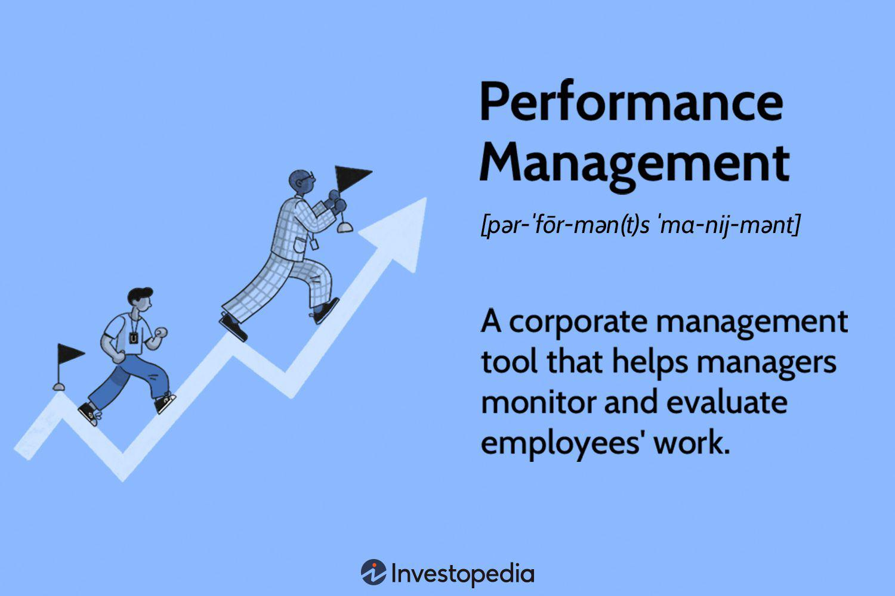

Algorithmic trading, often referred to as algo trading, represents a significant shift in the way financial markets operate. This approach utilizes computer algorithms to execute trading orders at speeds and frequencies that are beyond human capabilities. By leveraging vast datasets and sophisticated statistical models, algo trading can optimize trade execution and seek out profitable opportunities more efficiently than traditional methods. The prevalence of algo trading has grown considerably, accounting for a large volume of trades in modern financial markets and reshaping market dynamics in the process.

The performance evaluation of trading strategies within the context of algorithmic trading is crucial. With the automation and scale at which algorithms operate, there exists the potential for both substantial gains and significant losses. Hence, understanding how these strategies perform and identifying any underperformance is critical. Performance evaluation typically involves assessing a strategy's returns relative to benchmarks or expected outcomes. Algorithms can only make informed decisions and aid in maximizing returns when their performance metrics are thoroughly scrutinized and optimized.

Underperformance in trading strategies is a scenario where a trading algorithm generates returns that are inadequate compared to market benchmarks or expected results. This could happen for various reasons, including inappropriate strategy design, unexpected market conditions, or operational inefficiencies. Recognizing underperformance is imperative, as it points to inefficiencies or flaws within the trading strategy that require correction. Systematic evaluation of underperformance helps traders recognize patterns that may indicate persistent issues and provides opportunities for refining and enhancing trading systems.

Examples of underperformance provide critical insights into the vulnerabilities and challenges inherent in algorithmic trading. Analyzing such instances not only aids in improving existing strategies but also in fortifying future developments against similar pitfalls. By examining past performance and understanding its shortcomings, traders can better anticipate potential issues and adjust their algorithms accordingly.

Addressing underperformance is fundamental to improving trading outcomes. Trader awareness and proactive strategies mitigate risks associated with underperformance and enhance overall profitability. Through carefully designed evaluation systems, regular performance assessments, and adaptive strategy modifications, market participants can significantly improve the robustness of their algorithmic trading strategies. This approach not only safeguards investments but also positions traders to capitalize on emerging opportunities with greater confidence and agility.

## Table of Contents

## Understanding Underperformance in Algo Trading

Underperformance in algorithmic trading refers to a situation where trading strategies fail to meet expected returns or benchmarks, which can have significant implications for investors and fund managers. It can signal inefficiencies or errors in the trading system, potentially leading to financial losses or diminished returns relative to models or indices.

Underperformance in [algorithmic trading](/wiki/algorithmic-trading) strategies can manifest in multiple ways. An algorithm might consistently generate less profit than anticipated, perhaps due to incorrect assumptions in its design or unforeseen changes in market conditions. Alternatively, the strategy may incur higher transaction costs or encounter latency issues, limiting its ability to execute trades at optimal prices.

There are two primary types of underperformance: absolute and relative. Absolute underperformance occurs when a strategy returns a lower profit than expected based on its historical performance or predefined goals. Relative underperformance, meanwhile, is assessed in relation to a benchmark. For instance, if an algorithm achieves a 5% return, but the benchmark returns 7%, the strategy is considered to have underperformed relatively.

To assess performance, several key metrics are utilized. Benchmark comparison is a common method, where the strategy's returns are measured against a relevant index or peer group. Year-to-date (YTD) performance gives a snapshot of how the strategy has performed from the beginning of the year to the current date, providing a temporal perspective on performance. Other metrics, like the Sharpe ratio and alpha, offer insight into risk-adjusted returns and excess returns over a benchmark, respectively. 

Performance metric evaluation is an ongoing process, critical for mitigating risks. Regular assessment can help identify underperformance early, allowing for timely adjustments to trading strategies. For instance, tweaking model parameters or altering the asset allocation might improve performance. Traders need to remain vigilant, as the dynamic nature of financial markets demands constant vigilance and strategy evolution to maintain optimal performance.

## Causes of Underperformance in Algorithmic Trading

Algorithmic trading, a powerful tool in modern financial markets, can experience underperformance due to a variety of factors. A crucial aspect affecting algorithmic performance is the ever-changing market conditions. Sudden shifts in the market can render previously successful strategies obsolete. An algo that thrives in a bullish market may falter during downturns, resulting in underperformance. Consequently, traders must continuously adapt their strategies to align with current market environments, necessitating constant strategy reassessment and adjustment.

Management decisions also play a critical role in strategy performance. Decisions regarding risk management, capital allocation, and strategic direction can greatly influence the effectiveness of an algorithmic trading system. Poor judgment in these areas can lead to suboptimal performance, exacerbating underperformance issues. A robust governance framework and informed decision-making process are essential in mitigating these risks.

Algorithmic design is another pivotal [factor](/wiki/factor-investing). Poorly designed algorithms, particularly those falling into the trap of overfitting, can significantly underperform. Overfitting occurs when a model is excessively complex and captures noise rather than the underlying trading signal. This results in poor generalization to new, unseen data. The formula for overfitting is represented as follows:

$$
\text{Model} = \text{Training Set} + \text{Noise}
$$

To avoid overfitting, traders should focus on simplicity and validate their models using out-of-sample data.

Transaction costs, including brokerage fees and slippage, can also eat into trading profits and reduce the overall efficiency of strategies. High-frequency trading strategies, which rely on executing numerous trades, are particularly vulnerable. Even small transaction costs can compound and have a substantial negative impact on performance. Thus, minimizing fees and optimizing order execution are vital for maintaining strategy viability.

Technological failures present further challenges. Algorithms depend on reliable hardware and network infrastructures. Failures can result in lost opportunities or unintended trades. Similarly, data discrepancies such as incorrect or delayed data can lead to erroneous decision-making. Ensuring data integrity and investing in robust technological infrastructure are pivotal in preventing such issues.

Lastly, geopolitical events can cause unexpected shocks to the market, affecting trading performance. Events such as elections, conflicts, and regulatory changes can lead to increased [volatility](/wiki/volatility-trading-strategies) and uncertainty. Algorithms operating without the foresight of such events may encounter sudden underperformance. Therefore, incorporating geopolitical analysis and event-risk strategies can help in adapting to these unanticipated changes.

In conclusion, understanding these causes of underperformance is crucial for developing resilient and adaptive algorithmic trading strategies. Regular evaluation and modification of approaches in response to these challenges are essential for achieving long-term trading success.

## Examples of Underperformance in Algorithmic Trading

Algorithmic trading, while offering speed and efficiency, is not immune to underperformance. Several high-profile cases highlight these challenges and provide learning opportunities for traders and investors.

### Enron: A Case Study in Strategic Failure

Although Enron's collapse is primarily a story of corporate fraud, it presents an indirect, yet clear example of how algorithmic strategies can suffer from systemic failures. The downfall of Enron in late 2001 had massive ripple effects in the energy trading markets. Algorithms that were designed based on historical data, which included Enron as a significant player, suddenly found themselves inefficient. An algorithm that relied heavily on Enron prices or patterns was likely to underperform, highlighting the risk of over-reliance on specific market structures. The Enron situation underscored the need for robust risk management frameworks to anticipate and mitigate such strategic misalignments.

### General Electric: Sector-Wide Underperformance

General Electric (GE) provides another illustration of underperformance, albeit from a slightly different angle. Starting from the early 2000s and exacerbated post-2008 financial crisis, GE's performance was symptomatic of larger systemic issues within the industrial sector. Algorithmic trading strategies predicated on industrial sector indices, which included GE as a significant component, faced challenges as the sector consistently underperformed against broader market expectations. Such sector-wide underperformance highlights the necessity for algorithmic traders to remain adaptive and responsive to changes that affect entire industries, not just individual stocks.

### Impact of Market Crashes

The 2008 financial crisis serves as a crucial example of how market crashes can drastically affect algorithmic trading performance. Algorithms that were calibrated on pre-crash market dynamics often failed to adjust to the new, volatile conditions, resulting in substantial losses. During such crashes, correlations between asset classes tend to converge, reducing the effectiveness of diversification strategies employed by many algorithms. The challenge for algorithms during crashes is their inability to predict sharp spikes in volatility and their aftermath, demonstrating a critical area for improvement.

### Historical Data Patterns: Insights and Challenges

Over many decades, historical market data reveals certain recurring patterns of underperformance across algorithms. One typical pattern includes mean-reversion strategies failing during prolonged market trends, where prices move unidirectionally rather than oscillating around a mean. Additionally, [momentum](/wiki/momentum) strategies can suffer in choppy, stagnant markets where decisive trends are absent. The key learning from these patterns is the importance of continuously updating algorithmic models to incorporate new market data and behavioral shifts in financial markets.

These examples show how both macroeconomic events and corporate-specific failures can lead to underperformance in algorithmic trading. An understanding of these events can guide the design of more robust algorithms that can adapt to a broader range of scenarios and mitigate risks effectively.

## Mitigating Underperformance in Algorithmic Trading

Algorithmic trading, while offering the potential for significant profits through automated decision-making, faces the challenge of underperformance. Addressing this issue involves implementing strategies that minimize risks and enhance overall performance.

Diversification is a fundamental risk management strategy. By allocating investments across various assets, sectors, and time horizons, traders can reduce the impact of any single asset's poor performance on the overall portfolio. Diversification helps to mitigate unsystematic risk, which is specific to individual assets or sectors, thereby stabilizing returns. The modern portfolio theory by Harry Markowitz underscores that by investing in a portfolio of non-correlated assets, the overall risk can be lower than the weighted average risk of the individual stocks.

Regular review and rebalancing of algorithmic strategies are crucial in maintaining alignment with evolving market conditions and investor goals. As markets fluctuate, an initially balanced strategy can become skewed, inadvertently increasing risk. Rebalancing ensures that the portfolio adheres to the desired asset allocation and risk profile. This process involves assessing the performance of current strategies, identifying underperforming elements, and making necessary adjustments. Trading algorithms should be dynamically calibrated to reflect changes in market volatility and [liquidity](/wiki/liquidity-risk-premium) conditions. Python code for [backtesting](/wiki/backtesting) and rebalancing might involve libraries such as pandas for data manipulation and [backtrader](/wiki/backtrader) for simulating strategy performance over historical data.

Hedging strategies are employed to protect against potential losses. By using derivatives such as options or futures contracts, traders can offset the risk of adverse price movements in their primary investments. For example, if a trading strategy is heavily invested in stocks, purchasing put options can provide insurance against a decline in stock prices. The goal of hedging is not to eliminate risk but to manage it within acceptable levels, ensuring that potential losses do not exceed a predetermined threshold.

Data-driven decision-making and continuous learning are essential in adapting to a rapidly changing market landscape. Incorporating [machine learning](/wiki/machine-learning) techniques can enhance the predictive power of trading algorithms, allowing them to recognize complex patterns and make informed decisions. Continuous monitoring and evaluation of algorithmic performance provide feedback necessary for refinement and adaptation. Algorithms should continuously be assessed against key performance metrics, such as Sharpe Ratio and Maximum Drawdown, to ensure they meet performance expectations.

By integrating these strategies, algorithmic traders can significantly mitigate underperformance risks and optimize their trading outcomes. These approaches not only improve resilience to market volatility but also enhance the robustness and efficacy of automated trading systems.

## Conclusion: Addressing Underperformance for Improved Results

Algorithmic trading has become an essential component of modern financial markets, offering increased efficiency and agility in executing trades. However, underperformance remains a significant challenge, highlighting the importance of understanding its causes and actively managing performance. The analysis demonstrates that underperformance can arise from a variety of factors, including market conditions, algorithmic overfitting, transaction costs, technological failures, and external geopolitical events. These factors underscore the need for traders to undertake proactive performance management, continuously evaluating and adapting their strategies to mitigate risks.

Proactive performance management is crucial for improving trading outcomes. By regularly reviewing performance metrics, such as benchmark comparisons and year-to-date (YTD) performance, traders can quickly identify underperformance and make necessary adjustments. This practice ensures that strategies remain aligned with market realities and reduces the risk of sustained losses. Additionally, the importance of diversification in risk management cannot be understated. A well-diversified portfolio can mitigate the impact of specific asset or sector underperformance, offering a more stable return over time.

Traders are encouraged to embrace continuous evaluation and adaptation of their strategies. This involves not only regular performance reviews but also staying informed about market developments and technological advancements. Data-driven decision-making and continuous learning are critical components of this process, enabling traders to refine their algorithms and adapt to changing market environments.

For those seeking to enhance their understanding of algorithmic trading and improve their results, numerous resources and further readings are available. Books, online courses, and professional seminars offer valuable insights into the mechanics of algorithmic trading, strategy development, and risk management. Engaging with these resources can provide traders with the knowledge and skills needed to navigate the complexities of algo trading effectively.

In conclusion, while underperformance is a challenge in algorithmic trading, it also presents an opportunity for growth and improvement. By addressing the various causes of underperformance, adopting proactive management practices, and committing to continuous learning, traders can enhance their strategies and achieve more consistent and favorable trading results. The path to mastering algorithmic trading performance is one of ongoing adaptation and refinement, promising a positive outlook for those who are diligent in their pursuit of excellence.

## References & Further Reading

[1]: Bergstra, J., Bardenet, R., Bengio, Y., & Kégl, B. (2011). ["Algorithms for Hyper-Parameter Optimization."](https://dl.acm.org/doi/10.5555/2986459.2986743) Advances in Neural Information Processing Systems 24.

[2]: ["Advances in Financial Machine Learning"](https://www.amazon.com/Advances-Financial-Machine-Learning-Marcos/dp/1119482089) by Marcos Lopez de Prado

[3]: ["Evidence-Based Technical Analysis: Applying the Scientific Method and Statistical Inference to Trading Signals"](https://www.amazon.com/Evidence-Based-Technical-Analysis-Scientific-Statistical/dp/0470008741) by David Aronson

[4]: ["Machine Learning for Algorithmic Trading"](https://github.com/stefan-jansen/machine-learning-for-trading) by Stefan Jansen

[5]: ["Quantitative Trading: How to Build Your Own Algorithmic Trading Business"](https://github.com/LucindaYa/quant-resources/blob/master/Quantitative%20Trading%20How%20to%20Build%20Your%20Own%20Algorithmic%20Trading%20Business.pdf) by Ernest P. Chan