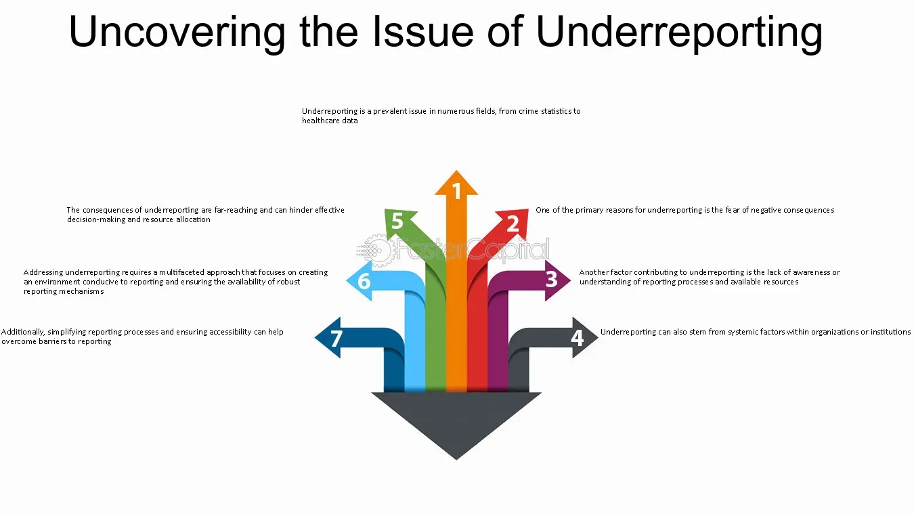

## Table of Contents

## What is underreporting in statistics?

Underreporting in statistics happens when some data is not recorded or reported as it should be. This can happen for many reasons, like people not wanting to share information, mistakes in collecting data, or problems with how data is gathered. When data is underreported, it means the numbers we see might not show the whole truth. For example, if people don't report all their income on a survey, the total income numbers will be lower than they really are.

This can cause big problems because decisions are often made based on these numbers. If the data is not complete, the decisions might be wrong. For instance, if a government uses underreported crime statistics to plan safety measures, they might not do enough to keep people safe because they think crime is less common than it really is. It's important for people collecting data to try to reduce underreporting so that the information they use is as accurate as possible.

## Why does underreporting occur in data collection?

Underreporting happens in data collection for a few main reasons. One big reason is that people might not want to share all their information. They might feel embarrassed or worried about what could happen if they tell the truth. For example, someone might not report all their income if they think they will have to pay more taxes. Another reason is that sometimes the people collecting the data make mistakes. They might miss some information or write it down wrong. This can happen if they are in a hurry or if the way they collect data is not very clear.

Also, the way data is gathered can cause underreporting. If the questions are hard to understand or if the survey is too long, people might not answer everything correctly or might skip some questions. Sometimes, the technology used to collect data can fail, like if a computer crashes and loses some answers. All these reasons can lead to underreporting, which means the data we end up with might not show the full picture of what's really going on.

## What are common examples of underreporting in different fields?

In healthcare, underreporting often happens with diseases like HIV or mental health issues. People might not tell their doctors about these conditions because they feel embarrassed or scared about what others might think. This can make it hard for health organizations to know how many people really need help. For example, if a lot of people don't report their mental health problems, the government might not see the need to spend more money on mental health services.

In crime [statistics](/wiki/bayesian-statistics), underreporting is common too. Many crimes, like sexual assault or domestic violence, are not reported to the police. Victims might be afraid of the person who hurt them or they might not trust the police to help. When these crimes are not reported, it looks like there are fewer crimes happening than there really are. This can make it hard for the police to know where to focus their efforts to keep people safe.

In financial reporting, underreporting can happen when businesses or people don't report all their income or expenses. They might do this to pay less in taxes or to make their business look more profitable than it is. For example, a small business owner might not report all their cash sales to avoid paying taxes on that money. This can lead to the government not collecting as much tax as they should, and it can also make it hard for investors to know the true financial health of a business.

## How does underreporting affect statistical analysis and results?

Underreporting can mess up statistical analysis and results a lot. When some data is missing or not reported right, the numbers we use to make decisions are not accurate. For example, if a lot of people don't report their income, the average income numbers will be lower than they really are. This can lead to wrong conclusions, like thinking that people are [earning](/wiki/earning-announcement) less money than they actually do. When we make decisions based on these wrong numbers, like how much to spend on public services, we might not spend enough or spend it in the wrong places.

This problem can also make it hard to see patterns and trends in data. If certain types of crimes are not reported, like domestic violence, it might look like crime rates are going down when they are actually staying the same or even going up. This can lead to bad policy decisions, like cutting police budgets when more resources are actually needed. In the end, underreporting can make it tough to trust the data we use, which can affect everything from healthcare planning to financial decisions.

## What are the potential biases introduced by underreporting?

Underreporting can create different kinds of biases in data. One common bias is called selection bias. This happens when the data we collect is not a good mix of all the people or things we want to study. For example, if only certain people report their income because they are not afraid of taxes, the data will mostly show their information and miss out on others. This can make it look like everyone earns more or less than they really do.

Another bias that can come from underreporting is called non-response bias. This happens when some people don't answer surveys or questions, so their information is missing. If the people who don't respond are different from those who do, like if sick people don't report their health issues, the data will not show the full picture. This can lead to wrong ideas about how common a health problem is, and it can affect how much help is given to those who need it.

These biases can make it hard to trust the data and can lead to bad decisions. If the data is not a true reflection of what's happening, the choices made based on that data might not help everyone equally. For example, if crime data is underreported, the police might focus on the wrong areas, leaving some communities less safe. It's important to try to reduce underreporting so that the data we use is as fair and accurate as possible.

## What methods can be used to detect underreporting in datasets?

To detect underreporting in datasets, one common method is to compare the data with other sources of information. For example, if a survey says fewer people have a certain disease than what hospitals report, it might mean the survey is missing some data. Another way is to look at historical data to see if the numbers have suddenly changed a lot. If the number of reported crimes drops a lot from one year to the next, but nothing else has changed, it could mean people are not reporting crimes as much as before.

Another method is to use statistical tests to check for patterns that might show underreporting. For instance, if the data shows a lot of round numbers, like people saying they earn exactly $50,000 a year, it could mean they are not telling the whole truth. Also, if the data looks too perfect or too even, it might be a sign that some information is missing. By using these methods, researchers can try to find out if underreporting is happening and work to fix it so the data is more accurate.

## How can statistical models be adjusted to account for underreporting?

To account for underreporting in statistical models, one way is to use what's called "imputation." This means guessing the missing data based on what we know from the rest of the data. For example, if we know some people didn't report their income, we can use the income of similar people who did report to fill in the gaps. This helps make the overall numbers more accurate. Another method is to use "weighting," where we give more importance to the data we have from groups that are often underreported. This helps balance out the missing information and gives a better picture of the whole group.

Another approach is to use "capture-recapture" methods, often used in biology to estimate animal populations. This involves comparing different sources of data to see how much they overlap and then estimating how many cases might be missing. For example, if we compare crime reports from police with reports from hospitals, we can guess how many crimes might not be reported to the police. By using these methods, we can adjust our statistical models to be more accurate even when some data is missing. This helps us make better decisions based on the data we have.

## What are the ethical implications of underreporting in research?

Underreporting in research can lead to big ethical problems. When important information is missing, the results can be wrong, and this can hurt people. For example, if a study about a disease doesn't include all the cases because some people didn't report their illness, the study might say the disease is not as common or serious as it really is. This can mean that fewer resources are given to help those who are sick, and they might not get the care they need. It's not fair to the people who are left out of the data, and it can lead to decisions that don't help everyone equally.

Another big ethical issue with underreporting is that it can break the trust between researchers and the people they study. If people find out that the research didn't tell the whole truth because of missing data, they might not want to help with future studies. This makes it harder for researchers to do good work and find out important things. It's important for researchers to be honest and try their best to get all the information they need so that everyone can trust the results and benefit from the research.

## Can you discuss a case study where underreporting significantly impacted results?

One famous case where underreporting had a big impact was the study of sexual assault on college campuses in the United States. A lot of students who were assaulted did not report it to their school or the police. They might have felt scared, embarrassed, or didn't think anyone would help. Because of this, the numbers in the official reports were much lower than the real number of assaults happening. This made it look like sexual assault was not as big of a problem as it really was. As a result, some colleges didn't do enough to keep students safe or help those who had been assaulted.

When researchers realized this, they started doing surveys that let students answer anonymously. These surveys showed that the real number of sexual assaults was much higher than what was reported officially. This helped colleges understand how serious the problem was and start doing more to stop it. It also showed how important it is to find ways to get honest information from people, even when they might not want to share it. By understanding the true scale of the problem, better policies and support systems could be put in place to help students.

## What are the best practices for minimizing underreporting in data collection?

To minimize underreporting, it's important to make people feel safe and comfortable when they share information. This means keeping their answers private and explaining why the data is important. If people know their information will be used to help others or improve services, they might be more willing to tell the truth. Also, using clear and simple questions can help. If the survey or questionnaire is easy to understand, people are less likely to skip questions or give wrong answers. Offering different ways to answer, like online or by phone, can also help more people take part.

Another good practice is to train the people who collect the data to be friendly and understanding. They should know how to make people feel at ease and encourage them to share all the information they can. It's also helpful to check the data often to see if there are any signs of underreporting. If there are, you can try to fix it by going back to the people who didn't answer fully and asking them again in a different way. By doing these things, you can get more complete and accurate data, which helps everyone make better decisions.

## How do advanced statistical techniques help in addressing underreporting?

Advanced statistical techniques can help a lot in dealing with underreporting. One way they do this is through a method called multiple imputation. This means using the data we do have to guess the missing information. For example, if some people didn't report their income, we can use the income of similar people who did report to fill in those gaps. This helps make the data more complete and the results more accurate. Another technique is weighting, where we give more importance to the data from groups that are often underreported. This helps balance out the missing information and gives a better picture of the whole group.

Another important technique is capture-recapture, which is often used to estimate animal populations but can also work for human data. This method involves comparing different sources of data to see how much they overlap and then estimating how many cases might be missing. For example, if we compare crime reports from police with reports from hospitals, we can guess how many crimes might not be reported to the police. By using these advanced techniques, researchers can adjust their statistical models to account for underreporting. This helps make the data more reliable and the decisions based on it more fair and effective.

## What future research directions could help in better understanding and mitigating underreporting?

Future research could focus on understanding why people don't report information. By learning more about the reasons, like fear or embarrassment, researchers can come up with better ways to make people feel safe and comfortable sharing their data. This could mean using new technology to keep answers private or finding new ways to explain why the data is important. If people know their information will help others, they might be more willing to share it. Researchers could also look into how different cultures and communities view data sharing and find ways to respect those views while still collecting accurate data.

Another important direction for future research is to develop better ways to check for underreporting. This could involve creating new statistical methods that can spot missing data more easily and accurately. Researchers might also work on improving existing techniques like multiple imputation and weighting to make them even more effective. By testing these methods in different fields, like healthcare or crime statistics, we can see which ones work best and why. This will help make sure that the data we use to make decisions is as complete and accurate as possible, leading to better outcomes for everyone.

## What are the consequences of data inaccuracy due to underreporting?

Underreporting in the context of financial data can profoundly impact the evaluation of trading strategies, leading to suboptimal decision-making by traders and analysts. Accurate assessment of trading strategies hinges on the integrity and comprehensiveness of the data utilized. When data is incomplete or misreported, it hinders the trader's ability to gauge the true performance of a strategy, ultimately impacting the potential success of trades.

Financial reports that intentionally or unintentionally underreport data can skew perceptions of an entity's financial health. This misrepresentation could lead stakeholders to form inaccurate opinions about a company's profitability, [liquidity](/wiki/liquidity-risk-premium), and overall market condition. For instance, a company that reports lower operational costs than actually incurred might appear more profitable than it is, thus misleading investors regarding its true financial condition.

Traders relying on erroneous data can develop strategies based on faulty premises. This risk is particularly compounded when traders depend on algorithmic models that analyze historical data patterns to predict future market behavior. If the underlying data does not accurately reflect past events, the algorithms may generate misleading signals. This creates scenarios where strategies appear viable but fail when deployed in real-time market conditions.

For instance, consider an algorithm that uses historical price data to forecast future price movements. If the historical data underreports certain price spikes or drops, the algorithm might fail to account for market [volatility](/wiki/volatility-trading-strategies) correctly, leading to false signals and ineffective trading decisions. Such discrepancies can be represented mathematically in a simplified model:

$$
\text{Expected Price Movement} = \text{Historical Data} \times \text{Prediction Model}
$$

If $\text{Historical Data}$ is underreported, the final expected price movement calculated by the prediction model becomes inherently flawed.

Furthermore, misleading financial health information can result in an unintentional market imbalance. When many market participants operate on inaccurately reported data, systemic risks emerge. Market outcomes may veer away from expected results, potentially leading to financial crises or significant losses. Thus, ensuring the accuracy and completeness of data through robust validation and verification processes is paramount to maintain market stability and optimize trading strategies.

## References & Further Reading

[1]: Bergstra, J., Bardenet, R., Bengio, Y., & Kégl, B. (2011). ["Algorithms for Hyper-Parameter Optimization."](https://dl.acm.org/doi/10.5555/2986459.2986743) Advances in Neural Information Processing Systems 24.

[2]: ["Advances in Financial Machine Learning"](https://www.amazon.com/Advances-Financial-Machine-Learning-Marcos/dp/1119482089) by Marcos Lopez de Prado

[3]: ["Evidence-Based Technical Analysis: Applying the Scientific Method and Statistical Inference to Trading Signals"](https://www.amazon.com/Evidence-Based-Technical-Analysis-Scientific-Statistical/dp/0470008741) by David Aronson

[4]: ["Machine Learning for Algorithmic Trading"](https://github.com/stefan-jansen/machine-learning-for-trading) by Stefan Jansen

[5]: ["Quantitative Trading: How to Build Your Own Algorithmic Trading Business"](https://www.amazon.com/Quantitative-Trading-Build-Algorithmic-Business/dp/1119800064) by Ernest P. Chan