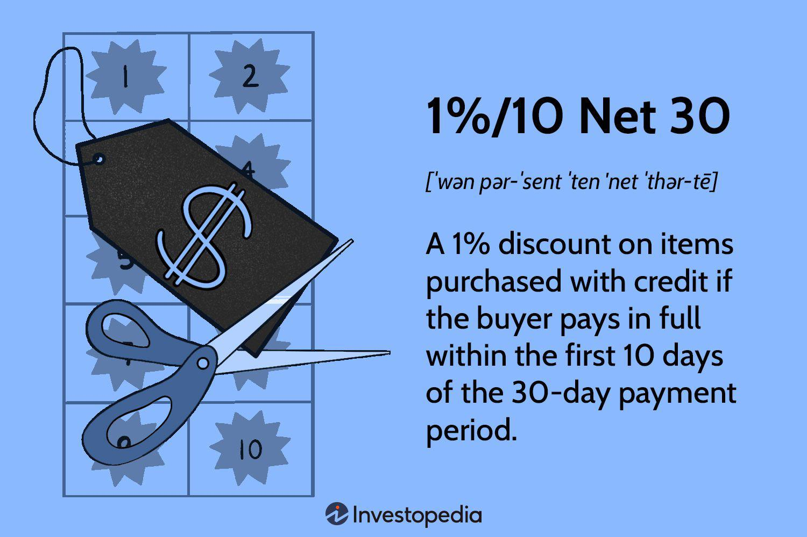

Business transactions form a complex landscape where understanding payment, invoice, and discount terms is essential for both buyers and sellers. These terms not only dictate the financial relationship between trading entities but also significantly affect cash flow dynamics. Payment terms specify the conditions under which a seller expects to receive payment, including due dates and accepted methods, while invoice terms address the specifics of the billing document, such as the issuance date and payment timeframe. Discount terms, on the other hand, offer financial incentives for early payments, benefiting both the liquidity of the seller and the cost structure of the buyer.

Algorithmic trading represents a modern evolution in financial operations. It employs automated systems to execute trades with speed and precision based on predefined criteria. This method enhances trading efficiency and accuracy by removing the potential for human error and emotional biases, which can often lead to suboptimal decisions in volatile markets. 



By examining both the foundational concepts of payment, invoice, and discount terms and the advanced mechanisms of algorithmic trading, businesses can navigate the financial markets more strategically. This article aims to provide clear insights into these fundamental and contemporary trading concepts, revealing how they can collectively contribute to robust financial strategies that enhance business sustainability and competitiveness. Understanding the interplay between these elements will help businesses optimize their financial relationships and embrace innovative trading technologies for improved outcomes.

## Table of Contents

## Understanding Payment Terms

Payment terms are crucial components of commercial transactions, outlining the conditions under which a buyer is expected to fulfill their financial obligations to a seller. Typically, these terms include the payment due date, acceptable payment methods, and any penalties or fees incurred for late payments.

A clear specification of the payment due date is essential. It establishes the timeline within which a buyer must complete the payment for goods or services received. The most common terms used are Net 30, Net 60, or Net 90, which indicate that the payment is due within 30, 60, or 90 days from the invoice date, respectively. This timeframe is critical for ensuring that businesses maintain an uninterrupted cash flow, which is central to their operational stability.

Accepted payment methods are also an integral part of payment terms. They provide flexibility and security for both parties by detailing the acceptable forms of payment, such as bank transfers, credit cards, checks, or digital payment platforms. The inclusion of diverse payment options can facilitate the transaction process, making it easier for buyers to comply with the payment schedules.

Penalties for late payment serve as deterrents against delayed payments, which can disrupt a seller's cash flow and lead to potential financial distress. These penalties often come in the form of late fees or interest charges that accrue on overdue amounts. For instance, a common late payment term might be expressed as a 1.5% monthly interest on any outstanding balance, which motivates timely payment and compensates the seller for the inconvenience caused by the delay.

The importance of establishing clear payment terms lies in minimizing financial risks. For sellers, well-defined terms reduce the uncertainty of when they will receive payment, thus allowing for better cash flow management and financial planning. For buyers, clarity in payment terms aids in managing their expenses and ensuring they meet their financial commitments without incurring additional costs. In essence, well-negotiated payment terms foster a constructive business relationship, paving the way for transparency, trust, and long-term collaboration.

In conclusion, understanding and implementing clear payment terms is vital for the seamless execution of transactions and safeguarding the financial health of businesses. By specifying the due dates, accepted payment methods, and penalties for delays, both buyers and sellers can enhance their financial stability and operational efficiency.

## Common Invoice Terms

Invoice terms provide a structured framework for financial transactions between a buyer and a seller. They include the issuance date of the invoice, the period within which payment is expected, and potential discounts for early payment. These elements are pivotal for defining the financial responsibilities of the buyer and ensuring both parties are synchronized in their financial dealings.

One of the most prevalent invoice terms is "Net 30." This term implies that the payment is due 30 days from the date of the invoice. It is widely adopted due to its simplicity and balance between offering the buyer sufficient time to manage cash flow while ensuring the seller receives timely payment. Other common terms include "Net 60" or "Net 90," which extend the payment terms accordingly, depending on the contractual agreement and financial strategy employed by the seller.

The "End of Month" (EOM) term stipulates that payment is due at the end of the month following the invoice date, providing a clear timeline for payment. This can sometimes be coupled with "Net" terms, such as "Net 30 EOM," indicating the payment is due 30 days after the end of the month in which the invoice was issued.

Early payment discounts are another critical component. Terms like "2%/10 Net 30" offer a 2% discount if the invoice is paid within 10 days, while still allowing for the total payment period of 30 days if the discount is not taken. Such terms incentivize buyers to pay ahead of schedule, improving cash flow for sellers.

Acquainting oneself with these terms enhances business operations, promoting efficient payment cycles and strengthening financial management. Clear articulation of invoice terms helps mitigate misunderstandings and disputes, fostering a healthy financial relationship. As businesses integrate technology into financial operations, understanding and utilizing these terms effectively becomes increasingly significant. Adapting to and leveraging these terms allow for greater precision and efficiency in managing business finances, contributing to a smoother transaction process.

## Exploring Discount Terms

Discount terms are financial incentives given by sellers to encourage buyers to settle their invoices earlier than the specified due date. These terms can play a crucial role in enhancing the seller's cash flow while providing cost-saving opportunities for buyers.

A common example of discount terms is "1%/10 Net 30." In this arrangement, the buyer can avail of a 1% discount on the invoice total if the payment is made within 10 days; otherwise, the full invoice amount is due within 30 days. This type of term is advantageous for buyers who have sufficient [liquidity](/wiki/liquidity-risk-premium) to take advantage of the discount, ultimately reducing their purchase costs. For sellers, offering discounts can accelerate cash inflows, reducing the time delay associated with accounts receivable, which can be essential for maintaining a healthy cash flow.

The structure of discount terms typically follows the pattern:  
$$
\text{Discount \%} / \text{Discount period} \text{ Net } \text{Full payment period}
$$

For instance, with "2%/15 Net 45," buyers receive a 2% discount if payment is completed within 15 days, although the full balance can be paid without a discount by day 45. This formula promotes effective cash management and allows buyers to prioritize their payments based on available funds and operational needs. Considering a company with consistent cash flow constraints, strategically taking advantage of early payment discounts leads to considerable long-term savings.

The rationale behind implementing discount terms is grounded in the time value of money, where receiving payments sooner allows sellers to reinvest the capital or settle their own debts, which may prevent interest accumulation. The decision to offer early payment discounts reflects a company’s broader financial strategy and ability to sustain reduced profit margins for increased liquidity.

Facilitating these discounts may involve using straightforward calculations. Python, for example, can be employed to automate the decision-making process for buyers contemplating whether to take advantage of a discount:

```python
def calculate_discount_impact(invoice_amount, discount_percent, discount_days, net_days, daily_interest_rate):
    discount_value = invoice_amount * (discount_percent / 100)
    cost_of_not_taking_discount = invoice_amount * daily_interest_rate * (net_days - discount_days)

    if discount_value > cost_of_not_taking_discount:
        return f"Take the discount and save ${discount_value:.2f}"
    else:
        return f"Do not take the discount, it's costlier by ${cost_of_not_taking_discount:.2f}"

# Example Usage
invoice_amount = 1000
discount_percent = 1
discount_days = 10
net_days = 30
daily_interest_rate = 0.0005 # Assume a 0.05% daily rate

decision = calculate_discount_impact(invoice_amount, discount_percent, discount_days, net_days, daily_interest_rate)
print(decision)
```

This simple program assists buyers in evaluating the financial implications of accepting or declining a discount based on their cost of funds, fostering informed financial decision-making. Understanding and implementing discount terms can drive operational efficiencies that benefit both parties in a transaction.

 to Algo Trading

Algorithmic trading, commonly known as algo trading, leverages technology to automate the execution of trading strategies based on pre-set rules. This automated approach relies on computer algorithms that can process vast amounts of data at high speeds, enabling traders to execute orders with increased precision and reduced human intervention.

Algo trading incorporates a variety of complex models and mathematical computations to evaluate trading opportunities and determine optimal execution strategies. The primary goal is to capture market inefficiencies and make profitable trades. Algorithms can be designed to evaluate criteria such as timing, price, [volume](/wiki/volume-trading-strategy), and other market data, executing trades as soon as the conditions outlined in the trading strategy are met.

There are several benefits associated with [algorithmic trading](/wiki/algorithmic-trading). One of the most significant advantages is the speed at which trades are executed. Computers can react to market changes faster than a human, allowing traders to capitalize on fleeting opportunities that might otherwise be missed. Moreover, algorithmic trading can increase efficiency by minimizing the possibility of human error in the trading process. It also enables [backtesting](/wiki/backtesting), where traders can test their strategies on historical data to assess their potential effectiveness without risking capital.

Despite its advantages, algorithmic trading is not without risks. Market [volatility](/wiki/volatility-trading-strategies) can sometimes lead to unpredicted outcomes, as algorithms can execute large volumes of trades in an instant, potentially exacerbating price swings. There's also the risk of technical failures or bugs within the algorithms, which could result in unintended trading actions. Consequently, successful algo trading requires careful design, rigorous testing, and continuous monitoring of algorithms to ensure they function as intended.

The connection between payment, invoice, and discount terms with algorithmic trading is relevant in developing comprehensive financial strategies. For instance, automated execution can optimize cash flow cycles by aligning payments with trading strategies, ensuring that funds are available when needed. Additionally, data analysis from algorithms can identify patterns in payment terms or discount usage, potentially informing better financial decisions.

Overall, understanding algorithmic trading and its integration with broader financial strategies can provide a competitive edge in today's digital trading environment.

## The Intersection of Payment and Algo Trading

In recent years, technological advancements have significantly transformed both payment systems and trading strategies. This evolution is particularly evident in the integration of algorithmic solutions, which have revolutionized the way transactions are facilitated and optimized. At the core of this transformation is the ability of algorithms to analyze vast datasets, identify actionable insights, and execute complex operations with minimal human intervention.

Algorithmic strategies have the potential to enhance payment processes by automating routine tasks and enabling more efficient cash flow management. For instance, algorithms can predict optimal payment timings by analyzing historical transaction data, accounting for variables such as transaction fees, exchange rates, and cash flow constraints. Implementing such strategies can lead to considerable savings and reduced financial risk by minimizing late fees and maximizing early payment discounts.

Consider a scenario where a business uses a simple algorithm to manage its payments. Suppose the business normally follows Net 30 terms but offers a 2% discount for early payment within 10 days, expressed as ${ 2/10 \text{ Net } 30 }$. An algorithm could automatically assess the company’s current cash flow, forecast short-term liquidity needs, and decide whether to take advantage of the discount or defer the payment. Such automation ensures optimal decision-making without constant manual oversight.

The integration between payment systems and trading mechanisms is not just limited to optimizing cash flow; it also extends to improving the trading processes themselves. Algorithmic trading, leveraged in financial markets, relies heavily on speed and precision. By harnessing [machine learning](/wiki/machine-learning) models and quantitative analysis, traders can employ advanced strategies like statistical [arbitrage](/wiki/arbitrage), [market making](/wiki/market-making), and [momentum](/wiki/momentum) trading.

```python
import numpy as np
import pandas as pd

# Sample data
historical_data = pd.DataFrame({
    'day': np.arange(1, 31),
    'exchange_rate': np.random.uniform(0.95, 1.05, 30),
    'transaction_fee': np.random.uniform(0.01, 0.03, 30)
})

# Simple algorithm example for optimal payment decision
def analyze_payment_options(data, cash_flow, discount_rate, payment_window):
    discount_savings = []
    for i in range(payment_window):
        day_data = data.iloc[i]
        discount_cost = day_data['exchange_rate'] * (1 - discount_rate) + day_data['transaction_fee']
        discount_savings.append(cash_flow - discount_cost)
    # Determine the optimal day to make the payment
    optimal_day = np.argmax(discount_savings) + 1
    return optimal_day, max(discount_savings)

cash_flow = 1000  # Example cash flow available
discount_rate = 0.02  # Example discount rate
optimal_day, max_savings = analyze_payment_options(historical_data, cash_flow, discount_rate, 10)
```

Such algorithmic processes offer the capability to automatically time buy and sell orders, based on complex computations involving market data and predefined performance indicators. In payment systems, these algorithms can synchronize with electronic invoicing and payments, thus enabling seamless transactions. Moreover, the interplay of these systems facilitates better alignment with financial policies and compliance requirements.

Looking ahead, the future integration of payment systems and algorithmic trading holds the promise of complete automation and integration of financial operations. Innovations such as blockchain and smart contracts could further streamline these processes by providing a secure, transparent environment for executing algorithms that manage both payments and trades. As financial systems continue to evolve, businesses that embrace and adapt these technological integrations will likely maintain a robust edge in efficiency and competitiveness.

## Conclusions and Future Implications

Understanding and optimizing payment, invoice, and discount terms alongside the application of algorithmic trading technologies are vital in modern business operations. The synergy between these financial mechanisms creates a robust framework that can lead to enhanced cash flow management, cost savings, and improved strategic decision-making. 

As businesses continue to evolve, embracing technological advancements is not just beneficial but necessary. Future developments in [artificial intelligence](/wiki/ai-artificial-intelligence), machine learning, and blockchain could further revolutionize the way payment and trading systems operate. These innovations promise to enable seamless, automated transactions with minimal human intervention, thereby reducing errors and enhancing transaction speed and reliability.

For instance, algorithmic trading can benefit from improved data analytics and pattern recognition capabilities provided by AI, helping traders to identify profitable opportunities with more precision. Similarly, blockchain technology might offer secure, transparent, and immutable records of transactions, addressing concerns related to fraud and trust in traditional payment systems.

Businesses must remain vigilant and adaptive to these technological shifts to sustain their competitive advantage and ensure financial sustainability. This involves not only adopting new technologies but also understanding and analyzing the financial terms that underpin their operations. The integration of advanced payment, invoice, and discount mechanisms with cutting-edge trading strategies could yield significant operational efficiencies and financial gains.

To illustrate the potential of combining these fields, consider a Python script that uses machine learning to advise on optimal payment terms based on historical transaction data:

```python
import pandas as pd
from sklearn.linear_model import LinearRegression

# Sample data: historical invoices with terms and payment behavior
data = {'Term': ['Net 30', 'EOM', '1%/10 Net 30'], 'Days_to_Pay': [28, 35, 9]}
df = pd.DataFrame(data)

# Convert categorical terms into numerical values
df['Term_Encoded'] = df['Term'].astype('category').cat.codes

# Linear regression model to predict payment behavior
X = df[['Term_Encoded']]
y = df['Days_to_Pay']
model = LinearRegression().fit(X, y)

def predict_days_to_pay(term):
    term_code = pd.Series([term]).astype('category').cat.codes[0]
    return model.predict([[term_code]])

# Example: predict payment days for '1%/10 Net 30'
predicted_days = predict_days_to_pay('1%/10 Net 30')
print(f"Predicted days to pay for '1%/10 Net 30': {predicted_days[0]:.2f}")
```

The continuous interaction between payment processes and trading algorithms will play a key role in shaping the financial landscape. By leveraging data-driven insights and automated technologies, businesses can achieve higher levels of efficiency and financial performance, positioning themselves favorably in a rapidly changing economic environment.

## References & Further Reading

[1]: ["Discounts Lost for Late Payments Reflect Bad Bill-Paying Habits"](https://www.brightmoney.co/learn/late-payments-unleashed-consequences-you-cant-ignore) - Wall Street Journal article on the significance of early payment discounts.

[2]: Stevens, H. (2012). ["Financial Modeling"](https://www.financialmodellinghandbook.org/contents/) (4th ed.). MIT Press. A book detailing financial modeling with a focus on real-world finance applications including payment terms.

[3]: ["Advances in Financial Machine Learning"](https://www.amazon.com/Advances-Financial-Machine-Learning-Marcos/dp/1119482089) by Marcos Lopez de Prado - A comprehensive guide to integrating machine learning with financial trading strategies.

[4]: O’Hara, M. (2015). ["High-Frequency Trading: Its Impact on Markets and Investors"](https://www.sciencedirect.com/science/article/pii/S0304405X15000045). Financial Analysts Journal. An article exploring the implications of algorithmic trading patterns.

[5]: Brynjolfsson, E., & McAfee, A. (2014). ["The Second Machine Age"](https://psycnet.apa.org/record/2014-07087-000) - Discusses how technology transforms how we do business and includes sections relevant to financial operations and trading.